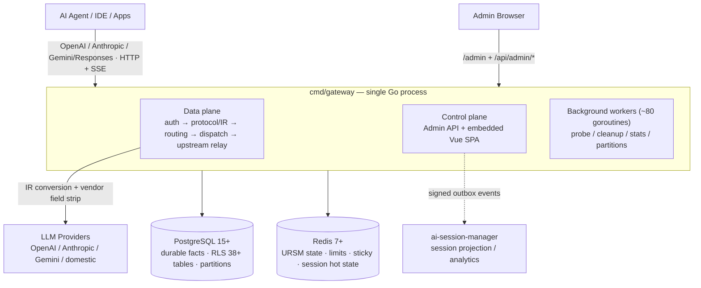

# AI Native Gateway

> بوابة LLM الأصلية للذكاء الاصطناعي: ليست مجرد وكيل — **مستوى إدارة ومنصة حوكمة جلسات** لحركة مرور الذكاء الاصطناعي المؤسسية.

[](LICENSE)
[](https://golang.org)
[](CHANGELOG.md)

[English](README.md) | [简体中文](README.zh-CN.md) | [繁體中文](README.zh-TW.md) | [日本語](README.ja.md) | [Deutsch](README.de.md) | [Français](README.fr.md) | [Español](README.es.md) | **العربية**

[البدء السريع](#-البدء-السريع) • [القيم الأساسية](#-أربع-قيم-أساسية) • [المعمارية](#-نظرة-عامة-على-المعمارية) • [حوكمة الجلسة](#-حوكمة-الجلسة) • [معاينة المنتج](#-معاينة-المنتج) • [المقارنة](#-التموضع-والمقارنة) • [خارطة الطريق](ROADMAP.md)

---

## ما هي AI Native Gateway؟

AI Native Gateway هي **بوابة LLM أصلية للذكاء الاصطناعي، مفتوحة المصدر وذاتية الاستضافة**، بُنيت لعصر وكلاء الذكاء الاصطناعي و«vibe coding». إنها تفعل أكثر بكثير من إعادة توجيه الطلبات: فهي **تصنّف وتوجّه وتحكم وتدقّق وتفوتر** كل رمز يمر عبر منظمتك.

- **توحيد البروتوكولات**: توافق مع OpenAI وAnthropic وGemini وResponses API — نقطة نهاية واحدة لكل النماذج
- **توجيه ذكي بطبقتين**: L1 يختار النموذج (تصنيف المهام → تقييم بـ 6 أبعاد)، L2 يختار الاعتماد (تراجع الطبقات → جولة الفوترة → تقييم P2C → تنفيذ / قاطع دائرة)
- **حوكمة الجلسة**: جلسات مثبتة، وإعادة تشغيل كاملة لمحتوى الجلسة، وضغط تلقائي للمطالبات، ودورة حياة بيانات رباعية المستويات — المحادثة، لا الطلب وحده، كائن مُدار من الدرجة الأولى
- **تعدد المستأجرين**: عزل مستأجرين مفروض عبر RLS في PostgreSQL على 38+ جدولاً، مع حصص وقياس وفوترة MaaS لكل مستأجر
- **إدارة الاعتمادات**: مجمعات اعتمادات متعددة مع تمويه البصمات وسبر تكيّفي وقواطع دائرة تلقائية
- **الرصد**: تدفق طلبات لحظي، وتحليلات توجيه (خريطة حرارية + Sankey)، وتتبع للتكلفة، وOTel + Prometheus
- **الخصوصية**: نشر خاص 100٪ — كل البيانات تبقى داخل بنيتك التحتية

مبنية بـ **Go + PostgreSQL + Redis**، وتعمل اليوم في الإنتاج على k3s (نسختان تشتركان في مخطط PostgreSQL واحد). مصممة للمؤسسات التي تحتاج سيطرة كاملة على بنيتها التحتية للذكاء الاصطناعي.

---

## ✨ أربع قيم أساسية

| القيمة | ما يحصل عليه العميل |
|--------|---------------------|
| **أمان** | حواجز الذكاء الاصطناعي · DLP · اعتراض مضمّن · حوكمة Vibe Coding · تكامل SIEM/SOAR |
| **ثبات** | تنسيق متعدد السحابة · قاطع دائرة مع تعافٍ تلقائي · هدف SLA ‏99.9٪ |
| **تكلفة منخفضة** | التخزين المؤقت الدلالي · توجيه تلقائي (سياسات cost/quality) · قياس الرموز · ضغط المطالبات |
| **تكامل مؤسسي** | بوابة أدوات MCP (خارطة طريق) · مركز أصول API Hub (خارطة طريق) · تدقيق كامل السلسلة · SIEM/SOAR |

## 🏗️ ثلاثة أعمدة للمنتج

| التحكم | الحوكمة | الأمن |
|--------|---------|-------|
| ✅ قياس استخدام الرموز | 🔨 مركز أصول API Hub | 🔨 Model Armor |
| ✅ توجيه ذكي + جلسات مثبتة | 🔨 اكتشاف تلقائي | 🔨 حماية البيانات الحساسة (SDP) |
| ✅ التخزين المؤقت الدلالي + Funnel | 🔨 إثراء SpecBoost الذكي | 🔨 دفاع ضد المطالبات العدائية |
| ✅ تدقيق كامل السلسلة + OTel | ✅ RLS متعدد المستأجرين (L1 = 0) | ✅ تكامل SIEM/SOAR |
| ✅ فوترة MaaS | | |

✅ = مُسلَّم &nbsp;·&nbsp; 🔨 = على خارطة الطريق

## 🎯 مصفوفة القدرات

| الطبقة | ما تحصل عليه |
|--------|--------------|
| **البروتوكول** | توافق OpenAI / Anthropic / Gemini / Responses + ترحيل بث SSE مع فحوصات سلامة |
| **التوجيه** | توجيه بطبقتين (نموذج → اعتماد) + جلسات مثبتة + توجيه تلقائي بسياسات cost/quality |
| **تعدد المستأجرين** | نفق هوية (IP/MAC/ClientID افتراضية) + مجمعات اعتمادات + RLS على 38+ جدولاً |
| **حوكمة الحركة** | تحديد معدل الرموز (TPM/RPM) + التخزين المؤقت الدلالي + ضغط المطالبات + خوارزميات النوافذ المنزلقة |
| **التدقيق** | تدقيق كامل السلسلة + DLQ + احتياط على القرص + OTel + Prometheus |
| **الاعتمادات** | اعتمادات متعددة + مجمع بصمات + سبر تكيّفي + تعطيل يدوي |
| **النشر** | نسختان (Docker + k3s NodePort) تشتركان في مخطط PostgreSQL واحد |

انظر قسم [نظرة عامة على المعمارية](#-نظرة-عامة-على-المعمارية) أدناه، أو [مجموعة مخططات المعمارية](docs/architecture-diagrams.md) الكاملة للتفاصيل.

---

## 🏛️ نظرة عامة على المعمارية

عملية Go واحدة (`cmd/gateway`) تستضيف **مستوى البيانات ومستوى التحكم وواجهة الإدارة على mux واحد** (h2c: HTTP/1.1 + HTTP/2 على منفذ واحد). يحتفظ PostgreSQL بالحقائق الدائمة (معزولة عبر RLS ومقسّمة شهريًا)؛ ويحتفظ Redis بالحالة الساخنة (التوجيه، الحدود، الجلسات المثبتة). نفس واجهات `storage` تخدم كلا **وضع full** (PG + Redis) و**وضع lite** (SQLite + ملفات محلية — بلا تبعيات خارجية، ثنائي واحد).



**مسار الطلب (مسار الإنتاج v1، مسار التنفيذ الوحيد منذ 2026-08)**:

```text
HTTP/SSE → middleware chain → protocol/IR normalization → session assignment
  → (model=auto: L1 model selection) → resource prep (semantic cache / prompt compression)
  → Executor (attempt budget) → dispatch queues (global → model → credential)
  → Router (tier / health / sticky filters + URSM v2 state + P2C scoring)
  → resource gates (fingerprint slot / concurrency / RPM)
  → upstream relay (0 internal retries; pre-first-byte failover only adds attempts)
  → SSE write-back with integrity checks
  → request_logs + usage ledger (canonical facts)
  → onPersisted hooks: session V2 shadow write · session_dim upsert · ASM outbox
```

**تخطيط المستودع**

| المسار | الدور |
|--------|------|
| `cmd/gateway/` | جذر التركيب — مدخل الإنتاج بثنائي واحد (مستوى البيانات + مستوى التحكم) |
| `domains/` | 67 نطاقًا بأسلوب DDD — `streaming`، `dispatch`، `credential`، `session`(+v2)، `ursm`، hooks، security… |
| `admin/` + `web/` | واجهة REST للإدارة + Vue 3 + TypeScript SPA (Element Plus، ECharts) |
| `bg/` | عمال الخلفية — السبر، تنظيف دورة الحياة، تجميع الإحصاءات، صيانة الأقسام |
| `storage/` | مصنع تخزين ثنائي الوضع (`full`: PG+Redis / `lite`: SQLite+ملفات+KV داخلي) |
| `internal/` | بنية تحتية عرضية — IR، إزالة حقول المزوّدين، مرآة الجلسات، outbox، القياس عن بعد… |
| `sql/migrations/` + `db/migrations/` | ترحيلات idempotent (سلسلة بدء التشغيل حاليًا عند 764) |
| `installer/` | وحدة تثبيت/ترقية مستقلة متعددة المنصات |
| `scripts/`، `deploy/` | أدوات البناء والنشر والمرايا والتحقق |

لقطة الحجم (مسح كود بتاريخ 2026-10-01): **~4,500 ملف Go · 2,278 ملف اختبارات · 927 ملف SQL ترحيل · 67 حزمة نطاقات · 34 ثنائيًا** داخل `cmd/`.

**قراءات أعمق**

- [مجموعة مخططات المعمارية](docs/architecture-diagrams.md) — مجموعة Mermaid كاملة: السياق، الحاويات، سلسلة الطلب، التوجيه بطبقتين، التخزين، النشر، العمال
- [المعمارية بتصنيف الأدلة](docs/03-design/01-architecture/architecture/ARCHITECTURE.md) — وثيقة المرجع الداخلي (تصنيف CURRENT / SHADOW / PARALLEL، لقطة 2026-10-01)
- [دورة حياة الجلسة](docs/session-lifecycle.md) — الجلسة من أول طلب حتى الأرشفة، بمخططات كاملة
- [تدفق الطلب في وقت التشغيل](docs/03-design/01-architecture/architecture/runtime-request-flow.md) · [التوجيه والحالة](docs/03-design/01-architecture/architecture/routing-and-state.md)

---

## 🧠 حوكمة الجلسة

معظم البوابات تعامل كل طلب كحدث معزول. أما AI Native Gateway فتتعامل مع **الجلسة** كوحدة للحوكمة — لأنه في عصر وكلاء البرمجة والمساعدين طويلي الأمد، نادرًا ما يكون «الطلب» الواحد هو القصة كاملة.

- **الربط الجلسي المثبت**: تُثبَّت الجلسات على الاعتمادات حتى ينجو سياق المحادثة عبر تبديل النماذج والتجاوز عند الفشل — بلا فقدان صامت للسياق في منتصف المهمة
- **تدقيق وإعادة تشغيل على مستوى الجلسة**: تُحفظ مطالبات النظام والاستجابات كاملة وتكون قابلة لإعادة التشغيل لكل جلسة (أكثر من 13,000 جلسة حية في الإنتاج)، وتغطي نوع المهمة ونموذج العميل ونموذج الإخراج والمزوّد والرموز وزمن الاستجابة وسبب الانتهاء — تقطيع حسب المفتاح / المستأجر / النطاق الزمني لاستكشاف الأخطاء والامتثال
- **ضغط المطالبات التلقائي**: عندما يقترب الطلب من نافذة السياق الحقيقية للمزوّد (التشغيل عند نحو 80٪)، يُنفَّذ ضغط على مستوى الرسائل قبل الإرسال — جلسات الوكلاء الطويلة تتسع في نوافذ أصغر بدل الفشل. يُسجَّل كل حدث ضغط (الاستراتيجية، العتبة، الأحجام قبل/بعد) على الطلب
- **ذكاء بيانات الجلسة الوصفية**: وسم تلقائي بأنواع العمل (10 أنواع عمل)، وإسناد المشاريع، واستخراج العناوين — تحويل الحركة الخام إلى معرفة قابلة للبحث
- **نفق الهوية**: تُنسب حركة الوكلاء عبر IP/MAC/ClientID افتراضية حتى يبقى عزل تعدد المستأجرين صامدًا حتى حين يتشارك وكلاء كثيرون مخرجًا واحدًا
- **دورة حياة البيانات رباعية المستويات**: ساخنة (0–7 أيام) / دافئة (7–30 يومًا) / باردة (30–90 يومًا) / منتهية (>90 يومًا) مع معاينة الأرشفة — «هذا بالضبط ما سينتقل» قبل التنفيذ

كيف تتدفق الجلسة فعليًا عبر البوابة — النموذج ثلاثي الطبقات (الحالة الساخنة في Redis / الحقائق المعيارية في `request_logs` / جداول الظل للجلسات V2)، وإسناد المعرّفات، والتسلسل لكل دورة، والربط المثبت، والضغط، والأرشفة — مخطط بالكامل في [دورة حياة الجلسة](docs/session-lifecycle.md).

---

## 🎛️ معاينة المنتج

كل الوحدات أدناه مُسلَّمة وتعمل في نشر k3s الإنتاجي. اللقطات مأخوذة من نشر محلي حي (1728×1050، بعد تحميل البيانات كاملة).

### لوحة التحكم — التدفق الحي للطلبات


*تدفق طلبات حي مجمّع حسب طابور المعالجة، مع إحصاءات سلسلة التوزيع (قيد التنفيذ، زمن الاستجابة p50/p95، توافر العقد) وصحة العقد لكل نموذج*

### لوحة الإحصاءات — الاستخدام والتكلفة بنظرة واحدة


*تبويب اللوحة في لوحة التحكم: مقاييس البطل (الطلبات / الرموز / التكلفة / النقاط المحصّلة)، RPM · TPM · زمن الاستجابة، عدّادات المفاتيح/النماذج/المزوّدين، وقسم تكاليف ومشتريات المزوّدين — عرض تسوية الرسوم المدمج في اللوحة (لقطة 2026-10، الإصدار v2.5.8)*

### تسوية الرسوم — تكاليف ومشتريات المزوّدين


*بطاقات تكلفة المزوّدين (تكلفة النافذة، النقاط المحصّلة، الرصيد/الخطة) وجدول الاستخدام لكل مزوّد — الطلبات، الرموز، التكلفة (USD)، النقاط، نسبة النجاح — محاسبة تكاليف بمستوى التسوية داخل لوحة الإحصاءات، قابلة للتصدير إلى Excel*

### بانوراما التوجيه — توجيه بطبقتين بشكل مرئي بالكامل


*اختيار النموذج في L1 (تصنيف المهام → تقييم بـ 6 أبعاد → قفل الملف) + اختيار الاعتماد في L2 (حل النموذج → تراجع الطبقات → جولة الفوترة → تقييم P2C → تنفيذ / قاطع دائرة). خريطة حرارية مهمة×نموذج تجيب عن «أي نموذج لأي مهمة»؛ ومخطط Sankey يُظهر الوجهة النهائية لأكثر من 14,000 طلب حي (مهمة → نموذج → مزوّد)*

### مراقب الاعتمادات — صحة متعددة المصادر × متعددة الاعتمادات


*مصفوفة توافر ثنائية الأبعاد حية (19 اعتمادًا × 18 نموذجًا في الإنتاج) تُظهر بنظرة واحدة أي اعتماد يُعطّل أي نموذج. زمن استجابة P95 لكل اعتماد، ومعدل نجاح بنافذة منزلقة لساعة واحدة، واستخدام فتحات التزامن. مجمع البصمات (أكثر من 50 User-Agent، و35 تنويعًا لـ Accept-Language، و11 ملف تعريف uTLS) + سبر تكيّفي يتحايلان على ضوابط المخاطر في المصدر تلقائيًا — الفشل يُفعّل القاطع، بلا تدخل بشري*

### إعداد أنواع العمل — التصنيف التلقائي للمهام


*تصنيف تلقائي للمهام (10 أنواع عمل) مع توزيع 24 ساعة، وأعلى النماذج، وإحصاءات قرارات التوجيه — قابل للضبط لكل نوع عمل في واجهة الإدارة*

### مجمع الموارد المجانية


*مجمع موارد النماذج المجانية: مفاتيحك الخاصة، وقوالب مزوّدين (Groq، Google AI Studio، OpenRouter، SiliconFlow، Zhipu)، وأولوية توجيه لكل نموذج*

### تفاصيل جلسة الطلب — طب شرعي كامل السلسلة


*فحص كامل للطلب: إعادة تشغيل السؤال والجواب، شلال التوزيع، أثر التوجيه وإعادة المحاولة، التتبع، سجل الضغط/الإخفاء (لاحظ مفتاح API المُخفى `sk-****`)، وإحصاءات الرموز والتخزين المؤقت*

---

## 🚀 البدء السريع

### الخيار أ: Docker Compose (موصى به، أقل من 10 دقائق)

```bash
# Clone
git clone https://codeup.aliyun.com/kaixuan/official-deploy/llm-gateway-go.git ai-native-gateway
cd ai-native-gateway
# (GitHub mirror: git clone https://github.com/halfking/ai-native-gateway-core.git)

# Generate secure keys
cp .env.quickstart.example .env
# Edit .env with secure random values (see file for generation commands)

# Start the stack (PostgreSQL + Redis + Gateway)
docker compose -f docker-compose.quickstart.yml up -d

# Verify health
curl http://localhost:8781/healthz
# {"status":"ok"}

# Open the embedded admin UI
open http://localhost:8781/admin
```

### الخيار ب: البناء من المصدر

```bash
go build -o gateway ./cmd/gateway
LLM_GATEWAY_CONFIG_FILE=config.example.yaml ./gateway
curl http://localhost:8781/healthz   # → 200 OK
```

انظر [دليل البدء](docs/getting-started.md) للتعليمات المفصلة.

---

## أوضاع النشر

تدعم AI Native Gateway كلاً من **أكوام الإنتاج الكاملة** و**نشرًا محليًا أدنى على جهاز واحد**:

| الوضع | الوصف | الحالة |
|-------|--------|--------|
| **Docker Compose** | بدء سريع مع PostgreSQL/Redis مضمّنة | ✅ موصى به للتقييم |
| **ثنائي + systemd** | نشر إنتاجي على مضيفات Linux | ✅ مدعوم عبر المثبّت |
| **Kubernetes** | بيانات Deployment + ConfigMap + Service | ⚠️ بمستوى الاختبار (الإنتاج الداخلي يعمل على k3s) |

**كومة الإنتاج**: البوابة + PostgreSQL 14+ (حالة دائمة، RLS) + Redis 7+ (حالة ساخنة، حدود معدل) + واجهة إدارة مضمّنة، مع مراقبة Prometheus/Grafana اختيارية.

كومة البدء السريع هي **نفس الثنائي ونفس المخطط كما في الإنتاج** — الانتقال إلى الإنتاج يعني التوجيه إلى PostgreSQL/Redis مُدارة وإضافة TLS، لا تغيير دلالات الإعداد. النشر الإنتاجي الداخلي يعمل **بنسختين (مضيف Docker + k3s NodePort) تشتركان في مخطط PostgreSQL واحد**.

**متطلبات الإنتاج**: PostgreSQL 14+ وRedis 7+ خارجيان، وإنهاء TLS (وكيل عكسي)، وإدارة أسرار، ونسخ احتياطي ومراقبة.

انظر [نشر الإنتاج](docs/06-deployment/) للتفاصيل.

### المثبّت — أداة النشر بنقرة واحدة (`installer/`)

توفّر الشجرة الفرعية `installer/` **ثنائي Go واحدًا متعدد المنصات** (`llm-gw-installer`) يغلّف كامل مسار النشر في معالج تفاعلي من 13 خطوة. ويدعم Windows / Linux / macOS / 国产 OS / 国产 CPU دون أي إعداد مسبق.

**الأوامر الفرعية**

```bash
llm-gw-installer doctor      # detect OS / docker / network / ports
llm-gw-installer install     # one-click install + deploy
llm-gw-installer uninstall   # uninstall (--purge removes data)
```

**بناء متعدد المنصات**

```bash
GOOS=linux  GOARCH=amd64   go build -o dist/llm-gw-installer-linux-amd64   ./installer/cmd/llm-gw-installer/
GOOS=linux  GOARCH=arm64   go build -o dist/llm-gw-installer-linux-arm64   ./installer/cmd/llm-gw-installer/
GOOS=linux  GOARCH=loong64 go build -o dist/llm-gw-installer-linux-loong64 ./installer/cmd/llm-gw-installer/
GOOS=darwin GOARCH=amd64   go build -o dist/llm-gw-installer-darwin-amd64  ./installer/cmd/llm-gw-installer/
GOOS=darwin GOARCH=arm64   go build -o dist/llm-gw-installer-darwin-arm64  ./installer/cmd/llm-gw-installer/
GOOS=windows GOARCH=amd64  go build -o dist/llm-gw-installer-windows-amd64.exe ./installer/cmd/llm-gw-installer/
GOOS=windows GOARCH=arm64  go build -o dist/llm-gw-installer-windows-arm64.exe ./installer/cmd/llm-gw-installer/
```

#### أوضاع التخزين (full مقابل lite)

يأتي المثبّت **بوضعي تخزين**؛ اختر واحدًا وقت التثبيت:

| الوضع | خلفية التخزين | حالة الاستخدام | الصور المسحوبة عند التثبيت | هل يُهيّئ المخطط؟ |
|------|----------------|------------------|------------------------------|---------------------|
| **`full`** (الافتراضي) | PostgreSQL (kx-citus) + Redis | الإنتاج / نسخ متعددة / تزامن عالٍ | `kx-llm-gateway-go` + `kx-citus` + `kx-redis` | نعم (ينتظر جاهزية PG + `InitSchema`) |
| **`lite`** | SQLite + محلي | جهاز واحد / تطوير / CI / عرض توضيحي | `kx-llm-gateway-go` فقط | لا (SQLite ينشئ الجداول تلقائيًا) |

**أولوية الاختيار**

1. علم CLI: `--mode lite` أو `--mode full` (أعلى أولوية)
2. ملف الإعدادات (`--config /path/to/install.env`):
   ```
   STORAGE_MODE=lite
   LLM_GATEWAY_MASTER_URL=https://llm.kxpms.cn
   INSTALL_SKIP_ACTIVATION=0
   ```
3. المعالج التفاعلي: يعرض `[1] full  [2] lite`، الافتراضي `1`

في وضع غير TTY (CI / `--skip-prompt`) دون `--config`، الافتراضي هو `full`.

**سلوك التثبيت في وضع `lite`**

| الخطوة | `full` | `lite` |
|------|--------|--------|
| 1. كشف البيئة | نفسه | نفسه |
| 2. الإعداد (wizard / config) | نفسه | نفسه (يتضمّن الآن storage mode وmaster URL) |
| 3. سحب الصور | `kx-citus` + `kx-redis` + `kx-llm-gateway-go` | **`kx-llm-gateway-go` فقط** |
| 4. كتابة `.env` | كل المفاتيح | نفس الحقول، فقط `LLM_GATEWAY_STORAGE_MODE=lite` |
| 5. بنية المجلدات | كاملة | كاملة (تُنشأ مجلدات db/data وredis/data دون استخدام) |
| 6. `compose.yml` | 3 خدمات | **يُستبعد منه `kx-citus` + `kx-redis`**؛ يفقد gateway ‏`depends_on` وبيئة PG/Redis |
| 7. تشغيل الحاويات | 3 حاويات | **`kx-llm-gateway-go` فقط** |
| 8. تهيئة قاعدة البيانات | انتظار جاهزية PG + `InitSchema` (450+ ترحيل عند بدء التشغيل) | **يُتخطى** (SQLite ينشئ تلقائيًا) |
| 9. فحص الصحة | فحص كامل من 5 بنود | حاوية + `/healthz` فقط؛ PG/Redis/Schema تُفرض ✅ في التقرير |

**أعلام التثبيت الجديدة**

```
--mode string         # full | lite (empty → wizard / default full)
--master-url string   # control-plane URL (default https://llm.kxpms.cn)
--skip-activation     # bool, skip the auto-activation call at end of install
```

**مفاتيح `.env` الجديدة** (تُكتب إلى `{installDir}/.env`)

| المفتاح | الافتراضي | المعنى |
|-----|---------|---------|
| `LLM_GATEWAY_STORAGE_MODE` | `full` | يُقرأ عبر `cmd/gateway` في `storage_mode_init`؛ `lite` → SQLite، `full` → PG/Redis |
| `LLM_GATEWAY_MASTER_URL` | `https://llm.kxpms.cn` | هدف تفعيل الترخيص + heartbeat |
| `INSTALL_SKIP_ACTIVATION` | `0` | تخطي استدعاء التفعيل/التسجيل التلقائي في نهاية التثبيت (انظر `activation.RunAutoActivate`) |

#### سلسلة بدائل مصادر الصور

تُسحب جميع صور الحاويات عبر سلسلة بدائل من 4 مستويات ليعمل التثبيت سواء كنت متصلًا أو خلف بروكسي مؤسسي أو معزولًا تمامًا عن الشبكة:

```
[1] Offline bundle images/*.tar.gz  (highest priority)
    ↓ on miss
[2] registry.kxpms.cn              (internal registry)
    ↓ on miss
[3] registry.cn-hangzhou.aliyuncs.com (Aliyun mirror)
    ↓ on miss
[4] registry-1.docker.io           (official Docker Hub)
    ↓ on miss
❌ clear, actionable error
```

**تجاوزات البيئة**

| المتغير | الافتراضي | الغرض |
|----------|---------|---------|
| `KX_REGISTRY` | `registry.kxpms.cn` | سجل داخلي مخصص |
| `KX_REGISTRY_USERNAME` / `_PASSWORD` | فارغ | بيانات اعتماد السجل |
| `KX_REGISTRY_INSECURE` | `false` | السماح بـ HTTP غير مشفّر |
| `APP_IMAGE_TAG` | يُقرأ من MANIFEST | تجاوز وسم صورة التطبيق |
| `GOPROXY` | `https://goproxy.cn,direct` | وكيل وحدات Go |

#### القيود المعروفة

- **HarmonyOS NEXT**: غير مدعوم (لا دعم لحاويات Linux)
- **macOS**: يجب على المستخدم تثبيت OrbStack أو Docker Desktop مسبقًا
- **Windows**: يجب على المستخدم تثبيت Docker Desktop + WSL2 مسبقًا

للاطلاع على التصميم الكامل للمثبّت، انظر [installer/README.md](installer/README.md).

---

## 📐 التموضع والمقارنة

### مقابل بوابات الذكاء الاصطناعي العامة

| البعد | بوابة ذكاء اصطناعي عامة | AI Native Gateway |
|-----------|--------------------|-------------------|
| **النشر** | SaaS / داخل المنشأة | خاص 100٪ (مُثبت في إنتاج k3s) |
| **إقامة البيانات** | البيانات تغادر محيطك | كل البيانات تبقى داخل بنيتك التحتية |
| **الفوترة** | حسب الاستخدام (USD) | خطط + نقاط + حزم معززات — مبنية للشركات الصغيرة والمتوسطة في الصين، جاهزة لـ Alipay |
| **نماذج المصدر** | قلة من المزوّدين الكبار | تغطية واسعة للنماذج + النماذج الصينية المحلية + النماذج المحلية |
| **مجمع بصمات الاعتمادات** | أساسي | أكثر من 50 User-Agent · 35 Accept-Language · 11 ملف تعريف uTLS |
| **حوكمة الجلسة** | سجلات على مستوى الطلب | جلسات مثبتة + إعادة تشغيل كاملة المحتوى + ضغط + دورة حياة رباعية المستويات |
| **بوابة أدوات MCP** | جزئي | تسليم كامل مستهدف في الربع الثالث 2026 |
| **الملاءمة للسوق الصيني** | محدودة | واجهة صينية كاملة + نماذج محلية + Alipay |
| **تدقيق متعدد المستأجرين** | قياسي | RLS على 38+ جدولاً · تدقيق مستأجرين عند L1 = 0 |

### مقابل البدائل المسماة

| الميزة | AI Native Gateway | LiteLLM | OmniRoute | Portkey | Kong AI |
|---------|-------------------|---------|-----------|---------|---------|
| **النشر** | خاص (استضافة ذاتية) | SaaS + OSS | استضافة ذاتية (Node) | SaaS | OSS |
| **تعدد المستأجرين** | أصلي (PG RLS) | أساسي | موجّه لعقدة واحدة | كامل (SaaS) | عبر إضافات |
| **واجهة الإدارة** | Vue SPA مضمّنة | CLI | واجهة ويب | واجهة SaaS | Kong Manager |
| **إقامة البيانات** | خاص 100٪ | حسب الوضع | خاص 100٪ | سحابة (SaaS) | استضافة ذاتية |
| **الرخصة** | Apache 2.0 | MIT | انظر المصدر الأصلي | ملكية خاصة | Apache 2.0 |

**اختر AI Native Gateway إذا احتجت**:

- سيطرة كاملة على إقامة البيانات (بلا تبعيات SaaS خارجية)
- تعدد مستأجرين عميق مع عزل على مستوى قاعدة البيانات
- حوكمة وطب شرعي على مستوى الجلسة، لا مجرد سجلات طلبات
- واجهة إدارة مضمّنة في ثنائي Go واحد
- فوترة MaaS تناسب الشركات الصغيرة والمتوسطة الصينية (خطط + نقاط + حزم معززات)

**اختر البدائل إذا احتجت**:

- أقصى تغطية للمزوّدين (أكثر من 100 مزوّد) → LiteLLM
- بوابة ذاتية الاستضافة مبنية على Node.js مع قاعدة بيانات مضمّنة → OmniRoute
- خدمة مُدارة بلا تشغيل → Portkey
- بوابة API عامة + LLM → Kong

انظر [المقارنة التفصيلية](docs/comparison.md) للمزيد.

---

## خارطة الطريق

**الحالي (v2.x)**:

- ✅ دعم بروتوكولات OpenAI/Anthropic/Gemini/Responses
- ✅ عزل متعدد المستأجرين عبر PostgreSQL RLS
- ✅ توجيه ذكي مع جلسات مثبتة
- ✅ حوكمة الجلسة: ضغط، إعادة تشغيل، دورة حياة
- ✅ لوحة إدارة Vue.js
- ✅ بدء سريع عبر Docker Compose

**التالي (3–6 أشهر)**:

- 🚧 توجيه محسّن واعٍ بالتكلفة/الجودة
- 🚧 مخططات Helm إنتاجية لـ Kubernetes
- 🚧 قوالب لوحات Grafana
- 🚧 رصد متقدم (طب شرعي للجلسات، إعادة تشغيل القرارات)

**قيد الاستكشاف (6–12+ شهرًا)**:

- 🔬 تكامل بوابة MCP (Model Context Protocol) — تسليم كامل مستهدف في الربع الثالث 2026
- 🔬 دعم بروتوكول A2A (وكيل إلى وكيل)
- 🔬 مشغّل Kubernetes (نشر قائم على CRD)

انظر [ROADMAP.md](ROADMAP.md) للتفاصيل الكاملة.

---

## 📚 التوثيق

| الفئة | المستند |
|----------|----------|
| بدء الاستخدام | [docs/getting-started.md](docs/getting-started.md) — النشر في 10 دقائق |
| مخططات المعمارية | [docs/architecture-diagrams.md](docs/architecture-diagrams.md) — مجموعة Mermaid كاملة (السياق / الحاويات / سلسلة الطلب / التوجيه / التخزين / النشر) |
| دورة حياة الجلسة | [docs/session-lifecycle.md](docs/session-lifecycle.md) — دورة معالجة الجلسة، بمخططات كاملة |
| المعمارية (بتصنيف الأدلة) | [docs/03-design/01-architecture/architecture/ARCHITECTURE.md](docs/03-design/01-architecture/architecture/ARCHITECTURE.md) — المرجع الداخلي (تصنيف CURRENT/SHADOW/PARALLEL) |
| المعمارية (نظرة عامة) | [docs/architecture.md](docs/architecture.md) — تصميم النظام ومكوناته |
| المتطلبات | [docs/01-requirements/SYSTEM_REQUIREMENTS.md](docs/01-requirements/SYSTEM_REQUIREMENTS.md) — FR×19 نطاقات / NFR×13 |
| كتالوج الميزات | [docs/01-requirements/functional/FEATURES_CATALOG.md](docs/01-requirements/functional/FEATURES_CATALOG.md) — خريطة ميزة → كود → API → صفحة إدارة |
| API | [docs/03-design/01-architecture/architecture/API.md](docs/03-design/01-architecture/architecture/API.md) — مواصفات مستوى البيانات وواجهة الإدارة |
| البيئة | [docs/environment.md](docs/environment.md) — بيئات النشر والمتغيرات |
| مرجع سريع | [docs/QUICK_REFERENCE.md](docs/QUICK_REFERENCE.md) — الأوامر الشائعة واستكشاف الأخطاء |
| المقارنة | [docs/comparison.md](docs/comparison.md) — مقابل LiteLLM وOmniRoute وPortkey وKong |
| نظرة عامة على المشروع | [docs/PROJECT_OVERVIEW.md](docs/PROJECT_OVERVIEW.md) — الميزات وخريطة الوحدات |
| فهرس التوثيق | [docs/README.md](docs/README.md) · [docs/archive/2026-09/INDEX.md](docs/archive/2026-09/INDEX.md) — تنقّل كامل للتوثيق |
| سياسة المستودعين | [docs/06-deployment/04-runbooks/operations/REPO-MIRROR-POLICY.md](docs/06-deployment/04-runbooks/operations/REPO-MIRROR-POLICY.md) — سير عمل codeup ⇄ GitHub |
| الأمن | [SECURITY.md](SECURITY.md) — الإبلاغ عن الثغرات + استخدام الماسح |
| القانوني | [docs/02-resources/compliance/legal/disguise-compliance.md](docs/02-resources/compliance/legal/disguise-compliance.md) — القائمة البيضاء لامتثال التنكّر |
| بحث A2A | [docs/03-design/01-architecture/architecture/a2a-spec-2027.md](docs/03-design/01-architecture/architecture/a2a-spec-2027.md) — مسح بروتوكول وكيل-إلى-وكيل |
| Armor / SDP | [docs/03-design/01-architecture/architecture/armor-sdp-feasibility.md](docs/03-design/01-architecture/architecture/armor-sdp-feasibility.md) — جدوى حقن المطالبات + SDP |

---

## 🔀 استراتيجية المستودعين

| Remote | URL | الغرض |
|--------|-----|---------|
| `codeup` (origin) | `https://codeup.aliyun.com/kaixuan/official-deploy/llm-gateway-go.git` | الافتراضي (التطوير اليومي) |
| `github` | `git@github.com:halfking/ai-native-gateway-core.git` | المرآة العامة (إصدارات مرحلية) |

```bash
git push              # → codeup (no extra checks)
git push github       # → github (secret scan, blocked on BLOCK-level hit)
```

حماية المعلومات الحساسة: يُشغّل `.githooks/pre-push` تلقائيًا `scripts/scan-secrets.sh` (50 قاعدة؛ الوضع الافتراضي عادي — نتائج BLOCK تحجب، ونتائج WARN تحذّر فقط؛ و`STRICT_SCANNER=1` يفعّل الوضع الصارم) عند الدفع إلى GitHub. انظر [سياسة المرآة](docs/06-deployment/04-runbooks/operations/REPO-MIRROR-POLICY.md).

---

## ✅ CI والبوابات (منذ 2026-09-14)

- **البوابة الرسمية = `./verify.sh` المحلي**: يجب تشغيله قبل كل إرسال/نشر (`go test ./...` كاملًا، ومطابقة checksum الترحيلات، وامتثال الخصوصية، وvet، وbuild، وبناء الواجهة الأمامية). الدمج إلى main والإصدارات تُعتمد عليه.
- **بوابة codeup Flow الخفيفة**: المستودع البعيد هو codeup فقط، و`.github/workflows/` لا تُنفَّذ على codeup؛ يوفّر `.workflow/main-verify.yml` إعداد «خط أنابيب ككود» (build + `go vet ./autoroute/...` + مجموعة offline من 60 حالة لمطابقة auto)، ويلزم استيراده مرة واحدة من صفحة «خطوط الأنابيب» في مستودع codeup ليعمل تلقائيًا مع كل push/PR.
- يمكن إعادة تشغيل اختبارات الانحدار offline لمطابقة auto وحدها: `go test ./autoroute/ -run 'TestAutoMatchingSuiteHeuristic|TestPromptClassificationMatrix'` (offline بالكامل، بلا شبكة).

---

## 🤝 المساهمة

نرحّب بمساهماتكم! انظر [CONTRIBUTING.md](CONTRIBUTING.md) لإعداد بيئة التطوير وأسلوب الكود وعملية طلبات السحب.

تغييرات تعدد المستأجرين يجب أن تجتاز أدوات الفحص الثلاث كلها: `lint-tenant-scope-llmgw` / `lint-pg-rls` / `lint-otel-tenant`.

## 🔐 الأمن

- الإبلاغ عن الثغرات: انظر [SECURITY.md](SECURITY.md)
- حماية أسرار المرآة العامة: انظر [سياسة المستودعين](docs/06-deployment/04-runbooks/operations/REPO-MIRROR-POLICY.md)
- القائمة البيضاء لامتثال التنكّر: انظر [docs/02-resources/compliance/legal/disguise-compliance.md](docs/02-resources/compliance/legal/disguise-compliance.md)

## الرخصة

مرخّصة بموجب [Apache License 2.0](LICENSE). راجع [NOTICE](NOTICE) للاسنادات المطلوبة عند إعادة توزيع هذا البرنامج.

**الاستخدام التجاري**: تسمح Apache 2.0 بالاستخدام التجاري. عند إعادة التوزيع (كشفرة أو ثنائي)، يجب الاحتفاظ بإشعارات حقوق النشر وملف NOTICE. الاستخدام التجاري الداخلي دون إعادة توزيع لا يتطلب اسنادات إضافية غير الامتثال للرخصة.

## شكر وتقدير

تتضمن AI Native Gateway مكونات من مشاريع مفتوحة المصدر التالية:

- مكتبة Go القياسية (BSD-3-Clause)
- مشغّل PostgreSQL (MIT)
- عميل Redis (BSD-2-Clause)
- Vue.js وElement Plus (MIT)
- انظر [NOTICE](NOTICE) للقائمة الكاملة

---

بُني بـ ❤️ من مجتمع AI Native Gateway
