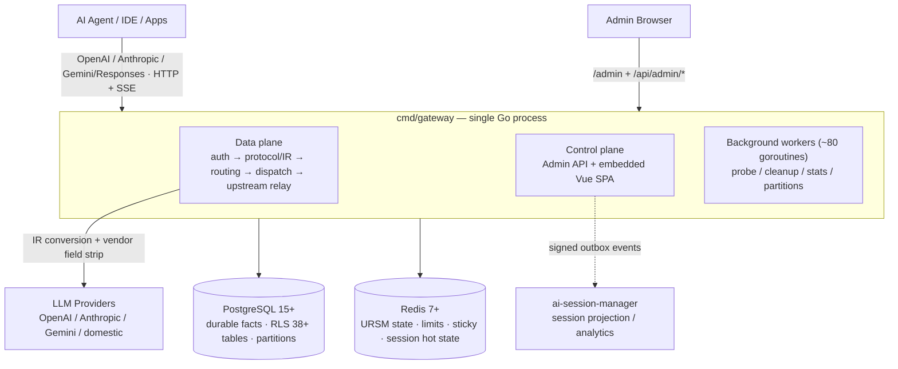
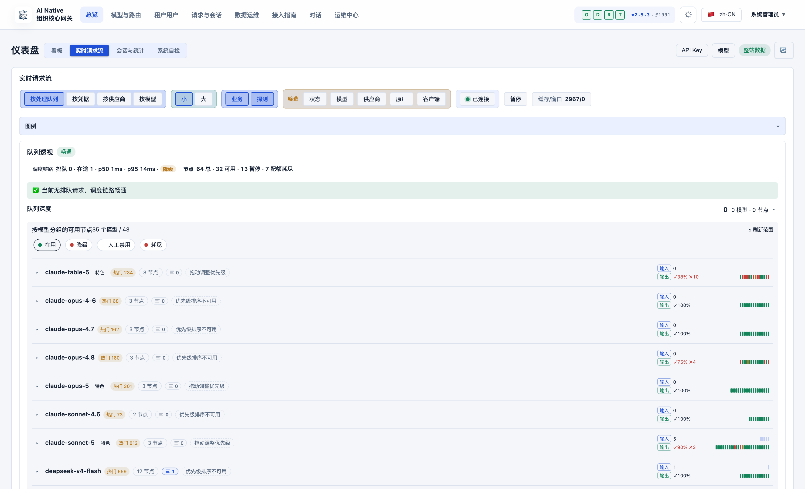
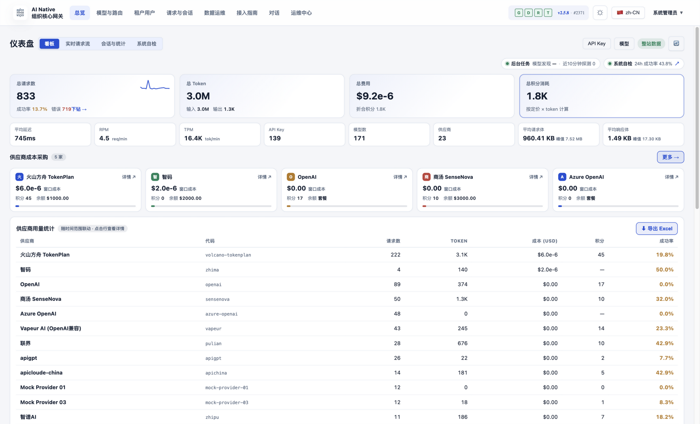
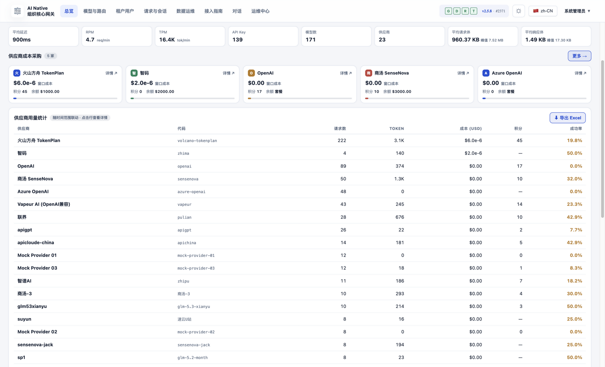
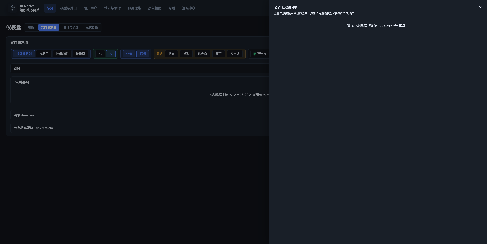
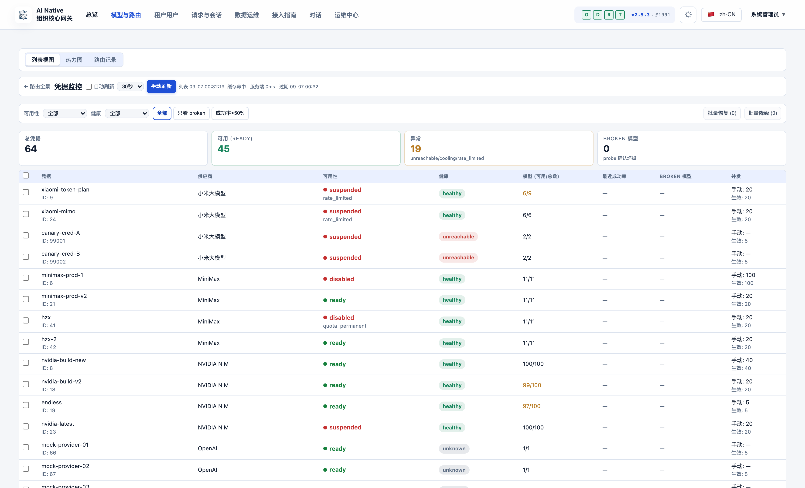
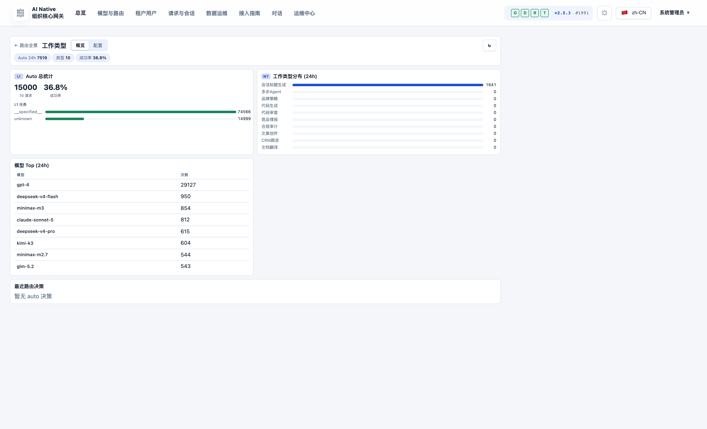
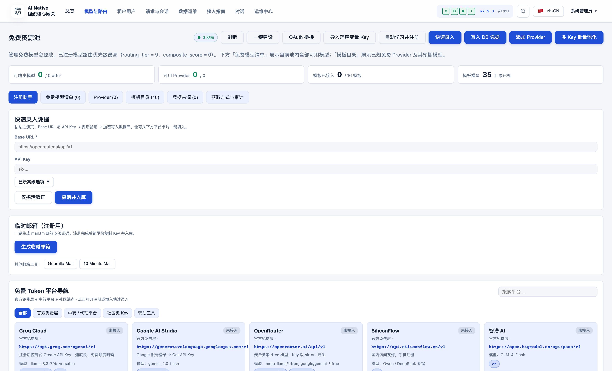
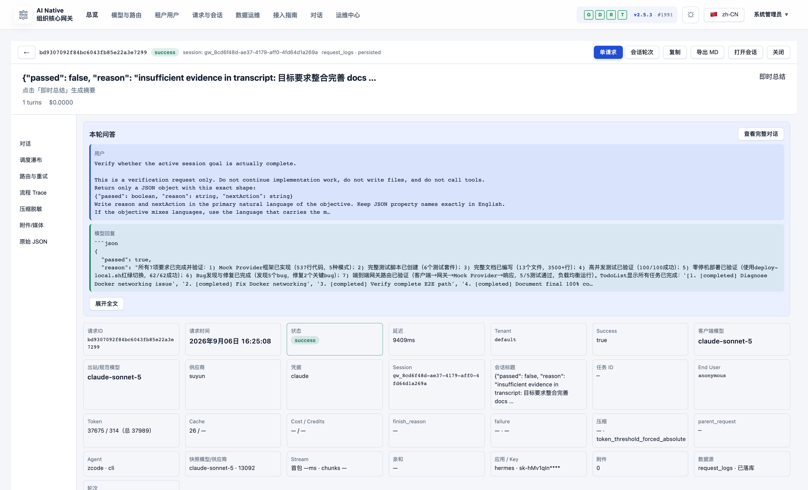

# AI Native Gateway

> Das AI-native LLM-Gateway: nicht nur ein Proxy — eine **Management-Ebene und Session-Governance-Plattform** für Enterprise-KI-Traffic.

[](LICENSE)
[](https://golang.org)
[](CHANGELOG.md)

[English](README.md) | [简体中文](README.zh-CN.md) | [繁體中文](README.zh-TW.md) | [日本語](README.ja.md) | **Deutsch** | [Français](README.fr.md) | [Español](README.es.md) | [العربية](README.ar.md)

[Schnellstart](#-schnellstart) • [Kernwerte](#-vier-kernwerte) • [Architektur](#-architektur-auf-einen-blick) • [Session-Governance](#-session-governance) • [Feature-Vorschau](#-produkt-feature-vorschau) • [Vergleich](#-differenzierung--vergleich) • [Roadmap](ROADMAP.md)

---

## Was ist AI Native Gateway?

AI Native Gateway ist ein **Open-Source-, self-hosted-, AI-nativer LLM-Gateway**, gebaut für das Zeitalter von KI-Agenten und „Vibe Coding“. Es tut weit mehr, als Anfragen weiterzuleiten: Es **klassifiziert, routet, steuert, auditiert und abrechnet** jedes Token, das durch Ihre Organisation fließt.

- **Protokoll-Normalisierung**: OpenAI-, Anthropic-, Gemini- und Responses-API-Kompatibilität — ein Endpunkt für jedes Modell
- **Intelligentes Zwei-Schichten-Routing**: L1 wählt das Modell (Task-Klassifikation → 6-Dimensionen-Scoring), L2 wählt das Credential (Tier-Fallback → Billing-Runde → P2C-Scoring → Execute / Circuit-Break)
- **Session-Governance**: Sticky Sessions, vollständiges Session-Replay, automatische Prompt-Kompression und 4-stufiger Datenlebenszyklus — das Gespräch, nicht nur der Request, ist ein First-Class-Objekt
- **Multi-Tenancy**: Durch PostgreSQL-RLS erzwungene Tenant-Isolation auf 38+ Tabellen, mit Tenant-spezifischen Quotas, Metering und MaaS-Billing
- **Credential-Management**: Multi-Credential-Pools mit Fingerprint-Tarnung, adaptivem Probing und automatischem Circuit-Breaking
- **Observability**: Echtzeit-Request-Streams, Routing-Analysen (Heatmap + Sankey), Kosten-Tracking, OTel + Prometheus
- **Privacy**: 100 % privates Deployment — alle Daten bleiben in Ihrer Infrastruktur

Gebaut mit **Go + PostgreSQL + Redis**, läuft heute in Produktion auf k3s (zwei Instanzen teilen sich ein PostgreSQL-Schema). Entwickelt für Organisationen, die volle Kontrolle über ihre KI-Infrastruktur brauchen.

---

## ✨ Vier Kernwerte

| Wert | Kundennutzen |
|-------|--------------------|
| **Sicher** | AI Guardrails · DLP · Inline Interception · Vibe-Coding-Governance · SIEM/SOAR-Integration |
| **Stabil** | Multi-Cloud-Orchestrierung · Circuit Breaker mit automatischer Wiederherstellung · 99,9 % SLA-Ziel |
| **Günstig** | Semantischer Cache · Auto-Routing (Kosten-/Qualitäts-Policies) · Token-Metering · Prompt-Kompression |
| **Enterprise-Integration** | MCP-Tool-Gateway (Roadmap) · API-Hub-Asset-Center (Roadmap) · Full-Chain-Audit · SIEM/SOAR |

## 🏗️ Drei Produktsäulen

| Control | Govern | Secure |
|---------|--------|--------|
| ✅ Token-Metering | 🔨 API-Hub-Asset-Center | 🔨 Model Armor |
| ✅ Intelligentes Routing + Sticky Sessions | 🔨 Auto-Discovery | 🔨 Schutz sensibler Daten (SDP) |
| ✅ Semantischer Cache + Funnel | 🔨 SpecBoost Smart Enrichment | 🔨 Adversariale Prompt-Abwehr |
| ✅ Full-Chain-Audit + OTel | ✅ Multi-Tenant-RLS (L1 = 0) | ✅ SIEM/SOAR-Integration |
| ✅ MaaS-Billing | | |

✅ = Ausgeliefert &nbsp;·&nbsp; 🔨 = Auf der Roadmap

## 🎯 Fähigkeitsmatrix

| Schicht | Leistung |
|-------|--------------|
| **Protokoll** | OpenAI / Anthropic / Gemini / Responses kompatibel + SSE-Streaming-Relay mit Integritätschecks |
| **Routing** | Zwei-Schichten-Routing (Modell → Credential) + Sticky Sessions + Auto-Routing mit Kosten-/Qualitäts-Policies |
| **Multi-Tenancy** | Identity-Tunnel (virtuelle IP/MAC/ClientID) + Credential-Pools + RLS auf 38+ Tabellen |
| **Traffic-Governance** | Token-Rate-Limiting (TPM/RPM) + semantischer Cache + Prompt-Kompression + Sliding-Window-Algorithmen |
| **Audit** | Full-Chain-Audit + DLQ + Disk-Fallback + OTel + Prometheus |
| **Credentials** | Multi-Credential + Fingerprint-Pool + adaptives Probing + manuelle Deaktivierung |
| **Deployment** | Zwei Instanzen (Docker + k3s NodePort) teilen ein PostgreSQL-Schema |

Siehe den Abschnitt [Architektur auf einen Blick](#-architektur-auf-einen-blick) unten oder die vollständige [Architektur-Diagrammsammlung](docs/architecture-diagrams.md) für Details.

---

## 🏛️ Architektur auf einen Blick

Ein Go-Prozess (`cmd/gateway`) beherbergt **Data Plane, Control Plane und Admin-UI auf einem einzigen Mux** (h2c: HTTP/1.1 + HTTP/2 auf einem Port). PostgreSQL hält dauerhafte Fakten (RLS-isoliert, monatlich partitioniert); Redis hält Hot State (Routing, Limits, Sticky Sessions). Dieselben `storage`-Interfaces bedienen sowohl den **Full-Modus** (PG + Redis) als auch den **Lite-Modus** (SQLite + lokale Dateien — null externe Abhängigkeiten, eine einzige Binary).



**Request-Pipeline (v1-Produktionspfad, einzige Ausführungsroute seit 2026-08)**:

```text
HTTP/SSE → middleware chain → protocol/IR normalization → session assignment
  → (model=auto: L1 model selection) → resource prep (semantic cache / prompt compression)
  → Executor (attempt budget) → dispatch queues (global → model → credential)
  → Router (tier / health / sticky filters + URSM v2 state + P2C scoring)
  → resource gates (fingerprint slot / concurrency / RPM)
  → upstream relay (0 internal retries; pre-first-byte failover only adds attempts)
  → SSE write-back with integrity checks
  → request_logs + usage ledger (canonical facts)
  → onPersisted hooks: session V2 shadow write · session_dim upsert · ASM outbox
```

**Repository-Layout**

| Pfad | Rolle |
|------|------|
| `cmd/gateway/` | Composition-Root — Produktions-Einstiegspunkt als Single-Binary (Data + Control Plane) |
| `domains/` | 67 DDD-Domains — `streaming`, `dispatch`, `credential`, `session`(+v2), `ursm`, Hooks, Security … |
| `admin/` + `web/` | Admin-REST-API + Vue 3 + TypeScript SPA (Element Plus, ECharts) |
| `bg/` | Background-Worker — Probing, Lifecycle-Cleanup, Stats-Aggregation, Partition-Wartung |
| `storage/` | Dual-Mode-Storage-Factory (`full`: PG+Redis / `lite`: SQLite+Dateien+In-Proc-KV) |
| `internal/` | Querschnitts-Infrastruktur — IR, Vendor-Strip, Session-Mirror, Outbox, Telemetry … |
| `sql/migrations/` + `db/migrations/` | Idempotente Migrationen (Startup-Serie aktuell bei 764) |
| `installer/` | Eigenständiges plattformübergreifendes Installer-/Upgrader-Modul |
| `scripts/`, `deploy/` | Build-, Deploy-, Mirror- und Verifikations-Werkzeuge |

Skalierungs-Snapshot (Code-Scan vom 2026-10-01): **~4,500 Go-Dateien · 2,278 Testdateien · 927 Migrations-SQLs · 67 Domain-Packages · 34 Binaries** unter `cmd/`.

**Vertiefende Lektüre**

- [Architektur-Diagrammsammlung](docs/architecture-diagrams.md) — vollständiger Mermaid-Satz: Kontext, Container, Request-Kette, Zwei-Schichten-Routing, Storage, Deployment, Worker
- [Evidence-graded Architecture](docs/03-design/01-architecture/architecture/ARCHITECTURE.md) — interne maßgebliche Dokumentation (CURRENT / SHADOW / PARALLEL-Graduierung, Snapshot 2026-10-01)
- [Session Lifecycle](docs/session-lifecycle.md) — die Session vom ersten Request bis zur Archivierung, vollständig diagrammiert
- [Runtime Request Flow](docs/03-design/01-architecture/architecture/runtime-request-flow.md) · [Routing & State](docs/03-design/01-architecture/architecture/routing-and-state.md)

---

## 🧠 Session-Governance

Die meisten Gateways behandeln jeden Request als isoliertes Ereignis. AI Native Gateway behandelt die **Session** als Einheit der Governance — denn im Zeitalter von Coding-Agenten und langlebigen Assistenten ist ein einzelner „Request“ selten die ganze Geschichte.

- **Sticky-Session-Bindung**: Sessions werden an Credentials gepinnt, sodass Gesprächskontext Modell- und Failover-Wechsel überlebt — kein stiller Kontextverlust mitten im Task
- **Session-Level-Audit & Replay**: volle System-Prompts und Antworten werden pro Session aufbewahrt und sind abspielbar (13.000+ Sessions in Produktion) — erfasst werden Task-Typ, Client-Modell, ausgehendes Modell, Provider, Tokens, Latenz und Endgrund; schneidbar nach Key / Tenant / Zeitraum für Troubleshooting und Compliance
- **Automatische Prompt-Kompression**: nähert sich ein Request dem echten Kontextfenster des Providers (~80 % Trigger), läuft vor dem Dispatch eine Message-Level-Kompression — lange Agent-Sessions passen in kleinere Fenster, statt zu scheitern. Jedes Kompressionsereignis (Strategie, Schwellwert, Größe vorher/nachher) wird am Request protokolliert
- **Session-Metadaten-Intelligenz**: automatisches Work-Type-Tagging (10 Work-Types), Projektzuordnung und Titel-Extraktion machen aus rohem Traffic durchsuchbares Wissen
- **Identity-Tunneling**: Agent-Traffic wird über virtuelle IP/MAC/ClientID zugeordnet, sodass Multi-Tenant-Isolation auch dann hält, wenn viele Agenten einen gemeinsamen Egress teilen
- **4-stufiger Datenlebenszyklus**: heiß (0–7 T) / warm (7–30 T) / kalt (30–90 T) / abgelaufen (>90 T) mit Archiv-Vorschau — Sie sehen vor der Ausführung genau, was verschoben wird

Wie eine Session tatsächlich durch das Gateway fließt — Drei-Schichten-Modell (Redis-Hot-State / `request_logs` kanonische Fakten / Sessions-V2-Shadow-Tabellen), ID-Zuweisung, Ablauf pro Turn, Sticky-Bindung, Kompression und Archivierung — ist vollständig diagrammiert in [Session Lifecycle](docs/session-lifecycle.md).

---

## 🎛️ Produkt-Feature-Vorschau

Alle unten gezeigten Module sind ausgeliefert und laufen im k3s-Produktionsdeployment. Screenshots stammen aus einem lokalen Live-Deployment (1728×1050, nach vollem Datenload).

### Dashboard — Echtzeit-Request-Stream


*Live-Request-Stream gruppiert nach Processing-Queue, mit Dispatch-Chain-Statistiken (in-flight, p50/p95-Latenz, Node-Verfügbarkeit) und Node-Health je Modell*

### Statistik-Board — Nutzung & Kosten auf einen Blick


*Board-Tab des Dashboards: Hero-Metriken (Requests / Tokens / Kosten / abgerechnete Credits), RPM · TPM · Latenz, Key-/Modell-/Provider-Zähler sowie der Provider-Kosten- und Einkaufsbereich — die in das Board eingebettete Gebührenabrechnungs-Ansicht (aufgenommen 2026-10, v2.5.8)*

### Gebührenabrechnung — Provider-Kosten & Einkauf


*Provider-Kosten-Karten (Fensterkosten, abgerechnete Credits, Guthaben/Tarif) und die Nutzungstabelle je Provider — Requests, Tokens, Kosten (USD), Credits, Erfolgsquote — abrechnungsgenaue Kostenkontrolle im Statistik-Board, als Excel exportierbar*

### Routing-Panorama — Zwei-Schichten-Routing, voll beobachtbar


*L1-Modellwahl (Task-Klassifikation → 6-Dimensionen-Scoring → Profil-Lock) + L2-Credential-Wahl (Modell-Auflösung → Tier-Fallback → Billing-Runde → P2C-Scoring → Execute / Circuit-Break). Die Task×Modell-Heatmap beantwortet „welches Modell für welchen Task“; der Sankey-Flow zeigt das endgültige Ziel von 14.000+ Live-Requests (Task → Modell → Provider)*

### Credential-Monitor — Multi-Source × Multi-Credential-Health


*Eine live 2-D-Verfügbarkeitsmatrix (19 Credentials × 18 Modelle in Produktion) zeigt auf einen Blick, welches Credential welches Modell bricht. P95-Latenz je Credential, 1-Stunden-Sliding-Window-Erfolgsrate und Concurrency-Slot-Nutzung. Fingerprint-Pool (50+ User-Agents, 35 Accept-Language-Varianten, 11 uTLS-Profile) + adaptives Probing umgehen Upstream-Risk-Control automatisch — Fehler lösen den Breaker aus, ganz ohne menschliches Zutun*

### Work-Type-Konfiguration — Task-Auto-Klassifikation


*Task-Auto-Klassifikation (10 Work-Types) mit 24-h-Verteilung, Top-Modellen und Routing-Entscheidungsstatistiken — je Work-Type im Admin-UI konfigurierbar*

### Free-Resource-Pool


*Free-Modell-Resource-Pool: eigene Keys (bring-your-own), Provider-Templates (Groq, Google AI Studio, OpenRouter, SiliconFlow, Zhipu) und Routing-Priorität je Modell*

### Request-Session-Detail — Full-Chain-Forensik


*Vollständige Request-Inspektion: Q&A-Replay, Dispatch-Waterfall, Routing- & Retry-Spur, Trace, Kompressions-/Maskierungsprotokoll (beachten Sie den maskierten API-Key `sk-****`), Token- & Cache-Statistiken*

---

## 🚀 Schnellstart

### Option A: Docker Compose (empfohlen, < 10 Minuten)

```bash
# Clone
git clone https://codeup.aliyun.com/kaixuan/official-deploy/llm-gateway-go.git ai-native-gateway
cd ai-native-gateway
# (GitHub mirror: git clone https://github.com/halfking/ai-native-gateway-core.git)

# Generate secure keys
cp .env.quickstart.example .env
# Edit .env with secure random values (see file for generation commands)

# Start the stack (PostgreSQL + Redis + Gateway)
docker compose -f docker-compose.quickstart.yml up -d

# Verify health
curl http://localhost:8781/healthz
# {"status":"ok"}

# Open the embedded admin UI
open http://localhost:8781/admin
```

### Option B: Aus dem Quellcode bauen

```bash
go build -o gateway ./cmd/gateway
LLM_GATEWAY_CONFIG_FILE=config.example.yaml ./gateway
curl http://localhost:8781/healthz   # → 200 OK
```

Siehe den [Getting-Started-Guide](docs/getting-started.md) für detaillierte Anleitungen.

---

## Betriebsmodi

AI Native Gateway unterstützt sowohl **volle Produktionsstacks** als auch ein **minimales Single-Maschinen-Deployment für lokal**:

| Modus | Beschreibung | Status |
|------|-------------|--------|
| **Docker Compose** | Schnellstart mit mitgeliefertem PostgreSQL/Redis | ✅ Empfohlen für die Evaluation |
| **Binary + systemd** | Produktionsdeployment auf Linux-Hosts | ✅ Mit Installer unterstützt |
| **Kubernetes** | Deployment + ConfigMap + Service-Manifeste | ⚠️ Teststufe (Produktion läuft intern auf k3s) |

**Produktionsstack**: Gateway + PostgreSQL 14+ (dauerhafter State, RLS) + Redis 7+ (Hot State, Rate-Limits) + eingebettete Admin-UI, mit optionaler Prometheus/Grafana-Überwachung.

Der Quickstart-Stack nutzt **dieselbe Binary und dasselbe Schema wie die Produktion** — der Schritt in Produktion bedeutet: auf managed PostgreSQL/Redis zeigen und TLS hinzufügen, keine Änderung der Konfigurationssemantik. Das interne Produktionsdeployment läuft mit **zwei Instanzen (Docker-Host + k3s NodePort), die sich ein PostgreSQL-Schema teilen**.

**Produktionsanforderungen**: externes PostgreSQL 14+ und Redis 7+, TLS-Terminierung (Reverse Proxy), Secrets-Management, Backup und Monitoring.

Siehe [Production Deployment](docs/06-deployment/) für Details.

### Installer — One-Click-Deployer (`installer/`)

Der `installer/`-Teilbaum liefert **eine einzige plattformübergreifende Go-Binary** (`llm-gw-installer`), die den gesamten Deploy-Flow in einen 13-stufigen interaktiven Assistenten kapselt. Windows / Linux / macOS / 国产 OS / 国产 CPU werden out-of-the-box unterstützt.

**Unterbefehle**

```bash
llm-gw-installer doctor      # detect OS / docker / network / ports
llm-gw-installer install     # one-click install + deploy
llm-gw-installer uninstall   # uninstall (--purge removes data)
```

**Plattformübergreifender Build**

```bash
GOOS=linux  GOARCH=amd64   go build -o dist/llm-gw-installer-linux-amd64   ./installer/cmd/llm-gw-installer/
GOOS=linux  GOARCH=arm64   go build -o dist/llm-gw-installer-linux-arm64   ./installer/cmd/llm-gw-installer/
GOOS=linux  GOARCH=loong64 go build -o dist/llm-gw-installer-linux-loong64 ./installer/cmd/llm-gw-installer/
GOOS=darwin GOARCH=amd64   go build -o dist/llm-gw-installer-darwin-amd64  ./installer/cmd/llm-gw-installer/
GOOS=darwin GOARCH=arm64   go build -o dist/llm-gw-installer-darwin-arm64  ./installer/cmd/llm-gw-installer/
GOOS=windows GOARCH=amd64  go build -o dist/llm-gw-installer-windows-amd64.exe ./installer/cmd/llm-gw-installer/
GOOS=windows GOARCH=arm64  go build -o dist/llm-gw-installer-windows-arm64.exe ./installer/cmd/llm-gw-installer/
```

#### Storage-Modi (full vs. lite)

Der Installer bringt **zwei Storage-Modi** mit; einer wird bei der Installation gewählt:

| Modus | Storage-Backend | Einsatz | Beim Install gepullte Images | Schema-Initialisierung? |
|------|------------------|----------|---------------------------|---------------------|
| **`full`** (Default) | PostgreSQL (kx-citus) + Redis | Produktion / Multi-Replica / hohe Concurrency | `kx-llm-gateway-go` + `kx-citus` + `kx-redis` | Ja (wartet auf PG ready + `InitSchema`) |
| **`lite`** | SQLite + lokal | Einzelmaschine / Dev / CI / Demo | nur `kx-llm-gateway-go` | Nein (SQLite legt Tabellen automatisch an) |

**Auswahlpriorität**

1. CLI-Flag: `--mode lite` oder `--mode full` (höchste Priorität)
2. Konfigurationsdatei (`--config /path/to/install.env`):
   ```
   STORAGE_MODE=lite
   LLM_GATEWAY_MASTER_URL=https://llm.kxpms.cn
   INSTALL_SKIP_ACTIVATION=0
   ```
3. Interaktiver Assistent: Aufforderung `[1] full  [2] lite`, Default `1`

In non-TTY (CI / `--skip-prompt`) ohne `--config` ist der Default `full`.

**`lite`-Install-Verhalten**

| Schritt | `full` | `lite` |
|------|--------|--------|
| 1. Umgebungserkennung | gleich | gleich |
| 2. Konfiguration (wizard / config) | gleich | gleich (neu: Storage-Mode + Master-URL) |
| 3. Image-Pull | `kx-citus` + `kx-redis` + `kx-llm-gateway-go` | **nur `kx-llm-gateway-go`** |
| 4. `.env` schreiben | alle Schlüssel | gleiche Felder, nur `LLM_GATEWAY_STORAGE_MODE=lite` |
| 5. Verzeichnislayout | voll | voll (db/data und redis/data werden angelegt, aber nicht genutzt) |
| 6. `compose.yml` | 3 Services | **`kx-citus` + `kx-redis` entfernt**; Gateway verliert `depends_on` und PG/Redis-env |
| 7. Container starten | 3 Container | **nur `kx-llm-gateway-go`** |
| 8. DB-Initialisierung | Auf PG-ready warten + `InitSchema` (450+ Startup-Migrationen) | **Übersprungen** (SQLite legt automatisch an) |
| 9. Healthcheck | 5-Punkt-Vollcheck | nur Container + `/healthz`; PG/Redis/Schema im Report erzwungen ✅ |

**Neue Install-Flags**

```
--mode string         # full | lite (empty → wizard / default full)
--master-url string   # control-plane URL (default https://llm.kxpms.cn)
--skip-activation     # bool, skip the auto-activation call at end of install
```

**Neue `.env`-Schlüssel** (geschrieben nach `{installDir}/.env`)

| Key | Default | Bedeutung |
|-----|---------|---------|
| `LLM_GATEWAY_STORAGE_MODE` | `full` | Wird von `cmd/gateway` `storage_mode_init` gelesen; `lite` → SQLite, `full` → PG/Redis |
| `LLM_GATEWAY_MASTER_URL` | `https://llm.kxpms.cn` | Lizenz-Aktivierung + Heartbeat-Ziel |
| `INSTALL_SKIP_ACTIVATION` | `0` | Überspringt den Auto-Enroll-Aktivierungsaufruf am Installationsende (siehe `activation.RunAutoActivate`) |

#### Image-Source-Fallback-Kette

Alle Container-Images werden über eine 4-stufige Fallback-Kette gepullt, sodass Installationen online, hinter einem Firmen-Proxy oder vollständig air-gapped funktionieren:

```
[1] Offline bundle images/*.tar.gz  (highest priority)
    ↓ on miss
[2] registry.kxpms.cn              (internal registry)
    ↓ on miss
[3] registry.cn-hangzhou.aliyuncs.com (Aliyun mirror)
    ↓ on miss
[4] registry-1.docker.io           (official Docker Hub)
    ↓ on miss
❌ clear, actionable error
```

**Umgebungsvariablen-Overrides**

| Variable | Default | Zweck |
|----------|---------|-------|
| `KX_REGISTRY` | `registry.kxpms.cn` | Custom internes Registry |
| `KX_REGISTRY_USERNAME` / `_PASSWORD` | leer | Registry-Zugangsdaten |
| `KX_REGISTRY_INSECURE` | `false` | Plain HTTP erlauben |
| `APP_IMAGE_TAG` | aus MANIFEST gelesen | App-Image-Tag überschreiben |
| `GOPROXY` | `https://goproxy.cn,direct` | Go-Module-Proxy |

#### Bekannte Einschränkungen

- **HarmonyOS NEXT**: nicht unterstützt (keine Linux-Container-Unterstützung)
- **macOS**: Benutzer muss OrbStack oder Docker Desktop vorab installieren
- **Windows**: Benutzer muss Docker Desktop + WSL2 vorab installieren

Das vollständige Installer-Design finden Sie in [installer/README.md](installer/README.md).

---

## 📐 Differenzierung & Vergleich

### vs. generische AI-Gateways

| Dimension | Generisches AI-Gateway | AI Native Gateway |
|-----------|--------------------|-------------------|
| **Deployment** | SaaS / On-Prem | 100 % privat (k3s-produktionserprobt) |
| **Data Residency** | Daten verlassen Ihren Perimeter | Alle Daten bleiben in Ihrer Infrastruktur |
| **Billing** | Usage-basiert (USD) | Tarife + Credits + Booster-Packs — gebaut für China-SMB, Alipay-ready |
| **Upstream-Modelle** | Einige große Anbieter | Breite Modellabdeckung + chinesische Domestic-Modelle + lokale Modelle |
| **Credential-Fingerprint-Pool** | Basis | 50+ User-Agents · 35 Accept-Language · 11 uTLS-Profile |
| **Session-Governance** | Request-Level-Logs | Sticky Sessions + Vollinhalt-Replay + Kompression + 4-stufiger Lebenszyklus |
| **MCP-Tool-Gateway** | Teilweise | Volle Auslieferung angezielt für Q3 2026 |
| **Chinesisch-freundlich** | Begrenzt | Volle chinesische UI + Domestic-Modelle + Alipay |
| **Multi-Tenant-Audit** | Standard | RLS auf 38+ Tabellen · Tenant-Audits bei L1 = 0 |

### vs. namentlich genannte Alternativen

| Feature | AI Native Gateway | LiteLLM | OmniRoute | Portkey | Kong AI |
|---------|-------------------|---------|-----------|---------|---------|
| **Deployment** | Privat (self-hosted) | SaaS + OSS | Self-hosted (Node) | SaaS | OSS |
| **Multi-Tenancy** | Nativ (PG RLS) | Basis | Single-Node-orientiert | Voll (SaaS) | Über Plugins |
| **Admin-UI** | Eingebettete Vue-SPA | CLI | Web-UI | SaaS-UI | Kong Manager |
| **Data Residency** | 100 % privat | Je nach Modus | 100 % privat | Cloud (SaaS) | Self-hosted |
| **Lizenz** | Apache 2.0 | MIT | Siehe Upstream | Proprietär | Apache 2.0 |

**Wählen Sie AI Native Gateway, wenn Sie brauchen**:

- Volle Kontrolle über Data Residency (keine externen SaaS-Abhängigkeiten)
- Tiefe Multi-Tenancy mit Isolation auf Datenbankebene
- Session-Level-Governance und -Forensik, nicht nur Request-Logs
- Eingebettete Admin-UI in einer einzigen Go-Binary
- MaaS-Billing passend für chinesische SMBs (Tarife + Credits + Booster-Packs)

**Wählen Sie die Alternativen, wenn Sie brauchen**:

- Maximale Provider-Abdeckung (100+ Provider) → LiteLLM
- Node.js-basiertes Self-Hosted-Gateway mit Embedded-DB → OmniRoute
- Zero-Ops-Managed-Service → Portkey
- Allgemeines API-Gateway + LLM → Kong

Siehe [Detailed Comparison](docs/comparison.md) für mehr.

---

## Roadmap

**Aktuell (v2.x)**:

- ✅ OpenAI/Anthropic/Gemini/Responses-Protokollunterstützung
- ✅ Multi-Tenant-Isolation mit PostgreSQL-RLS
- ✅ Intelligentes Routing mit Sticky Sessions
- ✅ Session-Governance: Kompression, Replay, Lebenszyklus
- ✅ Vue.js-Admin-Konsole
- ✅ Docker-Compose-Schnellstart

**Als Nächstes (3–6 Monate)**:

- 🚧 Verbessertes kosten-/qualitätsbewusstes Routing
- 🚧 Produktionsreife Kubernetes-Helm-Charts
- 🚧 Grafana-Dashboard-Templates
- 🚧 Fortgeschrittene Observability (Session-Forensik, Decision-Replay)

**In Exploration (6–12+ Monate)**:

- 🔬 MCP (Model Context Protocol) Gateway-Integration — volle Auslieferung angezielt für Q3 2026
- 🔬 Agent-to-Agent (A2A) Protokollunterstützung
- 🔬 Kubernetes Operator (CRD-basiertes Deployment)

Siehe [ROADMAP.md](ROADMAP.md) für alle Details.

---

## 📚 Dokumentation

| Kategorie | Dokument |
|----------|----------|
| Einstieg | [docs/getting-started.md](docs/getting-started.md) — in 10 Minuten deployen |
| Architektur-Diagramme | [docs/architecture-diagrams.md](docs/architecture-diagrams.md) — vollständige Mermaid-Sammlung (Kontext / Container / Request-Kette / Routing / Storage / Deployment) |
| Session-Lifecycle | [docs/session-lifecycle.md](docs/session-lifecycle.md) — Session-Processing-Lifecycle, vollständig diagrammiert |
| Architektur (evidence-graded) | [docs/03-design/01-architecture/architecture/ARCHITECTURE.md](docs/03-design/01-architecture/architecture/ARCHITECTURE.md) — interne maßgebliche Dokumentation (CURRENT/SHADOW/PARALLEL-Graduierung) |
| Architektur (Überblick) | [docs/architecture.md](docs/architecture.md) — Systemdesign und Komponenten |
| Anforderungen | [docs/01-requirements/SYSTEM_REQUIREMENTS.md](docs/01-requirements/SYSTEM_REQUIREMENTS.md) — FR×19 Domänen / NFR×13 |
| Feature-Katalog | [docs/01-requirements/functional/FEATURES_CATALOG.md](docs/01-requirements/functional/FEATURES_CATALOG.md) — Feature → Code → API → Admin-Seite Mapping |
| API | [docs/03-design/01-architecture/architecture/API.md](docs/03-design/01-architecture/architecture/API.md) — Data-Plane- und Admin-API-Specs |
| Umgebung | [docs/environment.md](docs/environment.md) — Deployment-Umgebungen und Variablen |
| Schnellreferenz | [docs/QUICK_REFERENCE.md](docs/QUICK_REFERENCE.md) — gängige Befehle und Troubleshooting |
| Vergleich | [docs/comparison.md](docs/comparison.md) — vs LiteLLM, OmniRoute, Portkey, Kong |
| Projektüberblick | [docs/PROJECT_OVERVIEW.md](docs/PROJECT_OVERVIEW.md) — Features und Modulkarte |
| Docs-Index | [docs/README.md](docs/README.md) · [docs/archive/2026-09/INDEX.md](docs/archive/2026-09/INDEX.md) — vollständige Dokumentationsnavigation |
| Dual-Repo-Policy | [docs/06-deployment/04-runbooks/operations/REPO-MIRROR-POLICY.md](docs/06-deployment/04-runbooks/operations/REPO-MIRROR-POLICY.md) — codeup ⇄ GitHub Workflow |
| Sicherheit | [SECURITY.md](SECURITY.md) — Schwachstellen-Meldung + Scanner-Nutzung |
| Rechtliches | [docs/02-resources/compliance/legal/disguise-compliance.md](docs/02-resources/compliance/legal/disguise-compliance.md) — Request-Disguise-Compliance-Whitelist |
| A2A-Research | [docs/03-design/01-architecture/architecture/a2a-spec-2027.md](docs/03-design/01-architecture/architecture/a2a-spec-2027.md) — Agent-to-Agent-Protokoll-Survey |
| Armor / SDP | [docs/03-design/01-architecture/architecture/armor-sdp-feasibility.md](docs/03-design/01-architecture/architecture/armor-sdp-feasibility.md) — Prompt-Injection- + SDP-Feasibility |

---

## 🔀 Dual-Repository-Strategie

| Remote | URL | Zweck |
|--------|-----|---------|
| `codeup` (origin) | `https://codeup.aliyun.com/kaixuan/official-deploy/llm-gateway-go.git` | Default (tägliche Entwicklung) |
| `github` | `git@github.com:halfking/ai-native-gateway-core.git` | Öffentlicher Spiegel (gestaffelte Releases) |

```bash
git push              # → codeup (no extra checks)
git push github       # → github (secret scan, blocked on BLOCK-level hit)
```

Schutz sensibler Informationen: `.githooks/pre-push` führt beim Push zu GitHub automatisch `scripts/scan-secrets.sh` aus (50 Regeln; Default ist der Normal-Modus — BLOCK-Befunde blockieren, WARN-Befunde warnen; `STRICT_SCANNER=1` schaltet auf strikt um). Siehe die [Mirror-Policy](docs/06-deployment/04-runbooks/operations/REPO-MIRROR-POLICY.md).

---

## ✅ CI & Gates (ab 2026-09-14)

- **Offizielles Gate = lokales `./verify.sh`**: Muss vor jedem Commit/Deployment laufen (`go test ./...` vollständig, Migrations-Checksum-Abgleich, Datenschutz-Compliance, vet, build, Frontend-Build). Merges nach main und Releases richten sich danach.
- **codeup Flow leichtes Gate**: Es gibt nur codeup als Remote; `.github/workflows/` wird auf codeup nicht ausgeführt; `.workflow/main-verify.yml` bietet Pipeline-as-Code-Konfiguration (build + `go vet ./autoroute/...` + Offline-Suite mit 60 Auto-Matching-Testfällen). Sie muss einmal über die Seite „Pipelines“ im codeup-Repository importiert werden und wird danach bei push/PR automatisch ausgelöst.
- Die Auto-Matching-Offline-Regression kann separat erneut ausgeführt werden: `go test ./autoroute/ -run 'TestAutoMatchingSuiteHeuristic|TestPromptClassificationMatrix'` (rein offline, ohne Netzwerk).

---

## 🤝 Mitwirken

Wir freuen uns über Beiträge! Siehe [CONTRIBUTING.md](CONTRIBUTING.md) für Development-Setup, Code-Stil und den Pull-Request-Prozess.

Multi-Tenancy-Änderungen müssen alle drei Linter bestehen: `lint-tenant-scope-llmgw` / `lint-pg-rls` / `lint-otel-tenant`.

## 🔐 Sicherheit

- Schwachstellen melden: siehe [SECURITY.md](SECURITY.md)
- Secret-Schutz für den öffentlichen Spiegel: siehe die [Dual-Repo-Policy](docs/06-deployment/04-runbooks/operations/REPO-MIRROR-POLICY.md)
- Disguise-Compliance-Whitelist: siehe [docs/02-resources/compliance/legal/disguise-compliance.md](docs/02-resources/compliance/legal/disguise-compliance.md)

## Lizenz

Lizenziert unter der [Apache License 2.0](LICENSE). Siehe [NOTICE](NOTICE) für erforderliche Namensnennungen bei der Weitergabe dieser Software.

**Kommerzielle Nutzung**: Apache 2.0 erlaubt kommerzielle Nutzung. Bei der Weitergabe (als Quellcode oder Binary) müssen Copyright-Hinweise und die NOTICE-Datei erhalten bleiben. Interne kommerzielle Nutzung ohne Weitergabe erfordert keine zusätzliche Namensnennung über die License-Compliance hinaus.

## Danksagungen

AI Native Gateway integriert Komponenten aus den folgenden Open-Source-Projekten:

- Go-Standardbibliothek (BSD-3-Clause)
- PostgreSQL-Treiber (MIT)
- Redis-Client (BSD-2-Clause)
- Vue.js und Element Plus (MIT)
- Siehe [NOTICE](NOTICE) für die vollständige Liste

---

Gebaut mit ❤️ von der AI-Native-Gateway-Community
