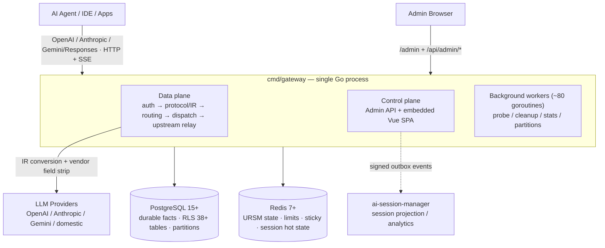

# AI Native Gateway

> La pasarela LLM nativa de IA: no es solo un proxy — un **plano de gestión y una plataforma de gobernanza de sesiones** para el tráfico de IA empresarial.

[](LICENSE)
[](https://golang.org)
[](CHANGELOG.md)

[English](README.md) | [简体中文](README.zh-CN.md) | [繁體中文](README.zh-TW.md) | [日本語](README.ja.md) | [Deutsch](README.de.md) | [Français](README.fr.md) | **Español** | [العربية](README.ar.md)

[Inicio rápido](#-inicio-rápido) • [Valores centrales](#-cuatro-valores-centrales) • [Arquitectura](#-arquitectura-de-un-vistazo) • [Gobernanza de sesión](#-gobernanza-de-sesión) • [Vista previa](#-vista-previa-de-funciones) • [Comparación](#-diferenciación-y-comparación) • [Hoja de ruta](ROADMAP.md)

---

## ¿Qué es AI Native Gateway?

AI Native Gateway es una **pasarela LLM nativa de IA, de código abierto y autoalojada**, construida para la era de los agentes de IA y el «vibe coding». Hace mucho más que reenviar peticiones: **clasifica, enruta, gobierna, audita y factura** cada token que fluye por su organización.

- **Normalización de protocolos**: compatibilidad con OpenAI, Anthropic, Gemini y Responses API — un único punto de acceso para todos los modelos
- **Enrutado inteligente de dos capas**: L1 elige el modelo (clasificación de tareas → scoring de 6 dimensiones), L2 elige la credencial (fallback de tier → ronda de facturación → scoring P2C → ejecutar / abrir circuito)
- **Gobernanza de sesión**: sesiones sticky (persistentes), replay de sesión con contenido completo, compresión automática de prompts y ciclo de vida de datos de 4 niveles — la conversación, y no solo la petición, es un objeto gestionado de primer nivel
- **Multi-tenancy**: aislamiento de tenants mediante RLS de PostgreSQL en 38+ tablas, con cuotas, medición y facturación MaaS por tenant
- **Gestión de credenciales**: pools multi-credencial con disfraz de huella digital, sondeo adaptativo y apertura automática del circuito
- **Observabilidad**: flujos de peticiones en tiempo real, analítica de enrutado (mapa de calor + Sankey), seguimiento de costes, OTel + Prometheus
- **Privacidad**: despliegue 100 % privado — todos los datos permanecen dentro de su infraestructura

Construido con **Go + PostgreSQL + Redis**, hoy en producción sobre k3s (dos instancias que comparten un único esquema PostgreSQL). Diseñado para organizaciones que necesitan control total sobre su infraestructura de IA.

---

## ✨ Cuatro valores centrales

| Valor | Lo que obtiene el cliente |
|-------|---------------------------|
| **Seguro** | AI Guardrails · DLP · interceptación inline · gobernanza del vibe coding · integración SIEM/SOAR |
| **Estable** | Orquestación multi-nube · circuit breaker con recuperación automática · objetivo SLA 99,9 % |
| **Bajo coste** | Caché semántica · auto-enrutado (políticas coste/calidad) · medición de tokens · compresión de prompts |
| **Integración empresarial** | Pasarela de herramientas MCP (hoja de ruta) · centro de activos API Hub (hoja de ruta) · auditoría de punta a punta · SIEM/SOAR |

## 🏗️ Tres pilares del producto

| Control | Gobernanza | Seguridad |
|---------|------------|-----------|
| ✅ Medición de uso de tokens | 🔨 Centro de activos API Hub | 🔨 Model Armor |
| ✅ Enrutado inteligente + sesiones sticky | 🔨 Auto-descubrimiento | 🔨 Protección de datos sensibles (SDP) |
| ✅ Caché semántica + Funnel | 🔨 Enriquecimiento inteligente SpecBoost | 🔨 Defensa contra prompts adversarios |
| ✅ Auditoría de punta a punta + OTel | ✅ RLS multi-tenant (L1 = 0) | ✅ Integración SIEM/SOAR |
| ✅ Facturación MaaS | | |

✅ = Entregado &nbsp;·&nbsp; 🔨 = En la hoja de ruta

## 🎯 Matriz de capacidades

| Capa | Qué obtiene |
|------|-------------|
| **Protocolo** | Compatibilidad con OpenAI / Anthropic / Gemini / Responses + relé SSE con comprobaciones de integridad |
| **Enrutado** | Enrutado de dos capas (modelo → credencial) + sesiones sticky + auto-enrutado con políticas coste/calidad |
| **Multi-tenancy** | Túnel de identidad (IP/MAC/ClientID virtuales) + pools de credenciales + RLS en 38+ tablas |
| **Gobernanza de tráfico** | Límites de tokens (TPM/RPM) + caché semántica + compresión de prompts + algoritmos de ventana deslizante |
| **Auditoría** | Auditoría de punta a punta + DLQ + fallback a disco + OTel + Prometheus |
| **Credenciales** | Multi-credencial + pool de huellas + sondeo adaptativo + desactivación manual |
| **Despliegue** | Dos instancias (Docker + k3s NodePort) que comparten un único esquema PostgreSQL |

Véase la sección [Arquitectura de un vistazo](#-arquitectura-de-un-vistazo) más abajo, o la [colección completa de diagramas de arquitectura](docs/architecture-diagrams.md) para más detalles.

---

## 🏛️ Arquitectura de un vistazo

Un único proceso Go (`cmd/gateway`) aloja el **plano de datos, el plano de control y la UI de administración en un solo mux** (h2c: HTTP/1.1 + HTTP/2 en un mismo puerto). PostgreSQL guarda los hechos duraderos (aislados por RLS, particionados por mes); Redis guarda el estado caliente (enrutado, límites, sesiones sticky). Las mismas interfaces `storage` soportan tanto el **modo full** (PG + Redis) como el **modo lite** (SQLite + ficheros locales — cero dependencias externas, un solo binario).



**Pipeline de peticiones (ruta de producción v1, única ruta de ejecución desde 2026-08)**:

```text
HTTP/SSE → middleware chain → protocol/IR normalization → session assignment
  → (model=auto: L1 model selection) → resource prep (semantic cache / prompt compression)
  → Executor (attempt budget) → dispatch queues (global → model → credential)
  → Router (tier / health / sticky filters + URSM v2 state + P2C scoring)
  → resource gates (fingerprint slot / concurrency / RPM)
  → upstream relay (0 internal retries; pre-first-byte failover only adds attempts)
  → SSE write-back with integrity checks
  → request_logs + usage ledger (canonical facts)
  → onPersisted hooks: session V2 shadow write · session_dim upsert · ASM outbox
```

**Estructura del repositorio**

| Ruta | Rol |
|------|-----|
| `cmd/gateway/` | Raíz de composición — entrada de producción de binario único (plano de datos + control) |
| `domains/` | 67 dominios DDD — `streaming`, `dispatch`, `credential`, `session`(+v2), `ursm`, hooks, seguridad… |
| `admin/` + `web/` | API REST de administración + SPA Vue 3 + TypeScript (Element Plus, ECharts) |
| `bg/` | Workers en segundo plano — sondeo, limpieza del ciclo de vida, agregación de estadísticas, mantenimiento de particiones |
| `storage/` | Fábrica de almacenamiento de doble modo (`full`: PG+Redis / `lite`: SQLite+ficheros+KV en proceso) |
| `internal/` | Infraestructura transversal — IR, strip de campos del proveedor, espejo de sesión, outbox, telemetría… |
| `sql/migrations/` + `db/migrations/` | Migraciones idempotentes (serie de arranque actualmente en 809) |
| `installer/` | Módulo instalador/actualizador autónomo multiplataforma |
| `scripts/`, `deploy/` | Herramientas de build, despliegue, espejo y verificación |

Instantánea de escala (escaneo de código del 2026-10-01): **~4,500 ficheros Go · 2,278 ficheros de test · 927 SQLs de migración · 67 paquetes de dominio · 34 binarios** bajo `cmd/`.

**Lecturas adicionales**

- [Colección de diagramas de arquitectura](docs/architecture-diagrams.md) — conjunto Mermaid completo: contexto, contenedores, cadena de peticiones, enrutado de dos capas, almacenamiento, despliegue, workers
- [Arquitectura con gradación de evidencia](docs/03-design/01-architecture/architecture/ARCHITECTURE.md) — documento interno de autoridad (gradación CURRENT / SHADOW / PARALLEL, instantánea 2026-10-01)
- [Ciclo de vida de sesión](docs/session-lifecycle.md) — la sesión desde la primera petición hasta el archivo, totalmente diagramada
- [Flujo de peticiones en ejecución](docs/03-design/01-architecture/architecture/runtime-request-flow.md) · [Enrutado y estado](docs/03-design/01-architecture/architecture/routing-and-state.md)

---

## 🧠 Gobernanza de sesión

La mayoría de las pasarelas tratan cada petición como un evento aislado. AI Native Gateway trata la **sesión** como unidad de gobernanza — porque en la era de los agentes de código y los asistentes de larga duración, una «petición» rara vez cuenta toda la historia.

- **Vinculación sticky de sesión**: las sesiones se fijan a credenciales para que el contexto de la conversación sobreviva a cambios de modelo y failovers — sin pérdida silenciosa de contexto a mitad de tarea
- **Auditoría y replay a nivel de sesión**: los system prompts y las respuestas completos se conservan y son reproducibles por sesión (13,000+ sesiones en producción), cubriendo tipo de tarea, modelo del cliente, modelo de salida, proveedor, tokens, latencia y motivo de fin — segmentable por clave / tenant / rango temporal para diagnóstico y cumplimiento
- **Compresión automática de prompts**: cuando una petición se acerca a la ventana de contexto real del proveedor (disparador ~80 %), se ejecuta compresión a nivel de mensaje antes del dispatch — las sesiones largas de agentes caben en ventanas más pequeñas en lugar de fallar. Cada evento de compresión (estrategia, umbral, tamaños antes/después) se registra en la petición
- **Inteligencia de metadatos de sesión**: etiquetado automático de tipo de trabajo (10 tipos de trabajo), atribución de proyecto y extracción de título convierten el tráfico bruto en conocimiento buscable
- **Túnel de identidad**: el tráfico de agentes se atribuye mediante IP/MAC/ClientID virtuales, de modo que el aislamiento multi-tenant se mantiene incluso cuando muchos agentes comparten un mismo egress
- **Ciclo de vida de datos de 4 niveles**: caliente (0–7 d) / templado (7–30 d) / frío (30–90 d) / caducado (>90 d) con vista previa del archivo — «esto es exactamente lo que se moverá» antes de ejecutar

Cómo fluye realmente una sesión por la pasarela — modelo de tres capas (estado caliente en Redis / hechos canónicos en `request_logs` / tablas shadow de Sessions V2), asignación de ID, secuencia por turno, vinculación sticky, compresión y archivo — está totalmente diagramado en [Ciclo de vida de sesión](docs/session-lifecycle.md).

---

## 🎛️ Vista previa de funciones

Todos los módulos siguientes están entregados y funcionando en el despliegue de producción en k3s. Las capturas provienen de un despliegue local real (1728×1050, tras cargar todos los datos).

### Panel de control — flujo de peticiones en tiempo real


*Flujo de peticiones en vivo agrupado por cola de procesamiento, con estadísticas de la cadena de dispatch (en vuelo, latencia p50/p95, disponibilidad de nodos) y salud de nodos por modelo*

### Panel de estadísticas — uso y costes de un vistazo


*Pestaña Board del panel: métricas héroe (peticiones / tokens / coste / créditos cargados), RPM · TPM · latencia, contadores de claves/modelos/proveedores y la sección de costes y compras de proveedores — la vista de liquidación de tarifas integrada en el panel (captura de 2026-10, v2.5.8)*

### Liquidación de tarifas — costes y compras de proveedores


*Tarjetas de coste por proveedor (coste de ventana, créditos cargados, saldo/plan) y tabla de uso por proveedor — peticiones, tokens, coste (USD), créditos, tasa de éxito — contabilidad de costes de grado de liquidación dentro del panel de estadísticas, exportable a Excel*

### Panorama de enrutado — enrutado de dos capas, totalmente observable


*Selección de modelo L1 (clasificación de tareas → scoring de 6 dimensiones → bloqueo de perfil) + selección de credencial L2 (resolución de modelo → fallback de tier → ronda de facturación → scoring P2C → ejecutar / abrir circuito). El mapa de calor tarea×modelo responde «qué modelo para qué tarea»; el flujo Sankey muestra el destino final de 14,000+ peticiones en vivo (tarea → modelo → proveedor)*

### Monitor de credenciales — salud multi-fuente × multi-credencial


*Una matriz de disponibilidad 2-D en vivo (19 credenciales × 18 modelos en producción) muestra de un vistazo qué credencial rompe qué modelo. Latencia P95 por credencial, tasa de éxito con ventana deslizante de 1 hora y uso de slots de concurrencia. El pool de huellas (50+ User-Agents, 35 variantes de Accept-Language, 11 perfiles uTLS) + el sondeo adaptativo esquivan automáticamente el control de riesgo del upstream — los fallos disparan el breaker, sin intervención humana*

### Configuración de tipos de trabajo — clasificación automática de tareas


*Clasificación automática de tareas (10 tipos de trabajo) con distribución de 24 h, modelos principales y estadísticas de decisiones de enrutado — configurable por tipo de trabajo en la UI de administración*

### Pool de recursos gratuito


*Pool de recursos de modelos gratuitos: claves propias (bring-your-own), plantillas de proveedores (Groq, Google AI Studio, OpenRouter, SiliconFlow, Zhipu) y prioridad de enrutado por modelo*

### Detalle de sesión de petición — forense de punta a punta


*Inspección completa de la petición: replay de Q&A, cascada de dispatch, rastro de enrutado y reintentos, traza, registro de compresión/enmascarado (fíjese en la clave API enmascarada `sk-****`), estadísticas de tokens y caché*

---

## 🚀 Inicio rápido

### Opción A: Docker Compose (recomendado, < 10 minutos)

```bash
# Clone
git clone https://codeup.aliyun.com/kaixuan/official-deploy/llm-gateway-go.git ai-native-gateway
cd ai-native-gateway
# (GitHub mirror: git clone https://github.com/halfking/ai-native-gateway-core.git)

# Generate secure keys
cp .env.quickstart.example .env
# Edit .env with secure random values (see file for generation commands)

# Start the stack (PostgreSQL + Redis + Gateway)
docker compose -f docker-compose.quickstart.yml up -d

# Verify health
curl http://localhost:8781/healthz
# {"status":"ok"}

# Open the embedded admin UI
open http://localhost:8781/admin
```

### Opción B: compilar desde el código fuente

```bash
go build -o gateway ./cmd/gateway
LLM_GATEWAY_CONFIG_FILE=config.example.yaml ./gateway
curl http://localhost:8781/healthz   # → 200 OK
```

Véase la [Guía de inicio](docs/getting-started.md) para instrucciones detalladas.

---

## Modos de despliegue

AI Native Gateway soporta tanto **stacks completos de producción** como un **despliegue local mínimo de una sola máquina**:

| Modo | Descripción | Estado |
|------|-------------|--------|
| **Docker Compose** | Inicio rápido con PostgreSQL/Redis incluidos | ✅ Recomendado para evaluación |
| **Binario + systemd** | Despliegue de producción en hosts Linux | ✅ Soportado con instalador |
| **Kubernetes** | Manifiestos Deployment + ConfigMap + Service | ⚠️ Grado de prueba (la producción interna corre en k3s) |

**Stack de producción**: Gateway + PostgreSQL 14+ (estado duradero, RLS) + Redis 7+ (estado caliente, límites de tasa) + UI de administración embebida, con monitorización opcional Prometheus/Grafana.

El stack de inicio rápido es el **mismo binario y esquema que producción** — pasar a producción significa apuntar a PostgreSQL/Redis gestionados y añadir TLS, no cambiar la semántica de configuración. El despliegue de producción interno ejecuta **dos instancias (host Docker + k3s NodePort) que comparten un esquema PostgreSQL**.

**Requisitos de producción**: PostgreSQL 14+ y Redis 7+ externos, terminación TLS (proxy inverso), gestión de secretos, copias de seguridad y monitorización.

Véase [Despliegue en producción](docs/06-deployment/) para más detalles.

### Installer — instalador de un clic (`installer/`)

El subárbol `installer/` entrega **un único binario Go multiplataforma** (`llm-gw-installer`) que encapsula todo el flujo de despliegue en un asistente interactivo de 13 pasos. Soporta Windows / Linux / macOS / 国产 OS / 国产 CPU de fábrica.

**Subcomandos**

```bash
llm-gw-installer doctor      # detect OS / docker / network / ports
llm-gw-installer install     # one-click install + deploy
llm-gw-installer uninstall   # uninstall (--purge removes data)
```

**Compilación multiplataforma**

```bash
GOOS=linux  GOARCH=amd64   go build -o dist/llm-gw-installer-linux-amd64   ./installer/cmd/llm-gw-installer/
GOOS=linux  GOARCH=arm64   go build -o dist/llm-gw-installer-linux-arm64   ./installer/cmd/llm-gw-installer/
GOOS=linux  GOARCH=loong64 go build -o dist/llm-gw-installer-linux-loong64 ./installer/cmd/llm-gw-installer/
GOOS=darwin GOARCH=amd64   go build -o dist/llm-gw-installer-darwin-amd64  ./installer/cmd/llm-gw-installer/
GOOS=darwin GOARCH=arm64   go build -o dist/llm-gw-installer-darwin-arm64  ./installer/cmd/llm-gw-installer/
GOOS=windows GOARCH=amd64  go build -o dist/llm-gw-installer-windows-amd64.exe ./installer/cmd/llm-gw-installer/
GOOS=windows GOARCH=arm64  go build -o dist/llm-gw-installer-windows-arm64.exe ./installer/cmd/llm-gw-installer/
```

#### Modos de almacenamiento (full vs. lite)

El instalador trae **dos modos de almacenamiento** para elegir al instalar:

| Modo | Backend de almacenamiento | Caso de uso | Imágenes descargadas al instalar | ¿Inicializa el esquema? |
|------|---------------------------|-------------|-----------------------------------|-------------------------|
| **`full`** (por defecto) | PostgreSQL (kx-citus) + Redis | Producción / multi-réplica / alta concurrencia | `kx-llm-gateway-go` + `kx-citus` + `kx-redis` | Sí (espera PG ready + `InitSchema`) |
| **`lite`** | SQLite + local | Máquina única / dev / CI / demo | solo `kx-llm-gateway-go` | No (SQLite crea las tablas automáticamente) |

**Prioridad de selección**

1. Flag CLI: `--mode lite` o `--mode full` (máxima prioridad)
2. Archivo de configuración (`--config /path/to/install.env`):
   ```
   STORAGE_MODE=lite
   LLM_GATEWAY_MASTER_URL=https://llmgateway.internal.example.com
   INSTALL_SKIP_ACTIVATION=0
   ```
3. Asistente interactivo: muestra `[1] full  [2] lite`, por defecto `1`

En no-TTY (CI / `--skip-prompt`) sin `--config`, el valor por defecto es `full`.

**Comportamiento del install en modo `lite`**

| Paso | `full` | `lite` |
|------|--------|--------|
| 1. Detección del entorno | igual | igual |
| 2. Configuración (wizard / config) | igual | igual (incluye modo de almacenamiento + master URL) |
| 3. Pull de imágenes | `kx-citus` + `kx-redis` + `kx-llm-gateway-go` | **solo `kx-llm-gateway-go`** |
| 4. Escritura de `.env` | todas las claves | mismos campos, solo `LLM_GATEWAY_STORAGE_MODE=lite` |
| 5. Estructura de directorios | completa | completa (db/data y redis/data se crean pero no se usan) |
| 6. `compose.yml` | 3 servicios | **`kx-citus` + `kx-redis` eliminados**; el gateway pierde `depends_on` y el env de PG/Redis |
| 7. Arranque de contenedores | 3 contenedores | **solo `kx-llm-gateway-go`** |
| 8. Inicialización de la BD | esperar PG ready + `InitSchema` (450+ migraciones de arranque) | **saltada** (SQLite autocrea) |
| 9. Comprobación de salud | control completo de 5 puntos | solo contenedor + `/healthz`; PG/Redis/Schema forzados a ✅ en el informe |

**Nuevos flags de install**

```
--mode string         # full | lite (empty → wizard / default full)
--master-url string   # control-plane URL (default https://llmgateway.internal.example.com)
--skip-activation     # bool, skip the auto-activation call at end of install
```

**Nuevas claves `.env`** (escritas en `{installDir}/.env`)

| Clave | Por defecto | Significado |
|-------|-------------|-------------|
| `LLM_GATEWAY_STORAGE_MODE` | `full` | Leída por `storage_mode_init` de `cmd/gateway`; `lite` → SQLite, `full` → PG/Redis |
| `LLM_GATEWAY_MASTER_URL` | `https://llmgateway.internal.example.com` | Destino de activación de licencia + heartbeat |
| `INSTALL_SKIP_ACTIVATION` | `0` | Omitir la llamada de auto-registro/activación al final del install (véase `activation.RunAutoActivate`) |

#### Cadena de reserva de imágenes

Todas las imágenes de contenedor se descargan mediante una cadena de reserva de 4 niveles, de modo que la instalación funcione tanto online, como detrás de un proxy corporativo o totalmente air-gapped:

```
[1] Offline bundle images/*.tar.gz  (highest priority)
    ↓ on miss
[2] registry.internal.example.com              (internal registry)
    ↓ on miss
[3] registry.cn-hangzhou.aliyuncs.com (Aliyun mirror)
    ↓ on miss
[4] registry-1.docker.io           (official Docker Hub)
    ↓ on miss
❌ clear, actionable error
```

**Sobrescrituras por variables de entorno**

| Variable | Por defecto | Propósito |
|----------|-------------|-----------|
| `KX_REGISTRY` | `registry.internal.example.com` | Registry interno personalizado |
| `KX_REGISTRY_USERNAME` / `_PASSWORD` | vacío | Credenciales del registry |
| `KX_REGISTRY_INSECURE` | `false` | Permitir HTTP sin cifrar |
| `APP_IMAGE_TAG` | leído del MANIFEST | Sobrescribir el tag de la imagen de la aplicación |
| `GOPROXY` | `https://goproxy.cn,direct` | Proxy de módulos Go |

#### Limitaciones conocidas

- **HarmonyOS NEXT**: no soportado (sin soporte de contenedores Linux)
- **macOS**: el usuario debe preinstalar OrbStack o Docker Desktop
- **Windows**: el usuario debe preinstalar Docker Desktop + WSL2

Para el diseño completo del instalador, véase [installer/README.md](installer/README.md).

---

## 📐 Diferenciación y comparación

### vs. pasarelas de IA genéricas

| Dimensión | Pasarela de IA genérica | AI Native Gateway |
|-----------|-------------------------|-------------------|
| **Despliegue** | SaaS / On-Prem | 100 % privado (probado en producción k3s) |
| **Residencia de datos** | Los datos salen de su perímetro | Todos los datos permanecen dentro de su infraestructura |
| **Facturación** | Por uso (USD) | Planes + créditos + paquetes booster — pensado para la PYME china, listo para Alipay |
| **Modelos upstream** | Unos pocos grandes proveedores | Amplia cobertura de modelos + modelos domésticos chinos + modelos locales |
| **Pool de huellas de credenciales** | Básico | 50+ User-Agents · 35 Accept-Language · 11 perfiles uTLS |
| **Gobernanza de sesión** | Logs a nivel de petición | Sesiones sticky + replay completo + compresión + ciclo de vida de 4 niveles |
| **Pasarela de herramientas MCP** | Parcial | Entrega completa prevista para el T3 2026 |
| **Amigable con China** | Limitada | UI completa en chino + modelos domésticos + Alipay |
| **Auditoría multi-tenant** | Estándar | RLS en 38+ tablas · auditorías de tenant con L1 = 0 |

### vs. alternativas concretas

| Función | AI Native Gateway | LiteLLM | OmniRoute | Portkey | Kong AI |
|---------|-------------------|---------|-----------|---------|---------|
| **Despliegue** | Privado (self-hosted) | SaaS + OSS | Self-hosted (Node) | SaaS | OSS |
| **Multi-tenancy** | Nativa (RLS de PG) | Básica | Orientado a nodo único | Completa (SaaS) | Vía plugins |
| **UI de administración** | SPA Vue embebida | CLI | Web UI | UI SaaS | Kong Manager |
| **Residencia de datos** | 100 % privado | Depende | 100 % privado | Nube (SaaS) | Self-hosted |
| **Licencia** | Apache 2.0 | MIT | Ver upstream | Propietaria | Apache 2.0 |

**Elija AI Native Gateway si necesita**:

- Control total de la residencia de datos (sin dependencias de SaaS externos)
- Multi-tenancy profunda con aislamiento a nivel de base de datos
- Gobernanza y forense a nivel de sesión, no solo logs de peticiones
- UI de administración embebida en un único binario Go
- Facturación MaaS adaptada a la PYME china (planes + créditos + paquetes booster)

**Elija las alternativas si necesita**:

- Máxima cobertura de proveedores (100+) → LiteLLM
- Pasarela self-hosted basada en Node.js con BD embebida → OmniRoute
- Servicio gestionado cero-ops → Portkey
- API gateway general + LLM → Kong

Véase la [comparación detallada](docs/comparison.md) para más información.

---

## Hoja de ruta

**Actualidad (v2.x)**:

- ✅ Soporte de protocolos OpenAI/Anthropic/Gemini/Responses
- ✅ Aislamiento multi-tenant con RLS de PostgreSQL
- ✅ Enrutado inteligente con sesiones sticky
- ✅ Gobernanza de sesión: compresión, replay, ciclo de vida
- ✅ Consola de administración Vue.js
- ✅ Inicio rápido con Docker Compose

**Siguiente (3–6 meses)**:

- 🚧 Enrutado mejorado consciente de coste/calidad
- 🚧 Helm charts de Kubernetes listos para producción
- 🚧 Plantillas de dashboard Grafana
- 🚧 Observabilidad avanzada (forense de sesión, replay de decisiones)

**Exploración (6–12+ meses)**:

- 🔬 Integración de la pasarela MCP (Model Context Protocol) — entrega completa prevista para el T3 2026
- 🔬 Soporte del protocolo Agent-to-Agent (A2A)
- 🔬 Operador de Kubernetes (despliegue basado en CRD)

Véase [ROADMAP.md](ROADMAP.md) para todos los detalles.

---

## 📚 Documentación

| Categoría | Documento |
|-----------|-----------|
| Inicio | [docs/getting-started.md](docs/getting-started.md) — despliegue en 10 minutos |
| Diagramas de arquitectura | [docs/architecture-diagrams.md](docs/architecture-diagrams.md) — colección Mermaid completa (contexto / contenedores / cadena de peticiones / enrutado / almacenamiento / despliegue) |
| Ciclo de vida de sesión | [docs/session-lifecycle.md](docs/session-lifecycle.md) — ciclo de vida del procesamiento de sesiones, totalmente diagramado |
| Arquitectura (gradación de evidencia) | [docs/03-design/01-architecture/architecture/ARCHITECTURE.md](docs/03-design/01-architecture/architecture/ARCHITECTURE.md) — autoridad interna (gradación CURRENT/SHADOW/PARALLEL) |
| Arquitectura (visión general) | [docs/architecture.md](docs/architecture.md) — diseño del sistema y componentes |
| Requisitos | [docs/01-requirements/SYSTEM_REQUIREMENTS.md](docs/01-requirements/SYSTEM_REQUIREMENTS.md) — FR×19 dominios / NFR×13 |
| Catálogo de funciones | [docs/01-requirements/functional/FEATURES_CATALOG.md](docs/01-requirements/functional/FEATURES_CATALOG.md) — mapa función → código → API → página de administración |
| API | [docs/03-design/01-architecture/architecture/API.md](docs/03-design/01-architecture/architecture/API.md) — especificaciones del plano de datos y la API de administración |
| Entorno | [docs/environment.md](docs/environment.md) — entornos de despliegue y variables |
| Referencia rápida | [docs/QUICK_REFERENCE.md](docs/QUICK_REFERENCE.md) — comandos habituales y resolución de problemas |
| Comparación | [docs/comparison.md](docs/comparison.md) — vs LiteLLM, OmniRoute, Portkey, Kong |
| Visión del proyecto | [docs/PROJECT_OVERVIEW.md](docs/PROJECT_OVERVIEW.md) — funciones y mapa de módulos |
| Índice de documentación | [docs/README.md](docs/README.md) · [docs/archive/2026-09/INDEX.md](docs/archive/2026-09/INDEX.md) — navegación completa de la documentación |
| Política dual-repo | [docs/06-deployment/04-runbooks/operations/REPO-MIRROR-POLICY.md](docs/06-deployment/04-runbooks/operations/REPO-MIRROR-POLICY.md) — flujo codeup ⇄ GitHub |
| Seguridad | [SECURITY.md](SECURITY.md) — reporte de vulnerabilidades + uso del escáner |
| Legal | [docs/02-resources/compliance/legal/disguise-compliance.md](docs/02-resources/compliance/legal/disguise-compliance.md) — lista blanca de cumplimiento del disfraz de peticiones |
| Investigación A2A | [docs/03-design/01-architecture/architecture/a2a-spec-2027.md](docs/03-design/01-architecture/architecture/a2a-spec-2027.md) — estudio del protocolo agente-a-agente |
| Armor / SDP | [docs/03-design/01-architecture/architecture/armor-sdp-feasibility.md](docs/03-design/01-architecture/architecture/armor-sdp-feasibility.md) — viabilidad de prompt injection + SDP |

---

## 🔀 Estrategia de doble repositorio

| Remote | URL | Propósito |
|--------|-----|-----------|
| `codeup` (origin) | `https://codeup.aliyun.com/kaixuan/official-deploy/llm-gateway-go.git` | Por defecto (desarrollo diario) |
| `github` | `git@github.com:halfking/ai-native-gateway-core.git` | Espejo público (versiones escalonadas) |

```bash
git push              # → codeup (no extra checks)
git push github       # → github (secret scan, blocked on BLOCK-level hit)
```

Protección de información sensible: `.githooks/pre-push` ejecuta automáticamente `scripts/scan-secrets.sh` (50 reglas; por defecto en modo normal — los hallazgos BLOCK bloquean, los WARN avisan; `STRICT_SCANNER=1` activa el modo estricto) al hacer push a GitHub. Véase la [política de espejo](docs/06-deployment/04-runbooks/operations/REPO-MIRROR-POLICY.md).

---

## ✅ CI y puertas (desde 2026-09-14)

- **Puerta oficial = `./verify.sh` local**: obligatorio antes de commit/despliegue (`go test ./...` completo, verificación de checksums de migraciones, cumplimiento de privacidad, vet, build, build del frontend). Los merge a main y las releases se rigen por él.
- **Puerta ligera de codeup Flow**: el único remoto es codeup; `.github/workflows/` no se ejecuta en codeup; `.workflow/main-verify.yml` ofrece la configuración de pipeline como código (build + `go vet ./autoroute/...` + suite offline de auto matching con 60 casos); debe importarse una vez desde la página «Pipeline» del repositorio de codeup y después se dispara automáticamente con cada push/PR.
- La regresión offline de auto matching puede relanzarse por separado: `go test ./autoroute/ -run 'TestAutoMatchingSuiteHeuristic|TestPromptClassificationMatrix'` (puramente offline, sin red).

---

## 🤝 Contribuir

¡Aceptamos contribuciones! Véase [CONTRIBUTING.md](CONTRIBUTING.md) para la configuración del desarrollo, el estilo de código y el proceso de pull requests.

Los cambios multi-tenant deben pasar los tres linters: `lint-tenant-scope-llmgw` / `lint-pg-rls` / `lint-otel-tenant`.

## 🔐 Seguridad

- Reporte de vulnerabilidades: véase [SECURITY.md](SECURITY.md)
- Protección de secretos del espejo público: véase la [política dual-repo](docs/06-deployment/04-runbooks/operations/REPO-MIRROR-POLICY.md)
- Lista blanca de cumplimiento del disfraz: véase [docs/02-resources/compliance/legal/disguise-compliance.md](docs/02-resources/compliance/legal/disguise-compliance.md)

## Licencia

Licenciado bajo la [Apache License 2.0](LICENSE). Véase [NOTICE](NOTICE) para las atribuciones requeridas al redistribuir este software.

**Uso comercial**: Apache 2.0 permite el uso comercial. Al redistribuir (como fuente o binario), debe conservar los avisos de copyright y el fichero NOTICE. El uso comercial interno sin redistribución no requiere atribuciones adicionales más allá del cumplimiento de la licencia.

## Agradecimientos

AI Native Gateway incorpora componentes de los siguientes proyectos de código abierto:

- Biblioteca estándar de Go (BSD-3-Clause)
- Driver de PostgreSQL (MIT)
- Cliente de Redis (BSD-2-Clause)
- Vue.js y Element Plus (MIT)
- Véase [NOTICE](NOTICE) para la lista completa

---

Construido con ❤️ por la comunidad de AI Native Gateway
