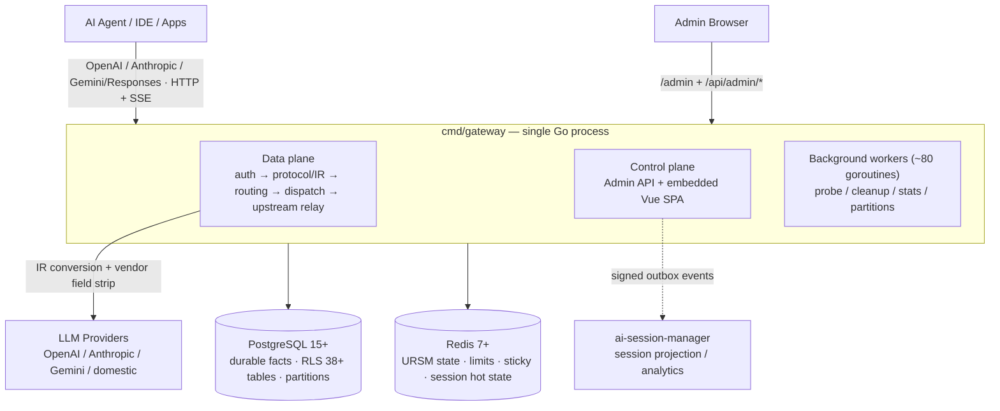

# AI Native Gateway

> La passerelle LLM nativement IA : pas seulement un proxy — un **plan de management et une plateforme de gouvernance de session** pour le trafic IA des entreprises.

[](LICENSE)
[](https://golang.org)
[](CHANGELOG.md)

[English](README.md) | [简体中文](README.zh-CN.md) | [繁體中文](README.zh-TW.md) | [日本語](README.ja.md) | [Deutsch](README.de.md) | **Français** | [Español](README.es.md) | [العربية](README.ar.md)

[Démarrage rapide](#-démarrage-rapide) • [Valeurs fondamentales](#-quatre-valeurs-fondamentales) • [Architecture](#-architecture-en-un-coup-dœil) • [Gouvernance de session](#-gouvernance-de-session) • [Aperçu des fonctionnalités](#-aperçu-des-fonctionnalités) • [Comparaison](#-différenciation--comparaison) • [Roadmap](ROADMAP.md)

---

## Qu’est-ce qu’AI Native Gateway ?

AI Native Gateway est une **passerelle LLM open source, auto-hébergée et nativement IA**, conçue pour l’ère des agents IA et du « vibe coding ». Elle fait bien plus que relayer des requêtes : elle **classe, route, gouverne, audite et facture** chaque token qui traverse votre organisation.

- **Normalisation des protocoles** : compatibilité OpenAI, Anthropic, Gemini et Responses API — un seul endpoint pour tous les modèles
- **Routage intelligent à deux couches** : L1 choisit le modèle (classification de tâche → scoring à 6 dimensions), L2 choisit le credential (repli de palier → tour de facturation → scoring P2C → exécuter / couper)
- **Gouvernance de session** : sessions collantes, replay de session au contenu complet, compression automatique de prompt et cycle de vie des données en 4 niveaux — la conversation, et pas seulement la requête, est un objet managé de premier rang
- **Multi-tenant** : isolation des tenants imposée par RLS PostgreSQL sur 38+ tables, avec quotas, metering et facturation MaaS par tenant
- **Gestion des credentials** : pools multi-credentials avec déguisement d’empreinte, sonde adaptive et coupure automatique (disjoncteur)
- **Observabilité** : flux de requêtes en temps réel, analytique de routage (heatmap + Sankey), suivi des coûts, OTel + Prometheus
- **Confidentialité** : déploiement 100 % privé — toutes les données restent dans votre infrastructure

Construit avec **Go + PostgreSQL + Redis**, aujourd’hui en production sur k3s (deux instances partageant un seul schéma PostgreSQL). Conçu pour les organisations qui exigent un contrôle total de leur infrastructure IA.

---

## ✨ Quatre valeurs fondamentales

| Valeur | Bénéfice client |
|-------|--------------------|
| **Sécurité** | AI Guardrails · DLP · interception inline · gouvernance du vibe coding · intégration SIEM/SOAR |
| **Stabilité** | Orchestration multi-cloud · disjoncteur à rétablissement automatique · objectif SLA de 99,9 % |
| **Coût réduit** | Cache sémantique · auto-routage (politiques coût/qualité) · metering de tokens · compression de prompt |
| **Intégration entreprise** | Passerelle d’outils MCP (feuille de route) · centre d’actifs API Hub (feuille de route) · audit bout-en-bout · SIEM/SOAR |

## 🏗️ Trois piliers produit

| Control | Govern | Secure |
|---------|--------|--------|
| ✅ Metering de l’usage des tokens | 🔨 Centre d’actifs API Hub | 🔨 Model Armor |
| ✅ Routage intelligent + sessions collantes | 🔨 Auto-découverte | 🔨 Protection des données sensibles (SDP) |
| ✅ Cache sémantique + Entonnoir (Funnel) | 🔨 Enrichissement intelligent SpecBoost | 🔨 Défense contre les prompts adverses |
| ✅ Audit bout-en-bout + OTel | ✅ RLS multi-tenant (L1 = 0) | ✅ Intégration SIEM/SOAR |
| ✅ Facturation MaaS | | |

✅ = Livré &nbsp;·&nbsp; 🔨 = Sur la feuille de route

## 🎯 Matrice de capacités

| Couche | Ce que vous obtenez |
|-------|--------------|
| **Protocole** | Compatible OpenAI / Anthropic / Gemini / Responses + relais SSE avec contrôles d’intégrité |
| **Routage** | Routage à deux couches (modèle → credential) + sessions collantes + auto-routage avec politiques coût/qualité |
| **Multi-tenant** | Tunnel d’identité (IP/MAC/ClientID virtuels) + pools de credentials + RLS sur 38+ tables |
| **Gouvernance du trafic** | Limitation de tokens (TPM/RPM) + cache sémantique + compression de prompt + algorithmes à fenêtre glissante |
| **Audit** | Audit bout-en-bout + DLQ + repli disque + OTel + Prometheus |
| **Credentials** | Multi-credential + pool d’empreintes + sonde adaptive + désactivation manuelle |
| **Déploiement** | Deux instances (Docker + k3s NodePort) partageant un seul schéma PostgreSQL |

Voir la section [Architecture en un coup d’œil](#-architecture-en-un-coup-dœil) ci-dessous, ou la [Collection de diagrammes d’architecture](docs/architecture-diagrams.md) complète pour le détail.

---

## 🏛️ Architecture en un coup d’œil

Un seul processus Go (`cmd/gateway`) héberge le **plan de données, le plan de contrôle et l’UI d’admin sur un mux unique** (h2c : HTTP/1.1 + HTTP/2 sur un seul port). PostgreSQL conserve les faits durables (isolés par RLS, partitionnés par mois) ; Redis conserve l’état chaud (routage, limites, sessions collantes). Les mêmes interfaces `storage` servent le **mode full** (PG + Redis) et le **mode lite** (SQLite + fichiers locaux — zéro dépendance externe, binaire unique).



**Pipeline de requête (chemin de production v1, unique route d’exécution depuis 2026-08)** :

```text
HTTP/SSE → middleware chain → protocol/IR normalization → session assignment
  → (model=auto: L1 model selection) → resource prep (semantic cache / prompt compression)
  → Executor (attempt budget) → dispatch queues (global → model → credential)
  → Router (tier / health / sticky filters + URSM v2 state + P2C scoring)
  → resource gates (fingerprint slot / concurrency / RPM)
  → upstream relay (0 internal retries; pre-first-byte failover only adds attempts)
  → SSE write-back with integrity checks
  → request_logs + usage ledger (canonical facts)
  → onPersisted hooks: session V2 shadow write · session_dim upsert · ASM outbox
```

**Structure du dépôt**

| Chemin | Rôle |
|------|------|
| `cmd/gateway/` | Racine de composition — point d’entrée de production en binaire unique (plans données + contrôle) |
| `domains/` | 67 domaines DDD — `streaming`, `dispatch`, `credential`, `session`(+v2), `ursm`, hooks, sécurité… |
| `admin/` + `web/` | API REST d’admin + SPA Vue 3 + TypeScript (Element Plus, ECharts) |
| `bg/` | Workers en arrière-plan — probing, nettoyage du cycle de vie, agrégation de stats, maintenance des partitions |
| `storage/` | Factory de stockage double mode (`full` : PG+Redis / `lite` : SQLite+fichiers+KV en processus) |
| `internal/` | Infra transverse — IR, strip des champs fournisseurs, miroir de session, outbox, télémétrie… |
| `sql/migrations/` + `db/migrations/` | Migrations idempotentes (série de démarrage actuellement à 817) |
| `installer/` | Module autonome d’installation / mise à niveau multiplateforme |
| `scripts/`, `deploy/` | Outillage de build, déploiement, miroir et vérification |

Instantané d’échelle (scan du code au 2026-10-01) : **~4,500 fichiers Go · 2,278 fichiers de test · 927 SQL de migration · 67 packages de domaine · 34 binaires** sous `cmd/`.

**Pour aller plus loin**

- [Collection de diagrammes d’architecture](docs/architecture-diagrams.md) — jeu Mermaid complet : contexte, conteneurs, chaîne de requête, routage à deux couches, stockage, déploiement, workers
- [Evidence-graded Architecture](docs/03-design/01-architecture/architecture/ARCHITECTURE.md) — document d’autorité interne (graduation CURRENT / SHADOW / PARALLEL, instantané 2026-10-01)
- [Session Lifecycle](docs/session-lifecycle.md) — la session, de la première requête à l’archivage, entièrement diagrammée
- [Runtime Request Flow](docs/03-design/01-architecture/architecture/runtime-request-flow.md) · [Routing & State](docs/03-design/01-architecture/architecture/routing-and-state.md)

---

## 🧠 Gouvernance de session

La plupart des passerelles traitent chaque requête comme un événement isolé. AI Native Gateway traite la **session** comme unité de gouvernance — car à l’ère des agents de code et des assistants de longue durée, une « requête » raconte rarement toute l’histoire.

- **Liaison de session collante** : les sessions sont épinglées à des credentials afin que le contexte de conversation survive aux changements de modèle et aux failovers — aucune perte de contexte silencieuse en pleine tâche
- **Audit et replay au niveau session** : les system prompts et réponses complets sont conservés et rejouables par session (13 000+ sessions en production), couvrant type de tâche, modèle client, modèle sortant, fournisseur, tokens, latence et motif de fin — découpables par clé / tenant / plage temporelle pour le dépannage et la conformité
- **Compression automatique de prompt** : quand une requête approche de la fenêtre de contexte réelle du fournisseur (déclencheur à ~80 %), une compression au niveau des messages s’exécute avant l’envoi — les longues sessions d’agents tiennent dans des fenêtres plus petites au lieu d’échouer. Chaque événement de compression (stratégie, seuil, tailles avant/après) est enregistré sur la requête
- **Intelligence des métadonnées de session** : étiquetage automatique du type de travail (10 types de travail), attribution de projet et extraction de titre transforment le trafic brut en connaissances cherchables
- **Tunnel d’identité** : le trafic des agents est rattaché via IP/MAC/ClientID virtuels afin que l’isolation multi-tenant tienne même quand de nombreux agents partagent une seule sortie (egress)
- **Cycle de vie des données en 4 niveaux** : chaud (0–7 j) / tiède (7–30 j) / froid (30–90 j) / expiré (>90 j) avec aperçu avant archivage — « voici exactement ce qui va bouger » avant l’exécution

La façon dont une session circule réellement dans la passerelle — modèle à trois couches (état chaud Redis / faits canoniques `request_logs` / tables shadow Sessions V2), attribution d’ID, séquence par tour, liaison collante, compression et archivage — est entièrement diagrammée dans [Session Lifecycle](docs/session-lifecycle.md).

---

## 🎛️ Aperçu des fonctionnalités

Tous les modules ci-dessous sont livrés et tournent dans le déploiement de production k3s. Les captures d’écran proviennent d’un déploiement local réel (1728×1050, après chargement complet des données).

### Tableau de bord — Flux de requêtes en temps réel


*Flux de requêtes en direct groupé par file de traitement, avec stats de la chaîne de dispatch (en vol, latence p50/p95, disponibilité des nœuds) et santé des nœuds par modèle*

### Tableau de bord statistique — usage et coûts en un coup d’œil


*Onglet Board du tableau de bord : métriques héros (requêtes / tokens / coût / crédits facturés), RPM · TPM · latence, compteurs clés/modèles/fournisseurs, et la section coûts & achats fournisseurs — la vue de facturation intégrée au tableau de bord (capture 2026-10, v2.5.8)*

### Facturation — coûts & achats fournisseurs


*Cartes de coûts fournisseurs (coût de la fenêtre, crédits facturés, solde/forfait) et tableau d’usage par fournisseur — requêtes, tokens, coût (USD), crédits, taux de succès — une comptabilité des coûts de niveau facturation au sein du tableau de bord statistique, exportable vers Excel*

### Panorama de routage — routage à deux couches, entièrement observable


*Sélection du modèle L1 (classification de tâche → scoring à 6 dimensions → verrou de profil) + sélection du credential L2 (résolution du modèle → repli de palier → tour de facturation → scoring P2C → exécuter / couper). La heatmap tâche × modèle répond à « quel modèle pour quelle tâche » ; le flux Sankey montre la destination finale de 14 000+ requêtes live (tâche → modèle → fournisseur)*

### Moniteur de credentials — santé multi-sources × multi-credentials


*Une matrice de disponibilité 2D en direct (19 credentials × 18 modèles en production) montre d’un coup d’œil quel credential casse quel modèle. Latence P95 par credential, taux de succès sur fenêtre glissante d’1 heure et usage des slots de concurrence. Le pool d’empreintes (50+ User-Agents, 35 variantes Accept-Language, 11 profils uTLS) + la sonde adaptive esquivent automatiquement le risk control amont — les échecs déclenchent le disjoncteur, sans intervention humaine*

### Configuration des types de travail — auto-classification des tâches


*Auto-classification des tâches (10 types de travail) avec distribution sur 24 h, modèles les plus utilisés et stats des décisions de routage — configurable par type de travail dans l’UI d’admin*

### Pool de ressources gratuit


*Pool de ressources de modèles gratuits : apportez vos propres clés, templates de fournisseurs (Groq, Google AI Studio, OpenRouter, SiliconFlow, Zhipu) et priorité de routage par modèle*

### Détail de session de requête — forensique bout-en-bout


*Inspection complète de la requête : replay Q&R, waterfall de dispatch, piste de routage & retry, trace, enregistrement compression/masquage (notez la clé API masquée `sk-****`), stats tokens & cache*

---

## 🚀 Démarrage rapide

### Option A : Docker Compose (recommandé, < 10 minutes)

```bash
# Clone
git clone https://codeup.aliyun.com/kaixuan/official-deploy/llm-gateway-go.git ai-native-gateway
cd ai-native-gateway
# (GitHub mirror: git clone https://github.com/halfking/ai-native-gateway-core.git)

# Generate secure keys
cp .env.quickstart.example .env
# Edit .env with secure random values (see file for generation commands)

# Start the stack (PostgreSQL + Redis + Gateway)
docker compose -f docker-compose.quickstart.yml up -d

# Verify health
curl http://localhost:8781/healthz
# {"status":"ok"}

# Open the embedded admin UI
open http://localhost:8781/admin
```

### Option B : Compiler depuis les sources

```bash
go build -o gateway ./cmd/gateway
LLM_GATEWAY_CONFIG_FILE=config.example.yaml ./gateway
curl http://localhost:8781/healthz   # → 200 OK
```

Voir le [Guide de démarrage](docs/getting-started.md) pour des instructions détaillées.

---

## Modes de déploiement

AI Native Gateway supporte à la fois des **piles de production complètes** et un **déploiement local minimal sur une seule machine** :

| Mode | Description | Statut |
|------|-------------|--------|
| **Docker Compose** | Démarrage rapide avec PostgreSQL/Redis inclus | ✅ Recommandé pour l’évaluation |
| **Binaire + systemd** | Déploiement de production sur hôtes Linux | ✅ Supporté avec l’installeur |
| **Kubernetes** | Manifests Deployment + ConfigMap + Service | ⚠️ Niveau test (la production interne tourne sur k3s) |

**Pile de production** : Gateway + PostgreSQL 14+ (état durable, RLS) + Redis 7+ (état chaud, limites de débit) + UI d’admin intégrée, avec monitoring Prometheus/Grafana optionnel.

La pile de quick-start utilise le **même binaire et le même schéma que la production** — passer en production signifie pointer vers des PostgreSQL/Redis gérés et ajouter TLS, pas changer la sémantique de configuration. Le déploiement de production interne tourne en **deux instances (hôte Docker + k3s NodePort) partageant un seul schéma PostgreSQL**.

**Prérequis de production** : PostgreSQL 14+ et Redis 7+ externes, terminaison TLS (reverse proxy), gestion des secrets, sauvegarde et monitoring.

Voir [Production Deployment](docs/06-deployment/) pour le détail.

### Installer — déployeur en un clic (`installer/`)

Le sous-arbre `installer/` livre **un unique binaire Go multiplateforme** (`llm-gw-installer`) qui encapsule tout le flux de déploiement dans un wizard interactif en 13 étapes. Windows / Linux / macOS / 国产 OS / 国产 CPU sont supportés sans configuration supplémentaire.

**Sous-commandes**

```bash
llm-gw-installer doctor      # detect OS / docker / network / ports
llm-gw-installer install     # one-click install + deploy
llm-gw-installer uninstall   # uninstall (--purge removes data)
```

**Build multiplateforme**

```bash
GOOS=linux  GOARCH=amd64   go build -o dist/llm-gw-installer-linux-amd64   ./installer/cmd/llm-gw-installer/
GOOS=linux  GOARCH=arm64   go build -o dist/llm-gw-installer-linux-arm64   ./installer/cmd/llm-gw-installer/
GOOS=linux  GOARCH=loong64 go build -o dist/llm-gw-installer-linux-loong64 ./installer/cmd/llm-gw-installer/
GOOS=darwin GOARCH=amd64   go build -o dist/llm-gw-installer-darwin-amd64  ./installer/cmd/llm-gw-installer/
GOOS=darwin GOARCH=arm64   go build -o dist/llm-gw-installer-darwin-arm64  ./installer/cmd/llm-gw-installer/
GOOS=windows GOARCH=amd64  go build -o dist/llm-gw-installer-windows-amd64.exe ./installer/cmd/llm-gw-installer/
GOOS=windows GOARCH=arm64  go build -o dist/llm-gw-installer-windows-arm64.exe ./installer/cmd/llm-gw-installer/
```

#### Modes de stockage (full vs. lite)

L’installeur propose **deux modes de stockage** ; on en choisit un au moment de l’installation :

| Mode | Backend de stockage | Cas d’usage | Images tirées à l’install | Initialise le schéma ? |
|------|---------------------|-------------|----------------------------|------------------------|
| **`full`** (par défaut) | PostgreSQL (kx-citus) + Redis | Production / multi-réplica / haute concurrence | `kx-llm-gateway-go` + `kx-citus` + `kx-redis` | Oui (attend PG ready + `InitSchema`) |
| **`lite`** | SQLite + local | Mono-machine / dev / CI / démo | `kx-llm-gateway-go` uniquement | Non (SQLite crée les tables) |

**Priorité de sélection**

1. Flag CLI : `--mode lite` ou `--mode full` (priorité la plus haute)
2. Fichier de configuration (`--config /path/to/install.env`) :
   ```
   STORAGE_MODE=lite
   LLM_GATEWAY_MASTER_URL=https://llmgateway.internal.example.com
   INSTALL_SKIP_ACTIVATION=0
   ```
3. Wizard interactif : propose `[1] full  [2] lite`, par défaut `1`

En non-TTY (CI / `--skip-prompt`) sans `--config`, la valeur par défaut est `full`.

**Comportement de l’install en mode `lite`**

| Étape | `full` | `lite` |
|-------|--------|--------|
| 1. Détection d’environnement | identique | identique |
| 2. Configuration (wizard / config) | identique | identique (ajoute storage mode + master URL) |
| 3. Pull des images | `kx-citus` + `kx-redis` + `kx-llm-gateway-go` | **`kx-llm-gateway-go` uniquement** |
| 4. Écriture de `.env` | toutes les clés | mêmes champs, seule `LLM_GATEWAY_STORAGE_MODE=lite` |
| 5. Arborescence | complète | complète (db/data et redis/data créés mais inutilisés) |
| 6. `compose.yml` | 3 services | **`kx-citus` + `kx-redis` retirés** ; la gateway perd `depends_on` et l’env PG/Redis |
| 7. Démarrage des conteneurs | 3 conteneurs | **`kx-llm-gateway-go` uniquement** |
| 8. Initialisation de la base | attendre PG ready + `InitSchema` (450+ migrations de démarrage) | **sauté** (SQLite auto-crée) |
| 9. Vérification de santé | contrôle complet en 5 points | conteneur + `/healthz` uniquement ; PG/Redis/Schema forcés ✅ dans le rapport |

**Nouveaux flags d’install**

```
--mode string         # full | lite (empty → wizard / default full)
--master-url string   # control-plane URL (default https://llmgateway.internal.example.com)
--skip-activation     # bool, skip the auto-activation call at end of install
```

**Nouvelles clés `.env`** (écrites dans `{installDir}/.env`)

| Clé | Défaut | Signification |
|-----|--------|---------------|
| `LLM_GATEWAY_STORAGE_MODE` | `full` | Lue à l’exécution par `cmd/gateway` via `storage_mode_init` ; `lite` → SQLite, `full` → PG/Redis |
| `LLM_GATEWAY_MASTER_URL` | `https://llmgateway.internal.example.com` | Cible pour l’activation de licence + heartbeat |
| `INSTALL_SKIP_ACTIVATION` | `0` | Sauter l’appel d’auto-enregistrement d’activation en fin d’install (voir `activation.RunAutoActivate`) |

#### Chaîne de fallback des images

Toutes les images conteneurs sont tirées via une chaîne de fallback à 4 niveaux, pour que l’installation fonctionne en ligne, derrière un proxy d’entreprise ou totalement air-gap :

```
[1] Offline bundle images/*.tar.gz  (highest priority)
    ↓ on miss
[2] registry.internal.example.com              (internal registry)
    ↓ on miss
[3] registry.cn-hangzhou.aliyuncs.com (Aliyun mirror)
    ↓ on miss
[4] registry-1.docker.io           (official Docker Hub)
    ↓ on miss
❌ clear, actionable error
```

**Surcharges par variables d’environnement**

| Variable | Défaut | Usage |
|----------|--------|-------|
| `KX_REGISTRY` | `registry.internal.example.com` | Registry interne personnalisé |
| `KX_REGISTRY_USERNAME` / `_PASSWORD` | vide | Identifiants du registry |
| `KX_REGISTRY_INSECURE` | `false` | Autoriser le HTTP brut |
| `APP_IMAGE_TAG` | lu depuis MANIFEST | Surcharger le tag d’image de l’app |
| `GOPROXY` | `https://goproxy.cn,direct` | Proxy de modules Go |

#### Limitations connues

- **HarmonyOS NEXT** : non supporté (pas de support de conteneurs Linux)
- **macOS** : l’utilisateur doit installer au préalable OrbStack ou Docker Desktop
- **Windows** : l’utilisateur doit installer au préalable Docker Desktop + WSL2

Pour le design complet de l’installeur, voir [installer/README.md](installer/README.md).

---

## 📐 Différenciation & comparaison

### vs. passerelles IA génériques

| Dimension | Passerelle IA générique | AI Native Gateway |
|-----------|-------------------------|-------------------|
| **Déploiement** | SaaS / On-Prem | 100 % privé (éprouvé en production k3s) |
| **Résidence des données** | Les données sortent de votre périmètre | Toutes les données restent dans votre infrastructure |
| **Facturation** | À l’usage (USD) | Forfaits + crédits + boosters — conçu pour les PME chinoises, compatible Alipay |
| **Modèles amont** | Quelques grands fournisseurs | Couverture large de modèles + modèles domestiques chinois + modèles locaux |
| **Pool d’empreintes de credentials** | Basique | 50+ User-Agents · 35 Accept-Language · 11 profils uTLS |
| **Gouvernance de session** | Logs au niveau requête | Sessions collantes + replay au contenu complet + compression + cycle de vie en 4 niveaux |
| **Passerelle d’outils MCP** | Partiel | Livraison complète visée T3 2026 |
| **Adapté au chinois** | Limité | UI entièrement en chinois + modèles domestiques + Alipay |
| **Audit multi-tenant** | Standard | RLS sur 38+ tables · audits tenant à L1 = 0 |

### vs. alternatives nommées

| Fonction | AI Native Gateway | LiteLLM | OmniRoute | Portkey | Kong AI |
|----------|-------------------|---------|-----------|---------|---------|
| **Déploiement** | Privé (auto-hébergé) | SaaS + OSS | Auto-hébergé (Node) | SaaS | OSS |
| **Multi-tenant** | Natif (RLS PG) | Basique | Orienté nœud unique | Complet (SaaS) | Via plugins |
| **UI admin** | SPA Vue intégrée | CLI | Web UI | UI SaaS | Kong Manager |
| **Résidence des données** | 100 % privé | Ça dépend | 100 % privé | Cloud (SaaS) | Auto-hébergé |
| **Licence** | Apache 2.0 | MIT | Voir l’amont | Propriétaire | Apache 2.0 |

**Choisissez AI Native Gateway si vous avez besoin de** :

- Contrôle total de la résidence des données (aucune dépendance SaaS externe)
- Multi-tenant profond avec isolation au niveau base de données
- Gouvernance et forensique au niveau session, pas seulement des logs de requêtes
- UI d’admin intégrée dans un seul binaire Go
- Facturation MaaS adaptée aux PME chinoises (forfaits + crédits + boosters)

**Choisissez les alternatives si vous avez besoin de** :

- Couverture maximale de fournisseurs (100+) → LiteLLM
- Passerelle auto-hébergée en Node.js avec base embarquée → OmniRoute
- Service managé zéro-ops → Portkey
- API gateway générale + LLM → Kong

Voir la [comparaison détaillée](docs/comparison.md) pour en savoir plus.

---

## Feuille de route

**Actuel (v2.x)** :

- ✅ Support des protocoles OpenAI/Anthropic/Gemini/Responses
- ✅ Isolation multi-tenant avec RLS PostgreSQL
- ✅ Routage intelligent avec sessions collantes
- ✅ Gouvernance de session : compression, replay, cycle de vie
- ✅ Console d’admin Vue.js
- ✅ Démarrage rapide Docker Compose

**Ensuite (3–6 mois)** :

- 🚧 Routage amélioré sensible au coût/qualité
- 🚧 Charts Helm Kubernetes de qualité production
- 🚧 Templates de dashboards Grafana
- 🚧 Observabilité avancée (forensique de session, replay de décisions)

**En exploration (6–12 mois et +)** :

- 🔬 Intégration passerelle MCP (Model Context Protocol) — livraison complète visée T3 2026
- 🔬 Support du protocole Agent-to-Agent (A2A)
- 🔬 Operator Kubernetes (déploiement basé CRD)

Voir [ROADMAP.md](ROADMAP.md) pour le détail complet.

---

## 📚 Documentation

| Catégorie | Document |
|----------|----------|
| Démarrage | [docs/getting-started.md](docs/getting-started.md) — déployer en 10 minutes |
| Diagrammes d’architecture | [docs/architecture-diagrams.md](docs/architecture-diagrams.md) — collection Mermaid complète (contexte / conteneurs / chaîne de requête / routage / stockage / déploiement) |
| Cycle de vie de session | [docs/session-lifecycle.md](docs/session-lifecycle.md) — cycle de vie de traitement de session, entièrement diagrammé |
| Architecture (graduée par preuves) | [docs/03-design/01-architecture/architecture/ARCHITECTURE.md](docs/03-design/01-architecture/architecture/ARCHITECTURE.md) — autorité interne (graduation CURRENT/SHADOW/PARALLEL) |
| Architecture (vue d’ensemble) | [docs/architecture.md](docs/architecture.md) — conception système et composants |
| Exigences | [docs/01-requirements/SYSTEM_REQUIREMENTS.md](docs/01-requirements/SYSTEM_REQUIREMENTS.md) — FR×19 domaines / NFR×13 |
| Catalogue de fonctionnalités | [docs/01-requirements/functional/FEATURES_CATALOG.md](docs/01-requirements/functional/FEATURES_CATALOG.md) — carte fonctionnalité → code → API → page admin |
| API | [docs/03-design/01-architecture/architecture/API.md](docs/03-design/01-architecture/architecture/API.md) — specs du plan de données et de l’API d’admin |
| Environnement | [docs/environment.md](docs/environment.md) — environnements de déploiement et variables |
| Référence rapide | [docs/QUICK_REFERENCE.md](docs/QUICK_REFERENCE.md) — commandes courantes et dépannage |
| Comparaison | [docs/comparison.md](docs/comparison.md) — vs LiteLLM, OmniRoute, Portkey, Kong |
| Vue d’ensemble du projet | [docs/PROJECT_OVERVIEW.md](docs/PROJECT_OVERVIEW.md) — fonctionnalités et carte des modules |
| Index de la docs | [docs/README.md](docs/README.md) · [docs/archive/2026-09/INDEX.md](docs/archive/2026-09/INDEX.md) — navigation complète de la documentation |
| Politique dual-dépôt | [docs/06-deployment/04-runbooks/operations/REPO-MIRROR-POLICY.md](docs/06-deployment/04-runbooks/operations/REPO-MIRROR-POLICY.md) — workflow codeup ⇄ GitHub |
| Sécurité | [SECURITY.md](SECURITY.md) — signalement de vulnérabilités + usage du scanner |
| Légal | [docs/02-resources/compliance/legal/disguise-compliance.md](docs/02-resources/compliance/legal/disguise-compliance.md) — liste blanche de conformité du déguisement de requêtes |
| Recherche A2A | [docs/03-design/01-architecture/architecture/a2a-spec-2027.md](docs/03-design/01-architecture/architecture/a2a-spec-2027.md) — état de l’art du protocole agent-to-agent |
| Armor / SDP | [docs/03-design/01-architecture/architecture/armor-sdp-feasibility.md](docs/03-design/01-architecture/architecture/armor-sdp-feasibility.md) — faisabilité prompt injection + SDP |

---

## 🔀 Stratégie double dépôt

| Remote | URL | Usage |
|--------|-----|---------|
| `codeup` (origin) | `https://codeup.aliyun.com/kaixuan/official-deploy/llm-gateway-go.git` | Par défaut (développement quotidien) |
| `github` | `git@github.com:halfking/ai-native-gateway-core.git` | Miroir public (releases échelonnées) |

```bash
git push              # → codeup (no extra checks)
git push github       # → github (secret scan, blocked on BLOCK-level hit)
```

Protection des informations sensibles : `.githooks/pre-push` exécute automatiquement `scripts/scan-secrets.sh` (50 règles ; mode normal par défaut — les findings BLOCK bloquent, les WARN avertissent ; `STRICT_SCANNER=1` active le mode strict) lors du push vers GitHub. Voir la [politique miroir](docs/06-deployment/04-runbooks/operations/REPO-MIRROR-POLICY.md).

---

## ✅ CI & gates (à partir du 2026-09-14)

- **La porte officielle = `./verify.sh` en local** : à exécuter avant tout commit/déploiement (`go test ./...` complet, rapprochement des checksums de migrations, conformité privacy, vet, build, build frontend). Les merges vers main et les releases s’y réfèrent.
- **Porte légère codeup Flow** : codeup est le seul remote ; `.github/workflows/` ne s’exécute pas sur codeup ; `.workflow/main-verify.yml` fournit la configuration pipeline-as-code (build + `go vet ./autoroute/...` + suite offline de 60 cas d’auto-matching), à importer une fois depuis la page « Pipelines » du dépôt codeup, puis déclenchement automatique à chaque push/PR.
- La régression offline de l’auto-matching peut être relancée seule : `go test ./autoroute/ -run 'TestAutoMatchingSuiteHeuristic|TestPromptClassificationMatrix'` (purement offline, sans réseau).

---

## 🤝 Contribuer

Les contributions sont les bienvenues ! Voir [CONTRIBUTING.md](CONTRIBUTING.md) pour la mise en place du développement, le style de code et le processus de pull request.

Les changements multi-tenant doivent passer les trois linters : `lint-tenant-scope-llmgw` / `lint-pg-rls` / `lint-otel-tenant`.

## 🔐 Sécurité

- Signalement des vulnérabilités : voir [SECURITY.md](SECURITY.md)
- Protection des secrets du miroir public : voir la [politique dual-dépôt](docs/06-deployment/04-runbooks/operations/REPO-MIRROR-POLICY.md)
- Liste blanche de conformité du déguisement : voir [docs/02-resources/compliance/legal/disguise-compliance.md](docs/02-resources/compliance/legal/disguise-compliance.md)

## Licence

Sous licence [Apache License 2.0](LICENSE). Voir [NOTICE](NOTICE) pour les attributions requises lors de la redistribution de ce logiciel.

**Usage commercial** : Apache 2.0 autorise l’usage commercial. Lors d’une redistribution (source ou binaire), vous devez conserver les mentions de copyright et le fichier NOTICE. L’usage commercial interne sans redistribution ne requiert pas d’attribution supplémentaire au-delà de la conformité à la licence.

## Remerciements

AI Native Gateway intègre des composants des projets open source suivants :

- Bibliothèque standard Go (BSD-3-Clause)
- Driver PostgreSQL (MIT)
- Client Redis (BSD-2-Clause)
- Vue.js et Element Plus (MIT)
- Voir [NOTICE](NOTICE) pour la liste complète

---

Construit avec ❤️ par la communauté AI Native Gateway
