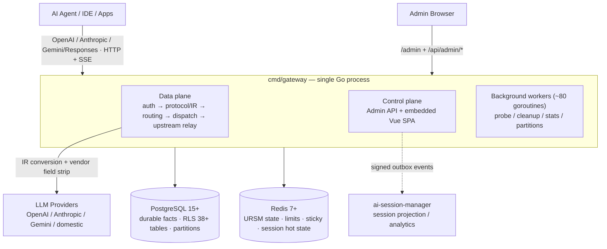

# AI Native Gateway

> AI ネイティブな LLM ゲートウェイ：単なるプロキシではなく、エンタープライズ AI トラフィックのための**管理プレーン & セッションガバナンスプラットフォーム**。

[](LICENSE)
[](https://golang.org)
[](CHANGELOG.md)

[English](README.md) | [简体中文](README.zh-CN.md) | [繁體中文](README.zh-TW.md) | **日本語** | [Deutsch](README.de.md) | [Français](README.fr.md) | [Español](README.es.md) | [العربية](README.ar.md)

[クイックスタート](#-クイックスタート) • [コアバリュー](#-4-つのコアバリュー) • [アーキテクチャ](#-アーキテクチャ概観) • [セッションガバナンス](#-セッションガバナンス) • [機能プレビュー](#-製品機能プレビュー) • [比較](#-差別化ポジショニングと競合比較) • [ロードマップ](ROADMAP.md)

---

## AI Native Gateway とは？

AI Native Gateway は、AI エージェントと「バイブコーディング」の時代のために作られた**オープンソース・自己ホスト型の AI ネイティブ LLM ゲートウェイ**です。単にリクエストを転送するだけでなく、組織を流れるすべてのトークンを**分類・ルーティング・ガバナンス・監査・課金**します。

- **プロトコル正規化**：OpenAI / Anthropic / Gemini / Responses API 互換 —— 1 つのエンドポイントですべてのモデルに接続
- **2 層インテリジェントルーティング**：L1 がモデルを選択（タスク分類 → 6 項目スコアリング）、L2 がクレデンシャルを選択（ティアフォールバック → 課金ラウンド → P2C スコアリング → 実行 / サーキットブレーク）
- **セッションガバナンス**：スティッキーセッション、全文セッションリプレイ、自動プロンプト圧縮、4 層データライフサイクル —— 「リクエスト」ではなく「会話」を第一級の管理対象として扱う
- **マルチテナント**：38 以上のテーブルに PostgreSQL RLS で強制されるテナント分離、テナント別クォータ・計量・MaaS 課金に対応
- **クレデンシャル管理**：フィンガープリント偽装、適応型プロービング、自動サーキットブレーク付きのマルチクレデンシャルプール
- **オブザーバビリティ**：リアルタイムリクエストストリーム、ルーティング分析（ヒートマップ + Sankey）、コスト追跡、OTel + Prometheus
- **プライバシー**：100% プライベートデプロイ —— すべてのデータが自社インフラ内に留まる

技術スタックは **Go + PostgreSQL + Redis**。現在 k3s 上の本番環境で稼働しています（同一 PostgreSQL スキーマを共有する 2 インスタンス構成）。AI インフラを完全にコントロールしたい組織のために設計されています。

---

## ✨ 4 つのコアバリュー

| バリュー | お客様が得られるもの |
|----------|----------------------|
| **セキュア** | AI Guardrails · DLP · インラインインターセプション · バイブコーディングガバナンス · SIEM/SOAR 連携 |
| **安定** | マルチクラウドオーケストレーション · サーキットブレーカー（自動回復）· 99.9% SLA 目標 |
| **低コスト** | セマンティックキャッシュ · オートルーティング（cost/quality ポリシー）· トークン計量 · プロンプト圧縮 |
| **エンタープライズ統合** | MCP ツールゲートウェイ（ロードマップ）· API Hub 資産センター（ロードマップ）· フルチェーン監査 · SIEM/SOAR 連携 |

## 🏗️ 3 つの製品ピラー

| Control（管理） | Govern（ガバナンス） | Secure（セキュリティ） |
|------------------|----------------------|------------------------|
| ✅ トークン使用量計測 | 🔨 API Hub 資産センター | 🔨 Model Armor |
| ✅ インテリジェントルーティング + スティッキーセッション | 🔨 自動ディスカバリー | 🔨 機密データ保護（SDP） |
| ✅ セマンティックキャッシュ + Funnel | 🔨 SpecBoost スマートエンリッチメント | 🔨 対抗型プロンプト防御 |
| ✅ フルチェーン監査 + OTel | ✅ マルチテナント RLS（L1 = 0） | ✅ SIEM/SOAR 連携 |
| ✅ MaaS 課金 | | |

✅ = リリース済み &nbsp;·&nbsp; 🔨 = ロードマップ

## 🎯 ケイパビリティマトリクス

| レイヤー | 提供内容 |
|----------|----------|
| **プロトコル** | OpenAI / Anthropic / Gemini / Responses 互換 + 整合性チェック付き SSE ストリーミング中継 |
| **ルーティング** | 2 層ルーティング（モデル → クレデンシャル）+ スティッキーセッション + cost/quality ポリシーによるオートルーティング |
| **マルチテナント** | アイデンティティトンネル（virtual IP/MAC/ClientID）+ クレデンシャルプール + 38 以上のテーブルに RLS |
| **トラフィックガバナンス** | トークンレート制限（TPM/RPM）+ セマンティックキャッシュ + プロンプト圧縮 + スライディングウィンドウアルゴリズム |
| **監査** | フルチェーン監査 + DLQ + ディスクフォールバック + OTel + Prometheus |
| **クレデンシャル** | マルチクレデンシャル + フィンガープリントプール + 適応型プロービング + 手動無効化 |
| **デプロイ** | 同一 PostgreSQL スキーマを共有する 2 インスタンス（Docker + k3s NodePort） |

詳細は下記の[アーキテクチャ概観](#-アーキテクチャ概観)セクション、または[アーキテクチャ図コレクション](docs/architecture-diagrams.md)を参照してください。

---

## 🏛️ アーキテクチャ概観

1 つの Go プロセス（`cmd/gateway`）が、**データプレーン・コントロールプレーン・管理 UI を単一の mux 上でホスト**します（h2c：HTTP/1.1 + HTTP/2 を 1 ポートで）。PostgreSQL は永続ファクト（RLS 分離・月次パーティション）を保持し、Redis はホット状態（ルーティング、レート制限、スティッキーセッション）を保持します。同じ `storage` インターフェースが **full モード**（PG + Redis）と **lite モード**（SQLite + ローカルファイル —— 外部依存ゼロのシングルバイナリ）の両方を支えます。



**リクエストパイプライン（v1 本番パス、2026-08 以降の唯一の実行ルート）**：

```text
HTTP/SSE → middleware chain → protocol/IR normalization → session assignment
  → (model=auto: L1 model selection) → resource prep (semantic cache / prompt compression)
  → Executor (attempt budget) → dispatch queues (global → model → credential)
  → Router (tier / health / sticky filters + URSM v2 state + P2C scoring)
  → resource gates (fingerprint slot / concurrency / RPM)
  → upstream relay (0 internal retries; pre-first-byte failover only adds attempts)
  → SSE write-back with integrity checks
  → request_logs + usage ledger (canonical facts)
  → onPersisted hooks: session V2 shadow write · session_dim upsert · ASM outbox
```

**リポジトリ構成**

| パス | 役割 |
|------|------|
| `cmd/gateway/` | コンポジションルート —— シングルバイナリの本番エントリ（データ + コントロールプレーン） |
| `domains/` | 67 の DDD ドメイン —— `streaming`、`dispatch`、`credential`、`session`(+v2)、`ursm`、hooks、security など |
| `admin/` + `web/` | 管理 REST API + Vue 3 + TypeScript SPA（Element Plus、ECharts） |
| `bg/` | バックグラウンドワーカー —— プロービング、ライフサイクルクリーンアップ、統計集計、パーティションメンテナンス |
| `storage/` | デュアルモードストレージファクトリ（`full`：PG+Redis / `lite`：SQLite+ファイル+インプロセス KV） |
| `internal/` | 横断インフラ —— IR、ベンダーフィールド除去、セッションミラー、outbox、テレメトリなど |
| `sql/migrations/` + `db/migrations/` | 冪等マイグレーション（起動シリーズは現在 816） |
| `installer/` | スタンドアロンのクロスプラットフォームインストーラ / アップグレーダーモジュール |
| `scripts/`、`deploy/` | ビルド、デプロイ、ミラー、検証ツール |

スケールスナップショット（2026-10-01 のコードスキャン）：`cmd/` 配下に **~4,500 Go ファイル · 2,278 テストファイル · 927 マイグレーション SQL · 67 ドメインパッケージ · 34 バイナリ**。

**さらに詳しく**

- [アーキテクチャ図コレクション](docs/architecture-diagrams.md) — Mermaid フルセット：コンテキスト、コンテナ、リクエストチェーン、2 層ルーティング、ストレージ、デプロイ、バックグラウンドワーカー
- [エビデンスグレード付きアーキテクチャ](docs/03-design/01-architecture/architecture/ARCHITECTURE.md) — 内部権威ドキュメント（CURRENT / SHADOW / PARALLEL グレーディング、スナップショット 2026-10-01）
- [セッションライフサイクル](docs/session-lifecycle.md) — 最初のリクエストからアーカイブまでのセッションを完全図解
- [ランタイムリクエストフロー](docs/03-design/01-architecture/architecture/runtime-request-flow.md) · [ルーティング & 状態](docs/03-design/01-architecture/architecture/routing-and-state.md)

---

## 🧠 セッションガバナンス

多くのゲートウェイは各リクエストを孤立したイベントとして扱います。AI Native Gateway は**セッション**をガバナンスの基本単位として扱います —— コーディングエージェントと長時間稼働アシスタントの時代には、1 回の「リクエスト」では物事の全貌を捉えられないからです。

- **スティッキーセッションバインディング**：セッションをクレデンシャルに固定し、モデル切り替えやフェイルオーバー後も会話コンテキストを維持 —— タスク途中でコンテキストが静かに失われることがありません
- **セッションレベルの監査とリプレイ**：system prompt とレスポンス全文を保存し、セッション単位で再生可能（本番環境で 13,000 以上のセッションを保有）。タスク種別・クライアントモデル・出力モデル・プロバイダ・トークン・レイテンシ・終了理由を網羅し、キー / テナント / 期間でスライスしてトラブルシューティングとコンプライアンス監査に活用
- **自動プロンプト圧縮**：リクエストがプロバイダの実際のコンテキストウィンドウに近づくと（約 80% で発火）、ディスパッチ前にメッセージレベルの圧縮を実行 —— 長いエージェントセッションが小さいウィンドウにも収まります。圧縮イベント（戦略・しきい値・圧縮前後のサイズ）はすべてリクエストに記録されます
- **セッションメタデータインテリジェンス**：タスク種別の自動タグ付け（10 ワークタイプ）、プロジェクト帰属、タイトル抽出により、生のトラフィックを検索可能なナレッジに変換
- **アイデンティティトンネル**：エージェントトラフィックを virtual IP/MAC/ClientID で帰属させ、多数のエージェントが同一出口を共有してもマルチテナント分離を維持
- **4 層データライフサイクル**：ホット（0〜7 日）/ ウォーム（7〜30 日）/ コールド（30〜90 日）/ 期限切れ（90 日超）+ アーカイブプレビュー —— 実行前に「何が移動するのか」を正確に表示

セッションがゲートウェイ内で実際にどう流れるのか —— 3 層モデル（Redis ホット状態 / `request_logs` の正規ファクト / Sessions V2 シャドウテーブル）、ID 割り当て、ターンごとのシーケンス、スティッキーバインディング、圧縮、アーカイブ —— の全体像は [セッションライフサイクル](docs/session-lifecycle.md) に図解されています。

---

## 🎛️ 製品機能プレビュー

以下の機能モジュールはすべてリリース済みで、k3s 本番環境で稼働しています。スクリーンショットは実機ローカルデプロイ（1728×1050、全データ読み込み後）から撮影。

### ダッシュボード — リアルタイムリクエストストリーム


*処理キューごとにグループ化されたライブリクエストストリーム。ディスパッチチェーン統計（処理中、p50/p95 レイテンシ、ノード可用性）とモデル別ノードヘルス*

### 統計ボード — 使用量とコストをひと目で


*ダッシュボードの「ボード」タブ：ヒーロー指標（リクエスト数 / トークン / コスト / クレジット消費）、RPM · TPM · レイテンシ、キー / モデル / プロバイダ数、そしてボード内蔵のプロバイダコスト調達セクション（費用精算ビュー）（2026-10 撮影、v2.5.8）*

### 費用精算 — プロバイダコスト調達


*プロバイダコストカード（ウィンドウコスト、クレジット消費、残高 / プラン）とプロバイダ別使用量テーブル（リクエスト数、トークン、コスト USD、クレジット、成功率）—— 統計ボード内の精算グレードのコスト会計、Excel エクスポート可*

### ルーティング全景 — 2 層ルーティングの完全可視化


*L1 モデル選択（タスク分類 → 6 項目スコアリング → プロファイル固定）+ L2 クレデンシャル選択（モデル解決 → ティアフォールバック → 課金ラウンド → P2C スコアリング → 実行 / サーキットブレーク）。タスク×モデルのヒートマップが「どのタスクにどのモデル」に答え、Sankey フローが 14,000 以上のライブリクエストの最終的な行き先（タスク → モデル → プロバイダ）を表示*

### クレデンシャルモニター — マルチソース × マルチクレデンシャルの健全性


*2 次元の可用性マトリクス（本番環境で 19 クレデンシャル × 18 モデル）で、どのクレデンシャルがどのモデルを壊しているか一目で把握。クレデンシャルごとの P95 レイテンシ、直近 1 時間のスライディングウィンドウ成功率、同時実行スロット使用率。フィンガープリントプール（50+ User-Agent · 35 種 Accept-Language · 11 種 uTLS プロファイル）+ 適応型プロービングが上流のリスクコントロールを自動回避 —— 障害はブレーカーが遮断し、人の介入は不要*

### ワークタイプ設定 — タスク自動分類


*タスク自動分類（10 ワークタイプ）と 24 時間分布、上位モデル、ルーティング決定統計 —— 管理画面でワークタイプごとに設定可能*

### フリーリソースプール


*無料モデルのリソースプール：持ち込みキー、プロバイダテンプレート（Groq、Google AI Studio、OpenRouter、SiliconFlow、Zhipu）、モデル別ルーティング優先度*

### リクエストセッション詳細 — フルチェーンフォレンジック


*リクエストの完全な検査：Q&A リプレイ、ディスパッチウォーターフォール、ルーティング & リトライ履歴、トレース、圧縮/マスキング記録（マスクされた API キー `sk-****` に注目）、トークン & キャッシュ統計*

---

## 🚀 クイックスタート

### 方法 A：Docker Compose（推奨、10 分以内）

```bash
# Clone
git clone https://codeup.aliyun.com/kaixuan/official-deploy/llm-gateway-go.git ai-native-gateway
cd ai-native-gateway
# (GitHub mirror: git clone https://github.com/halfking/ai-native-gateway-core.git)

# Generate secure keys
cp .env.quickstart.example .env
# Edit .env with secure random values (see file for generation commands)

# Start the stack (PostgreSQL + Redis + Gateway)
docker compose -f docker-compose.quickstart.yml up -d

# Verify health
curl http://localhost:8781/healthz
# {"status":"ok"}

# Open the embedded admin UI
open http://localhost:8781/admin
```

### 方法 B：ソースからビルド

```bash
go build -o gateway ./cmd/gateway
LLM_GATEWAY_CONFIG_FILE=config.example.yaml ./gateway
curl http://localhost:8781/healthz   # → 200 OK
```

詳細は[スタートガイド](docs/getting-started.md)を参照してください。

---

## デプロイモード

AI Native Gateway は**完全な本番スタック**と**シングルマシンの最小構成ローカルデプロイ**の両方をサポートします：

| モード | 説明 | 状態 |
|--------|------|------|
| **Docker Compose** | PostgreSQL/Redis 込みのクイックスタート | ✅ 評価に推奨 |
| **バイナリ + systemd** | Linux ホストへの本番デプロイ | ✅ インストーラ提供 |
| **Kubernetes** | Deployment + ConfigMap + Service マニフェスト | ⚠️ テストグレード（内部の本番は k3s で稼働） |

**本番スタック構成**：Gateway + PostgreSQL 14+（永続状態、RLS）+ Redis 7+（ホット状態、レート制限）+ 内蔵管理 UI、オプションで Prometheus/Grafana 監視。

クイックスタートのスタックは本番と**同一バイナリ・同一スキーマ**です —— 本番移行はマネージド PostgreSQL/Redis への向け直しと TLS 追加のみで、設定セマンティクスの変更は不要です。内部の本番環境は**同一 PostgreSQL スキーマを共有する 2 インスタンス（Docker ホスト + k3s NodePort）**で稼働しています。

**本番要件**：外部 PostgreSQL 14+ と Redis 7+、TLS 終端（リバースプロキシ）、シークレット管理、バックアップと監視。

詳細は[本番デプロイ](docs/06-deployment/)を参照してください。

### Installer ワンクリックインストーラ（`installer/`）

`installer/` サブツリーは、デプロイフロー全体を 13 ステップのインタラクティブウィザードにまとめた**単一のクロスプラットフォーム Go バイナリ**（`llm-gw-installer`）を提供します。Windows / Linux / macOS / 国产 OS / 国产 CPU をそのままサポートします。

**サブコマンド**

```bash
llm-gw-installer doctor      # detect OS / docker / network / ports
llm-gw-installer install     # one-click install + deploy
llm-gw-installer uninstall   # uninstall (--purge removes data)
```

**クロスプラットフォームビルド**

```bash
GOOS=linux  GOARCH=amd64   go build -o dist/llm-gw-installer-linux-amd64   ./installer/cmd/llm-gw-installer/
GOOS=linux  GOARCH=arm64   go build -o dist/llm-gw-installer-linux-arm64   ./installer/cmd/llm-gw-installer/
GOOS=linux  GOARCH=loong64 go build -o dist/llm-gw-installer-linux-loong64 ./installer/cmd/llm-gw-installer/
GOOS=darwin GOARCH=amd64   go build -o dist/llm-gw-installer-darwin-amd64  ./installer/cmd/llm-gw-installer/
GOOS=darwin GOARCH=arm64   go build -o dist/llm-gw-installer-darwin-arm64  ./installer/cmd/llm-gw-installer/
GOOS=windows GOARCH=amd64  go build -o dist/llm-gw-installer-windows-amd64.exe ./installer/cmd/llm-gw-installer/
GOOS=windows GOARCH=arm64  go build -o dist/llm-gw-installer-windows-arm64.exe ./installer/cmd/llm-gw-installer/
```

#### ストレージモード（full vs. lite）

インストーラには **2 つのストレージモード**が同梱されており、インストール時にどちらかを選びます：

| モード | ストレージバックエンド | 用途 | インストール時に取得するイメージ | スキーマ初期化 |
|------|------------------|----------|---------------------------|---------------------|
| **`full`**（デフォルト） | PostgreSQL (kx-citus) + Redis | 本番 / マルチレプリカ / 高並行 | `kx-llm-gateway-go` + `kx-citus` + `kx-redis` | あり（PG ready 待機 + `InitSchema`） |
| **`lite`** | SQLite + ローカル | シングルマシン / 開発 / CI / デモ | `kx-llm-gateway-go` のみ | なし（SQLite が自動作成） |

**選択の優先順位**

1. CLI flag：`--mode lite` または `--mode full`（最優先）
2. 設定ファイル（`--config /path/to/install.env`）：
   ```
   STORAGE_MODE=lite
   LLM_GATEWAY_MASTER_URL=https://llm.kxpms.cn
   INSTALL_SKIP_ACTIVATION=0
   ```
3. インタラクティブウィザード：`[1] full  [2] lite` を表示し、デフォルトは `1`

非 TTY（CI / `--skip-prompt`）で `--config` がない場合、デフォルトは `full` です。

**`lite` インストール時の動作**

| ステップ | `full` | `lite` |
|------|--------|--------|
| 1. 環境検出 | 同じ | 同じ |
| 2. 設定（wizard / config） | 同じ | 同じ（storage mode と master URL を含む） |
| 3. イメージプル | `kx-citus` + `kx-redis` + `kx-llm-gateway-go` | **`kx-llm-gateway-go` のみ** |
| 4. `.env` 書き込み | 全キー | 同じフィールド、`LLM_GATEWAY_STORAGE_MODE=lite` のみ |
| 5. ディレクトリ構成 | フル | フル（db/data と redis/data ディレクトリは作成されるが未使用） |
| 6. `compose.yml` | 3 サービス | **`kx-citus` + `kx-redis` を除去**、gateway から `depends_on` と PG/Redis env を削除 |
| 7. コンテナ起動 | 3 コンテナ | **`kx-llm-gateway-go` のみ** |
| 8. データベース初期化 | PG ready 待機 + `InitSchema`（450+ 起動マイグレーション） | **スキップ**（SQLite が自動作成） |
| 9. ヘルスチェック | 5 項目フルチェック | コンテナ + `/healthz` のみ。レポート上の PG/Redis/Schema は強制 ✅ |

**新規 install flags**

```
--mode string         # full | lite (empty → wizard / default full)
--master-url string   # control-plane URL (default https://llm.kxpms.cn)
--skip-activation     # bool, skip the auto-activation call at end of install
```

**新規 `.env` キー**（`{installDir}/.env` に書き込み）

| キー | デフォルト | 意味 |
|-----|---------|---------|
| `LLM_GATEWAY_STORAGE_MODE` | `full` | `cmd/gateway` の `storage_mode_init` が読み込み；`lite` → SQLite、`full` → PG/Redis |
| `LLM_GATEWAY_MASTER_URL` | `https://llm.kxpms.cn` | ライセンスアクティベーション + ハートビート送信先 |
| `INSTALL_SKIP_ACTIVATION` | `0` | install 末尾の自動登録アクティベーション呼び出しをスキップ（`activation.RunAutoActivate` を参照） |

#### イメージソース fallback チェーン

すべてのコンテナイメージは 4 段階の fallback チェーンで取得されるため、オンラインでも、コーポレートプロキシの背後でも、完全なエアギャップ環境でもインストールできます：

```
[1] Offline bundle images/*.tar.gz  (highest priority)
    ↓ on miss
[2] registry.kxpms.cn              (internal registry)
    ↓ on miss
[3] registry.cn-hangzhou.aliyuncs.com (Aliyun mirror)
    ↓ on miss
[4] registry-1.docker.io           (official Docker Hub)
    ↓ on miss
❌ clear, actionable error
```

**環境変数オーバーライド**

| 変数 | デフォルト | 用途 |
|----------|---------|---------|
| `KX_REGISTRY` | `registry.kxpms.cn` | カスタム内部 registry |
| `KX_REGISTRY_USERNAME` / `_PASSWORD` | 空 | registry の認証情報 |
| `KX_REGISTRY_INSECURE` | `false` | 平文 HTTP を許可 |
| `APP_IMAGE_TAG` | MANIFEST から読み取り | アプリケーションイメージタグの上書き |
| `GOPROXY` | `https://goproxy.cn,direct` | Go module プロキシ |

#### 既知の制限

- **HarmonyOS NEXT**：未対応（Linux コンテナ非対応）
- **macOS**：OrbStack または Docker Desktop を事前にインストールする必要あり
- **Windows**：Docker Desktop + WSL2 を事前にインストールする必要あり

インストーラの完全な設計は [installer/README.md](installer/README.md) を参照してください。

---

## 📐 差別化ポジショニングと競合比較

### 汎用 AI ゲートウェイとの比較

| 項目 | 汎用 AI Gateway | AI Native Gateway |
|------|-----------------|-------------------|
| **デプロイ** | SaaS / On-Prem | 100% プライベート（k3s 本番実証済み） |
| **データレジデンシー** | データが組織の境界外に出る | すべてのデータが自社インフラ内に留まる |
| **課金** | 従量課金（USD） | プラン + クレジット + ブースターパック —— 中国 SMB 向け、Alipay 対応 |
| **上流モデル** | 一部の大手ベンダー | 幅広いモデル + 中国国産モデル + ローカルモデル |
| **クレデンシャルフィンガープリントプール** | 基本的 | 50+ User-Agent · 35 種 Accept-Language · 11 種 uTLS プロファイル |
| **セッションガバナンス** | リクエスト単位のログ | スティッキーセッション + 全文リプレイ + 圧縮 + 4 層データライフサイクル |
| **MCP ツールゲートウェイ** | 一部 | 2026 Q3 フル提供予定 |
| **中国語フレンドリー** | 限定的 | 完全中国語 UI + 国産モデル + Alipay |
| **マルチテナント監査** | 標準 | 38+ テーブル RLS · テナント監査 L1 = 0 |

### 有名な代替製品との比較

| 機能 | AI Native Gateway | LiteLLM | OmniRoute | Portkey | Kong AI |
|------|-------------------|---------|-----------|---------|---------|
| **デプロイ** | プライベート（自己ホスト） | SaaS + OSS | 自己ホスト（Node） | SaaS | OSS |
| **マルチテナント** | ネイティブ（PG RLS） | 基本的 | シングルノード指向 | フル（SaaS） | プラグイン経由 |
| **管理 UI** | 内蔵 Vue SPA | CLI | Web UI | SaaS UI | Kong Manager |
| **データレジデンシー** | 100% プライベート | モードによる | 100% プライベート | クラウド（SaaS） | 自己ホスト |
| **ライセンス** | Apache 2.0 | MIT | 上流を参照 | プロプライエタリ | Apache 2.0 |

**AI Native Gateway を選ぶべきケース**：

- 完全なデータレジデンシー管理（外部 SaaS 依存なし）が必要
- データベースレベルの分離による深いマルチテナントが必要
- リクエストログではなく、セッションレベルのガバナンスとフォレンジックが必要
- 単一 Go バイナリに内蔵された管理 UI が必要
- 中国の SMB に適した MaaS 課金（プラン + クレジット + ブースターパック）が必要

**代替製品を選ぶべきケース**：

- 最大のプロバイダカバー範囲（100+ プロバイダ）→ LiteLLM
- 内蔵 DB 付き Node.js 製自己ホストゲートウェイ → OmniRoute
- ゼロ運用のマネージドサービス → Portkey
- 汎用 API ゲートウェイ + LLM → Kong

詳細は[詳細比較](docs/comparison.md)を参照してください。

---

## ロードマップ

**現在（v2.x）**：

- ✅ OpenAI / Anthropic / Gemini / Responses プロトコル対応
- ✅ PostgreSQL RLS によるマルチテナント分離
- ✅ スティッキーセッションによるインテリジェントルーティング
- ✅ セッションガバナンス：圧縮、リプレイ、ライフサイクル
- ✅ Vue.js 管理コンソール
- ✅ Docker Compose クイックスタート

**次（3〜6 ヶ月）**：

- 🚧 cost/quality 感知ルーティングの強化
- 🚧 本番グレードの Kubernetes Helm Charts
- 🚧 Grafana ダッシュボードテンプレート
- 🚧 高度なオブザーバビリティ（セッションフォレンジック、ディシジョンリプレイ）

**探究中（6〜12 ヶ月以上）**：

- 🔬 MCP（Model Context Protocol）ゲートウェイ統合 —— 2026 Q3 フル提供目標
- 🔬 エージェント間（A2A）プロトコル対応
- 🔬 Kubernetes Operator（CRD ベースのデプロイ）

完全なロードマップは [ROADMAP.md](ROADMAP.md) を参照してください。

---

## 📚 ドキュメント

| カテゴリ | ドキュメント |
|----------|--------------|
| スタートガイド | [docs/getting-started.md](docs/getting-started.md) — 10 分でデプロイ |
| アーキテクチャ図 | [docs/architecture-diagrams.md](docs/architecture-diagrams.md) — Mermaid フルコレクション（コンテキスト / コンテナ / リクエストチェーン / ルーティング / ストレージ / デプロイ） |
| セッションライフサイクル | [docs/session-lifecycle.md](docs/session-lifecycle.md) — セッション処理ライフサイクル、完全図解 |
| アーキテクチャ（エビデンスグレード） | [docs/03-design/01-architecture/architecture/ARCHITECTURE.md](docs/03-design/01-architecture/architecture/ARCHITECTURE.md) — 内部権威（CURRENT/SHADOW/PARALLEL グレーディング） |
| アーキテクチャ（概観） | [docs/architecture.md](docs/architecture.md) — システム設計とコンポーネント |
| 要件 | [docs/01-requirements/SYSTEM_REQUIREMENTS.md](docs/01-requirements/SYSTEM_REQUIREMENTS.md) — FR×19 ドメイン / NFR×13 |
| 機能カタログ | [docs/01-requirements/functional/FEATURES_CATALOG.md](docs/01-requirements/functional/FEATURES_CATALOG.md) — 機能 → コード → API → 管理画面マップ |
| API | [docs/03-design/01-architecture/architecture/API.md](docs/03-design/01-architecture/architecture/API.md) — データプレーンと管理 API 仕様 |
| 環境 | [docs/environment.md](docs/environment.md) — デプロイ環境と変数 |
| クイックリファレンス | [docs/QUICK_REFERENCE.md](docs/QUICK_REFERENCE.md) — よく使うコマンドとトラブルシューティング |
| 比較 | [docs/comparison.md](docs/comparison.md) — vs LiteLLM、OmniRoute、Portkey、Kong |
| プロジェクト概要 | [docs/PROJECT_OVERVIEW.md](docs/PROJECT_OVERVIEW.md) — 機能とモジュールマップ |
| ドキュメント索引 | [docs/README.md](docs/README.md) · [docs/archive/2026-09/INDEX.md](docs/archive/2026-09/INDEX.md) — 全ドキュメントナビゲーション |
| デュアルリポジトリポリシー | [docs/06-deployment/04-runbooks/operations/REPO-MIRROR-POLICY.md](docs/06-deployment/04-runbooks/operations/REPO-MIRROR-POLICY.md) — codeup ⇄ GitHub ワークフロー |
| セキュリティ | [SECURITY.md](SECURITY.md) — 脆弱性報告 + スキャナの使い方 |
| 法務 | [docs/02-resources/compliance/legal/disguise-compliance.md](docs/02-resources/compliance/legal/disguise-compliance.md) — リクエスト偽装のコンプライアンスホワイトリスト |
| A2A 調査 | [docs/03-design/01-architecture/architecture/a2a-spec-2027.md](docs/03-design/01-architecture/architecture/a2a-spec-2027.md) — エージェント間プロトコル調査 |
| Armor / SDP | [docs/03-design/01-architecture/architecture/armor-sdp-feasibility.md](docs/03-design/01-architecture/architecture/armor-sdp-feasibility.md) — プロンプトインジェクション + SDP 実現可能性 |

---

## 🔀 デュアルリポジトリ戦略

| Remote | URL | 用途 |
|--------|-----|------|
| `codeup`（origin） | `https://codeup.aliyun.com/kaixuan/official-deploy/llm-gateway-go.git` | デフォルト（日常開発） |
| `github` | `git@github.com:halfking/ai-native-gateway-core.git` | 公開ミラー（段階的リリース） |

```bash
git push              # → codeup (no extra checks)
git push github       # → github (secret scan, blocked on BLOCK-level hit)
```

機密情報保護：GitHub への push 時に `.githooks/pre-push` が `scripts/scan-secrets.sh`（50 ルール；デフォルトは normal モード —— BLOCK 検出はブロック、WARN 検出は警告；`STRICT_SCANNER=1` で strict モードにオプトイン）を自動実行します。詳しくは[ミラーポリシー](docs/06-deployment/04-runbooks/operations/REPO-MIRROR-POLICY.md)を参照。

---

## ✅ CI とゲート（2026-09-14 以降）

- **正式ゲート = ローカルの `./verify.sh`**：コミット/デプロイ前に必ず実行（`go test ./...` フル、マイグレーション checksum 突き合わせ、プライバシーコンプライアンス、vet、build、フロントエンドビルド）。main への merge とリリースはこれを基準とします。
- **codeup Flow 軽量ゲート**：リモートは codeup のみで、`.github/workflows/` は codeup では実行されません；`.workflow/main-verify.yml` がパイプライン・アズ・コード設定（build + `go vet ./autoroute/...` + 60 例の auto マッチングオフラインスイート）を提供し、codeup リポジトリの「流水线」ページで一度インポートすれば、以降 push/PR で自動トリガーされます。
- auto マッチングオフライン回帰は単独で再実行可能：`go test ./autoroute/ -run 'TestAutoMatchingSuiteHeuristic|TestPromptClassificationMatrix'`（完全オフライン、ネットワーク不要）。

---

## 🤝 コントリビューション

コントリビューションを歓迎します！開発環境の構築、コードスタイル、プルリクエストのプロセスは [CONTRIBUTING.md](CONTRIBUTING.md) を参照してください。

マルチテナント関連の変更は、`lint-tenant-scope-llmgw` / `lint-pg-rls` / `lint-otel-tenant` の 3 つのリンターすべてに合格する必要があります。

## 🔐 セキュリティ

- 脆弱性報告：[SECURITY.md](SECURITY.md) を参照
- 公開ミラーの機密情報保護：[デュアルリポジトリポリシー](docs/06-deployment/04-runbooks/operations/REPO-MIRROR-POLICY.md) を参照
- 偽装コンプライアンスホワイトリスト：[docs/02-resources/compliance/legal/disguise-compliance.md](docs/02-resources/compliance/legal/disguise-compliance.md) を参照

## ライセンス

[Apache License 2.0](LICENSE) でライセンスされています。本ソフトウェアを再配布する際に必要な帰属表示は [NOTICE](NOTICE) を参照してください。

**商用利用**：Apache 2.0 は商用利用を許可します。再配布（ソースまたはバイナリ）時は、著作権表示と NOTICE ファイルを保持する必要があります。再配布を伴わない社内商用利用には、ライセンス遵守を超える追加の帰属表示は不要です。

## 謝辞

AI Native Gateway は以下のオープンソースプロジェクトのコンポーネントを利用しています：

- Go 標準ライブラリ（BSD-3-Clause）
- PostgreSQL ドライバ（MIT）
- Redis クライアント（BSD-2-Clause）
- Vue.js と Element Plus（MIT）
- 完全なリストは [NOTICE](NOTICE) を参照

---

AI Native Gateway コミュニティが ❤️ を込めて構築
