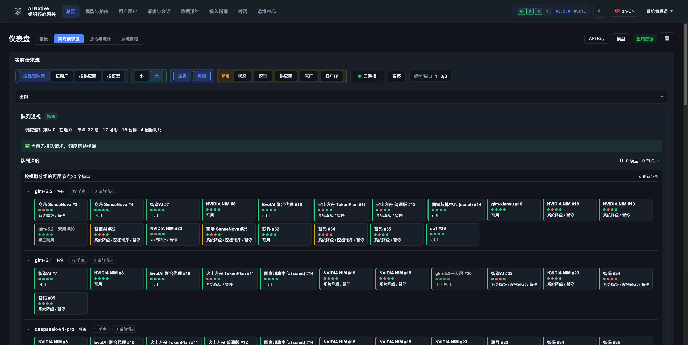
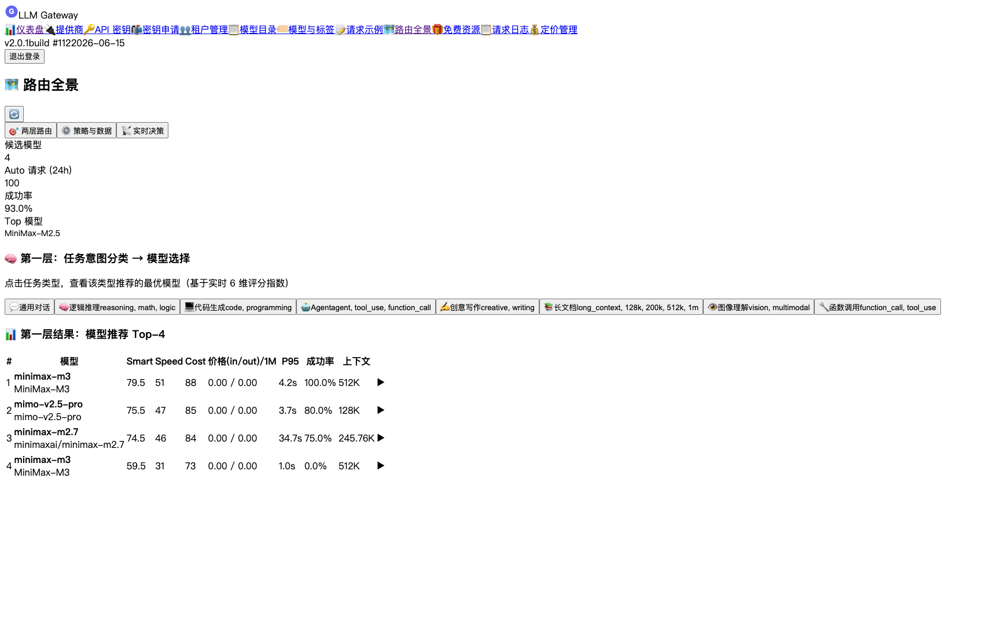
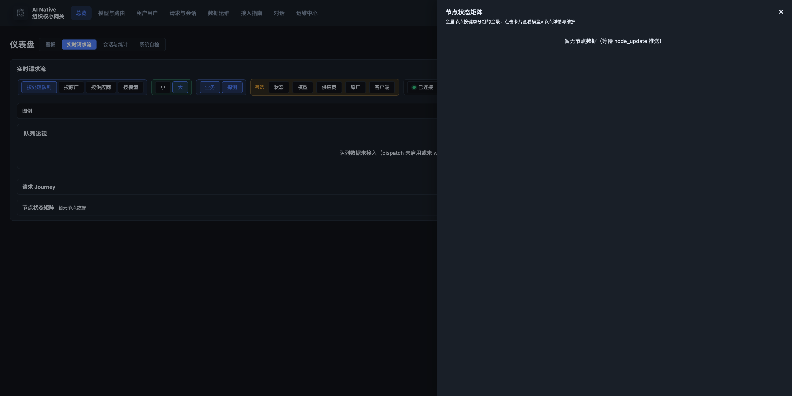
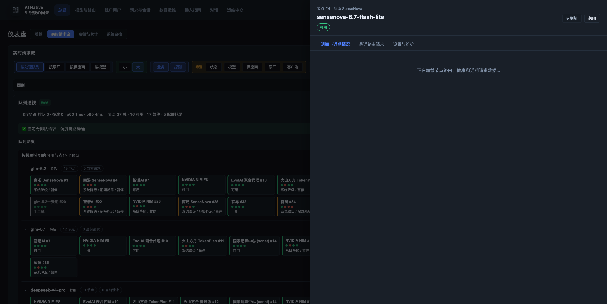

# AI Native Gateway

> Private-deployment LLM gateway with intelligent routing, multi-tenancy, and comprehensive observability

[](LICENSE)
[](https://golang.org)

[Quick Start](#quick-start) • [Features](#features) • [Architecture](docs/architecture.md) • [Comparison](docs/comparison.md) • [Roadmap](ROADMAP.md)

---

## What is AI Native Gateway?

AI Native Gateway is an **open-source, self-hosted LLM gateway** that provides:

- **Protocol Normalization**: OpenAI, Anthropic, Gemini, and Responses API compatibility
- **Intelligent Routing**: Sticky sessions, health-based failover, tier fallback
- **Multi-Tenancy**: PostgreSQL RLS-enforced tenant isolation
- **Credential Management**: Provider health monitoring and credential pools
- **Observability**: Real-time request streams, routing analytics, cost tracking
- **Privacy**: 100% private deployment - all data stays in your infrastructure

Built with **Go + PostgreSQL + Redis**, designed for organizations that need full control over their LLM infrastructure.

---

## Quick Start

Deploy locally in under 10 minutes:

```bash
# Clone repository
git clone https://github.com/halfking/ai-native-gateway-core.git
cd ai-native-gateway-core

# Generate secure keys
cp .env.quickstart.example .env
# Edit .env with secure random values (see file for generation commands)

# Start stack (PostgreSQL + Redis + Gateway)
docker-compose -f docker-compose.quickstart.yml up -d

# Verify health
curl http://localhost:8781/healthz
# {"status":"ok"}

# Access admin UI
open http://localhost:8781/admin
```

See [Getting Started Guide](docs/getting-started.md) for detailed instructions.

---

## Screenshots

### Dashboard - Real-time Request Monitoring


*Real-time request stream with multi-dimensional filtering and provider visibility*

### Routing Analytics


*Routing analytics with credential health monitoring and decision tracking*


*Routing overview showing system-wide request flow*

### Request Detail


*Detailed request inspection with processing pipeline visualization*

---

## Features

### Core Gateway Capabilities

- **Multi-Protocol Support**: OpenAI Chat/Completions, Anthropic Messages, Responses API, Gemini
- **Streaming**: HTTP SSE relay with incremental integrity checks
- **Authentication**: Bearer token validation with tenant isolation
- **Rate Limiting**: Token-based quotas (TPM/RPM) with Redis-backed enforcement
- **Audit Trail**: Request/response logging to PostgreSQL with sensitive data masking

### Intelligent Routing

- **Sticky Sessions**: Session-to-credential binding for conversation continuity
- **Health-Based**: Automatic failover when providers degrade
- **Tier Fallback**: Primary → Secondary → Tertiary credential routing
- **Billing-Aware**: Prefer metered/free/quota credentials based on policy
- **P2C Scoring**: Power-of-Two-Choices with latency and success rate

### Multi-Tenancy

- **Database-Level Isolation**: PostgreSQL Row-Level Security on 38+ tables
- **Tenant/User/API Key hierarchy**: Secure credential management
- **Per-Tenant Quotas**: Token limits, rate limits, cost caps
- **Cross-Tenant Security**: RLS prevents data leakage at query level

### Observability

- **Real-Time Request Stream**: Live dashboard with multi-dimensional filtering
- **Routing Analytics**: Task/model heatmaps, Sankey flow diagrams, decision replay
- **Credential Monitor**: Provider health matrix with latency and success rate
- **Cost Tracking**: Per-tenant token and cost accounting
- **Prometheus Metrics**: `/metrics` endpoint for external monitoring

### Admin Console

Embedded Vue.js SPA (no separate frontend deployment):
- Provider and credential management
- Tenant/user/API key administration  
- Request logs and session viewer
- Routing dashboards and analytics
- Data lifecycle management

---

## Architecture

```
Client → Gateway :8781 → [Auth → Protocol → IR → Router → Upstream]
                              ↓           ↓
                        PostgreSQL    Redis
```

- **Data Plane**: Go binary handling LLM requests
- **Control Plane**: Embedded Vue.js admin UI + REST API
- **Storage**: PostgreSQL (durable state) + Redis (hot cache)
- **Workers**: Background jobs for health probes, session summarization, billing

See [Architecture Documentation](docs/architecture.md) for details.

---

## Deployment Modes

| Mode | Description | Status |
|------|-------------|--------|
| **Docker Compose** | Quick start with included PostgreSQL/Redis | ✅ Recommended for evaluation |
| **Binary + systemd** | Production deployment on Linux hosts | ✅ Supported with installer |
| **Kubernetes** | Deployment + ConfigMap + Service manifests | ⚠️ Test-grade (not production-validated) |

**Production Requirements**:
- External PostgreSQL 14+ and Redis 7+
- TLS termination (reverse proxy)
- Secrets management
- Backup and monitoring

See [Production Deployment](docs/deployment/) for details.

---

## Comparison with Alternatives

| Feature | AI Native Gateway | LiteLLM | Portkey | Kong AI |
|---------|-------------------|---------|---------|---------|
| **Deployment** | Private (self-hosted) | SaaS + OSS | SaaS | OSS |
| **Multi-Tenancy** | Native (PG RLS) | Basic | Full (SaaS) | Via plugins |
| **Admin UI** | Embedded Vue SPA | CLI | SaaS UI | Kong Manager |
| **Data Residency** | 100% private | Depends | Cloud (SaaS) | Self-hosted |
| **License** | Apache 2.0 | MIT | Proprietary | Apache 2.0 |

**Choose AI Native Gateway if you need**:
- Full data residency control (no external SaaS dependencies)
- Deep multi-tenancy with database-level isolation
- Embedded admin UI in single binary
- Go performance and compiled artifact deployment

**Choose alternatives if you need**:
- Maximum provider coverage (100+ providers) → LiteLLM
- Zero-ops managed service → Portkey
- General API gateway + LLM → Kong

See [Detailed Comparison](docs/comparison.md) for more.

---

## Roadmap

**Current (v2.x)**:
- ✅ OpenAI/Anthropic/Gemini/Responses protocol support
- ✅ Multi-tenant isolation with PostgreSQL RLS
- ✅ Intelligent routing with sticky sessions
- ✅ Vue.js admin console
- ✅ Docker Compose quick start

**Next (3-6 months)**:
- 🚧 Enhanced cost/quality-aware routing
- 🚧 Production-grade Kubernetes Helm charts
- 🚧 Grafana dashboard templates
- 🚧 Advanced observability (session forensics, decision replay)

**Exploring (6-12+ months)**:
- 🔬 MCP (Model Context Protocol) gateway integration
- 🔬 Agent-to-Agent protocol support
- 🔬 Kubernetes Operator (CRD-based deployment)

See [ROADMAP.md](ROADMAP.md) for full details.

---

## Documentation

- [Getting Started](docs/getting-started.md) - Deploy in 10 minutes
- [Architecture Overview](docs/architecture.md) - System design and components
- [Configuration Reference](docs/configuration.md) - Environment variables and settings
- [API Documentation](docs/api/) - Data plane and admin API specs
- [Comparison](docs/comparison.md) - vs LiteLLM, Portkey, Kong
- [Troubleshooting](docs/troubleshooting.md) - Common issues and solutions

---

## Community & Support

- **Issues**: [GitHub Issues](https://github.com/halfking/ai-native-gateway-core/issues) for bugs and feature requests
- **Discussions**: [GitHub Discussions](https://github.com/halfking/ai-native-gateway-core/discussions) for questions
- **Security**: See [SECURITY.md](SECURITY.md) for responsible disclosure
- **Contributing**: See [CONTRIBUTING.md](CONTRIBUTING.md) for development setup

---

## Contributing

We welcome contributions! Please see [CONTRIBUTING.md](CONTRIBUTING.md) for:
- Development environment setup
- Code style and testing requirements
- Pull request process
- Multi-tenancy security requirements

---

## License

Licensed under the [Apache License 2.0](LICENSE).

See [NOTICE](NOTICE) for required attributions when redistributing this software.

**Commercial Use**: Apache 2.0 allows commercial use. When redistributing (as source or binary), you must retain copyright notices and the NOTICE file. Internal commercial use without redistribution does not require additional attribution beyond license compliance.

---

## Acknowledgments

AI Native Gateway incorporates components from the following open-source projects:
- Go standard library (BSD-3-Clause)
- PostgreSQL driver (MIT)
- Redis client (BSD-2-Clause)
- Vue.js and Element Plus (MIT)
- See [NOTICE](NOTICE) for complete list

---

Built with ❤️ by the AI Native Gateway community
