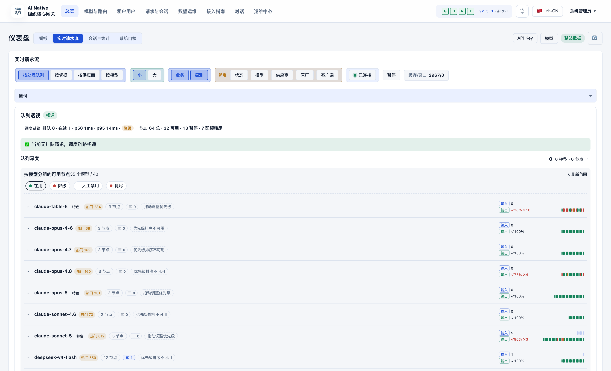
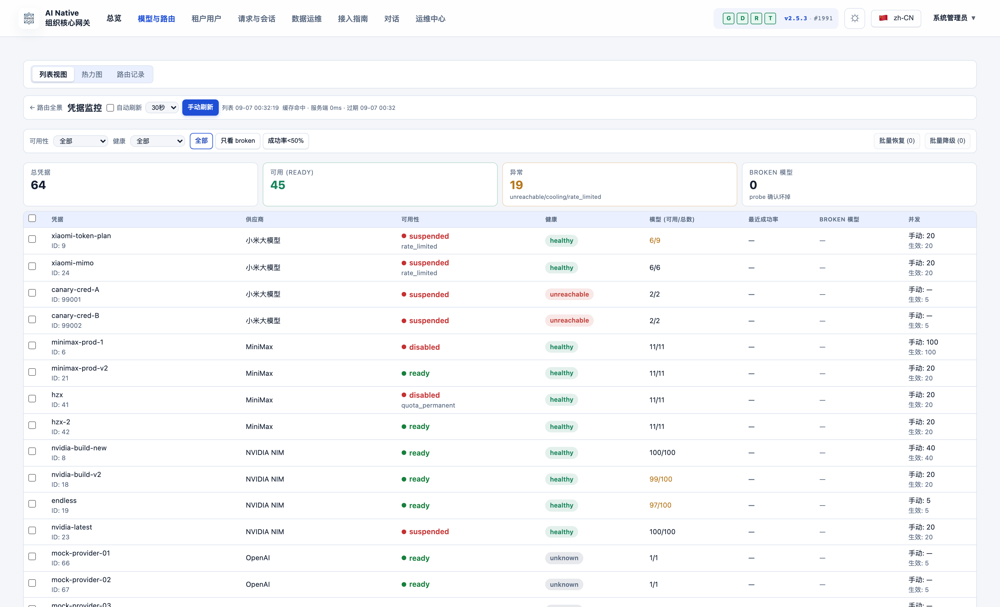
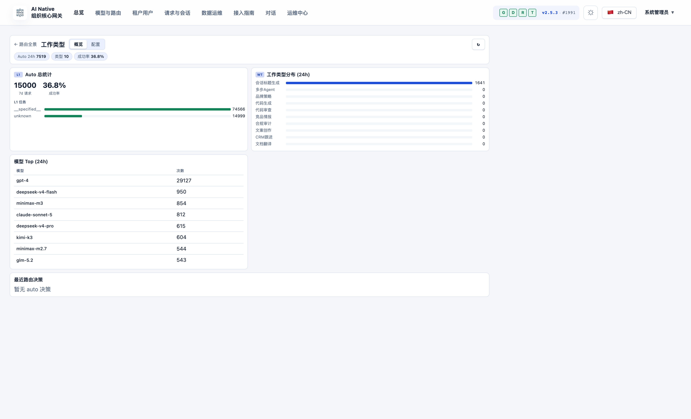
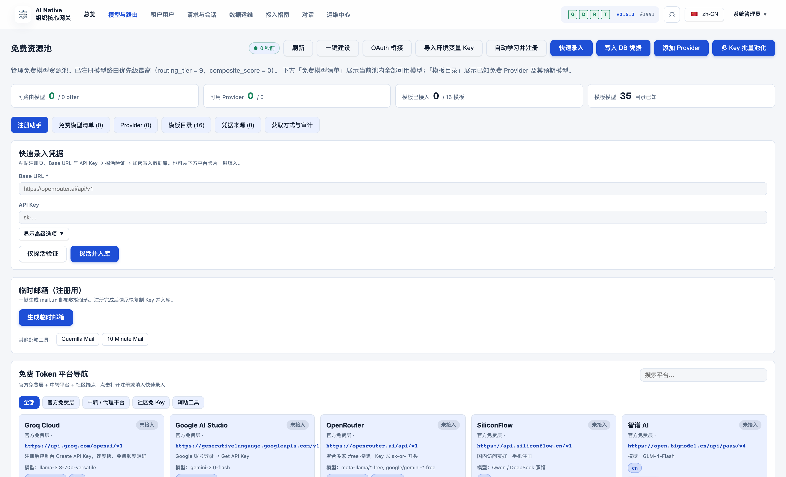
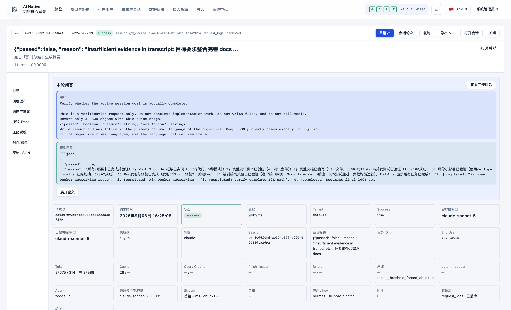

# AI Native Gateway

> The AI-native LLM gateway: not just a proxy — a **management plane and session governance platform** for enterprise AI traffic.

[](LICENSE)
[](https://golang.org)
[](CHANGELOG.md)

**English** | [简体中文](README.zh-CN.md) | [日本語](README.ja.md)

[Quick Start](#quick-start) • [Core Values](#-four-core-values) • [Session Governance](#-session-governance) • [Feature Preview](#-product-feature-preview) • [Comparison](#-differentiation--comparison) • [Architecture](docs/architecture.md) • [Roadmap](ROADMAP.md)

---

## What is AI Native Gateway?

AI Native Gateway is an **open-source, self-hosted, AI-native LLM gateway** built for the era of AI agents and "vibe coding". It does far more than forward requests: it **classifies, routes, governs, audits, and bills** every token that flows through your organization.

- **Protocol Normalization**: OpenAI, Anthropic, Gemini, and Responses API compatibility — one endpoint for every model
- **Intelligent Two-Layer Routing**: L1 picks the model (task classification → 6-dimension scoring), L2 picks the credential (tier fallback → billing round → P2C scoring → execute / circuit-break)
- **Session Governance**: sticky sessions, full-content session replay, automatic prompt compression, and 4-tier data lifecycle — the conversation, not just the request, is a first-class managed object
- **Multi-Tenancy**: PostgreSQL RLS-enforced tenant isolation on 38+ tables, with per-tenant quotas, metering, and MaaS billing
- **Credential Management**: multi-credential pools with fingerprint disguise, adaptive probing, and automatic circuit-breaking
- **Observability**: real-time request streams, routing analytics (heatmap + Sankey), cost tracking, OTel + Prometheus
- **Privacy**: 100% private deployment — all data stays inside your infrastructure

Built with **Go + PostgreSQL + Redis**, running today in production on k3s (dual instances sharing a single PostgreSQL schema). Designed for organizations that need full control over their AI infrastructure.

---

## ✨ Four Core Values

| Value | What customers get |
|-------|--------------------|
| **Secure** | AI Guardrails · DLP · Inline Interception · Vibe Coding governance · SIEM/SOAR integration |
| **Stable** | Multi-cloud orchestration · Circuit breaker with automatic recovery · 99.9% SLA target |
| **Low Cost** | Semantic cache · Auto-routing (cost/quality policies) · Token metering · Prompt compression |
| **Enterprise Integration** | MCP tool gateway (roadmap) · API Hub asset center (roadmap) · Full-chain audit · SIEM/SOAR |

## 🏗️ Three Product Pillars

| Control | Govern | Secure |
|---------|--------|--------|
| ✅ Token usage metering | 🔨 API Hub asset center | 🔨 Model Armor |
| ✅ Intelligent routing + sticky sessions | 🔨 Auto-discovery | 🔨 Sensitive Data Protection (SDP) |
| ✅ Semantic cache + Funnel | 🔨 SpecBoost smart enrichment | 🔨 Adversarial prompt defense |
| ✅ Full-chain audit + OTel | ✅ Multi-tenant RLS (L1 = 0) | ✅ SIEM/SOAR integration |
| ✅ MaaS billing | | |

✅ = Shipped &nbsp;·&nbsp; 🔨 = On the roadmap

## 🎯 Capability Matrix

| Layer | What you get |
|-------|--------------|
| **Protocol** | OpenAI / Anthropic / Gemini / Responses compatible + SSE streaming relay with integrity checks |
| **Routing** | Two-layer routing (model → credential) + sticky sessions + auto-routing with cost/quality policies |
| **Multi-Tenancy** | Identity tunneling (virtual IP/MAC/ClientID) + credential pools + RLS on 38+ tables |
| **Traffic Governance** | Token rate limiting (TPM/RPM) + semantic cache + prompt compression + sliding-window algorithms |
| **Audit** | Full-chain audit + DLQ + disk fallback + OTel + Prometheus |
| **Credentials** | Multi-credential + fingerprint pool + adaptive probing + manual disable |
| **Deployment** | Dual instances (Docker + k3s NodePort) sharing a single PostgreSQL schema |

See [Architecture Documentation](docs/architecture.md) for details.

---

## 🧠 Session Governance

Most gateways treat every request as an isolated event. AI Native Gateway treats the **session** as the unit of governance — because in the age of coding agents and long-running assistants, one "request" is rarely the whole story.

- **Sticky Session Binding**: sessions are pinned to credentials so conversation context survives model and failover switches — no silent context loss mid-task
- **Session-Level Audit & Replay**: full system prompts and responses are retained and replayable per session (13,000+ sessions live in production), covering task type, client model, outbound model, provider, tokens, latency, and end reason — slice by key / tenant / time range for troubleshooting and compliance
- **Automatic Prompt Compression**: when a request approaches the provider's real context window (~80% trigger), message-level compression runs before dispatch — long agent sessions fit smaller windows instead of failing. Every compression event (strategy, threshold, before/after sizes) is recorded on the request
- **Session Metadata Intelligence**: automatic work-type tagging (10 work types), project attribution, and title extraction turn raw traffic into searchable knowledge
- **Identity Tunneling**: agent traffic is attributed via virtual IP/MAC/ClientID so multi-tenant isolation holds even when many agents share one egress
- **4-Tier Data Lifecycle**: hot (0–7 d) / warm (7–30 d) / cold (30–90 d) / expired (>90 d) with archive preview — "here is exactly what will move" before you execute

---

## 🎛️ Product Feature Preview

All modules below are shipped and running in the k3s production deployment. Screenshots are captured from a live local deployment (1728×1050, after full data load).

### Dashboard — Real-Time Request Stream


*Live request stream grouped by processing queue, with dispatch-chain stats (in-flight, p50/p95 latency, node availability) and per-model node health*

### Routing Panorama — Two-Layer Routing, Fully Observable


*L1 model selection (task classification → 6-dimension scoring → profile lock) + L2 credential selection (model resolution → tier fallback → billing round → P2C scoring → execute / circuit-break). Task×model heatmap answers "which model for which task"; Sankey flow shows the final destination of 14,000+ live requests (task → model → provider)*

### Credential Monitor — Multi-Source × Multi-Credential Health


*A live 2-D availability matrix (19 credentials × 18 models in production) shows at a glance which credential breaks which model. Per-credential P95 latency, 1-hour sliding-window success rate, and concurrency slot usage. Fingerprint pool (50+ User-Agents, 35 Accept-Language variants, 11 uTLS profiles) + adaptive probing dodge upstream risk control automatically — failures trip the breaker, no human in the loop*

### Work-Type Configuration — Task Auto-Classification


*Task auto-classification (10 work types) with 24h distribution, top models, and routing decision stats — configurable per work type in the admin UI*

### Free Resource Pool


*Free-model resource pool: bring-your-own keys, provider templates (Groq, Google AI Studio, OpenRouter, SiliconFlow, Zhipu), and per-model routing priority*

### Request Session Detail — Full-Chain Forensics


*Full request inspection: Q&A replay, dispatch waterfall, routing & retry trail, trace, compression/masking record (note the masked API key `sk-****`), token & cache stats*

---

## 🚀 Quick Start

### Option A: Docker Compose (recommended, < 10 minutes)

```bash
# Clone
git clone https://codeup.aliyun.com/kaixuan/official-deploy/llm-gateway-go.git ai-native-gateway
cd ai-native-gateway
# (GitHub mirror: git clone https://github.com/halfking/SI-LLM-Gateway.git)

# Generate secure keys
cp .env.quickstart.example .env
# Edit .env with secure random values (see file for generation commands)

# Start the stack (PostgreSQL + Redis + Gateway)
docker compose -f docker-compose.quickstart.yml up -d

# Verify health
curl http://localhost:8781/healthz
# {"status":"ok"}

# Open the embedded admin UI
open http://localhost:8781/admin
```

### Option B: Build from source

```bash
go build -o gateway ./cmd/gateway
./gateway --config=configs/local.yaml
curl http://localhost:8781/healthz   # → 200 OK
```

See the [Getting Started Guide](docs/getting-started.md) for detailed instructions.

---

## Deployment Modes

AI Native Gateway supports both **full production stacks** and a **minimal single-machine local deployment**:

| Mode | Description | Status |
|------|-------------|--------|
| **Docker Compose** | Quick start with included PostgreSQL/Redis | ✅ Recommended for evaluation |
| **Binary + systemd** | Production deployment on Linux hosts | ✅ Supported with installer |
| **Kubernetes** | Deployment + ConfigMap + Service manifests | ⚠️ Test-grade (production runs on k3s internally) |

**Production stack**: Gateway + PostgreSQL 14+ (durable state, RLS) + Redis 7+ (hot state, rate limits) + embedded admin UI, with optional Prometheus/Grafana monitoring.

The quick-start stack is the **same binary and schema as production** — moving to production means pointing at managed PostgreSQL/Redis and adding TLS, not changing configuration semantics. The internal production deployment runs **dual instances (Docker host + k3s NodePort) sharing one PostgreSQL schema**.

**Production requirements**: external PostgreSQL 14+ and Redis 7+, TLS termination (reverse proxy), secrets management, backup and monitoring.

See [Production Deployment](docs/06-deployment/) for details.

---

## 📐 Differentiation & Comparison

### vs. Generic AI Gateways

| Dimension | Generic AI Gateway | AI Native Gateway |
|-----------|--------------------|-------------------|
| **Deployment** | SaaS / On-Prem | 100% private (k3s production-proven) |
| **Data residency** | Data leaves your perimeter | All data stays inside your infrastructure |
| **Billing** | Usage-based (USD) | Plans + credits + booster packs — built for China SMB, Alipay-ready |
| **Upstream models** | A few major vendors | Broad model coverage + Chinese domestic models + local models |
| **Credential fingerprint pool** | Basic | 50+ User-Agents · 35 Accept-Language · 11 uTLS profiles |
| **Session governance** | Request-level logs | Sticky sessions + full-content replay + compression + 4-tier lifecycle |
| **MCP tool gateway** | Partial | Full delivery targeted Q3 2026 |
| **Chinese-friendly** | Limited | Full Chinese UI + domestic models + Alipay |
| **Multi-tenant audit** | Standard | RLS on 38+ tables · tenant audits at L1 = 0 |

### vs. Named Alternatives

| Feature | AI Native Gateway | LiteLLM | OmniRoute | Portkey | Kong AI |
|---------|-------------------|---------|-----------|---------|---------|
| **Deployment** | Private (self-hosted) | SaaS + OSS | Self-hosted (Node) | SaaS | OSS |
| **Multi-Tenancy** | Native (PG RLS) | Basic | Single-node oriented | Full (SaaS) | Via plugins |
| **Admin UI** | Embedded Vue SPA | CLI | Web UI | SaaS UI | Kong Manager |
| **Data Residency** | 100% private | Depends | 100% private | Cloud (SaaS) | Self-hosted |
| **License** | Apache 2.0 | MIT | See upstream | Proprietary | Apache 2.0 |

**Choose AI Native Gateway if you need**:

- Full data residency control (no external SaaS dependencies)
- Deep multi-tenancy with database-level isolation
- Session-level governance and forensics, not just request logs
- Embedded admin UI in a single Go binary
- MaaS billing that fits Chinese SMB (plans + credits + booster packs)

**Choose alternatives if you need**:

- Maximum provider coverage (100+ providers) → LiteLLM
- Node.js-based self-hosted gateway with embedded DB → OmniRoute
- Zero-ops managed service → Portkey
- General API gateway + LLM → Kong

See [Detailed Comparison](docs/comparison.md) for more.

---

## Roadmap

**Current (v2.x)**:

- ✅ OpenAI/Anthropic/Gemini/Responses protocol support
- ✅ Multi-tenant isolation with PostgreSQL RLS
- ✅ Intelligent routing with sticky sessions
- ✅ Session governance: compression, replay, lifecycle
- ✅ Vue.js admin console
- ✅ Docker Compose quick start

**Next (3–6 months)**:

- 🚧 Enhanced cost/quality-aware routing
- 🚧 Production-grade Kubernetes Helm charts
- 🚧 Grafana dashboard templates
- 🚧 Advanced observability (session forensics, decision replay)

**Exploring (6–12+ months)**:

- 🔬 MCP (Model Context Protocol) gateway integration — full delivery targeted Q3 2026
- 🔬 Agent-to-Agent (A2A) protocol support
- 🔬 Kubernetes Operator (CRD-based deployment)

See [ROADMAP.md](ROADMAP.md) for full details.

---

## 📚 Documentation

| Category | Document |
|----------|----------|
| Getting started | [docs/getting-started.md](docs/getting-started.md) — deploy in 10 minutes |
| Architecture | [docs/architecture.md](docs/architecture.md) — system design and components |
| API | [docs/03-design/01-architecture/architecture/API.md](docs/03-design/01-architecture/architecture/API.md) — data plane and admin API specs |
| Environment | [docs/environment.md](docs/environment.md) — deployment environments and variables |
| Quick reference | [docs/QUICK_REFERENCE.md](docs/QUICK_REFERENCE.md) — common commands and troubleshooting |
| Comparison | [docs/comparison.md](docs/comparison.md) — vs LiteLLM, OmniRoute, Portkey, Kong |
| Project overview | [docs/PROJECT_OVERVIEW.md](docs/PROJECT_OVERVIEW.md) — features and module map |
| Docs index | [docs/INDEX.md](docs/INDEX.md) — full documentation navigation |
| Dual-repo policy | [docs/06-deployment/04-runbooks/operations/REPO-MIRROR-POLICY.md](docs/06-deployment/04-runbooks/operations/REPO-MIRROR-POLICY.md) — codeup ⇄ GitHub workflow |
| Security | [SECURITY.md](SECURITY.md) — vulnerability reporting + scanner usage |
| Legal | [docs/02-resources/compliance/legal/disguise-compliance.md](docs/02-resources/compliance/legal/disguise-compliance.md) — request disguise compliance whitelist |
| A2A research | [docs/03-design/01-architecture/architecture/a2a-spec-2027.md](docs/03-design/01-architecture/architecture/a2a-spec-2027.md) — agent-to-agent protocol survey |
| Armor / SDP | [docs/03-design/01-architecture/architecture/armor-sdp-feasibility.md](docs/03-design/01-architecture/architecture/armor-sdp-feasibility.md) — prompt injection + SDP feasibility |

---

## 🔀 Dual-Repository Strategy

| Remote | URL | Purpose |
|--------|-----|---------|
| `codeup` (origin) | `https://codeup.aliyun.com/kaixuan/official-deploy/llm-gateway-go.git` | Default (daily development) |
| `github` | `git@github.com:halfking/SI-LLM-Gateway.git` | Public mirror (staged releases) |

```bash
git push              # → codeup (no extra checks)
git push github       # → github (strict secret scan, blocked on hit)
```

Sensitive-information protection: `.githooks/pre-push` automatically runs `scripts/scan-secrets.sh` in strict mode (49 rules) when pushing to GitHub. See the [mirror policy](docs/06-deployment/04-runbooks/operations/REPO-MIRROR-POLICY.md).

---

## 🤝 Contributing

We welcome contributions! See [CONTRIBUTING.md](CONTRIBUTING.md) for development setup, code style, and the pull-request process.

Multi-tenancy changes must pass all three linters: `lint-tenant-scope-llmgw` / `lint-pg-rls` / `lint-otel-tenant`.

## 🔐 Security

- Vulnerability reporting: see [SECURITY.md](SECURITY.md)
- Public-mirror secret protection: see the [dual-repo policy](docs/06-deployment/04-runbooks/operations/REPO-MIRROR-POLICY.md)
- Disguise compliance whitelist: see [docs/02-resources/compliance/legal/disguise-compliance.md](docs/02-resources/compliance/legal/disguise-compliance.md)

## License

Licensed under the [Apache License 2.0](LICENSE). See [NOTICE](NOTICE) for required attributions when redistributing this software.

**Commercial use**: Apache 2.0 allows commercial use. When redistributing (as source or binary), you must retain copyright notices and the NOTICE file. Internal commercial use without redistribution does not require additional attribution beyond license compliance.

## Acknowledgments

AI Native Gateway incorporates components from the following open-source projects:

- Go standard library (BSD-3-Clause)
- PostgreSQL driver (MIT)
- Redis client (BSD-2-Clause)
- Vue.js and Element Plus (MIT)
- See [NOTICE](NOTICE) for the complete list

---

Built with ❤️ by the AI Native Gateway community
