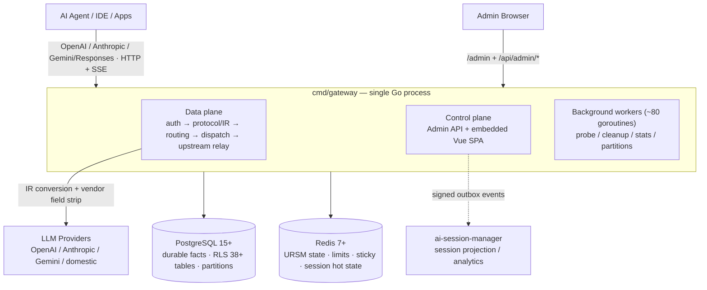

# AI Native Gateway

> The AI-native LLM gateway: not just a proxy — a **management plane and session governance platform** for enterprise AI traffic.

[](LICENSE)
[](https://golang.org)
[](CHANGELOG.md)

**English** | [简体中文](README.zh-CN.md) | [繁體中文](README.zh-TW.md) | [日本語](README.ja.md) | [Deutsch](README.de.md) | [Français](README.fr.md) | [Español](README.es.md) | [العربية](README.ar.md)

[Quick Start](#-quick-start) • [Core Values](#-four-core-values) • [Architecture](#-architecture-at-a-glance) • [Session Governance](#-session-governance) • [Feature Preview](#-product-feature-preview) • [Comparison](#-differentiation--comparison) • [Roadmap](ROADMAP.md)

---

## What is AI Native Gateway?

AI Native Gateway is an **open-source, self-hosted, AI-native LLM gateway** built for the era of AI agents and "vibe coding". It does far more than forward requests: it **classifies, routes, governs, audits, and bills** every token that flows through your organization.

- **Protocol Normalization**: OpenAI, Anthropic, Gemini, and Responses API compatibility — one endpoint for every model
- **Intelligent Two-Layer Routing**: L1 picks the model (task classification → 6-dimension scoring), L2 picks the credential (tier fallback → billing round → P2C scoring → execute / circuit-break)
- **Session Governance**: sticky sessions, full-content session replay, automatic prompt compression, and 4-tier data lifecycle — the conversation, not just the request, is a first-class managed object
- **Multi-Tenancy**: PostgreSQL RLS-enforced tenant isolation on 38+ tables, with per-tenant quotas, metering, and MaaS billing
- **Credential Management**: multi-credential pools with fingerprint disguise, adaptive probing, and automatic circuit-breaking
- **Observability**: real-time request streams, routing analytics (heatmap + Sankey), cost tracking, OTel + Prometheus
- **Privacy**: 100% private deployment — all data stays inside your infrastructure

Built with **Go + PostgreSQL + Redis**, running today in production on k3s (dual instances sharing a single PostgreSQL schema). Designed for organizations that need full control over their AI infrastructure.

---

## ✨ Four Core Values

| Value | What customers get |
|-------|--------------------|
| **Secure** | AI Guardrails · DLP · Inline Interception · Vibe Coding governance · SIEM/SOAR integration |
| **Stable** | Multi-cloud orchestration · Circuit breaker with automatic recovery · 99.9% SLA target |
| **Low Cost** | Semantic cache · Auto-routing (cost/quality policies) · Token metering · Prompt compression |
| **Enterprise Integration** | MCP tool gateway (roadmap) · API Hub asset center (roadmap) · Full-chain audit · SIEM/SOAR |

## 🏗️ Three Product Pillars

| Control | Govern | Secure |
|---------|--------|--------|
| ✅ Token usage metering | 🔨 API Hub asset center | 🔨 Model Armor |
| ✅ Intelligent routing + sticky sessions | 🔨 Auto-discovery | 🔨 Sensitive Data Protection (SDP) |
| ✅ Semantic cache + Funnel | 🔨 SpecBoost smart enrichment | 🔨 Adversarial prompt defense |
| ✅ Full-chain audit + OTel | ✅ Multi-tenant RLS (L1 = 0) | ✅ SIEM/SOAR integration |
| ✅ MaaS billing | | |

✅ = Shipped &nbsp;·&nbsp; 🔨 = On the roadmap

## 🎯 Capability Matrix

| Layer | What you get |
|-------|--------------|
| **Protocol** | OpenAI / Anthropic / Gemini / Responses compatible + SSE streaming relay with integrity checks |
| **Routing** | Two-layer routing (model → credential) + sticky sessions + auto-routing with cost/quality policies |
| **Multi-Tenancy** | Identity tunneling (virtual IP/MAC/ClientID) + credential pools + RLS on 38+ tables |
| **Traffic Governance** | Token rate limiting (TPM/RPM) + semantic cache + prompt compression + sliding-window algorithms |
| **Audit** | Full-chain audit + DLQ + disk fallback + OTel + Prometheus |
| **Credentials** | Multi-credential + fingerprint pool + adaptive probing + manual disable |
| **Deployment** | Dual instances (Docker + k3s NodePort) sharing a single PostgreSQL schema |

See the [Architecture at a Glance](#-architecture-at-a-glance) section below, or the full [Architecture Diagram Collection](docs/architecture-diagrams.md) for details.

---

## 🏛️ Architecture at a Glance

One Go process (`cmd/gateway`) hosts the **data plane, control plane, and admin UI on a single mux** (h2c: HTTP/1.1 + HTTP/2 on one port). PostgreSQL holds durable facts (RLS-isolated, monthly-partitioned); Redis holds hot state (routing, limits, sticky sessions). The same `storage` interfaces back both **full mode** (PG + Redis) and **lite mode** (SQLite + local files — zero external dependencies, single binary).


```mermaid
graph TB
    AGENT["AI Agent / IDE / Apps"] -->|"OpenAI / Anthropic / Gemini/Responses · HTTP + SSE"| GW
    ADMIN["Admin Browser"] -->|"/admin + /api/admin/*"| GW
    subgraph GW["cmd/gateway — single Go process"]
        DP["Data plane<br/>auth → protocol/IR → routing → dispatch → upstream relay"]
        CP["Control plane<br/>Admin API + embedded Vue SPA"]
        BGW["Background workers (~80 goroutines)<br/>probe / cleanup / stats / partitions"]
    end
    GW --> PG[("PostgreSQL 15+<br/>durable facts · RLS 38+ tables · partitions")]
    GW --> RD[("Redis 7+<br/>URSM state · limits · sticky · session hot state")]
    DP -->|"IR conversion + vendor field strip"| P["LLM Providers<br/>OpenAI / Anthropic / Gemini / domestic"]
    CP -.->|"signed outbox events"| ASM["ai-session-manager<br/>session projection / analytics"]

```

**Request pipeline (v1 production path, sole execution route since 2026-08)**:

```text
HTTP/SSE → middleware chain → protocol/IR normalization → session assignment
  → (model=auto: L1 model selection) → resource prep (semantic cache / prompt compression)
  → Executor (attempt budget) → dispatch queues (global → model → credential)
  → Router (tier / health / sticky filters + URSM v2 state + P2C scoring)
  → resource gates (fingerprint slot / concurrency / RPM)
  → upstream relay (0 internal retries; pre-first-byte failover only adds attempts)
  → SSE write-back with integrity checks
  → request_logs + usage ledger (canonical facts)
  → onPersisted hooks: session V2 shadow write · session_dim upsert · ASM outbox
```

**Repository layout**

| Path | Role |
|------|------|
| `cmd/gateway/` | Composition root — single-binary production entry (data + control plane) |
| `domains/` | 67 DDD domains — `streaming`, `dispatch`, `credential`, `session`(+v2), `ursm`, hooks, security… |
| `admin/` + `web/` | Admin REST API + Vue 3 + TypeScript SPA (Element Plus, ECharts) |
| `bg/` | Background workers — probing, lifecycle cleanup, stats aggregation, partition maintenance |
| `storage/` | Dual-mode storage factory (`full`: PG+Redis / `lite`: SQLite+files+in-proc KV) |
| `internal/` | Cross-cutting infra — IR, vendor strip, session mirror, outbox, telemetry… |
| `sql/migrations/` + `db/migrations/` | Idempotent migrations (startup series currently at 837) |
| `installer/` | Standalone cross-platform installer / upgrader module |
| `scripts/`, `deploy/` | Build, deploy, mirror, and verification tooling |

Scale snapshot (2026-10-06 code scan): **~4,967 Go files · 2,728 test files · 1,016 migration SQLs · 67 domain packages · 44 binaries** under `cmd/` (count = main packages per `go list`; the stale "34" was R48-B4, and `go list ./cmd/...`'s 46 includes 2 non-`main` helper packages — define the criterion before comparing numbers).

**Deeper reading**

- [Architecture Diagram Collection](docs/architecture-diagrams.md) — full Mermaid set: context, containers, request chain, two-layer routing, storage, deployment, workers
- [Evidence-graded Architecture](docs/03-design/01-architecture/architecture/ARCHITECTURE.md) — internal authority doc (CURRENT / SHADOW / PARALLEL grading, snapshot 2026-10-01)
- [Session Lifecycle](docs/session-lifecycle.md) — session from first request to archival, fully diagrammed
- [Runtime Request Flow](docs/03-design/01-architecture/architecture/runtime-request-flow.md) · [Routing & State](docs/03-design/01-architecture/architecture/routing-and-state.md)

---

## 🧠 Session Governance

Most gateways treat every request as an isolated event. AI Native Gateway treats the **session** as the unit of governance — because in the age of coding agents and long-running assistants, one "request" is rarely the whole story.

- **Sticky Session Binding**: sessions are pinned to credentials so conversation context survives model and failover switches — no silent context loss mid-task
- **Session-Level Audit & Replay**: full system prompts and responses are retained and replayable per session (13,000+ sessions live in production), covering task type, client model, outbound model, provider, tokens, latency, and end reason — slice by key / tenant / time range for troubleshooting and compliance
- **Automatic Prompt Compression**: when a request approaches the provider's real context window (~80% trigger), message-level compression runs before dispatch — long agent sessions fit smaller windows instead of failing. Every compression event (strategy, threshold, before/after sizes) is recorded on the request
- **Session Metadata Intelligence**: automatic work-type tagging (10 work types), project attribution, and title extraction turn raw traffic into searchable knowledge
- **Identity Tunneling**: agent traffic is attributed via virtual IP/MAC/ClientID so multi-tenant isolation holds even when many agents share one egress
- **4-Tier Data Lifecycle**: hot (0–7 d) / warm (7–30 d) / cold (30–90 d) / expired (>90 d) with archive preview — "here is exactly what will move" before you execute

How a session actually flows through the gateway — three-layer model (Redis hot state / `request_logs` canonical facts / Sessions V2 shadow tables), ID assignment, per-turn sequence, sticky binding, compression, and archival — is fully diagrammed in [Session Lifecycle](docs/session-lifecycle.md).

---

## 🎛️ Product Feature Preview

All modules below are shipped and running in the k3s production deployment. Screenshots are captured from a live local deployment (1728×1050, after full data load).

### Dashboard — Real-Time Request Stream


*Live request stream grouped by processing queue, with dispatch-chain stats (in-flight, p50/p95 latency, node availability) and per-model node health*

### Statistics Board — Usage & Cost at a Glance


*Board tab of the dashboard: hero metrics (requests / tokens / cost / credits charged), RPM · TPM · latency, key/model/provider counts, and the provider cost & procurement section — the fee-settlement view embedded in the board (captured 2026-10, v2.5.8)*

### Fee Settlement — Provider Cost & Procurement


*Provider cost cards (window cost, credits charged, balance/plan) and the per-provider usage table — requests, tokens, cost (USD), credits, success rate — settlement-grade cost accounting inside the statistics board, exportable to Excel*

### Routing Panorama — Two-Layer Routing, Fully Observable


*L1 model selection (task classification → 6-dimension scoring → profile lock) + L2 credential selection (model resolution → tier fallback → billing round → P2C scoring → execute / circuit-break). Task×model heatmap answers "which model for which task"; Sankey flow shows the final destination of 14,000+ live requests (task → model → provider)*

### Credential Monitor — Multi-Source × Multi-Credential Health


*A live 2-D availability matrix (19 credentials × 18 models in production) shows at a glance which credential breaks which model. Per-credential P95 latency, 1-hour sliding-window success rate, and concurrency slot usage. Fingerprint pool (50+ User-Agents, 35 Accept-Language variants, 11 uTLS profiles) + adaptive probing dodge upstream risk control automatically — failures trip the breaker, no human in the loop*

### Work-Type Configuration — Task Auto-Classification


*Task auto-classification (10 work types) with 24h distribution, top models, and routing decision stats — configurable per work type in the admin UI*

### Free Resource Pool


*Free-model resource pool: bring-your-own keys, provider templates (Groq, Google AI Studio, OpenRouter, SiliconFlow, Zhipu), and per-model routing priority*

### Request Session Detail — Full-Chain Forensics


*Full request inspection: Q&A replay, dispatch waterfall, routing & retry trail, trace, compression/masking record (note the masked API key `sk-****`), token & cache stats*

---

## 🚀 Quick Start

### Install (one command, two scales)

Every install method below is available **from this source tree** — clone and go, no
release bundle required. The entry point asks which *scale* you want before it does
anything, so you never end up with a stack you didn't intend:

| Scale | Storage | Use case |
|-------|---------|----------|
| **`lite`** | SQLite, single process | single host, intranet, evaluation, CI |
| **`full`** | PostgreSQL + Redis | production, multi-replica, high concurrency |

```bash
git clone https://codeup.aliyun.com/kaixuan/official-deploy/llm-gateway-go.git
cd llm-gateway-go

# Interactive: probes your machine, asks lite vs full, then installs
bash install.sh            # macOS / Linux / Windows(Git Bash)
.\install.ps1              # Windows PowerShell
install.bat                # Windows CMD
```

Not sure what your machine can do? Ask it first — nothing is downloaded or written:

```bash
bash install.sh doctor      # what is available here
bash install.sh version     # what version you have + how to get updates
```

#### Pick a channel explicitly

| Channel | Command | Notes |
|---------|---------|-------|
| Source build | `bash install.sh --channel source` | `go build` from this tree; needs Go, no registry |
| Go ecosystem | `go install github.com/kaixuan/llm-gateway-go/installer/cmd/llm-gw-installer@latest` | canonical Go install |
| npm | `npm install -g @kaixuan/llm-gw-installer` | lowest friction on Windows |
| Release binary | `bash install.sh --channel binary` | uses the bundled `llm-gw-installer-<os>-<arch>` |
| Official one-liner | `bash install.sh --channel maintain` | `curl … \| bash`, always the newest published artifact |

Non-interactive (CI / unattended):

```bash
bash install.sh --channel source --mode lite --yes
NO_INTERACTIVE=1 bash install.sh --mode full
```

Installer subcommands pass straight through, so existing usage keeps working:

```bash
bash install.sh upgrade       # upgrade an existing instance
bash install.sh uninstall     # --purge also drops the data
bash install.sh activate
bash install.sh heartbeat
bash install.sh upgrade --action check   # --action is required by `upgrade`
```

Note that `doctor` and `version` are claimed by the **bootstrap** itself, not passed
through: they answer "what can this machine install" and "what version do I have and
how do I get updates", which is the more useful question before you have an installer
installed at all. An unknown first argument is rejected with a clear error rather than
being handed to the binary.

### Option A: Docker Compose (recommended, < 10 minutes)

```bash
# Clone
git clone https://codeup.aliyun.com/kaixuan/official-deploy/llm-gateway-go.git ai-native-gateway
cd ai-native-gateway
# (GitHub mirror: git clone https://github.com/halfking/ai-native-gateway-core.git)

# Generate secure keys
cp .env.quickstart.example .env
# Edit .env with secure random values (see file for generation commands)

# Start the stack (PostgreSQL + Redis + Gateway)
docker compose -f docker-compose.quickstart.yml up -d

# Verify health
curl http://localhost:8781/healthz
# {"status":"ok"}

# Open the embedded admin UI
open http://localhost:8781/admin
```

### Option B: Build from source

```bash
go build -o gateway ./cmd/gateway
LLM_GATEWAY_CONFIG_FILE=config.example.yaml ./gateway
curl http://localhost:8781/healthz   # → 200 OK
```

See the [Getting Started Guide](docs/getting-started.md) for detailed instructions.

---

## Deployment Modes

AI Native Gateway supports both **full production stacks** and a **minimal single-machine local deployment**:

| Mode | Description | Status |
|------|-------------|--------|
| **Docker Compose** | Quick start with included PostgreSQL/Redis | ✅ Recommended for evaluation |
| **Binary + systemd** | Production deployment on Linux hosts | ✅ Supported with installer |
| **Kubernetes** | Deployment + ConfigMap + Service manifests | ⚠️ Test-grade (production runs on k3s internally) |

**Production stack**: Gateway + PostgreSQL 14+ (durable state, RLS) + Redis 7+ (hot state, rate limits) + embedded admin UI, with optional Prometheus/Grafana monitoring.

The quick-start stack is the **same binary and schema as production** — moving to production means pointing at managed PostgreSQL/Redis and adding TLS, not changing configuration semantics. The internal production deployment runs **dual instances (Docker host + k3s NodePort) sharing one PostgreSQL schema**.

**Production requirements**: external PostgreSQL 14+ and Redis 7+, TLS termination (reverse proxy), secrets management, backup and monitoring.

See [Production Deployment](docs/06-deployment/) for details.

### Installer — One-click Deployer (`installer/`)

The `installer/` subtree ships a **single cross-platform Go binary** (`llm-gw-installer`) that wraps the full deploy flow into a 13-step interactive wizard. It supports Windows / Linux / macOS / 国产 OS / 国产 CPU out of the box.

**Subcommands**

```bash
llm-gw-installer doctor      # detect OS / docker / network / ports
llm-gw-installer install     # one-click install + deploy
llm-gw-installer uninstall   # uninstall (--purge removes data)
```

**Cross-platform build**

```bash
GOOS=linux  GOARCH=amd64   go build -o dist/llm-gw-installer-linux-amd64   ./installer/cmd/llm-gw-installer/
GOOS=linux  GOARCH=arm64   go build -o dist/llm-gw-installer-linux-arm64   ./installer/cmd/llm-gw-installer/
GOOS=linux  GOARCH=loong64 go build -o dist/llm-gw-installer-linux-loong64 ./installer/cmd/llm-gw-installer/
GOOS=darwin GOARCH=amd64   go build -o dist/llm-gw-installer-darwin-amd64  ./installer/cmd/llm-gw-installer/
GOOS=darwin GOARCH=arm64   go build -o dist/llm-gw-installer-darwin-arm64  ./installer/cmd/llm-gw-installer/
GOOS=windows GOARCH=amd64  go build -o dist/llm-gw-installer-windows-amd64.exe ./installer/cmd/llm-gw-installer/
GOOS=windows GOARCH=arm64  go build -o dist/llm-gw-installer-windows-arm64.exe ./installer/cmd/llm-gw-installer/
```

#### Storage Modes (full vs. lite)

The installer ships **two storage modes**; pick one at install time:

| Mode | Storage backend | Use case | Images pulled at install | Initializes schema? |
|------|------------------|----------|---------------------------|---------------------|
| **`full`** (default) | PostgreSQL (kx-citus) + Redis | Production / multi-replica / high concurrency | `kx-llm-gateway-go` + `kx-citus` + `kx-redis` | Yes (waits for PG ready + `InitSchema`) |
| **`lite`** | SQLite + local | Single machine / dev / CI / demo | `kx-llm-gateway-go` only | No (SQLite auto-creates tables) |

**Selection priority**

1. CLI flag: `--mode lite` or `--mode full` (highest priority)
2. Config file (`--config /path/to/install.env`):
   ```
   STORAGE_MODE=lite
   LLM_GATEWAY_MASTER_URL=https://llmgateway.internal.example.com
   INSTALL_SKIP_ACTIVATION=0
   ```
3. Interactive wizard: prompt `[1] full  [2] lite`, default `1`

In non-TTY (CI / `--skip-prompt`) without `--config`, the default is `full`.

**`lite` install behavior**

| Step | `full` | `lite` |
|------|--------|--------|
| 1. Environment detection | same | same |
| 2. Configuration (wizard / config) | same | same (now includes storage mode + master URL) |
| 3. Image pull | `kx-citus` + `kx-redis` + `kx-llm-gateway-go` | **`kx-llm-gateway-go` only** |
| 4. Write `.env` | all keys | same fields, only `LLM_GATEWAY_STORAGE_MODE=lite` |
| 5. Directory layout | full | full (db/data and redis/data dirs created but unused) |
| 6. `compose.yml` | 3 services | **`kx-citus` + `kx-redis` stripped**; gateway loses `depends_on` + PG/Redis env |
| 7. Start containers | 3 containers | **`kx-llm-gateway-go` only** |
| 8. DB initialization | Wait for PG ready + `InitSchema` (450+ startup migrations) | **Skipped** (SQLite auto-creates) |
| 9. Health check | 5-item full check | container + `/healthz` only; PG/Redis/Schema forced ✅ in report |

**New install flags**

```
--mode string         # full | lite (empty → wizard / default full)
--master-url string   # control-plane URL (default https://llmgateway.internal.example.com)
--skip-activation     # bool, skip the auto-activation call at end of install
```

**New `.env` keys** (written to `{installDir}/.env`)

| Key | Default | Meaning |
|-----|---------|---------|
| `LLM_GATEWAY_STORAGE_MODE` | `full` | Read by `cmd/gateway` `storage_mode_init`; `lite` → SQLite, `full` → PG/Redis |
| `LLM_GATEWAY_MASTER_URL` | `https://llmgateway.internal.example.com` | License activation + heartbeat target |
| `INSTALL_SKIP_ACTIVATION` | `0` | Skip the auto-enroll activation call at install tail (see `activation.RunAutoActivate`) |

#### Image Source Fallback Chain

All container images are pulled via a 4-tier fallback chain so installs work whether you are online, behind a corporate proxy, or fully air-gapped:

```
[1] Offline bundle images/*.tar.gz  (highest priority)
    ↓ on miss
[2] registry.internal.example.com              (internal registry)
    ↓ on miss
[3] registry.cn-hangzhou.aliyuncs.com (Aliyun mirror)
    ↓ on miss
[4] registry-1.docker.io           (official Docker Hub)
    ↓ on miss
❌ clear, actionable error
```

**Environment overrides**

| Variable | Default | Purpose |
|----------|---------|---------|
| `KX_REGISTRY` | `registry.internal.example.com` | Custom internal registry |
| `KX_REGISTRY_USERNAME` / `_PASSWORD` | empty | Registry credentials |
| `KX_REGISTRY_INSECURE` | `false` | Allow plain HTTP |
| `APP_IMAGE_TAG` | read from MANIFEST | Override the application image tag |
| `GOPROXY` | `https://goproxy.cn,direct` | Go module proxy |

#### Known Limitations

- **HarmonyOS NEXT**: not supported (no Linux container support)
- **macOS**: user must pre-install OrbStack or Docker Desktop
- **Windows**: user must pre-install Docker Desktop + WSL2

For the installer's full design, see [installer/README.md](installer/README.md).

---

## 📐 Differentiation & Comparison

### vs. Generic AI Gateways

| Dimension | Generic AI Gateway | AI Native Gateway |
|-----------|--------------------|-------------------|
| **Deployment** | SaaS / On-Prem | 100% private (k3s production-proven) |
| **Data residency** | Data leaves your perimeter | All data stays inside your infrastructure |
| **Billing** | Usage-based (USD) | Plans + credits + booster packs — built for China SMB, Alipay-ready |
| **Upstream models** | A few major vendors | Broad model coverage + Chinese domestic models + local models |
| **Credential fingerprint pool** | Basic | 50+ User-Agents · 35 Accept-Language · 11 uTLS profiles |
| **Session governance** | Request-level logs | Sticky sessions + full-content replay + compression + 4-tier lifecycle |
| **MCP tool gateway** | Partial | Full delivery targeted Q3 2026 |
| **Chinese-friendly** | Limited | Full Chinese UI + domestic models + Alipay |
| **Multi-tenant audit** | Standard | RLS on 38+ tables · tenant audits at L1 = 0 |

### vs. Named Alternatives

| Feature | AI Native Gateway | LiteLLM | OmniRoute | Portkey | Kong AI |
|---------|-------------------|---------|-----------|---------|---------|
| **Deployment** | Private (self-hosted) | SaaS + OSS | Self-hosted (Node) | SaaS | OSS |
| **Multi-Tenancy** | Native (PG RLS) | Basic | Single-node oriented | Full (SaaS) | Via plugins |
| **Admin UI** | Embedded Vue SPA | CLI | Web UI | SaaS UI | Kong Manager |
| **Data Residency** | 100% private | Depends | 100% private | Cloud (SaaS) | Self-hosted |
| **License** | Apache 2.0 | MIT | See upstream | Proprietary | Apache 2.0 |

**Choose AI Native Gateway if you need**:

- Full data residency control (no external SaaS dependencies)
- Deep multi-tenancy with database-level isolation
- Session-level governance and forensics, not just request logs
- Embedded admin UI in a single Go binary
- MaaS billing that fits Chinese SMB (plans + credits + booster packs)

**Choose alternatives if you need**:

- Maximum provider coverage (100+ providers) → LiteLLM
- Node.js-based self-hosted gateway with embedded DB → OmniRoute
- Zero-ops managed service → Portkey
- General API gateway + LLM → Kong

See [Detailed Comparison](docs/comparison.md) for more.

---

## Roadmap

**Current (v2.x)**:

- ✅ OpenAI/Anthropic/Gemini/Responses protocol support
- ✅ Multi-tenant isolation with PostgreSQL RLS
- ✅ Intelligent routing with sticky sessions
- ✅ Session governance: compression, replay, lifecycle
- ✅ Vue.js admin console
- ✅ Docker Compose quick start

**Next (3–6 months)**:

- 🚧 Enhanced cost/quality-aware routing
- 🚧 Production-grade Kubernetes Helm charts
- 🚧 Grafana dashboard templates
- 🚧 Advanced observability (session forensics, decision replay)

**Exploring (6–12+ months)**:

- 🔬 MCP (Model Context Protocol) gateway integration — full delivery targeted Q3 2026
- 🔬 Agent-to-Agent (A2A) protocol support
- 🔬 Kubernetes Operator (CRD-based deployment)

See [ROADMAP.md](ROADMAP.md) for full details.

---

## 📚 Documentation

| Category | Document |
|----------|----------|
| Getting started | [docs/getting-started.md](docs/getting-started.md) — deploy in 10 minutes |
| Architecture diagrams | [docs/architecture-diagrams.md](docs/architecture-diagrams.md) — full Mermaid collection (context / containers / request chain / routing / storage / deployment) |
| Session lifecycle | [docs/session-lifecycle.md](docs/session-lifecycle.md) — session processing lifecycle, fully diagrammed |
| Architecture (evidence-graded) | [docs/03-design/01-architecture/architecture/ARCHITECTURE.md](docs/03-design/01-architecture/architecture/ARCHITECTURE.md) — internal authority (CURRENT/SHADOW/PARALLEL grading) |
| Architecture (overview) | [docs/architecture.md](docs/architecture.md) — system design and components |
| Requirements | [docs/01-requirements/SYSTEM_REQUIREMENTS.md](docs/01-requirements/SYSTEM_REQUIREMENTS.md) — FR×19 domains / NFR×13 |
| Feature catalog | [docs/01-requirements/functional/FEATURES_CATALOG.md](docs/01-requirements/functional/FEATURES_CATALOG.md) — feature → code → API → admin-page map |
| API | [docs/03-design/01-architecture/architecture/API.md](docs/03-design/01-architecture/architecture/API.md) — data plane and admin API specs |
| Environment | [docs/environment.md](docs/environment.md) — deployment environments and variables |
| Quick reference | [docs/QUICK_REFERENCE.md](docs/QUICK_REFERENCE.md) — common commands and troubleshooting |
| Comparison | [docs/comparison.md](docs/comparison.md) — vs LiteLLM, OmniRoute, Portkey, Kong |
| Project overview | [docs/PROJECT_OVERVIEW.md](docs/PROJECT_OVERVIEW.md) — features and module map |
| Docs index | [docs/README.md](docs/README.md) · [docs/archive/2026-09/INDEX.md](docs/archive/2026-09/INDEX.md) — full documentation navigation |
| Dual-repo policy | [docs/06-deployment/04-runbooks/operations/REPO-MIRROR-POLICY.md](docs/06-deployment/04-runbooks/operations/REPO-MIRROR-POLICY.md) — codeup ⇄ GitHub workflow |
| Security | [SECURITY.md](SECURITY.md) — vulnerability reporting + scanner usage |
| Legal | [docs/02-resources/compliance/legal/disguise-compliance.md](docs/02-resources/compliance/legal/disguise-compliance.md) — request disguise compliance whitelist |
| A2A research | [docs/03-design/01-architecture/architecture/a2a-spec-2027.md](docs/03-design/01-architecture/architecture/a2a-spec-2027.md) — agent-to-agent protocol survey |
| Armor / SDP | [docs/03-design/01-architecture/architecture/armor-sdp-feasibility.md](docs/03-design/01-architecture/architecture/armor-sdp-feasibility.md) — prompt injection + SDP feasibility |

---

## 🔀 Dual-Repository Strategy

| Remote | URL | Purpose |
|--------|-----|---------|
| `codeup` (origin) | `https://codeup.aliyun.com/kaixuan/official-deploy/llm-gateway-go.git` | Default (daily development) |
| `github` | `git@github.com:halfking/ai-native-gateway-core.git` | Public mirror (staged releases) |

```bash
git push              # → codeup (no extra checks)
git push github       # → github (secret scan, blocked on BLOCK-level hit)
```

Sensitive-information protection: `.githooks/pre-push` automatically runs `scripts/scan-secrets.sh` (50 rules; default normal mode — BLOCK findings block, WARN findings warn; `STRICT_SCANNER=1` opts into strict) when pushing to GitHub. See the [mirror policy](docs/06-deployment/04-runbooks/operations/REPO-MIRROR-POLICY.md).

---

## ✅ CI 与门禁（2026-09-14 起）

- **正式门禁 = 本地 `./verify.sh`**：提交/部署前必跑（`go test ./...` 全量、迁移 checksum 对账、隐私合规、vet、build、前端构建）。merge 到 main 与发版以它为准。
- **codeup Flow 轻量门**：远端只有 codeup，`.github/workflows/` 在 codeup 不执行；`.workflow/main-verify.yml` 提供流水线即代码配置（build + `go vet ./autoroute/...` + 60 例 auto 匹配离线套件），需在 codeup 仓库「流水线」页导入一次后随 push/PR 自动触发。
- auto 匹配离线回归可单独复跑：`go test ./autoroute/ -run 'TestAutoMatchingSuiteHeuristic|TestPromptClassificationMatrix'`（纯离线，无网络）。

---

## 🤝 Contributing

We welcome contributions! See [CONTRIBUTING.md](CONTRIBUTING.md) for development setup, code style, and the pull-request process.

Multi-tenancy changes must pass all three linters: `lint-tenant-scope-llmgw` / `lint-pg-rls` / `lint-otel-tenant`.

## 🔐 Security

- Vulnerability reporting: see [SECURITY.md](SECURITY.md)
- Public-mirror secret protection: see the [dual-repo policy](docs/06-deployment/04-runbooks/operations/REPO-MIRROR-POLICY.md)
- Disguise compliance whitelist: see [docs/02-resources/compliance/legal/disguise-compliance.md](docs/02-resources/compliance/legal/disguise-compliance.md)

## License

Licensed under the [Apache License 2.0](LICENSE). See [NOTICE](NOTICE) for required attributions when redistributing this software.

**Commercial use**: Apache 2.0 allows commercial use. When redistributing (as source or binary), you must retain copyright notices and the NOTICE file. Internal commercial use without redistribution does not require additional attribution beyond license compliance.

## Acknowledgments

AI Native Gateway incorporates components from the following open-source projects:

- Go standard library (BSD-3-Clause)
- PostgreSQL driver (MIT)
- Redis client (BSD-2-Clause)
- Vue.js and Element Plus (MIT)
- See [NOTICE](NOTICE) for the complete list

---

Built with ❤️ by the AI Native Gateway community
