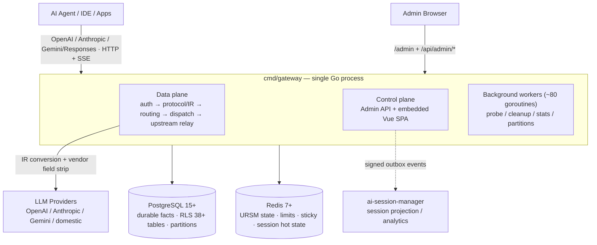

# AI Native Gateway

> AI 原生 LLM 网关：不止是代理 —— 面向企业级 AI 流量的**管理平面与会话治理平台**。

[](LICENSE)
[](https://golang.org)
[](CHANGELOG.md)

[English](README.md) | **简体中文** | [繁體中文](README.zh-TW.md) | [日本語](README.ja.md) | [Deutsch](README.de.md) | [Français](README.fr.md) | [Español](README.es.md) | [العربية](README.ar.md)

[快速开始](#-快速开始) • [核心价值](#-四大核心价值) • [架构](#-架构一览) • [会话治理](#-会话治理) • [功能预览](#-产品功能预览) • [差异化对比](#-差异化定位与竞品对比) • [路线图](ROADMAP.md)

---

## AI Native Gateway 是什么？

AI Native Gateway 是一个**开源、可私有部署的 AI 原生 LLM 网关**，为 AI Agent 与 Vibe Coding 时代而生。它远不止转发请求：它对流经企业的每一个 Token 进行**分类、路由、治理、审计与计费**。

- **协议归一化**：OpenAI、Anthropic、Gemini、Responses API 兼容 —— 一个端点接入所有模型
- **双层智能路由**：L1 选模型（任务分类 → 6 维评分），L2 选凭据（Tier 回退 → 计费轮次 → P2C 评分 → 执行 / 熔断）
- **会话治理**：粘性会话、全量内容会话回放、自动提示词压缩、4 档数据生命周期 —— 会话（而非单次请求）是一等治理对象
- **多租户**：PostgreSQL RLS 强制租户隔离（38+ 表），配套每租户配额、用量计量与 MaaS 计费
- **凭据管理**：多凭据池，配指纹伪装、自适应探测与自动熔断
- **可观测性**：实时请求流、路由分析（热力图 + Sankey）、成本追踪、OTel + Prometheus
- **隐私**：100% 私有化部署 —— 所有数据留在企业基础设施内

基于 **Go + PostgreSQL + Redis** 构建，当前已在 k3s 生产环境运行（双实例共享同一 PostgreSQL schema）。为需要对 AI 基础设施拥有完全控制权的组织而设计。

---

## ✨ 四大核心价值

| 价值 | 客户获得 |
|-------|--------------------|
| **安全** | AI Guardrails · DLP · Inline Interception · Vibe Coding 治理 · SIEM/SOAR 集成 |
| **稳定** | 多云编排 · 自动恢复熔断 · 99.9% SLA 目标 |
| **低成本** | 语义缓存 · 自动路由（cost/quality 策略）· Token 计量 · 提示词压缩 |
| **企业集成** | MCP 工具网关（路线图）· API Hub 资产中心（路线图）· 全链路审计 · SIEM/SOAR |

## 🏗️ 三大产品支柱

| Control（管控） | Govern（治理） | Secure（安全） |
|-----------------|----------------|-----------------|
| ✅ Token 用量计量 | 🔨 API Hub 资产中心 | 🔨 Model Armor |
| ✅ 智能路由 + 粘性会话 | 🔨 自动发现 | 🔨 敏感数据保护（SDP） |
| ✅ 语义缓存 + Funnel | 🔨 SpecBoost 智能富集 | 🔨 对抗性提示词防护 |
| ✅ 全链路审计 + OTel | ✅ 多租户 RLS（L1 = 0） | ✅ SIEM/SOAR 集成 |
| ✅ MaaS 计费 | | |

✅ = 已上线 &nbsp;·&nbsp; 🔨 = 路线图中

## 🎯 能力矩阵

| 层级 | 你能获得 |
|-------|--------------|
| **协议** | OpenAI / Anthropic / Gemini / Responses 兼容 + SSE 流式中继（增量完整性校验） |
| **路由** | 双层路由（模型 → 凭据）+ 粘性会话 + 自动路由（cost/quality 策略） |
| **多租户** | 身份隧道（virtual IP/MAC/ClientID）+ 凭据池 + 38+ 表 RLS |
| **流量治理** | Token 限流（TPM/RPM）+ 语义缓存 + 提示词压缩 + 滑窗算法 |
| **审计** | 全链路审计 + DLQ + 磁盘回退 + OTel + Prometheus |
| **凭据** | 多凭据 + 指纹池 + 自适应探测 + 手动禁用 |
| **部署** | 双实例（Docker + k3s NodePort），共享同一 PostgreSQL schema |

详见下方[架构一览](#-架构一览)小节，或完整的[架构图集](docs/architecture-diagrams.md)。

---

## 🏛️ 架构一览

单个 Go 进程（`cmd/gateway`）在**同一个 mux 上承载数据面、控制面与管理 UI**（h2c：HTTP/1.1 + HTTP/2 单端口）。PostgreSQL 保存持久事实（RLS 隔离、按月分区）；Redis 保存热状态（路由、限流、粘性会话）。同一套 `storage` 接口同时支撑 **full 模式**（PG + Redis）与 **lite 模式**（SQLite + 本地文件 —— 零外部依赖、单二进制）。



**请求流水线（v1 生产路径，自 2026-08 起为唯一执行路径）**：

```text
HTTP/SSE → middleware chain → protocol/IR normalization → session assignment
  → (model=auto: L1 model selection) → resource prep (semantic cache / prompt compression)
  → Executor (attempt budget) → dispatch queues (global → model → credential)
  → Router (tier / health / sticky filters + URSM v2 state + P2C scoring)
  → resource gates (fingerprint slot / concurrency / RPM)
  → upstream relay (0 internal retries; pre-first-byte failover only adds attempts)
  → SSE write-back with integrity checks
  → request_logs + usage ledger (canonical facts)
  → onPersisted hooks: session V2 shadow write · session_dim upsert · ASM outbox
```

**仓库布局**

| 路径 | 职责 |
|------|------|
| `cmd/gateway/` | 组合根 —— 单二进制生产入口（数据面 + 控制面） |
| `domains/` | 67 个 DDD 领域 —— `streaming`、`dispatch`、`credential`、`session`(+v2)、`ursm`、hooks、security… |
| `admin/` + `web/` | 管理 REST API + Vue 3 + TypeScript SPA（Element Plus、ECharts） |
| `bg/` | 后台 worker —— 探测、生命周期清理、统计聚合、分区维护 |
| `storage/` | 双模式存储工厂（`full`：PG+Redis / `lite`：SQLite+文件+进程内 KV） |
| `internal/` | 横切基础设施 —— IR、vendor 字段剥离、会话镜像、outbox、遥测… |
| `sql/migrations/` + `db/migrations/` | 幂等迁移（startup 系列当前到 817） |
| `installer/` | 独立跨平台安装器 / 升级器模块 |
| `scripts/`、`deploy/` | 构建、部署、镜像与校验工具 |

规模快照（2026-10-06 代码扫描）：`cmd/` 下共 **~4,967 Go files · 2,728 test files · 1,016 migration SQLs · 67 domain packages · 44 binaries**。

**延伸阅读**

- [架构图集](docs/architecture-diagrams.md) —— 完整 Mermaid 图集：上下文、容器、请求链路、双层路由、存储、部署、后台 worker
- [证据分级架构](docs/03-design/01-architecture/architecture/ARCHITECTURE.md) —— 内部权威文档（CURRENT / SHADOW / PARALLEL 分级，快照 2026-10-01）
- [会话生命周期](docs/session-lifecycle.md) —— 会话从首个请求到归档的全流程图解
- [运行时请求流](docs/03-design/01-architecture/architecture/runtime-request-flow.md) · [路由与状态](docs/03-design/01-architecture/architecture/routing-and-state.md)

---

## 🧠 会话治理

大多数网关把每个请求当作孤立事件处理。AI Native Gateway 把**会话**作为治理的基本单元 —— 因为在编码 Agent 与长时助手的时代，一次"请求"往往不是事情的全部。

- **粘性会话绑定**：会话与凭据绑定，模型切换与故障转移后对话上下文不丢失 —— 任务中途不会发生静默的上下文丢失
- **会话级审计与回放**：system prompt + 响应内容完整留存、可逐会话回放（生产环境已留存 13,000+ 会话），字段覆盖任务类型、客户端模型、出站模型、供应商、Token、延迟与结束原因 —— 可按 Key / 租户 / 时间段切片，支撑排查与合规审计
- **自动提示词压缩**：当请求接近供应商真实上下文窗口（约 80% 触发）时，在分发前执行消息级压缩 —— 长 Agent 会话适配更小窗口而不是直接失败。每次压缩事件（策略、阈值、压缩前后大小）都记录在请求上
- **会话元数据智能**：自动任务类型标注（10 类工作类型）、项目归属、标题提取，把原始流量变成可检索的知识
- **身份隧道**：Agent 流量通过 virtual IP/MAC/ClientID 归属 —— 即使大量 Agent 共享同一出口，多租户隔离依然成立
- **4 档数据生命周期**：热（0–7 天）/ 温（7–30 天）/ 冷（30–90 天）/ 过期（>90 天），配归档预览 —— 执行前先告诉你"具体会动哪些数据"

会话在网关内的真实流转 —— 三层模型（Redis 热状态 / `request_logs` 规范事实 / Sessions V2 影子表）、ID 分配、逐轮序列、粘性绑定、压缩与归档 —— 在[会话生命周期](docs/session-lifecycle.md)中有完整图解。

---

## 🎛️ 产品功能预览

以下模块均已上线并运行在 k3s 生产部署中。截图来自真实本地部署（1728×1050，全量数据加载后）。

### 仪表盘 — 实时请求流


*按处理队列分组的实时请求流，附分发链路统计（in-flight、p50/p95 延迟、节点可用性）与按模型节点健康*

### 统计看板 — 用量与成本一屏尽览


*仪表盘的看板标签页：英雄区四卡指标（请求数 / Token / 费用 / 积分消耗）、RPM · TPM · 延迟、Key/模型/供应商计数，以及供应商成本采购区 —— 内嵌在看板中的费用结算视角（截图于 2026-10，v2.5.8）*

### 费用结算 — 供应商成本采购


*供应商成本卡片（窗口成本、积分消耗、余额/套餐）与按供应商用量表 —— 请求数、Token、成本（USD）、积分、成功率 —— 统计看板内的结算级成本核算，可导出 Excel*

### 路由全景 — 双层路由全程可观测


*L1 选模型（任务分类 → 6 维评分 → Profile 锁定）+ L2 选凭据（模型解析 → Tier 回退 → 计费轮次 → P2C 评分 → 执行 / 熔断）。任务×模型热力图回答"什么任务该用什么模型"；Sankey 流向图展示 14,000+ 实时请求的最终去向（任务 → 模型 → 供应商）*

### 凭据监控 — 多源 × 多凭据健康


*实时二维可用性矩阵（生产环境 19 凭据 × 18 模型），一眼看出哪个凭据下哪个模型出问题。每凭据 P95 延迟、1 小时滑动窗口成功率与并发槽位占用。指纹池（50+ User-Agent、35 种 Accept-Language 变体、11 种 uTLS profile）+ 自适应探测自动躲避上游风控 —— 失败即触发熔断，无需人工介入*

### 工作类型配置 — 任务自动分类


*任务自动分类（10 类工作类型），附 24h 分布、Top 模型与路由决策统计 —— 可在管理界面按工作类型配置*

### 免费资源池


*免费模型资源池：自带 Key、供应商模板（Groq、Google AI Studio、OpenRouter、SiliconFlow、智谱）、按模型设置路由优先级*

### 请求会话详情 — 全链路取证


*完整请求检查：问答回放、分发瀑布、路由与重试轨迹、trace、压缩/脱敏记录（注意脱敏后的 API key `sk-****`）、Token 与缓存统计*

---

## 🚀 快速开始

### 方式 A：Docker Compose（推荐，< 10 分钟）

```bash
# Clone
git clone https://codeup.aliyun.com/kaixuan/official-deploy/llm-gateway-go.git ai-native-gateway
cd ai-native-gateway
# (GitHub mirror: git clone https://github.com/halfking/ai-native-gateway-core.git)

# Generate secure keys
cp .env.quickstart.example .env
# Edit .env with secure random values (see file for generation commands)

# Start the stack (PostgreSQL + Redis + Gateway)
docker compose -f docker-compose.quickstart.yml up -d

# Verify health
curl http://localhost:8781/healthz
# {"status":"ok"}

# Open the embedded admin UI
open http://localhost:8781/admin
```

### 方式 B：源码构建

```bash
go build -o gateway ./cmd/gateway
LLM_GATEWAY_CONFIG_FILE=config.example.yaml ./gateway
curl http://localhost:8781/healthz   # → 200 OK
```

详细步骤见[入门指南](docs/getting-started.md)。

---

## 部署模式

AI Native Gateway 同时支持**完整生产栈**与**单机最小化本地部署**：

| 模式 | 说明 | 状态 |
|------|-------------|--------|
| **Docker Compose** | 快速启动，内置 PostgreSQL/Redis | ✅ 评估推荐 |
| **二进制 + systemd** | Linux 主机生产部署 | ✅ 支持（含 installer） |
| **Kubernetes** | Deployment + ConfigMap + Service 清单 | ⚠️ 测试级（内部生产实际运行于 k3s） |

**生产栈**：Gateway + PostgreSQL 14+（持久状态、RLS）+ Redis 7+（热状态、限流）+ 内嵌管理界面，可选 Prometheus/Grafana 监控。

快速启动栈与生产环境使用**同一二进制与同一 schema** —— 上生产只需切换到托管的 PostgreSQL/Redis 并加 TLS，无需改变配置语义。内部生产环境运行**双实例（Docker 主机 + k3s NodePort）共享同一 PostgreSQL schema**。

**生产要求**：外部 PostgreSQL 14+ 与 Redis 7+、TLS 终结（反向代理）、密钥管理、备份与监控。

详见[生产部署](docs/06-deployment/)。

### Installer 一键安装器（`installer/`）

`installer/` 子树提供一个**单一跨平台 Go 二进制**（`llm-gw-installer`），将完整部署流程封装为 13 步交互向导。开箱支持 Windows / Linux / macOS / 国产 OS / 国产 CPU。

**子命令**

```bash
llm-gw-installer doctor      # detect OS / docker / network / ports
llm-gw-installer install     # one-click install + deploy
llm-gw-installer uninstall   # uninstall (--purge removes data)
```

**跨平台编译**

```bash
GOOS=linux  GOARCH=amd64   go build -o dist/llm-gw-installer-linux-amd64   ./installer/cmd/llm-gw-installer/
GOOS=linux  GOARCH=arm64   go build -o dist/llm-gw-installer-linux-arm64   ./installer/cmd/llm-gw-installer/
GOOS=linux  GOARCH=loong64 go build -o dist/llm-gw-installer-linux-loong64 ./installer/cmd/llm-gw-installer/
GOOS=darwin GOARCH=amd64   go build -o dist/llm-gw-installer-darwin-amd64  ./installer/cmd/llm-gw-installer/
GOOS=darwin GOARCH=arm64   go build -o dist/llm-gw-installer-darwin-arm64  ./installer/cmd/llm-gw-installer/
GOOS=windows GOARCH=amd64  go build -o dist/llm-gw-installer-windows-amd64.exe ./installer/cmd/llm-gw-installer/
GOOS=windows GOARCH=arm64  go build -o dist/llm-gw-installer-windows-arm64.exe ./installer/cmd/llm-gw-installer/
```

#### 存储模式（full vs. lite）

安装器内置**两种存储模式**，安装时二选一：

| 模式 | 存储后端 | 适用场景 | 安装时拉取的镜像 | 是否初始化 schema |
|------|------------------|----------|---------------------------|---------------------|
| **`full`**（默认） | PostgreSQL (kx-citus) + Redis | 生产 / 多副本 / 高并发 | `kx-llm-gateway-go` + `kx-citus` + `kx-redis` | 是（等待 PG ready + `InitSchema`） |
| **`lite`** | SQLite + 本地 | 单机 / 开发 / CI / 演示 | 仅 `kx-llm-gateway-go` | 否（SQLite 自动建表） |

**选择优先级**

1. CLI flag：`--mode lite` 或 `--mode full`（最高优先级）
2. 配置文件（`--config /path/to/install.env`）：
   ```
   STORAGE_MODE=lite
   LLM_GATEWAY_MASTER_URL=https://llmgateway.internal.example.com
   INSTALL_SKIP_ACTIVATION=0
   ```
3. 交互向导：提示 `[1] full  [2] lite`，默认 `1`

非 TTY（CI / `--skip-prompt`）且未提供 `--config` 时，默认 `full`。

**`lite` 模式 install 行为**

| 步骤 | `full` | `lite` |
|------|--------|--------|
| 1. 环境检测 | 同 | 同 |
| 2. 配置（wizard / config） | 同 | 同（现包含 storage mode + master URL） |
| 3. 镜像拉取 | `kx-citus` + `kx-redis` + `kx-llm-gateway-go` | **仅 `kx-llm-gateway-go`** |
| 4. 写 `.env` | 全部键 | 字段相同，仅 `LLM_GATEWAY_STORAGE_MODE=lite` |
| 5. 目录结构 | full | full（db/data 与 redis/data 目录仍创建但不使用） |
| 6. `compose.yml` | 3 服务 | **剥离 `kx-citus` + `kx-redis`**；gateway 移除 `depends_on` 与 PG/Redis env |
| 7. 启动容器 | 3 容器 | **仅 `kx-llm-gateway-go`** |
| 8. 数据库初始化 | 等待 PG ready + `InitSchema`（450+ startup 迁移） | **跳过**（SQLite 自动建表） |
| 9. 健康检查 | 5 项全检 | 仅容器 + `/healthz`；PG/Redis/Schema 在报告中强制显示 ✅ |

**新增 install flags**

```
--mode string         # full | lite (empty → wizard / default full)
--master-url string   # control-plane URL (default https://llmgateway.internal.example.com)
--skip-activation     # bool, skip the auto-activation call at end of install
```

**新增 `.env` 键**（写入 `{installDir}/.env`）

| Key | 默认 | 含义 |
|-----|---------|---------|
| `LLM_GATEWAY_STORAGE_MODE` | `full` | 由 `cmd/gateway` 的 `storage_mode_init` 读取；`lite` → SQLite，`full` → PG/Redis |
| `LLM_GATEWAY_MASTER_URL` | `https://llmgateway.internal.example.com` | License 激活 + 心跳目标 |
| `INSTALL_SKIP_ACTIVATION` | `0` | 跳过安装末尾的自动注册激活调用（见 `activation.RunAutoActivate`） |

#### 镜像源 Fallback 链

所有容器镜像通过 4 层 fallback 链拉取 —— 无论在线、在企业代理之后还是完全离线（air-gapped），安装都能完成：

```
[1] Offline bundle images/*.tar.gz  (highest priority)
    ↓ on miss
[2] registry.internal.example.com              (internal registry)
    ↓ on miss
[3] registry.cn-hangzhou.aliyuncs.com (Aliyun mirror)
    ↓ on miss
[4] registry-1.docker.io           (official Docker Hub)
    ↓ on miss
❌ clear, actionable error
```

**环境变量覆盖**

| 变量 | 默认 | 用途 |
|----------|---------|---------|
| `KX_REGISTRY` | `registry.internal.example.com` | 自定义内部 registry |
| `KX_REGISTRY_USERNAME` / `_PASSWORD` | 空 | registry 凭据 |
| `KX_REGISTRY_INSECURE` | `false` | 允许纯 HTTP |
| `APP_IMAGE_TAG` | 从 MANIFEST 读取 | 覆盖应用镜像 tag |
| `GOPROXY` | `https://goproxy.cn,direct` | Go module 代理 |

#### 已知限制

- **HarmonyOS NEXT**：不支持（无 Linux 容器支持）
- **macOS**：需用户预先安装 OrbStack 或 Docker Desktop
- **Windows**：需用户预先安装 Docker Desktop + WSL2

Installer 完整设计见 [installer/README.md](installer/README.md)。

---

## 📐 差异化定位与竞品对比

### vs. 通用 AI Gateway

| 维度 | 通用 AI Gateway | AI Native Gateway |
|-----------|--------------------|-------------------|
| **部署** | SaaS / On-Prem | 100% 私有（k3s 生产验证） |
| **数据驻留** | 数据离开企业边界 | 所有数据留在企业基础设施内 |
| **计费** | 按用量计费（USD） | 套餐 + 积分 + 加油包 —— 为中国 SMB 而生，支付宝就绪 |
| **上游模型** | 少数主要厂商 | 广泛模型覆盖 + 国产模型 + 本地模型 |
| **凭据指纹池** | 基础 | 50+ User-Agent · 35 Accept-Language · 11 uTLS profile |
| **会话治理** | 请求级日志 | 粘性会话 + 全量内容回放 + 压缩 + 4 档生命周期 |
| **MCP 工具网关** | 部分 | 2026 Q3 全量交付 |
| **中文友好** | 有限 | 全中文 UI + 国产模型 + 支付宝 |
| **多租户审计** | 标准 | 38+ 表 RLS · 租户审计 L1 = 0 |

### vs. 具名竞品

| 特性 | AI Native Gateway | LiteLLM | OmniRoute | Portkey | Kong AI |
|---------|-------------------|---------|-----------|---------|---------|
| **部署** | 私有化自部署 | SaaS + OSS | 自托管（Node） | SaaS | OSS |
| **多租户** | 原生（PG RLS） | 基础 | 单机导向 | 完整（SaaS） | 插件实现 |
| **管理界面** | 内嵌 Vue SPA | CLI | Web UI | SaaS UI | Kong Manager |
| **数据驻留** | 100% 私有 | 视模式而定 | 100% 私有 | 云端（SaaS） | 自托管 |
| **许可证** | Apache 2.0 | MIT | 见上游 | 商业专有 | Apache 2.0 |

**如果你需要以下能力，选 AI Native Gateway**：

- 完全的数据驻留控制（无外部 SaaS 依赖）
- 数据库级隔离的深度多租户
- 会话级治理与取证，而不只是请求日志
- 单个 Go 二进制内嵌管理界面
- 适合中国 SMB 的 MaaS 计费（套餐 + 积分 + 加油包）

**如果你需要以下能力，选其他方案**：

- 最大供应商覆盖（100+ 供应商）→ LiteLLM
- 基于 Node.js、内嵌数据库的自托管网关 → OmniRoute
- 零运维托管服务 → Portkey
- 通用 API 网关 + LLM → Kong

详见[详细对比](docs/comparison.md)。

---

## 路线图

**当前（v2.x）**：

- ✅ OpenAI/Anthropic/Gemini/Responses 协议支持
- ✅ PostgreSQL RLS 多租户隔离
- ✅ 智能路由 + 粘性会话
- ✅ 会话治理：压缩、回放、生命周期
- ✅ Vue.js 管理控制台
- ✅ Docker Compose 快速启动

**近期（3–6 个月）**：

- 🚧 增强 cost/quality 感知路由
- 🚧 生产级 Kubernetes Helm charts
- 🚧 Grafana 仪表盘模板
- 🚧 高阶可观测性（会话取证、决策回放）

**探索中（6–12+ 个月）**：

- 🔬 MCP（Model Context Protocol）网关集成 —— 2026 Q3 全量交付
- 🔬 Agent 间通信（A2A）协议支持
- 🔬 Kubernetes Operator（基于 CRD 的部署）

完整细节见 [ROADMAP.md](ROADMAP.md)。

---

## 📚 文档索引

| 类别 | 文档 |
|----------|----------|
| 入门 | [docs/getting-started.md](docs/getting-started.md) — 10 分钟部署 |
| 架构图集 | [docs/architecture-diagrams.md](docs/architecture-diagrams.md) — 完整 Mermaid 图集（上下文 / 容器 / 请求链路 / 路由 / 存储 / 部署） |
| 会话生命周期 | [docs/session-lifecycle.md](docs/session-lifecycle.md) — 会话处理生命周期，全流程图解 |
| 架构（证据分级） | [docs/03-design/01-architecture/architecture/ARCHITECTURE.md](docs/03-design/01-architecture/architecture/ARCHITECTURE.md) — 内部权威文档（CURRENT/SHADOW/PARALLEL 分级） |
| 架构（总览） | [docs/architecture.md](docs/architecture.md) — 系统设计与组件 |
| 需求 | [docs/01-requirements/SYSTEM_REQUIREMENTS.md](docs/01-requirements/SYSTEM_REQUIREMENTS.md) — FR×19 领域 / NFR×13 |
| 功能目录 | [docs/01-requirements/functional/FEATURES_CATALOG.md](docs/01-requirements/functional/FEATURES_CATALOG.md) — 功能 → 代码 → API → 管理页映射 |
| API | [docs/03-design/01-architecture/architecture/API.md](docs/03-design/01-architecture/architecture/API.md) — 数据面与管理面 API 规范 |
| 环境 | [docs/environment.md](docs/environment.md) — 部署环境与变量 |
| 速查 | [docs/QUICK_REFERENCE.md](docs/QUICK_REFERENCE.md) — 常用命令与排障 |
| 对比 | [docs/comparison.md](docs/comparison.md) — vs LiteLLM、OmniRoute、Portkey、Kong |
| 项目总览 | [docs/PROJECT_OVERVIEW.md](docs/PROJECT_OVERVIEW.md) — 功能与模块地图 |
| 文档索引 | [docs/README.md](docs/README.md) · [docs/archive/2026-09/INDEX.md](docs/archive/2026-09/INDEX.md) — 全量文档导航 |
| 双仓库策略 | [docs/06-deployment/04-runbooks/operations/REPO-MIRROR-POLICY.md](docs/06-deployment/04-runbooks/operations/REPO-MIRROR-POLICY.md) — codeup ⇄ GitHub 工作流 |
| 安全 | [SECURITY.md](SECURITY.md) — 漏洞报告 + 扫描器用法 |
| 法务 | [docs/02-resources/compliance/legal/disguise-compliance.md](docs/02-resources/compliance/legal/disguise-compliance.md) — 请求伪装合规白名单 |
| A2A 调研 | [docs/03-design/01-architecture/architecture/a2a-spec-2027.md](docs/03-design/01-architecture/architecture/a2a-spec-2027.md) — Agent 间通信协议调研 |
| Armor / SDP | [docs/03-design/01-architecture/architecture/armor-sdp-feasibility.md](docs/03-design/01-architecture/architecture/armor-sdp-feasibility.md) — 提示词注入 + SDP 可行性 |

---

## 🔀 双仓库策略

| Remote | URL | 用途 |
|--------|-----|---------|
| `codeup`（origin） | `https://codeup.aliyun.com/kaixuan/official-deploy/llm-gateway-go.git` | 默认（日常开发） |
| `github` | `git@github.com:halfking/ai-native-gateway-core.git` | 公开镜像（分阶段发布） |

```bash
git push              # → codeup (no extra checks)
git push github       # → github (secret scan, blocked on BLOCK-level hit)
```

敏感信息保护：推送 GitHub 时，`.githooks/pre-push` 自动运行 `scripts/scan-secrets.sh`（50 规则；默认 normal 模式 —— BLOCK 级命中阻断、WARN 级告警；`STRICT_SCANNER=1` 开启严格模式）。详见[镜像策略](docs/06-deployment/04-runbooks/operations/REPO-MIRROR-POLICY.md)。

---

## ✅ CI 与门禁（2026-09-14 起）

- **正式门禁 = 本地 `./verify.sh`**：提交/部署前必跑（`go test ./...` 全量、迁移 checksum 对账、隐私合规、vet、build、前端构建）。merge 到 main 与发版以它为准。
- **codeup Flow 轻量门**：远端只有 codeup，`.github/workflows/` 在 codeup 不执行；`.workflow/main-verify.yml` 提供流水线即代码配置（build + `go vet ./autoroute/...` + 60 例 auto 匹配离线套件），需在 codeup 仓库「流水线」页导入一次后随 push/PR 自动触发。
- auto 匹配离线回归可单独复跑：`go test ./autoroute/ -run 'TestAutoMatchingSuiteHeuristic|TestPromptClassificationMatrix'`（纯离线，无网络）。

---

## 🤝 贡献

欢迎参与贡献！开发环境搭建、代码风格与 PR 流程见 [CONTRIBUTING.md](CONTRIBUTING.md)。

多租户相关改动必须通过全部三条 linter：`lint-tenant-scope-llmgw` / `lint-pg-rls` / `lint-otel-tenant`。

## 🔐 安全

- 漏洞报告：见 [SECURITY.md](SECURITY.md)
- 公开镜像敏感信息保护：见[双仓库策略](docs/06-deployment/04-runbooks/operations/REPO-MIRROR-POLICY.md)
- 伪装合规白名单：见 [docs/02-resources/compliance/legal/disguise-compliance.md](docs/02-resources/compliance/legal/disguise-compliance.md)

## 许可证

基于 [Apache License 2.0](LICENSE) 授权。再分发本软件时须保留的署名信息见 [NOTICE](NOTICE)。

**商用说明**：Apache 2.0 允许商用。以源码或二进制形式再分发时，必须保留版权声明与 NOTICE 文件。不再分发的内部商用只需遵守许可证基本义务，无需额外署名。

## 致谢

AI Native Gateway 使用了以下开源项目的组件：

- Go 标准库（BSD-3-Clause）
- PostgreSQL 驱动（MIT）
- Redis 客户端（BSD-2-Clause）
- Vue.js 与 Element Plus（MIT）
- 完整清单见 [NOTICE](NOTICE)

---

由 AI Native Gateway 社区用 ❤️ 构建
