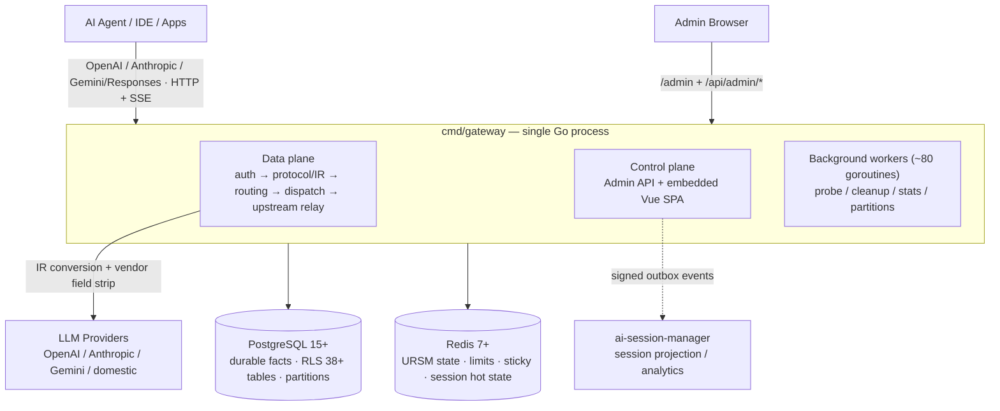

# AI Native Gateway

> AI 原生 LLM 閘道：不只是代理——更是面向企業 AI 流量的**管理平面與工作階段治理平台**。

[](LICENSE)
[](https://golang.org)
[](CHANGELOG.md)

[English](README.md) | [简体中文](README.zh-CN.md) | **繁體中文** | [日本語](README.ja.md) | [Deutsch](README.de.md) | [Français](README.fr.md) | [Español](README.es.md) | [العربية](README.ar.md)

[快速開始](#-快速開始) • [四大核心價值](#-四大核心價值) • [架構一覽](#-架構一覽) • [工作階段治理](#-工作階段治理) • [產品功能預覽](#-產品功能預覽) • [差異化定位與競品對比](#-差異化定位與競品對比) • [路線圖](ROADMAP.md)

---

## AI Native Gateway 是什麼？

AI Native Gateway 是一個為 AI Agent 與「vibe coding」時代打造的**開源、自託管、AI 原生 LLM 閘道**。它遠不止轉發請求：它對流經企業的每一枚 Token 進行**分類、路由、治理、稽核與計費**。

- **協定歸一**：相容 OpenAI、Anthropic、Gemini 與 Responses API——一個端點存取所有模型
- **智慧雙層路由**：L1 選模型（任務分類 → 6 維評分），L2 選憑證（Tier 回退 → 計費輪次 → P2C 評分 → 執行 / 熔斷）
- **工作階段治理**：黏性工作階段、全文工作階段回放、自動提示詞壓縮與 4 檔資料生命週期——對話本身（而非僅單次請求）就是一等管理物件
- **多租戶**：以 PostgreSQL RLS 在 38+ 張表上強制租戶隔離，並提供按租戶配額、計量與 MaaS 計費
- **憑證管理**：多憑證池，具備指紋偽裝、自適應探測與自動熔斷
- **可觀測性**：即時請求流、路由分析（熱力圖 + Sankey）、成本追蹤、OTel + Prometheus
- **隱私**：100% 私有化部署——所有資料都留在你的基礎設施內

以 **Go + PostgreSQL + Redis** 建構，目前已在 k3s 上生產運行（雙實例共用同一 PostgreSQL schema）。專為需要完全掌控自身 AI 基礎設施的組織而設計。

---

## ✨ 四大核心價值

| 價值 | 客戶獲得 |
|-------|--------------------|
| **安全** | AI Guardrails · DLP · Inline Interception · Vibe Coding 治理 · SIEM/SOAR 對接 |
| **穩定** | 多雲編排 · 具自動恢復能力的熔斷 · 99.9% SLA 目標 |
| **低成本** | 語義快取 · 自動路由（成本/品質策略）· Token 計量 · 提示詞壓縮 |
| **企業整合** | MCP 工具閘道（路線圖）· API Hub 資產中心（路線圖）· 全鏈路稽核 · SIEM/SOAR |

## 🏗️ 三大產品支柱

| Control（管控） | Govern（治理） | Secure（安全） |
|---------|--------|--------|
| ✅ Token 用量計量 | 🔨 API Hub 資產中心 | 🔨 Model Armor |
| ✅ 智慧路由 + 黏性工作階段 | 🔨 自動發現 | 🔨 敏感資料防護（SDP） |
| ✅ 語義快取 + Funnel | 🔨 SpecBoost 智慧富集 | 🔨 對抗性提示詞防護 |
| ✅ 全鏈路稽核 + OTel | ✅ 多租戶 RLS（L1 = 0） | ✅ SIEM/SOAR 對接 |
| ✅ MaaS 計費 | | |

✅ = 已上線 &nbsp;·&nbsp; 🔨 = 路線圖中

## 🎯 能力矩陣

| 層 | 你能獲得什麼 |
|-------|--------------|
| **協定** | OpenAI / Anthropic / Gemini / Responses 相容 + 帶完整性校驗的 SSE 串流中繼 |
| **路由** | 雙層路由（模型 → 憑證）+ 黏性工作階段 + 基於成本/品質策略的自動路由 |
| **多租戶** | 身分隧道（virtual IP/MAC/ClientID）+ 憑證池 + 38+ 表 RLS |
| **流量治理** | Token 限流（TPM/RPM）+ 語義快取 + 提示詞壓縮 + 滑動視窗演算法 |
| **稽核** | 全鏈路稽核 + DLQ + 磁碟回退 + OTel + Prometheus |
| **憑證** | 多憑證 + 指紋池 + 自適應探測 + 手動停用 |
| **部署** | 雙實例（Docker + k3s NodePort）共用同一 PostgreSQL schema |

詳見下方 [架構一覽](#-架構一覽) 小節，或完整的 [架構圖集](docs/architecture-diagrams.md)。

---

## 🏛️ 架構一覽

單一 Go 行程（`cmd/gateway`）**在同一個 mux 上承載資料面、控制面與管理介面**（h2c：單一埠同時支援 HTTP/1.1 與 HTTP/2）。PostgreSQL 保存持久事實（RLS 隔離、按月分區）；Redis 保存熱狀態（路由、限流、黏性工作階段）。同一套 `storage` 介面同時支撐 **full 模式**（PG + Redis）與 **lite 模式**（SQLite + 本機檔案——零外部依賴、單一二進位）。



**請求管線（v1 生產路徑，2026-08 起的唯一執行路由）**：

```text
HTTP/SSE → middleware chain → protocol/IR normalization → session assignment
  → (model=auto: L1 model selection) → resource prep (semantic cache / prompt compression)
  → Executor (attempt budget) → dispatch queues (global → model → credential)
  → Router (tier / health / sticky filters + URSM v2 state + P2C scoring)
  → resource gates (fingerprint slot / concurrency / RPM)
  → upstream relay (0 internal retries; pre-first-byte failover only adds attempts)
  → SSE write-back with integrity checks
  → request_logs + usage ledger (canonical facts)
  → onPersisted hooks: session V2 shadow write · session_dim upsert · ASM outbox
```

**倉庫目錄結構**

| 路徑 | 職責 |
|------|------|
| `cmd/gateway/` | 組合根——單一二進位生產入口（資料面 + 控制面） |
| `domains/` | 67 個 DDD 領域——`streaming`、`dispatch`、`credential`、`session`(+v2)、`ursm`、hooks、security… |
| `admin/` + `web/` | 管理 REST API + Vue 3 + TypeScript SPA（Element Plus、ECharts） |
| `bg/` | 背景工作者——探測、生命週期清理、統計聚合、分區維護 |
| `storage/` | 雙模式儲存工廠（`full`：PG+Redis / `lite`：SQLite+檔案+行程內 KV） |
| `internal/` | 橫切基礎設施——IR、vendor 欄位剝離、工作階段鏡像、outbox、遙測… |
| `sql/migrations/` + `db/migrations/` | 冪等遷移（啟動系列目前 817） |
| `installer/` | 獨立跨平台安裝器 / 升級器模組 |
| `scripts/`、`deploy/` | 建置、部署、鏡像與驗證工具 |

規模快照（2026-10-06 程式碼掃描）：`cmd/` 下共 **~4,967 個 Go 檔案 · 2,728 個測試檔案 · 1,016 個遷移 SQL · 67 個領域套件 · 44 個二進位**。

**深入閱讀**

- [架構圖集](docs/architecture-diagrams.md)——完整 Mermaid 集：上下文、容器、請求鏈、雙層路由、儲存、部署、背景工作者
- [證據分級架構](docs/03-design/01-architecture/architecture/ARCHITECTURE.md)——內部權威文件（CURRENT / SHADOW / PARALLEL 分級，快照 2026-10-01）
- [工作階段生命週期](docs/session-lifecycle.md)——工作階段從首個請求到封存，全程圖解
- [執行期請求流](docs/03-design/01-architecture/architecture/runtime-request-flow.md) · [路由與狀態](docs/03-design/01-architecture/architecture/routing-and-state.md)

---

## 🧠 工作階段治理

大多數閘道把每個請求當作孤立事件。AI Native Gateway 把**工作階段**當作治理單元——因為在編碼 Agent 與長時運行助理的時代，一次「請求」很少是事情的全部。

- **黏性工作階段綁定**：工作階段釘在憑證上，模型切換與故障轉移後對話上下文仍在——任務中途不會靜默丟失上下文
- **工作階段級稽核與回放**：完整 system prompt 與回應按工作階段留存並可回放（生產環境 13,000+ 工作階段），涵蓋任務類型、客戶端模型、出口模型、供應商、Token、延遲與結束原因——可依金鑰 / 租戶 / 時間範圍切分檢視，便於排障與合規
- **自動提示詞壓縮**：當請求逼近供應商真實上下文視窗（約 80% 觸發）時，會在分發前執行訊息級壓縮——長 Agent 工作階段得以塞進更小的視窗而不是失敗。每次壓縮事件（策略、閾值、壓縮前後大小）都記錄在請求上
- **工作階段中繼資料智慧**：自動工作類型標記（10 類工作類型）、專案歸屬與標題擷取，把原始流量變成可檢索的知識
- **身分隧道**：Agent 流量透過 virtual IP/MAC/ClientID 歸屬，即使多個 Agent 共用一個出口，多租戶隔離依然成立
- **4 檔資料生命週期**：熱（0–7 天）/ 溫（7–30 天）/ 冷（30–90 天）/ 過期（>90 天），並提供封存預覽——執行前先明確告訴你「將會搬動哪些資料」

工作階段實際如何流經閘道——三層模型（Redis 熱狀態 / `request_logs` 規範事實 / Sessions V2 影子表）、ID 分配、逐輪序號、黏性綁定、壓縮與封存——在 [工作階段生命週期](docs/session-lifecycle.md) 中有完整圖解。

---

## 🎛️ 產品功能預覽

以下所有模組均已上線並運行於 k3s 生產部署。截圖取自真實本機部署（1728×1050，全量資料載入後）。

### 儀表板 — 即時請求流


*即時請求流按處理佇列分組，附分發鏈統計（in-flight、p50/p95 延遲、節點可用性）與各模型節點健康度*

### 統計看板 — 用量與成本一屏盡覽


*儀表板的看板分頁：核心指標（請求數 / Token / 成本 / 積分消耗）、RPM · TPM · 延遲、金鑰/模型/供應商數量，以及供應商成本與採購區塊——內嵌在看板中的費用結算視圖（2026-10 擷取，v2.5.8）*

### 費用結算 — 供應商成本採購


*供應商成本卡片（視窗成本、積分消耗、餘額或套餐）與按供應商用量表——請求數、Token、成本（USD）、積分、成功率——統計看板內的結算級成本核算，可匯出 Excel*

### 路由全景 — 雙層路由全面可觀測


*L1 模型選擇（任務分類 → 6 維評分 → Profile 鎖定）+ L2 憑證選擇（模型解析 → Tier 回退 → 計費輪次 → P2C 評分 → 執行 / 熔斷）。任務×模型熱力圖回答「什麼任務該用什麼模型」；Sankey 流向圖展示 14,000+ 即時請求的最終去向（任務 → 模型 → 供應商）*

### 憑證監控 — 多來源 × 多憑證健康度


*即時二維可用性矩陣（生產環境 19 憑證 × 18 模型）一眼看出哪個憑證拖垮了哪個模型。按憑證的 P95 延遲、1 小時滑動視窗成功率與並發槽位用量。指紋池（50+ User-Agent、35 種 Accept-Language、11 套 uTLS 設定檔）+ 自適應探測自動規避上游風控——失敗即觸發熔斷，無需人工介入*

### 工作類型設定 — 任務自動分類


*任務自動分類（10 類工作類型）附 24 小時分佈、熱門模型與路由決策統計——可在管理端按工作類型設定*

### 免費資源池


*免費模型資源池：自帶金鑰、供應商模板（Groq、Google AI Studio、OpenRouter、SiliconFlow、智譜）與按模型路由優先級*

### 請求工作階段詳情 — 全鏈路取證


*完整請求檢視：Q&A 回放、分發瀑布、路由與重試軌跡、trace、壓縮/脫敏紀錄（注意已脫敏的 API 金鑰 `sk-****`）、Token 與快取統計*

---

## 🚀 快速開始

### 方式 A：Docker Compose（建議，10 分鐘內）

```bash
# Clone
git clone https://codeup.aliyun.com/kaixuan/official-deploy/llm-gateway-go.git ai-native-gateway
cd ai-native-gateway
# (GitHub mirror: git clone https://github.com/halfking/ai-native-gateway-core.git)

# Generate secure keys
cp .env.quickstart.example .env
# Edit .env with secure random values (see file for generation commands)

# Start the stack (PostgreSQL + Redis + Gateway)
docker compose -f docker-compose.quickstart.yml up -d

# Verify health
curl http://localhost:8781/healthz
# {"status":"ok"}

# Open the embedded admin UI
open http://localhost:8781/admin
```

### 方式 B：原始碼建置

```bash
go build -o gateway ./cmd/gateway
LLM_GATEWAY_CONFIG_FILE=config.example.yaml ./gateway
curl http://localhost:8781/healthz   # → 200 OK
```

詳細步驟見 [入門指南](docs/getting-started.md)。

---

## 部署模式

AI Native Gateway 同時支援**完整生產堆疊**與**最小化單機本地部署**：

| 模式 | 說明 | 狀態 |
|------|-------------|--------|
| **Docker Compose** | 快速啟動，內含 PostgreSQL/Redis | ✅ 評估建議 |
| **二進位 + systemd** | Linux 主機上的生產部署 | ✅ 提供安裝器支援 |
| **Kubernetes** | Deployment + ConfigMap + Service 清單 | ⚠️ 測試級（內部生產跑在 k3s） |

**生產堆疊**：Gateway + PostgreSQL 14+（持久狀態、RLS）+ Redis 7+（熱狀態、限流）+ 內嵌管理介面，可選 Prometheus/Grafana 監控。

快速啟動堆疊與生產使用**同一二進位、同一 schema**——遷移到生產只需指向託管 PostgreSQL/Redis 並加上 TLS，無需改變設定語義。內部生產部署以**雙實例（Docker 主機 + k3s NodePort）共用同一 PostgreSQL schema** 運行。

**生產要求**：外部 PostgreSQL 14+ 與 Redis 7+、TLS 終結（反向代理）、機密管理、備份與監控。

詳見 [生產部署](docs/06-deployment/)。

### Installer 一鍵安裝器（`installer/`）

`installer/` 子樹提供**單一跨平台 Go 二進位**（`llm-gw-installer`），將完整部署流程封裝為 13 步互動式嚮導。開箱支援 Windows / Linux / macOS / 國產 OS / 國產 CPU。

**子命令**

```bash
llm-gw-installer doctor      # detect OS / docker / network / ports
llm-gw-installer install     # one-click install + deploy
llm-gw-installer uninstall   # uninstall (--purge removes data)
```

**跨平台編譯**

```bash
GOOS=linux  GOARCH=amd64   go build -o dist/llm-gw-installer-linux-amd64   ./installer/cmd/llm-gw-installer/
GOOS=linux  GOARCH=arm64   go build -o dist/llm-gw-installer-linux-arm64   ./installer/cmd/llm-gw-installer/
GOOS=linux  GOARCH=loong64 go build -o dist/llm-gw-installer-linux-loong64 ./installer/cmd/llm-gw-installer/
GOOS=darwin GOARCH=amd64   go build -o dist/llm-gw-installer-darwin-amd64  ./installer/cmd/llm-gw-installer/
GOOS=darwin GOARCH=arm64   go build -o dist/llm-gw-installer-darwin-arm64  ./installer/cmd/llm-gw-installer/
GOOS=windows GOARCH=amd64  go build -o dist/llm-gw-installer-windows-amd64.exe ./installer/cmd/llm-gw-installer/
GOOS=windows GOARCH=arm64  go build -o dist/llm-gw-installer-windows-arm64.exe ./installer/cmd/llm-gw-installer/
```

#### 儲存模式（full vs. lite）

安裝器內建**兩種儲存模式**，安裝時二選一：

| 模式 | 儲存後端 | 適用場景 | 安裝時拉取的映像 | 是否初始化 schema |
|------|------------------|----------|---------------------------|---------------------|
| **`full`**（預設） | PostgreSQL (kx-citus) + Redis | 生產 / 多副本 / 高併發 | `kx-llm-gateway-go` + `kx-citus` + `kx-redis` | 是（等待 PG ready + `InitSchema`） |
| **`lite`** | SQLite + 本機 | 單機 / 開發 / CI / 展示 | 僅 `kx-llm-gateway-go` | 否（SQLite 自動建表） |

**選擇優先順序**

1. CLI flag：`--mode lite` 或 `--mode full`（最高優先）
2. 設定檔（`--config /path/to/install.env`）：
   ```
   STORAGE_MODE=lite
   LLM_GATEWAY_MASTER_URL=https://llmgateway.internal.example.com
   INSTALL_SKIP_ACTIVATION=0
   ```
3. 互動式嚮導：提示 `[1] full  [2] lite`，預設 `1`

非 TTY（CI / `--skip-prompt`）且未提供 `--config` 時，預設為 `full`。

**`lite` 模式的 install 行為**

| 步驟 | `full` | `lite` |
|------|--------|--------|
| 1. 環境偵測 | 同 | 同 |
| 2. 設定（wizard / config） | 同 | 同（現包含儲存模式 + master URL） |
| 3. 拉取映像 | `kx-citus` + `kx-redis` + `kx-llm-gateway-go` | **僅 `kx-llm-gateway-go`** |
| 4. 寫 `.env` | 全部鍵 | 同樣欄位，僅 `LLM_GATEWAY_STORAGE_MODE=lite` |
| 5. 目錄結構 | 完整 | 完整（db/data 與 redis/data 目錄仍會建立但不使用） |
| 6. `compose.yml` | 3 個服務 | **剝離 `kx-citus` + `kx-redis`**；gateway 移除 `depends_on` 與 PG/Redis env |
| 7. 啟動容器 | 3 個容器 | **僅 `kx-llm-gateway-go`** |
| 8. 資料庫初始化 | 等待 PG ready + `InitSchema`（450+ 個啟動遷移） | **跳過**（SQLite 自動建表） |
| 9. 健康檢查 | 5 項全檢 | 僅容器 + `/healthz`；PG/Redis/Schema 在報告中強制顯示 ✅ |

**新增 install flags**

```
--mode string         # full | lite (empty → wizard / default full)
--master-url string   # control-plane URL (default https://llmgateway.internal.example.com)
--skip-activation     # bool, skip the auto-activation call at end of install
```

**新增 `.env` 鍵**（寫入 `{installDir}/.env`）

| Key | 預設 | 說明 |
|-----|---------|---------|
| `LLM_GATEWAY_STORAGE_MODE` | `full` | 由 `cmd/gateway` 的 `storage_mode_init` 讀取；`lite` → SQLite，`full` → PG/Redis |
| `LLM_GATEWAY_MASTER_URL` | `https://llmgateway.internal.example.com` | 授權啟用 + 心跳回報目標 |
| `INSTALL_SKIP_ACTIVATION` | `0` | 跳過 install 結尾的自動註冊啟用呼叫（見 `activation.RunAutoActivate`） |

#### 映像源 fallback 鏈

所有容器映像皆透過 4 層 fallback 鏈拉取，無論在線、處於企業代理之後或完全離線（air-gapped），安裝都能成功：

```
[1] Offline bundle images/*.tar.gz  (highest priority)
    ↓ on miss
[2] registry.internal.example.com              (internal registry)
    ↓ on miss
[3] registry.cn-hangzhou.aliyuncs.com (Aliyun mirror)
    ↓ on miss
[4] registry-1.docker.io           (official Docker Hub)
    ↓ on miss
❌ clear, actionable error
```

**環境變數覆寫**

| 變數 | 預設 | 用途 |
|----------|---------|---------|
| `KX_REGISTRY` | `registry.internal.example.com` | 自訂內部 registry |
| `KX_REGISTRY_USERNAME` / `_PASSWORD` | 空 | registry 憑證 |
| `KX_REGISTRY_INSECURE` | `false` | 允許純 HTTP |
| `APP_IMAGE_TAG` | 從 MANIFEST 讀取 | 覆寫應用映像 tag |
| `GOPROXY` | `https://goproxy.cn,direct` | Go module 代理 |

#### 已知限制

- **HarmonyOS NEXT**：不支援（無 Linux 容器支援）
- **macOS**：使用者需預先安裝 OrbStack 或 Docker Desktop
- **Windows**：使用者需預先安裝 Docker Desktop + WSL2

Installer 完整設計見 [installer/README.md](installer/README.md)。

---

## 📐 差異化定位與競品對比

### vs. 通用 AI Gateway

| 維度 | 通用 AI Gateway | AI Native Gateway |
|-----------|--------------------|-------------------|
| **部署** | SaaS / 本地部署（On-Prem） | 100% 私有（k3s 生產驗證） |
| **資料駐留** | 資料離開企業邊界 | 所有資料留在你的基礎設施內 |
| **計費** | 按用量計費（USD） | 套餐 + 積分 + 加油包——為中國 SMB 而設，支援支付寶 |
| **上游模型** | 少數主流廠商 | 廣泛模型覆蓋 + 中國國產模型 + 本地模型 |
| **憑證指紋池** | 基礎 | 50+ User-Agent · 35 Accept-Language · 11 uTLS 設定檔 |
| **工作階段治理** | 請求級日誌 | 黏性工作階段 + 全文回放 + 壓縮 + 4 檔生命週期 |
| **MCP 工具閘道** | 部分 | 2026 年 Q3 全量交付 |
| **中文友好** | 有限 | 完整中文介面 + 國產模型 + 支付寶 |
| **多租戶稽核** | 標準 | 38+ 表 RLS · 租戶稽核 L1 = 0 |

### vs. 具名替代方案

| 特性 | AI Native Gateway | LiteLLM | OmniRoute | Portkey | Kong AI |
|---------|-------------------|---------|-----------|---------|---------|
| **部署** | 私有化（自託管） | SaaS + OSS | 自託管（Node） | SaaS | OSS |
| **多租戶** | 原生（PG RLS） | 基礎 | 單機導向 | 完整（SaaS） | 透過外掛 |
| **管理介面** | 內嵌 Vue SPA | CLI | Web UI | SaaS UI | Kong Manager |
| **資料駐留** | 100% 私有 | 視情況 | 100% 私有 | 雲端（SaaS） | 自託管 |
| **授權** | Apache 2.0 | MIT | 見上游 | 商業專有 | Apache 2.0 |

**如果你需要以下能力，請選擇 AI Native Gateway**：

- 完整掌控資料駐留（不依賴外部 SaaS）
- 資料庫級隔離的深度多租戶
- 工作階段級治理與取證，而不只是請求日誌
- 單一 Go 二進位內嵌管理介面
- 貼合中國 SMB 的 MaaS 計費（套餐 + 積分 + 加油包）

**如果你需要以下能力，請選擇替代方案**：

- 最大供應商覆蓋（100+ 供應商）→ LiteLLM
- Node.js 自託管閘道 + 內嵌資料庫 → OmniRoute
- 零維運託管服務 → Portkey
- 通用 API 閘道 + LLM → Kong

更多內容見 [詳細對比](docs/comparison.md)。

---

## 路線圖

**目前（v2.x）**：

- ✅ OpenAI/Anthropic/Gemini/Responses 協定支援
- ✅ PostgreSQL RLS 多租戶隔離
- ✅ 智慧路由 + 黏性工作階段
- ✅ 工作階段治理：壓縮、回放、生命週期
- ✅ Vue.js 管理台
- ✅ Docker Compose 快速開始

**近期（3–6 個月）**：

- 🚧 強化成本/品質感知路由
- 🚧 生產級 Kubernetes Helm 圖表
- 🚧 Grafana 儀表板模板
- 🚧 進階可觀測性（工作階段取證、決策回放）

**探索中（6–12+ 個月）**：

- 🔬 MCP（Model Context Protocol）閘道整合——2026 年 Q3 全量交付
- 🔬 Agent-to-Agent（A2A）協定支援
- 🔬 Kubernetes Operator（基於 CRD 的部署）

完整內容見 [ROADMAP.md](ROADMAP.md)。

---

## 📚 文件索引

| 類別 | 文件 |
|----------|----------|
| 快速開始 | [docs/getting-started.md](docs/getting-started.md)——10 分鐘完成部署 |
| 架構圖 | [docs/architecture-diagrams.md](docs/architecture-diagrams.md)——完整 Mermaid 集（上下文 / 容器 / 請求鏈 / 路由 / 儲存 / 部署） |
| 工作階段生命週期 | [docs/session-lifecycle.md](docs/session-lifecycle.md)——工作階段處理生命週期，完整圖解 |
| 架構（證據分級） | [docs/03-design/01-architecture/architecture/ARCHITECTURE.md](docs/03-design/01-architecture/architecture/ARCHITECTURE.md)——內部權威文件（CURRENT/SHADOW/PARALLEL 分級） |
| 架構（總覽） | [docs/architecture.md](docs/architecture.md)——系統設計與元件 |
| 需求 | [docs/01-requirements/SYSTEM_REQUIREMENTS.md](docs/01-requirements/SYSTEM_REQUIREMENTS.md)——FR×19 領域 / NFR×13 |
| 功能目錄 | [docs/01-requirements/functional/FEATURES_CATALOG.md](docs/01-requirements/functional/FEATURES_CATALOG.md)——功能 → 程式碼 → API → 管理頁面對應 |
| API | [docs/03-design/01-architecture/architecture/API.md](docs/03-design/01-architecture/architecture/API.md)——資料面與管理 API 規格 |
| 環境 | [docs/environment.md](docs/environment.md)——部署環境與變數 |
| 快速參考 | [docs/QUICK_REFERENCE.md](docs/QUICK_REFERENCE.md)——常用命令與排障 |
| 對比 | [docs/comparison.md](docs/comparison.md)——vs LiteLLM、OmniRoute、Portkey、Kong |
| 專案總覽 | [docs/PROJECT_OVERVIEW.md](docs/PROJECT_OVERVIEW.md)——功能與模組地圖 |
| 文件索引 | [docs/README.md](docs/README.md) · [docs/archive/2026-09/INDEX.md](docs/archive/2026-09/INDEX.md)——完整文件導航 |
| 雙倉庫策略 | [docs/06-deployment/04-runbooks/operations/REPO-MIRROR-POLICY.md](docs/06-deployment/04-runbooks/operations/REPO-MIRROR-POLICY.md)——codeup ⇄ GitHub 工作流 |
| 安全 | [SECURITY.md](SECURITY.md)——漏洞回報 + 掃描器使用 |
| 法務 | [docs/02-resources/compliance/legal/disguise-compliance.md](docs/02-resources/compliance/legal/disguise-compliance.md)——請求偽裝合規白名單 |
| A2A 調研 | [docs/03-design/01-architecture/architecture/a2a-spec-2027.md](docs/03-design/01-architecture/architecture/a2a-spec-2027.md)——Agent 間協定調研 |
| Armor / SDP | [docs/03-design/01-architecture/architecture/armor-sdp-feasibility.md](docs/03-design/01-architecture/architecture/armor-sdp-feasibility.md)——提示詞注入 + SDP 可行性 |

---

## 🔀 雙倉庫策略

| Remote | URL | 用途 |
|--------|-----|---------|
| `codeup`（origin） | `https://codeup.aliyun.com/kaixuan/official-deploy/llm-gateway-go.git` | 預設（日常開發） |
| `github` | `git@github.com:halfking/ai-native-gateway-core.git` | 公開鏡像（階段發布） |

```bash
git push              # → codeup (no extra checks)
git push github       # → github (secret scan, blocked on BLOCK-level hit)
```

敏感資訊防護：推送到 GitHub 時，`.githooks/pre-push` 會自動執行 `scripts/scan-secrets.sh`（50 條規則；預設一般模式——BLOCK 級發現阻斷、WARN 級發現警告；`STRICT_SCANNER=1` 啟用嚴格模式）。詳見 [鏡像策略](docs/06-deployment/04-runbooks/operations/REPO-MIRROR-POLICY.md)。

---

## ✅ CI 與門禁（2026-09-14 起）

- **正式門禁 = 本地 `./verify.sh`**：提交/部署前必跑（`go test ./...` 全量、遷移 checksum 對賬、隱私合規、vet、build、前端建置）。merge 到 main 與發版以它為準。
- **codeup Flow 輕量門**：遠端只有 codeup，`.github/workflows/` 在 codeup 不執行；`.workflow/main-verify.yml` 提供流水線即程式碼設定（build + `go vet ./autoroute/...` + 60 例 auto 匹配離線套件），需在 codeup 倉庫「流水線」頁匯入一次後隨 push/PR 自動觸發。
- auto 匹配離線回歸可單獨復跑：`go test ./autoroute/ -run 'TestAutoMatchingSuiteHeuristic|TestPromptClassificationMatrix'`（純離線，無網路）。

---

## 🤝 貢獻

歡迎參與貢獻！開發環境設定、程式碼風格與 pull request 流程見 [CONTRIBUTING.md](CONTRIBUTING.md)。

多租戶相關改動必須通過全部三個 linter：`lint-tenant-scope-llmgw` / `lint-pg-rls` / `lint-otel-tenant`。

## 🔐 安全

- 漏洞回報：見 [SECURITY.md](SECURITY.md)
- 公開鏡像機密防護：見 [雙倉庫策略](docs/06-deployment/04-runbooks/operations/REPO-MIRROR-POLICY.md)
- 偽裝合規白名單：見 [docs/02-resources/compliance/legal/disguise-compliance.md](docs/02-resources/compliance/legal/disguise-compliance.md)

## 授權

本軟體以 [Apache License 2.0](LICENSE) 授權。再散布本軟體時應保留的署名事項見 [NOTICE](NOTICE)。

**商業使用**：Apache 2.0 允許商業使用。以原始碼或二進位形式再散布時，必須保留版權聲明與 NOTICE 檔案。僅內部商業使用而不再散布時，除遵守授權條款外，無需額外署名。

## 謝誌

AI Native Gateway 整合了以下開源專案的元件：

- Go 標準庫（BSD-3-Clause）
- PostgreSQL 驅動（MIT）
- Redis 客戶端（BSD-2-Clause）
- Vue.js 與 Element Plus（MIT）
- 完整清單見 [NOTICE](NOTICE)

---

由 AI Native Gateway 社群用 ❤️ 建構
