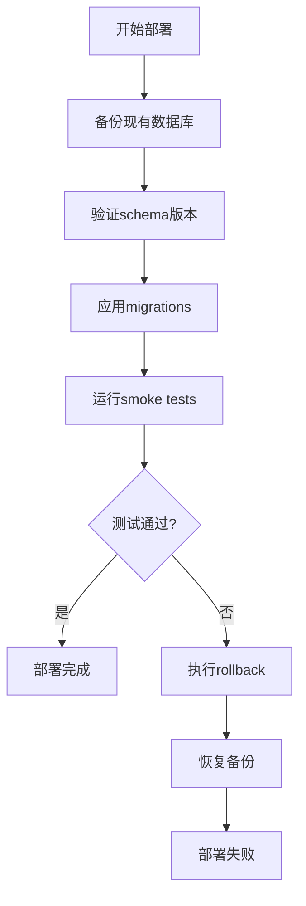

# deploy/sql/ 目录结构规范

> **设计原则**：deploy/sql/ 用于存放 **部署相关的 SQL 资产**，与 sql/ 目录互补但不重复。

## 设计目标

1. **按类别分类**：migrations、schemas、scripts、cron、tests、docs
2. **按对象分脚本**：每个独立操作/对象一个文件
3. **避免重复**：与 sql/ 目录明确分工
4. **易于部署**：结构清晰，便于自动化脚本执行

## 目录结构

```
deploy/sql/
├── README.md                          # 主文档（说明用途、执行顺序）
├── DEPLOYMENT_PLAN.md                 # 数据库部署方案
│
├── migrations/                        # 部署时的数据迁移脚本
│   ├── README.md                      # 迁移说明文档
│   ├── 001_baseline_schema.sql        # 基线schema（符号链接到 sql/schema/）
│   ├── 002_domain_migrations.sql      # 领域迁移汇总
│   └── 999_rollback_templates/        # 回滚模板
│
├── schemas/                           # Schema快照和基线
│   ├── baseline/                      # 基线schema（installer用）
│   │   ├── 00-prereqs.sql             # 从 installer/embeddata 迁移
│   │   ├── 01-schema.sql              # 从 installer/embeddata 迁移
│   │   └── 02-seed.sql                # 从 installer/embeddata 迁移
│   └── snapshots/                     # 各版本快照
│       ├── r920-20260701.sql          # 版本快照
│       └── r923-20260705.sql
│
├── scripts/                           # 部署运维脚本
│   ├── init-database.sh               # 数据库初始化脚本
│   ├── apply-migrations.sh            # 应用迁移
│   ├── verify-schema.sh               # Schema验证
│   ├── backup-before-deploy.sh        # 部署前备份
│   └── rollback.sh                    # 回滚脚本
│
├── cron/                              # 定时任务SQL
│   ├── README.md                      # 定时任务说明
│   ├── pricing_refresh_log.sql        # 从 deploy/k8s/cron/ 迁移
│   └── scheduled_maintenance.sql
│
├── tests/                             # 部署验证测试SQL
│   ├── README.md                      # 测试说明
│   ├── smoke_tests.sql                # 冒烟测试
│   ├── adaptive_probe_test.sql        # 从 tests/ 迁移
│   └── integration/                   # 集成测试
│       └── provider_model_join.sql
│
├── docs/                              # 文档化的SQL示例
│   ├── README.md                      # 文档说明
│   ├── features/                      # 功能相关SQL
│   │   ├── auto_route_mode.sql        # 从 docs/ 迁移
│   │   ├── peak_stats.sql             # 从 docs/ 迁移
│   │   └── explicit_model_stats.sql
│   ├── pricing/                       # 定价相关
│   │   └── xiaomi_tokenplan_tier2.sql # 从 docs/pricing/ 迁移
│   └── experiments/                   # 实验性SQL
│       └── archived/                  # 已废弃的实验
│
└── templates/                         # SQL模板
    ├── migration_template.sql         # 迁移模板
    ├── rollback_template.sql          # 回滚模板
    └── cronjob_template.sql           # 定时任务模板
```

## 与 sql/ 目录的分工

| 目录 | 用途 | 内容 |
|------|------|------|
| `sql/` | **开发时的SSOT** | objects/, migrations/startup, migrations/domain, schema/ |
| `deploy/sql/` | **部署时的资产** | schemas/baseline (installer用), cron/, tests/, docs/, 部署脚本 |

**关键原则**：
- `sql/` 是源代码级别的SSOT，由开发人员维护
- `deploy/sql/` 是部署级别的资产，面向运维和CI/CD
- `deploy/sql/schemas/baseline/` 是 installer 专用的schema快照
- 避免重复：不复制 `sql/migrations/`，而是通过脚本引用

## 迁移映射

| 源路径 | 目标路径 | 类型 |
|--------|----------|------|
| `installer/cmd/llm-gw-installer/embeddata/*.sql` | `deploy/sql/schemas/baseline/` | 移动 |
| `deploy/k8s/cron/*.sql` | `deploy/sql/cron/` | 移动 |
| `tests/*.sql` | `deploy/sql/tests/` | 移动 |
| `docs/*.sql` | `deploy/sql/docs/features/` | 移动 |
| `docs/pricing/*.sql` | `deploy/sql/docs/pricing/` | 移动 |

## 部署流程



## 文件命名规范

1. **迁移文件**：`<序号>_<描述>.sql`（如 `001_baseline_schema.sql`）
2. **功能SQL**：`<功能名>.sql`（如 `auto_route_mode.sql`）
3. **定时任务**：`<任务名>_<频率>.sql`（如 `pricing_refresh_daily.sql`）
4. **测试文件**：`<测试对象>_test.sql`（如 `adaptive_probe_test.sql`）
5. **回滚文件**：`<对应迁移名>.down.sql`（如 `auto_route_mode.down.sql`）

## 执行顺序

1. **初始化**：`deploy/sql/schemas/baseline/00-prereqs.sql` → `01-schema.sql` → `02-seed.sql`
2. **迁移**：按 `deploy/sql/migrations/` 目录下的序号顺序执行
3. **验证**：运行 `deploy/sql/tests/smoke_tests.sql`
4. **定时任务**：通过K8s CronJob调度 `deploy/sql/cron/` 下的SQL

## 维护约定

1. **所有SQL必须幂等**：使用 `IF NOT EXISTS` / `ON CONFLICT DO NOTHING`
2. **必须提供回滚**：每个迁移都应有对应的 `.down.sql` 文件
3. **注释完整**：每个SQL文件开头必须包含：
   - 用途说明
   - 依赖关系
   - 执行环境（dev/test/prod）
   - 作者和日期
4. **版本控制**：所有SQL文件纳入Git版本控制
