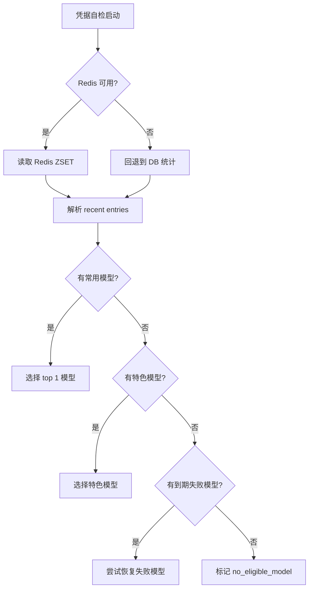
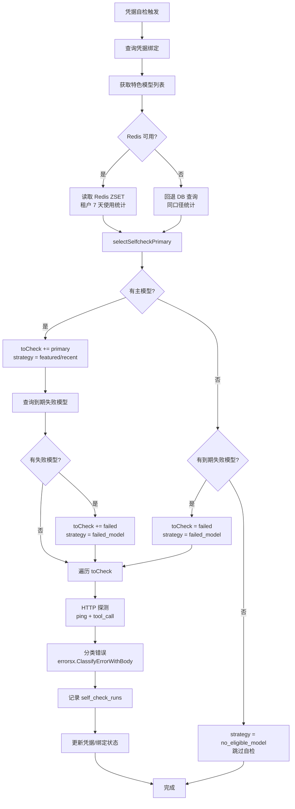

# NodeProbe 机制详解

**版本**: v2.0  
**更新日期**: 2026-08-12  
**状态**: 生产环境活跃

---

## 一、概述

NodeProbe 是 LLM Gateway 的核心健康检查机制，负责主动探测 (credential, model) 节点对的可达性和可用性。它取代了旧的三套探测系统（CredentialProbeV2、ModelProbe、ActiveProbe），提供统一的错误触发探测和指数退避策略。

### 1.1 核心职责

- **错误触发探测**: 请求失败时立即提交探测任务
- **双轮验证**: 直接探测供应商 + 通过网关探测（隔离故障层）
- **状态同步**: 探测结果同步到 DB、Redis、内存缓存
- **自愈机制**: 探测成功后自动恢复节点到路由池

### 1.2 设计目标

- ✅ **快速恢复**: 首次探测 5s 后触发，最快 35s 完成双轮验证
- ✅ **避免雪崩**: 指数退避 (5s → 30s → 60s → 5m → 1h → 2h → 24h)
- ✅ **跨实例协调**: Redis SELECT FOR UPDATE SKIP LOCKED 防止重复探测
- ✅ **精确诊断**: 记录完整的请求/响应上下文到 `node_probe_runs` 表

---

## 二、架构设计

### 2.1 组件关系

```
┌────────────────────────────────────────────────────────────┐
│                    请求执行层                                 │
│  domains/streaming/executors/executor.go                    │
│  - ExecuteRequest() → 记录成功/失败                          │
└────────────┬───────────────────────────────────────────────┘
             │
             ▼ (失败，连续 ≥ 2 次)
┌────────────────────────────────────────────────────────────┐
│                  状态管理器                                   │
│  domains/credentialstate/manager.go                         │
│  - UpdateOnFailure() → 判断是否提交探测                      │
└────────────┬───────────────────────────────────────────────┘
             │
             ▼ Submit(credID, model, tenantID, parentReqID)
┌────────────────────────────────────────────────────────────┐
│                NodeProbeWorker                              │
│  bg/node_probe.go                                           │
│  - Submit() → 写入 node_probe_state 表                       │
│  - loop() → 定时扫描 next_retry_at <= now()                 │
│  - cycle() → pickDueAtomically() → runOne()                 │
└────────────┬───────────────────────────────────────────────┘
             │
             ▼ runOne(credID, model)
┌──────────────────────┐        ┌──────────────────────┐
│  Round 1: Direct     │        │  Round 2: Gateway    │
│  probeDirect()       │   →    │  probeGateway()      │
│  - 解密凭据          │        │  - 系统 API key      │
│  - 直接调用供应商    │        │  - 本地网关 API      │
│  - 记录诊断信息      │        │  - 验证路由插件      │
└──────────┬───────────┘        └──────────┬───────────┘
           │                               │
           └───────────┬───────────────────┘
                       ▼ (两轮均成功)
┌────────────────────────────────────────────────────────────┐
│                    状态更新                                   │
│  - credential_model_bindings.available = TRUE               │
│  - credentials.health_status = 'healthy'                    │
│  - StateObserver.UpdateFromProbe() → 内存+Redis             │
│  - InvalidateCandidateCache() → 候选缓存失效                 │
│  - node_probe_state.next_retry_at = now() + 1h             │
└────────────────────────────────────────────────────────────┘
```

### 2.2 数据模型

#### node_probe_state (主状态表)
```sql
CREATE TABLE node_probe_state (
    credential_id INT NOT NULL,
    raw_model_name TEXT NOT NULL,
    consecutive_failures INT DEFAULT 0,
    consecutive_successes INT DEFAULT 0,
    last_attempt_at TIMESTAMPTZ,
    next_retry_at TIMESTAMPTZ,           -- 下次探测时间
    next_retry_seconds INT,              -- 退避秒数
    paused BOOLEAN DEFAULT FALSE,        -- 是否暂停
    in_flight_until TIMESTAMPTZ,         -- 跨实例锁（5分钟）
    last_direct_ok BOOLEAN,              -- Direct 轮结果
    last_gateway_ok BOOLEAN,             -- Gateway 轮结果
    last_err_code TEXT,                  -- 最后错误码
    last_err_detail TEXT,                -- 最后错误详情
    PRIMARY KEY (credential_id, raw_model_name)
);
```

#### node_probe_runs (审计日志)
```sql
CREATE TABLE node_probe_runs (
    id BIGSERIAL PRIMARY KEY,
    credential_id INT NOT NULL,
    raw_model_name TEXT NOT NULL,
    trigger_kind TEXT,                   -- request_failure / tick / sync_request
    attempt INT,                         -- 尝试次数（1-7+）
    next_retry_seconds INT,              -- 下次退避秒数
    
    -- Direct 轮
    direct_ok BOOLEAN,
    direct_http_status INT,
    direct_err_code TEXT,
    direct_latency_ms INT,
    direct_err_detail TEXT,
    
    -- Gateway 轮
    gateway_ok BOOLEAN,
    gateway_http_status INT,
    gateway_err_code TEXT,
    gateway_latency_ms INT,
    gateway_err_detail TEXT,
    
    success BOOLEAN,                     -- 两轮均成功
    started_at TIMESTAMPTZ,
    completed_at TIMESTAMPTZ,
    duration_ms INT,
    
    -- 诊断字段
    api_model TEXT,
    outbound_model TEXT,
    provider_id INT,
    request_url TEXT,
    request_headers JSONB,
    request_body TEXT,
    response_body TEXT,
    timeout_at_ms INT,
    via_proxy BOOLEAN,
    trigger_request_id TEXT
);
```

---

## 三、触发条件

### 3.1 错误触发（主要路径）

**条件**: 请求失败 AND 连续失败 ≥ 2 次

**流程**:
```go
// domains/credentialstate/manager.go
func (m *Manager) UpdateOnFailure(ctx, credID, model, errorKind, tenantID, reqID) {
    state := m.getOrCreate(credID, model)
    state.ConsecutiveFails++
    
    if state.ConsecutiveFails >= m.activeProbeThreshold { // 默认 2
        if m.activeProbeSubmitter != nil {
            m.activeProbeSubmitter(credID, model, tenantID, reqID)
        }
    }
}
```

**Submit 写入**:
```sql
INSERT INTO node_probe_state (credential_id, raw_model_name, next_retry_at, next_retry_seconds)
VALUES ($1, $2, now() + interval '5 seconds', 5)
ON CONFLICT (credential_id, raw_model_name) DO UPDATE
SET next_retry_at = CASE
        WHEN node_probe_state.paused = TRUE OR node_probe_state.next_retry_at <= now()
        THEN now() + interval '5 seconds'
        ELSE node_probe_state.next_retry_at  -- 保留现有退避，避免重置
    END,
    paused = FALSE,
    consecutive_failures = CASE
        WHEN node_probe_state.paused = TRUE THEN 0
        ELSE node_probe_state.consecutive_failures
    END;
```

**关键设计**:
- ✅ 首次失败 → 5s 后探测（快速恢复）
- ✅ 已有探测任务 → 不重置退避（避免无限循环）
- ✅ 暂停状态 → 自动恢复（重新开始退避链）

### 3.2 定时扫描（备用路径）

**条件**: `next_retry_at <= now() AND paused = FALSE`

**扫描间隔**: 30s

**批量大小**: 8 个 (credential, model) 对/批次

**跨实例协调**:
```sql
BEGIN;
SELECT credential_id, raw_model_name
FROM node_probe_state
WHERE paused = FALSE
  AND next_retry_at <= now()
  AND (in_flight_until IS NULL OR in_flight_until <= now())
ORDER BY next_retry_at ASC
LIMIT 1
FOR UPDATE SKIP LOCKED;  -- 跨实例防重

UPDATE node_probe_state
SET in_flight_until = now() + interval '5 minutes'
WHERE credential_id = $1 AND raw_model_name = $2;
COMMIT;
```

### 3.3 同步探测（no_candidates 场景）

**条件**: 路由决策返回 0 个候选

**流程**:
```go
// domains/streaming/executors/executor.go
if len(candidates) == 0 {
    recovered := nodeProbeWorker.ProbeSync(ctx, noCandidates, tenantID, reqID)
    if recovered {
        // 重新计划候选（状态已更新）
        candidates = router.PlanCandidates(...)
    }
}
```

**特点**:
- ✅ 5s 超时（用户请求上下文）
- ✅ 并发扇出 8 个探测
- ✅ 复用 in-flight 探测（等待已有任务完成）
- ✅ 第一个恢复立即返回（快速失败）

---

## 四、凭据自检模型选择策略

### 4.1 概述

凭据自检（Credential Selfcheck）是一种主动健康检查机制，用于验证凭据在特定模型上的可用性。与 NodeProbe 的双轮探测不同，凭据自检专注于选择**最有可能成功的模型**进行探测，以最大化探测效率和成功率。

### 4.2 数据源：Redis 租户隔离排行榜

#### 4.2.1 设计原理

凭据自检使用 **Redis ZSET** 维护每个租户最近 7 天使用的模型排行榜，作为模型选择的主要数据源。

**Redis 键格式**:
```
llmgw:routing:recently_used_models:<tenant_id>
```

**数据结构**:
- **成员（member）**: 标准化模型名（如 `gpt-4`, `claude-3-5-sonnet`）
- **分数（score）**: 使用次数（ZINCRBY 累加）
- **TTL**: 7 天自动过期

#### 4.2.2 写入路径

探测流量被严格过滤，仅记录真实业务流量：

```go
// admin/telemetry.go - ingester 写入逻辑
func (i *Ingester) ingest(ctx context.Context, entry *Entry) {
    // 过滤探测流量
    if entry.IsProbe {
        return
    }
    
    // 仅记录成功请求
    if entry.Status == "success" {
        recentmodels.Record(ctx, i.redisClient, entry.TenantID, entry.Model)
    }
}
```

**容错机制**: Redis 不可用时静默失败，不影响主流程。

#### 4.2.3 读取路径

凭据自检优先从 Redis 读取，Redis 不可用时自动回退到 7 天业务日志统计：

```go
// bg/credential_selfcheck.go
recent, _ := recentmodels.Read(ctx, redisClient, tenantID, 100)
if len(recent) == 0 {
    // 回退到 DB 统计（同口径：非探测、成功请求）
    recent = queryRecentModelsFromDB(ctx, tenantID)
}
```

**租户隔离**: 不同租户的使用模式完全隔离，避免跨租户干扰。

---

### 4.3 选择优先级与策略

#### 4.3.1 主模型选择算法

`selectSelfcheckPrimary()` 函数实现以下优先级：

```go
// bg/credential_selfcheck.go:493
func selectSelfcheckPrimary(
    bindings []selfcheckBinding,  // 凭据绑定的所有可路由模型
    featured []string,             // 特色模型列表
    recent []recentmodels.Entry    // Redis/DB 7天使用统计
) (rawModel, strategy string)
```

**排序规则**（从高到低）:
1. **使用量降序** (`score DESC`): 使用次数高的模型优先
2. **特色标识优先** (`featured ASC`): 使用量相同时，特色模型优先
3. **模型名字母序** (`model_name ASC`): 其他条件相同时按字母排序

**策略标记**:
- `featured`: 选中的是特色模型（即使 7 天使用量为 0）
- `recent`: 选中的是 Redis/DB 统计的常用模型（非特色）

#### 4.3.2 失败模型追加逻辑

主模型选择后，系统会追加**已到恢复时间的失败模型**进行恢复自检：

```go
// bg/credential_selfcheck.go
var toCheck []string

// 1. 主模型（featured 或 recent）
if primary != "" {
    toCheck = append(toCheck, primary)
}

// 2. 追加到期失败模型（无上限）
failedModels := queryFailedBindings(ctx, credentialID, now())
for _, model := range failedModels {
    if model != primary {
        toCheck = append(toCheck, model)
        strategy = "failed_model"
    }
}

// 3. 无主模型保护
if len(toCheck) == 0 && len(failedModels) > 0 {
    toCheck = failedModels
    strategy = "failed_model"
}

// 4. 完全无候选
if len(toCheck) == 0 {
    strategy = "no_eligible_model"
    return
}
```

**关键设计变更**（2026-08-28）:
- ❌ 旧: 失败模型恢复限 3 次 → 长期失败模型永久不恢复
- ✅ 新: 失败模型追加无上限 → 到期即尝试恢复，避免"假死"

---

### 4.4 Redis 不可用时的回退机制

#### 4.4.1 DB 回退查询

当 Redis 不可用时，系统使用相同口径的 DB 统计：

```sql
-- 7 天非探测成功请求统计
SELECT 
    model,
    COUNT(*) as usage_count
FROM request_logs
WHERE tenant_id = $1
  AND created_at > now() - interval '7 days'
  AND is_probe = FALSE
  AND status = 'success'
GROUP BY model
ORDER BY usage_count DESC
LIMIT 100;
```

**口径一致性**: 与 Redis 写入逻辑完全对齐（非探测 + 成功请求）。

#### 4.4.2 降级行为



---

### 4.5 完整流程图



---

### 4.6 策略标记说明

凭据自检会在 `self_check_runs.selection_strategy` 字段记录选择策略：

| 策略 | 含义 | 条件 |
|------|------|------|
| `featured` | 特色模型 | 选中模型在 featured 列表且使用量最高 |
| `recent` | 常用模型 | 选中模型来自 Redis/DB 统计，非特色 |
| `failed_model` | 失败恢复 | 仅对到期失败模型进行恢复自检 |
| `no_eligible_model` | 无候选 | 凭据无可路由模型（配置错误） |

**监控预期**（生产环境）:
- `featured` + `recent` 占比 > 80%（正常自检）
- `failed_model` < 15%（恢复自检）
- `no_eligible_model` < 5%（配置问题）

---

### 4.7 配置与调优

#### 4.7.1 特色模型配置

特色模型通过 `system_settings` 表配置：

```sql
SELECT setting_value 
FROM system_settings 
WHERE setting_key = 'featured_models';
```

```json
{
  "models": [
    "gpt-4",
    "gpt-4-turbo",
    "claude-3-5-sonnet-20241022",
    "gemini-1.5-pro"
  ]
}
```

#### 4.7.2 Redis 性能参数

```go
// recentmodels/store.go
const (
    TTL         = 7 * 24 * time.Hour  // 7 天过期
    MaxModels   = 100                 // 每租户最多 100 个模型
    PipelineMax = 100                 // Pipeline 批量写入上限
)
```

---

### 4.8 可观测性

#### 4.8.1 数据库查询

**自检策略分布**:
```sql
SELECT selection_strategy, COUNT(*) as count
FROM self_check_runs
WHERE created_at > now() - interval '24 hours'
GROUP BY selection_strategy
ORDER BY count DESC;
```

**Redis 覆盖率**:
```bash
redis-cli --scan --pattern 'llmgw:routing:recently_used_models:*' | wc -l
```

**自检成功率**:
```sql
SELECT 
    selection_strategy,
    COUNT(*) FILTER (WHERE status = 'success') * 100.0 / COUNT(*) as success_rate
FROM self_check_runs
WHERE created_at > now() - interval '24 hours'
GROUP BY selection_strategy;
```

---

### 4.9 故障排查

#### 4.9.1 问题：自检一直选择低成功率模型

**排查**:
1. 检查 Redis 数据是否过期：
   ```bash
   redis-cli ZRANGE llmgw:routing:recently_used_models:<tenant> 0 -1 WITHSCORES
   ```

2. 检查特色模型配置是否过时：
   ```sql
   SELECT setting_value FROM system_settings WHERE setting_key = 'featured_models';
   ```

3. 确认 ingester 是否正常写入：
   ```sql
   SELECT COUNT(*) FROM request_logs 
   WHERE tenant_id = ? 
     AND created_at > now() - interval '1 hour'
     AND is_probe = FALSE 
     AND status = 'success';
   ```

#### 4.9.2 问题：Redis 不可用导致自检失败

**影响范围**: 仅降级到 DB 统计，不影响自检执行。

**恢复步骤**:
1. 检查 Redis 连接：
   ```bash
   redis-cli PING
   ```

2. 检查 DB 回退是否正常：
   ```sql
   EXPLAIN ANALYZE
   SELECT model, COUNT(*) FROM request_logs
   WHERE tenant_id = ? AND created_at > now() - interval '7 days'
   GROUP BY model;
   ```

3. 确认 ingester 是否已恢复：
   ```bash
   grep "recentmodels.Record" /var/log/gateway.log | tail -20
   ```

---

### 4.10 参考资料

- **核心代码**: `bg/credential_selfcheck.go:493` (selectSelfcheckPrimary)
- **数据存储**: `recentmodels/store.go`
- **写入路径**: `admin/telemetry.go` (ingester)
- **策略枚举**: `errorsx/automatic_probe_policy.go`
- **交付报告**: `/tmp/selfcheck-optimization-handoff.md`

---

## 五、探测流程

### 5.1 双轮探测

#### Round 1: Direct (直接探测供应商)

**目的**: 隔离供应商侧问题

**步骤**:
1. 查询 DB 获取凭据密文、base_url、protocol
2. 解密凭据（支持 v1 keyring + legacy Fernet）
3. 构造最小请求体:
   ```json
   {
     "model": "<outbound_model_name>",
     "messages": [{"role": "user", "content": "ping"}],
     "max_tokens": 10
   }
   ```
4. 使用 `probeClient`（支持 HTTP_PROXY）发送请求
5. 记录结果:
   - HTTP 状态码
   - 延迟（ms）
   - 错误码（endpoint_build / network_error / http_<status>）
   - 请求/响应详情（URL、headers、body 前 512 字节）

**关键点**:
- ✅ 使用 proxy-aware client（与真实请求一致）
- ✅ 支持 OpenAI 和 Anthropic 协议
- ✅ 记录 `X-LLM-Origin-Stage: node_probe`（可追踪）

#### Round 2: Gateway (通过网关探测)

**目的**: 验证网关侧路由、插件、转换逻辑

**步骤**:
1. 构造请求到本地网关 `/v1/chat/completions`
2. 使用系统 API key（`is_system=true`）
3. 请求体与 Direct 轮相同
4. 使用 direct client（不走代理）

**状态更新时机**:
- ⚠️ **关键**: Direct 成功后 **立即** 更新状态（在 Gateway 轮之前）
  ```go
  if direct.ok {
      // CRITICAL: update state BEFORE probeGateway
      w.updateBindingAvailability(ctx, credID, model, true, "")
      w.updateCredentialHealth(ctx, credID)
      w.updateObservedState(ctx, credID, model, true, "", time.Now())
  }
  gateway := w.probeGateway(ctx, credID, model)
  ```
  
**原因**: Gateway 轮需要路由到已恢复的 credential，否则会因为旧的 `available=false` 再次失败。

### 5.2 指数退避策略

```go
var NodeProbeBackoffChain = []time.Duration{
    5 * time.Second,    // attempt 1
    30 * time.Second,   // attempt 2
    60 * time.Second,   // attempt 3
    5 * time.Minute,    // attempt 4
    1 * time.Hour,      // attempt 5
    2 * time.Hour,      // attempt 6
    24 * time.Hour,     // attempt 7+
}
```

**更新逻辑**:
```go
if success {
    next_retry_at = now() + 1h    // 成功后 1 小时不再探测
    consecutive_failures = 0
} else {
    backoff := NodeProbeBackoffChain[min(attempt-1, 6)]
    next_retry_at = now() + backoff
    consecutive_failures = attempt
}
```

**关键变更**（2026-07-22）:
- ❌ 旧: 成功后 24h 不探测 → 上游变更（密钥轮换、配额变化）检测延迟
- ✅ 新: 成功后 1h 不探测 → 与 asset health probe 对齐

---

## 六、状态同步

### 6.1 写入路径

#### 探测成功
```go
// 1. DB: credential_model_bindings
UPDATE credential_model_bindings cmb
SET available = TRUE,
    unavailable_reason = NULL,
    unavailable_at = NULL,
    unavailable_recover_at = NULL
FROM provider_models pm
WHERE pm.id = cmb.provider_model_id
  AND cmb.credential_id = $1
  AND pm.raw_model_name = $2;

// 2. DB: credentials
UPDATE credentials
SET health_status = 'healthy',
    health_error = NULL,
    availability_state = 'ready',
    state_reason_code = NULL
WHERE id = $1;

// 3. 内存+Redis: StateObserver
w.stateObserver.UpdateFromProbe(ctx, &State{
    CredentialID: credID,
    Model: model,
    Available: true,
    HealthStatus: "healthy",
    LastSuccessAt: &now,
    Source: "node_probe",
})

// 4. 候选缓存失效
w.invalidateCandidateCache(credID)

// 5. 可选: URSM v2 状态同步
if w.stateSink != nil {
    w.stateSink.ApplyProbeForTenant(ctx, tenantID, credID, model, true, latencyMs)
}

// 6. 可选: 断路器恢复
if w.recordCircuitSuccess != nil {
    w.recordCircuitSuccess(providerID, credID)
}

// 7. 发布 pg_notify（触发自动路由刷新）
SELECT pg_notify('auto_route_refresh', 'credentials:UPDATE:' || $1)
```

#### 探测失败
```go
// 1. DB: credential_model_bindings
UPDATE credential_model_bindings cmb
SET available = FALSE,
    unavailable_reason = 'probe_' || $3,  -- 如 'probe_http_500'
    unavailable_at = now(),
    unavailable_recover_at = now() + interval '5 minutes'
WHERE ...;

// 2. 内存+Redis: StateObserver
w.stateObserver.UpdateFromProbe(ctx, &State{
    CredentialID: credID,
    Model: model,
    Available: false,
    HealthStatus: "unreachable",
    LastError: errCode,
    RecoverAt: &recoverAt,  // +5min
    Source: "node_probe",
})

// 3. 候选缓存失效（确保下次路由不选中）
w.invalidateCandidateCache(credID)
```

### 6.2 读取路径

#### Router 路由决策
```go
// 1. StateBackend 过滤
stateBackend := selectStateBackend(ursmv2, stateMgr, ctx)
available := stateBackend.FilterAvailable(ctx, candidates)

// 2. NodeState 健康检查（仅非 authoritative 模式）
if !stateBackend.IsAuthoritative() {
    available = router.filterHealthyNodes(available)
}

// filterHealthyNodes 实现
for _, cand := range candidates {
    state, _ := fpSlots.GetNodeState(ctx, cand.CredentialID, cand.RawModel)
    if state == nil || state.IsUsable(now) {
        healthy = append(healthy, cand)
    }
}
```

#### NodeState.IsUsable() 判断
```go
func (n *NodeState) IsUsable(now time.Time) bool {
    if n.Disabled && n.DisabledUntil > 0 && now.Unix() < n.DisabledUntil {
        return false  // 冷却期内
    }
    n.recoverIfCooldownExpired(now.Unix())  // 自动恢复
    return !n.Disabled && n.ConsecutiveFailureStreak(now) < 3
}
```

---

## 七、可观测性

### 7.1 Prometheus 指标

```go
// 探测总数（按结果分类）
node_probe_sync_total{result="recovered|exhausted|timeout|skipped"}

// 同步探测耗时分布
node_probe_sync_duration_seconds

// 等待 in-flight 探测的请求数
node_probe_sync_inflight_waiters
```

### 7.2 日志级别

| 级别 | 场景 | 示例 |
|------|------|------|
| `Info` | 正常流程 | `node_probe_worker: submit`, `sync probe recovered` |
| `Warn` | 非关键错误 | `pick due failed`, `URSM v2 probe state write failed` |
| `Error` | 解密失败 | `decrypt failed`, `keyring_nil`, `unknown kid` |
| `Debug` | 诊断细节 | `reclaim scan failed`, `pressure query failed` |

### 7.3 SSE 实时流

**自检 Tab** (`/admin/probe-stream`):
```json
{
  "id": "node_probe:<credID>:<model>",
  "task_type": "node_probe",
  "status": "pending | in-flight | completed | failed",
  "credential_id": 123,
  "raw_model": "gpt-4",
  "attempt": 3,
  "reason": "request_failure",
  "timestamp_ms": 1723456789000
}
```

**请求日志 Tab** (`/admin/request-stream`):
- 探测结果自动出现在请求流（与真实请求混合）
- 可按 `origin_stage=node_probe` 过滤
- 包含完整请求/响应诊断信息

---

## 八、故障排查

### 8.1 常见问题

#### Q1: 探测一直失败，但供应商实际正常

**排查**:
1. 检查 `node_probe_runs` 表的 `direct_err_detail`:
   ```sql
   SELECT credential_id, raw_model_name, direct_err_code, direct_err_detail
   FROM node_probe_runs
   WHERE credential_id = ? AND raw_model_name = ?
   ORDER BY started_at DESC LIMIT 5;
   ```
2. 常见原因:
   - `endpoint_build` + "no rows in result set" → `credential_model_bindings` 缺失绑定
   - `endpoint_build` + "decrypt failed" → 密钥轮换，keyring 缺少新 kid
   - `network_error` + "upstream timeout" → HTTP_PROXY 代理故障
   - `http_401` / `http_403` → 凭据已过期或被供应商封禁

#### Q2: 探测成功但路由仍不选中该节点

**排查**:
1. 检查候选缓存是否失效:
   ```sql
   SELECT COUNT(*) FROM cached_candidates WHERE credential_id = ?;
   ```
   如果非 0，说明 `InvalidateCandidateCache()` 未执行
   
2. 检查 NodeState 状态:
   ```bash
   redis-cli GET "llmgw:cred_fp_node:<credID>:<model>"
   ```
   查看 `disabled` / `disabled_until` 字段

3. 检查 StateManager 缓存:
   ```go
   available, reason := stateManager.IsAvailable(ctx, credID, model)
   // 如果 available=false，查看 reason
   ```

#### Q3: 探测频率过高，浪费配额

**排查**:
1. 查看 `node_probe_state.consecutive_failures`:
   ```sql
   SELECT credential_id, raw_model_name, consecutive_failures, next_retry_at
   FROM node_probe_state
   WHERE consecutive_failures >= 5;
   ```
   
2. 检查是否有 Submit 重置退避:
   ```sql
   SELECT trigger_kind, COUNT(*), AVG(next_retry_seconds)
   FROM node_probe_runs
   WHERE credential_id = ? AND raw_model_name = ?
     AND started_at > now() - interval '1 hour'
   GROUP BY trigger_kind;
   ```
   
   如果 `request_failure` 触发频率过高 + `next_retry_seconds` 始终为 5，说明退避链被重置（可能是 BUG）

#### Q4: 探测成功但 Gateway 轮失败

**原因**: 网关侧路由、插件、转换逻辑问题

**排查**:
1. 查看 `gateway_err_detail`:
   ```sql
   SELECT gateway_http_status, gateway_err_code, gateway_err_detail
   FROM node_probe_runs
   WHERE credential_id = ? AND raw_model_name = ?
     AND direct_ok = TRUE AND gateway_ok = FALSE
   ORDER BY started_at DESC LIMIT 1;
   ```

2. 常见原因:
   - `http_404` → 路由配置错误（`provider_models.raw_model_name` 映射缺失）
   - `http_429` → 网关侧限流器触发
   - `http_500` → 插件异常（如压缩中间件、计费插件）

### 8.2 手动恢复命令

#### 强制标记节点为健康
```go
bg.MarkNodeProbeHealthy(ctx, db, credentialID, rawModel)
```

**效果**:
- `node_probe_state.consecutive_failures = 0`
- `next_retry_at = now() + 1h`
- `paused = FALSE`
- `last_direct_ok = TRUE`, `last_gateway_ok = TRUE`

#### 重置暂停状态
```sql
UPDATE node_probe_state
SET paused = FALSE,
    next_retry_at = now() + interval '5 seconds',
    consecutive_failures = 0
WHERE credential_id = ? AND raw_model_name = ?;
```

#### 删除探测状态（重新开始）
```sql
DELETE FROM node_probe_state
WHERE credential_id = ? AND raw_model_name = ?;
```

---

## 九、性能考量

### 9.1 热路径开销

| 操作 | 耗时 | 频率 | 优化 |
|------|------|------|------|
| `RecordNodeOutcome()` | ~1ms | 每请求 | Lua 脚本原子更新 |
| `GetNodeState()` | ~1-2ms | 每候选 | Redis GET（内存命中） |
| `ProbeSync()` | ~100-500ms | 仅 no_candidates | 5s 超时 + 并发扇出 |
| `Submit()` | ~2-5ms | 失败请求（≥2 次） | 异步写入 DB |

### 9.2 并发控制

- **跨实例**: `SELECT FOR UPDATE SKIP LOCKED` 防止重复探测
- **单实例**: `inFlight` map 防止同一 (cred, model) 并发探测
- **同步探测**: `syncWaiters` 复用 in-flight 探测结果（避免重复请求）

### 9.3 资源消耗

- **DB 连接**: 1 个长连接（worker）
- **Redis 连接**: 共享连接池
- **HTTP 连接**: 2 个 client（proxy-aware + direct）
- **Goroutine**: 1 个常驻 + N 个并发探测（N ≤ 8）

---

## 十、配置参数

### 10.1 环境变量

| 变量 | 默认值 | 说明 |
|------|--------|------|
| `LLM_GATEWAY_NODE_PROBE_BASE_URL` | `http://127.0.0.1:8781/v1` | Gateway 探测 URL |
| `LLM_GATEWAY_EGRESS_IP` | - | 出口 IP（记录到 `X-Real-IP`） |
| `LLM_GATEWAY_EGRESS_FORWARDED_FOR` | - | 出口 IP 链（记录到 `X-Forwarded-For`） |
| `LLM_GATEWAY_NO_CANDIDATE_PROBE_FANOUT` | 0（无限） | 同步探测并发数 |

### 10.2 系统配置 (system_settings)

```sql
SELECT * FROM system_settings WHERE setting_key = 'error_probe';
```

```json
{
  "enabled": true,
  "consecutive_threshold": 2,   // 连续失败 N 次触发探测
  "timeout_seconds": 30,
  "backoff_chain": [5, 30, 60, 300, 3600, 7200, 86400]
}
```

---

## 十一、演进历史

| 版本 | 日期 | 变更 |
|------|------|------|
| v1.0 | 2026-06-15 | 初版 NodeProbe（取代 3 套旧系统） |
| v1.1 | 2026-07-14 | 修复 Submit 重置退避 BUG |
| v1.2 | 2026-07-16 | probeDirect 支持 HTTP_PROXY |
| v1.3 | 2026-07-22 | 成功后 1h 重探（原 24h） |
| v1.4 | 2026-07-24 | 删除 orphan binding 行（避免无限探测） |
| v2.0 | 2026-08-11 | 文档化 + 7 天活动窗口 |
| v2.1 | 2026-08-28 | 凭据自检模型选择策略优化（Redis 排行榜） |

---

## 十二、参考资料

- **代码**: `bg/node_probe.go` (1900 行)
- **测试**: `bg/node_probe_test.go`
- **状态管理**: `credentialfpslot/node_state.go`
- **路由集成**: `domains/streaming/executors/router.go`
- **审计报告**: `docs/2026-08-12-credential-model-routing-audit.md`

---

**维护者**: LLM Gateway Team  
**联系方式**: #llm-gateway-dev (内部 Slack)
