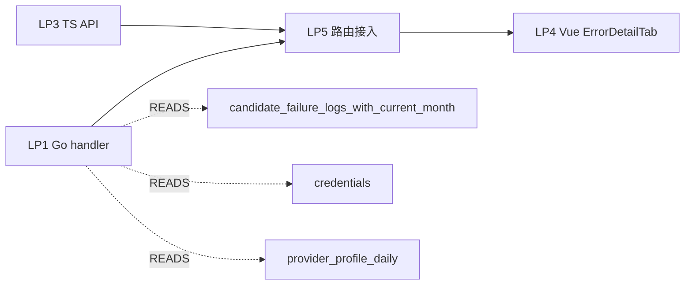

# Vendor/Credential Error Detail — 逻辑点清单

## 总览

- 功能目标：让 admin 在 provider-detail 页直接看到「哪个 credential 最近失败、失败原因、HTTP 状态码、最近一次错误响应 preview、最近 7 天质量评分」
- 数据 SSOT：`candidate_failure_logs_with_current_month` ∪ `credentials` ∪ `provider_profile_daily`
- 拆分为 **4 个 LP**（原计划的 LP2 已删除：现有 `idx_cfl_cred_ts` 已覆盖 `(credential_id, ts DESC)` 查询；rule 37 §2.2 简洁优先）
- 总代码量 ≈ 568 行（新增 480 + 修改 88），**每个 LP ≤ 300 行 ✅**

## 依赖图



## 逻辑点明细

| ID | 名称 | 类型 | 预估行数 | 依赖 | AC 数 |
|----|------|------|---------|------|-------|
| LP1 | vendor_credential_error_handlers.go（Go）| 新增 | ~150 | — | 5 |
| LP3 | vendor-credential-error.ts（TS API 客户端）| 新增 | ~80 | LP1 | 3 |
| LP4 | ErrorDetailTab.vue（前端 tab）| 新增 | ~250 | LP3 | 5 |
| LP5 | 路由 + handler 注册 + provider-detail tab 列表 | 修改 | ~18 | LP1, LP3, LP4 | 4 |

**总新增行数 ≈ 480**
**总修改行数 ≈ 88**

## 关键约束

### 来自 rule 33（分区 + Columnar）
- 查询必须走视图 `candidate_failure_logs_with_current_month`（rule 33 §2.4-2.6 视图 frozen columns）。
- 时间谓词必须使用参数化 `ts >= $N`（rule 33 §2.4 禁用 `NOW()` 等非 plan-time 常量）。
- ts 谓词出现在父表 / 视图查询时，禁止用 `NOW()`。

### 来自 rule 19 §11
- 本 LP 只读，无 DDL → 不触发 rule 19 §11 三阶流程。

### 来自 rule 17
- `go test ./admin/... -run TestVendorError` 必须全过；
- `go vet ./admin/...` 必须 0 错误；
- `pnpm typecheck` 0 错误；
- `pnpm vue-tsc --noEmit` 0 错误。

### 来自 rule 11 §6
- LP4（Vue 改动）必须 browser-use 实测（截屏存证）。

## 超限预警

所有 LP 均 ≤ 300 行，无超限风险。如实现期间某 LP 突破 300 行，立即按 rule 42 §2.2 拆分。

## LP5 路由设计（细节）

```
GET  /api/vendors/credentials/{id}/error-detail?hours=1|24|168
                                          ↑ LP1 handler URL path
```

为什么不复用 `/api/candidate-failures/credential/{id}`？
- 该 endpoint 已经存在（`candidate_failure_handlers.go:149`），只返回 recent_failures（rows 数组）。
- 本 LP 的新 endpoint 是「汇总视图」：返回 `{credential_meta, error_summary[], recent_failures[]}`。
- 命名上区分：**原始行** vs **汇总页**。

## 取消原 LP2 的理由

原 LP2 想新增 `idx_cfl_cred_kind_ts (credential_id, error_kind, ts DESC)`。但：

1. 现有 `idx_cfl_cred_ts (credential_id, ts DESC)`（`V359__*.sql:279-280`）已经覆盖 LP1 的核心查询（GROUP BY error_kind 在 24h/7d 窗口内是几百～几千行，全 index-only scan 即可）。
2. LP4 前端不带 error_kind 过滤器，只渲染全部的 recent_failures。
3. 性能瓶颈不在索引，而在查询次数（每次 tab 切换 1 次）。

**结论**：v1 不新增索引；245 部署后跑 EXPLAIN ANALYZE 验证 < 100ms p95 再决定。如果未来加错误类型过滤或 30d 窗口导致慢，再加索引（**走 rule 38 的迁移流程**）。
