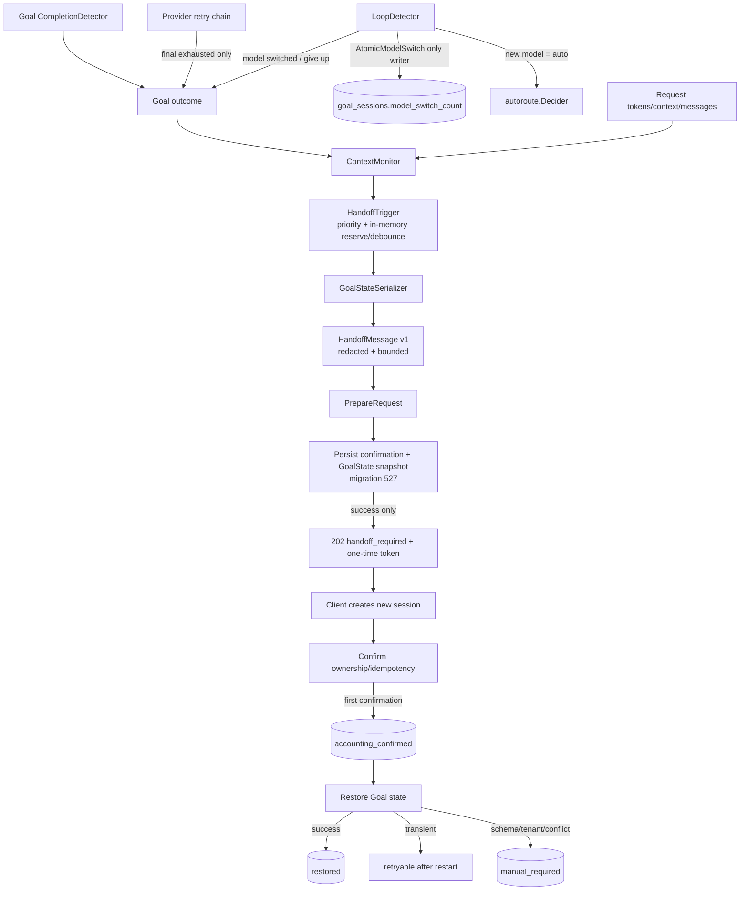

# 12 · Goal↔Handoff 协同契约

**状态**：P0-D 契约冻结 v1.1（2026-08-17）；实现存在，发布验证仍受 10/11 号 G2/G4 门禁约束。
**上游设计**：[会话优化v2/28-Phase3-Handoff协同设计方案](../会话优化v2/28-Phase3-Handoff协同设计方案.md)
**现行传输协议**：[会话交接模块](../modules/handoff.md)
**实施与状态**：[10-实施计划](./10-实施计划.md) / [11-完成情况核实与并发执行方案](./11-完成情况核实与并发执行方案.md)

---

## 1. 裁决

28 号设计提出的四组件保持不变，传输和持久化边界按当前实现冻结：

1. Handoff 在 provider dispatch 前判定；显式客户端收到 `202 Accepted` + `handoff_required`。
2. 客户端创建新会话后，以一次性 capability 确认；首次确认才执行 accounting、日志、计数和 cooldown，重复确认只能幂等返回。
3. response-side `InjectFollowUp` 只能在原 session 内续跑，不承担跨会话 Handoff。
4. 四组件提供 Goal 状态快照与触发意图，不替代 `autoroute.Decider`、Goal completion detector、LoopDetector 或确认事务。
5. `domains/moduleregistry.ModuleHandoffTrigger` 是模块元信息，不是执行注册；生产执行由 `ChatHandler.SetHandoffHook` 显式装配。
6. migration 527 将 GoalState snapshot 与 restore 生命周期持久化到 `handoff_pending_confirmations`；它不持久化进程内 pending signal、debounce lease、reservation 或 proposal binder map。
7. Handoff 202 与 pending/durable 202 是不同协议，不复用或新增 `X-LLM-Gateway-Retry-Scheduled`。

---

## 2. ContextMonitor

### 2.1 输入

`ContextSnapshot` 是一次只读会话快照：

| 字段 | 类型 | 语义 |
|---|---|---|
| `session_id` / `tenant_id` | string | 原 Goal 会话与租户 |
| `goal_state` | string | `active/paused/retrying/completed/failed` |
| `tokens_used` / `context_window` / `message_count` | int | 累计 token、窗口和消息数 |
| `retry_count` / `retry_exhausted` | int / bool | provider retry 累计与最终耗尽信号 |
| `repeat_count` | int | 连续重复响应计数，不等同 loop 次数 |
| `model_switch_count` / `max_model_switch_count` | int | `goal_sessions` 的 Goal loop 切模型计数 |
| `outcome` / `reason` | enum / string | 最近 Goal 检测结果与机器可判定原因 |
| `observed_at` | RFC3339 | 信号观测时间 |

### 2.2 输出

`TriggerSignal` 包含 `kind/source/reason/severity/observed_at`：

| kind | severity | Handoff 行为 |
|---|---:|---|
| `none` | 0 | 不触发 |
| `goal_completed` | 1 | 仅观测，无剩余工作不触发 |
| `context_pressure` | 2 | 达到绝对或窗口百分比阈值时触发 |
| `goal_degraded` | 3 | 普通成功切模型只观测；明确仍需跨会话工作时可触发 |
| `goal_failed` | 4 | retry/switch 最终耗尽、无 fallback 或禁用 switch 的 loop 可触发 |

优先级固定为 `failed > degraded > context_pressure > completed > none`。无有效 `context_window` 时只评估绝对阈值，不除零、不猜测窗口。

---

## 3. GoalStateSerializer 与 schema

### 3.1 GoalState v1

```json
{
  "version": 1,
  "source_session_id": "gw_old",
  "tenant_id": "tenant-a",
  "state": "active",
  "cost_mode": "balanced",
  "retry_count": 2,
  "decision_count": 4,
  "auto_continue_count": 3,
  "repeat_count": 1,
  "model_switch_count": 1,
  "current_model": "auto",
  "tokens_used": 85000,
  "message_count": 18,
  "task_description": "原始 Goal",
  "audit_completed": false,
  "completed_steps": [],
  "remaining_work": "",
  "captured_at": "2026-08-17T00:00:00Z"
}
```

约束：

- schema `version` 固定为 `1`；未知版本 fail-closed 为不可自动恢复，不做字段猜测。
- 不序列化 `last_response_hash`、凭据、原始 audit 内容、未脱敏对话、confirmation token 或 idempotency key。
- `repeat_count` 保持原语义，不改名、不换算为 `loop_detections`。
- `completed_steps`/`remaining_work` 是可选扩展；没有真实来源时省略，不能用永久零值冒充采集成功。
- `Serialize` 读取旧 session 并生成深拷贝；`Restore` 必须显式指定新 session ID。
- 新 session 恢复为 `active`；retry/decision/continue/repeat/model-switch 运行预算归零，历史数值只留在消息/snapshot 中；旧 session 不修改。
- 已存在且完全匹配的目标 session 视为幂等成功；冲突目标 session 进入 `manual_required`，禁止覆盖。

### 3.2 migration 527 durable snapshot

migration `527_handoff_durable_goal_state.sql` 在 `handoff_pending_confirmations` 增加：

- `goal_state JSONB`
- `goal_state_version INTEGER`
- `restore_status VARCHAR(32)`
- `restore_error VARCHAR(512)`
- `restore_attempted_at TIMESTAMPTZ`
- `restored_at TIMESTAMPTZ`

并把 confirmation 状态扩展为：

```text
pending -> accounting_confirmed -> restored
                              \-> manual_required
pending -> expired
```

冻结语义：

1. confirmation accounting 与 Goal restore 分离：accounting 必须 fail-closed、exactly-once；restore 在 accounting 成功后 fail-open，但必须可持久重试。
2. `accounting_confirmed` 表示 capability 已消费、日志/计数/cooldown 已提交；不能因 restore 失败回滚或再次计数。
3. `restore_status/error/attempted_at/restored_at` 只记录恢复生命周期；`restore_error` 必须截断且不得包含快照、token、凭据或原始对话。
4. startup migration 527 与历史 migration 362 的 schema 不变量必须一致；上线前在真实 PostgreSQL 执行 up/reapply/down 验证，而非仅字符串测试。
5. 进程重启后确认重放必须从 PG 读取 GoalState snapshot，而不是依赖内存 binder；snapshot 损坏/版本不符/tenant 不符进入 `manual_required`。

### 3.3 内存 proposal/debounce 边界

`MemoryHandoffTrigger` 的 pending signal、lease、reservation、proposal、acknowledged 全是**进程内临时状态**：

- 默认 TTL 与 confirmation TTL 对齐，当前为 5 分钟；过期清理，最多保留 10,000 个 entry。
- 同 session 同级或更低 severity 在 lease 内去重，更高 severity 可覆盖。
- `Reserve` 只暂占信号；`Commit` 才建立 debounce lease；`Abort` 必须把信号恢复为可重试。
- proposal binder 以 proposal ID + tenant 隔离并深拷贝；`Ack` 后仅保留短期已确认标记。
- 进程重启会丢失以上内存状态，这是允许的；已经 `SavePending` 的 durable confirmation/GoalState 仍可从 PG 恢复。
- 内存 debounce 不替代 PG 的 expiry、one-time token、idempotency、cooldown、`max_per_session` 或 ownership 约束。
- 内存丢失且 durable snapshot 不存在时 fail-open 到人工 ResumePacket 恢复，不得阻断普通 provider 请求。

---

## 4. HandoffTrigger 与 LoopDetector 边界

- `context_pressure` 和可交接的 `goal_failed` 可进入 proposal；`goal_completed` 不创建 proposal。
- 成功 `AtomicModelSwitch` 的 `goal_degraded/model_switched` 不创建 proposal；最终 give-up 才升级为 `goal_failed`。
- HandoffTrigger 不计算响应 hash、不增加 repeat count、不选模型、不调用 `AtomicModelSwitch`、不写 `goal_sessions.model_switch_count`。
- 不混用 `session_summaries.model_switch_count` 或 `dispatch_failover_total{kind="model_switch"}`。
- 只消费 LoopDetector 已产出的 `model_switched` 或最终失败原因。

---

## 5. HandoffMessage 与 ResumePacket 兼容

### 5.1 HandoffMessage v1

`HandoffMessage` 是现有 `ResumePacket` 的可选 `goal_handoff` 字段：

```json
{
  "version": 1,
  "source_session_id": "gw_old",
  "trigger": {
    "kind": "goal_failed",
    "source": "goal",
    "reason": "switch_budget_exhausted",
    "severity": 4
  },
  "goal_state": {"version": 1},
  "summary": "脱敏后的会话摘要",
  "resume_instruction": "Continue the original goal in Goal mode from the remaining work.",
  "created_at": "2026-08-17T00:00:00Z"
}
```

### 5.2 大小、脱敏与兼容

- transport `HandoffMessage` 编码后默认上限 **2 KiB**；超限按 summary→completed steps→task/remaining 截断顺序收缩，仍超限则返回错误，不发送半截非法 schema。
- durable `goal_state` snapshot 上限 **16 KiB**；`completed_steps` 最多 64 项，单项最多 512 rune，task/remaining 最多 4096 rune，current model 最多 256 rune。
- summary、task description、remaining work、completed steps、current model 写入前统一脱敏；任何路径都不得包含 API key、Bearer token、cookie、密码、私钥、confirmation token 或原始 audit。
- `goal_handoff` 必须是 optional/`omitempty`；旧 ResumePacket v1 不含该字段时编码与行为不变，旧客户端可忽略新增字段。
- 未识别 GoalState/HandoffMessage schema version 时不得自动 restore；仍可把已脱敏的旧 ResumePacket 交给客户端人工恢复。

---

## 6. 冻结 HTTP 202 协议

### 6.1 Goal Handoff 202

显式 Handoff 成功时冻结为：

```http
HTTP/1.1 202 Accepted
X-Gw-Handoff: explicit
X-Gw-Handoff-Reason: <machine-readable reason>
Content-Type: application/json
```

```json
{
  "status": "handoff_required",
  "resume_packet": {},
  "handoff_id": "<proposal id>",
  "confirmation_token": "<one-time capability>",
  "confirmation_expires_at": "<RFC3339>"
}
```

- `confirmation_token` 只在 202 body 返回一次；数据库只存 hash，日志不得记录 token/body。
- 202 发送前必须成功持久化 pending confirmation；持久化失败返回服务不可用并 `Abort` reservation，不得发送不可确认的 handoff。
- `handoff_id` 与 token 必须同时绑定 authenticated tenant 和 API key ID；tenant/API-key 来源必须来自服务端鉴权上下文，而非客户端 JSON。

### 6.2 与 pending/durable 202 的隔离

- pending 初始 accepted 继续使用 `X-Gw-Pending`、`X-Gw-Pending-Request`、`Retry-After`。
- durable 可另含 `Location`、`Preference-Applied`、`X-Gw-Task-Id`。
- Goal Handoff 不复制上述 headers；pending/durable 也不复制 `X-Gw-Handoff*`。
- 不新增 `X-LLM-Gateway-Retry-Scheduled`；其历史候选语义未冻结且不等价。

---

## 7. 确认、expiry、重启与重复语义

1. proposal expiry 必须严格晚于服务端当前时间；当前默认 5 分钟。过期后状态转为 `expired`，不能恢复或重新计数。
2. 测试必须使用可控时钟或相对未来时间；不得用固定历史时间，也不得为了测试通过放宽生产校验。
3. 首次确认需满足 proposal ID、tenant、API key ID、constant-time token hash、目标 session、target creation time、idempotency key、cooldown/max budget。
4. 同一 proposal + 同一 idempotency key + 同一目标 session 的重复确认幂等返回，`FirstConfirmation=false`；不得新增 handoff log、计数、cooldown 或重复创建 Goal session。
5. 同 proposal 使用不同 idempotency key 或不同目标 session 必须拒绝为 replay。
6. 进程重启后，`accounting_confirmed` 且未 restored 的行可继续 restore；restore 重试不重复 accounting。
7. snapshot 损坏、schema 不支持、tenant 不匹配或目标 session 冲突进入 `manual_required`；短暂数据库/GoalStore 错误保留可重试状态。
8. `Restore` 成功后标记 `restored`；标记失败需返回可观测错误，不能无声丢失恢复状态。

---

## 8. 日志安全与可观测性

### 8.1 日志安全

允许记录：

- event name、proposal ID（必要时 hash/截断）、tenant/session 的既有安全标识、trigger kind/reason、状态、耗时、错误分类、payload byte size。

禁止记录：

- confirmation token、token hash、idempotency key/hash、API key/Authorization、cookie、完整 ResumePacket、完整 GoalState、summary/task/remaining/completed steps、原始请求/响应 body、未脱敏 restore error。

日志事件至少区分：prepare failure、pending save failure、triggered、confirmation rejected/expired/replay、accounting confirmed、restore retryable、manual required、restored。错误字段必须先分类/截断，避免下游错误把敏感快照带入日志。

### 8.2 指标与告警

最低可观测面：

| 指标/视图 | 维度 | 用途 |
|---|---|---|
| `handoff_proposals_total` | trigger_kind/result | 触发、抑制、prepare/save 失败 |
| `handoff_confirmation_total` | result=`first/idempotent/expired/replay/invalid` | one-time capability 与攻击/客户端错误 |
| `handoff_restore_total` | result=`restored/retryable/manual_required/no_snapshot` | durable restore 生命周期 |
| `handoff_restore_duration_seconds` | result | 恢复延迟 |
| `handoff_payload_bytes` | kind=`message/snapshot` | 2 KiB/16 KiB 上限趋势 |
| PG 状态查询 | `pending/accounting_confirmed/restored/manual_required/expired` | 积压、过期和人工恢复 |
| 内存 trigger 当前量/eviction | entry kind | TTL/10,000 上限与异常抖动 |

告警至少覆盖：pending 临近/超过 TTL、`accounting_confirmed` 长时间未 restored、manual_required 增长、save/restore 连续失败、payload 超限、expired/replay 激增。指标 label 不得带 token、原文 reason、session 全量或高基数 payload。

---

## 9. 握手图



---

## 10. 验收表（G2/G4）

| ID | 验收项 | 预期 | Gate |
|---|---|---|---|
| H1 | 非 Goal/未满足阈值 | 不触发、不建 proposal | G2 |
| H2 | severity debounce/upgrade | 同级去重，高级覆盖，Abort 恢复 | G2 |
| H3 | 显式 prepare | 先持久化，再返回冻结 202 headers/body | G2 |
| H4 | pending save 失败 | 503/错误，reservation abort，无不可确认 202 | G2 |
| H5 | expiry 边界 | 未来有效、刚过期拒绝、固定历史 fixture 禁止 | G2 |
| H6 | tenant/API key ownership | 任一不匹配均拒绝，来源不信任 JSON | G2 |
| H7 | first confirmation | accounting/log/count/cooldown 仅一次 | G2 |
| H8 | 相同幂等重复确认 | `FirstConfirmation=false`，无重复副作用 | G2 |
| H9 | 不同幂等/目标重放 | 拒绝 replay | G2 |
| H10 | GoalState restore | 新 session active，运行预算归零，旧 session 不变 | G2 |
| H11 | schema/version | v1 成功，未知/损坏进入 manual_required | G2 |
| H12 | ResumePacket 兼容 | 无 `goal_handoff` 的旧 v1 编解码/行为不变 | G2 |
| H13 | 脱敏 | 常见 key/token/cookie/private key 不出 message/snapshot/log | G2 |
| H14 | 大小 | message ≤2 KiB，snapshot ≤16 KiB；超限明确失败 | G2 |
| H15 | 内存 TTL/上限 | expiry 清理、10,000 entry 限制、tenant deep copy | G2 |
| H16 | 进程重启 | 清空内存后从真实 PG `accounting_confirmed` 恢复 | G4 |
| H17 | restore 暂时失败 | accounting 不回滚，重复确认可恢复且不重复计数 | G4 |
| H18 | 真实 PostgreSQL migration | 527 up/reapply/down + 362 mirror 不变量 | G4 |
| H19 | 真实并发确认 | 行锁/幂等下仅一个 first confirmation | G4 |
| H20 | 可观测性 | 状态/耗时/积压/超限可查，labels 无敏感高基数 | G2/G4 |

**发布裁决**：H1-H15 未全过，不得通过 G2；H16-H20 中真实 PG/重启/并发场景有 SKIP 时，状态最高为 LOCAL_VERIFIED，不得 RELEASE_READY。

---

## 11. 兼容与失败策略

- 四组件及 observer 均为可选依赖；未装配时现有 Goal、audit、retry、Handoff 行为不变。
- `provider_retry_exhausted` 仅来自已启用 legacy Goal retry loop 的最终预算耗尽，且必须存在 Goal session；request-survival coordinator 保持独立 terminal outcome。
- Goal 状态读取/构建失败在 provider 请求侧 fail-open；confirmation accounting 失败 fail-closed；accounting 后 restore 失败 fail-open 但持久可重试。
- P0/P1/P2 completion 策略和 `UseAutorouteForAudit` 路径不变。
- 自动续跑继续受 follow-up depth/per-session 限制；Handoff 不篡改这些计数。
- 关闭 `LLM_GATEWAY_HANDOFF_ENABLED` 应恢复旧请求路径，但不得删除未完成 durable confirmation；恢复启用后仍可按状态继续处理。

---

**CHANGELOG**

- 2026-08-17 v1.1：增加 migration 527 durable snapshot/status；冻结内存 proposal/debounce 与持久确认边界；新增 G2/G4 验收表、2 KiB/16 KiB 大小限制、统一脱敏与日志安全、schema/重启/重复确认/旧 ResumePacket 兼容、冻结 Handoff 202 headers/body、可观测指标与告警；登记 expiry 测试必须使用可控时钟。
- 2026-08-16 v1.0：冻结 ContextMonitor、GoalStateSerializer、HandoffTrigger、HandoffMessage 四组件与基础握手语义。
