# 流处理验证层流程图

本文档包含 SSE 验证层和 Tool Call 验证层的详细流程图。

---

## 1. SSE Frame Validation Flow

### 1.1 First Frame Validation

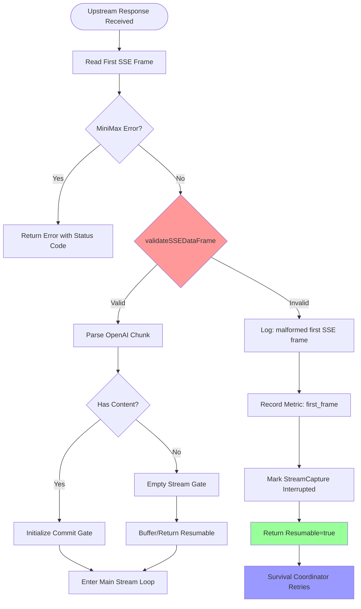

### 1.2 Mid-Stream Validation

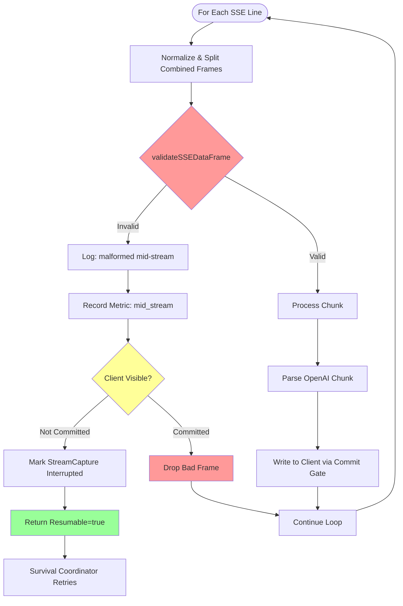

### 1.3 Complete Validation Decision Tree

```mermaid
flowchart TD
    Frame[Receive SSE Frame] --> Extract[Extract Payload]
    Extract --> CheckEmpty{Payload Empty or [DONE]?}
    
    CheckEmpty -->|Yes| Valid1[✅ Valid]
    CheckEmpty -->|No| CheckJSON{Starts with '{'?}
    
    CheckJSON -->|No| Valid2[✅ Valid - Not JSON]
    CheckJSON -->|Yes| Unmarshal{json.Unmarshal}
    
    Unmarshal -->|Success| Valid3[✅ Valid JSON]
    Unmarshal -->|Error| Invalid[❌ Malformed]
    
    Invalid --> CheckStage{Processing Stage?}
    CheckStage -->|First Frame| FirstAction[Return Resumable=true<br/>No Client Output]
    CheckStage -->|Mid-Stream| CheckVis{Client Visible?}
    
    CheckVis -->|No| MidNotCommitted[Return Resumable=true<br/>chunkCount preserved]
    CheckVis -->|Yes| MidCommitted[Drop Frame<br/>Continue Processing]
    
    Valid1 --> Process[Continue Normal Processing]
    Valid2 --> Process
    Valid3 --> Process
    
    FirstAction --> Survival1[Survival Coordinator<br/>Transparent Retry]
    MidNotCommitted --> Survival2[Survival Coordinator<br/>Transparent Retry]
    MidCommitted --> Process
    
    style Invalid fill:#ff6666
    style Valid1 fill:#66ff66
    style Valid2 fill:#66ff66
    style Valid3 fill:#66ff66
    style FirstAction fill:#99ff99
    style MidNotCommitted fill:#99ff99
    style MidCommitted fill:#ffaa66
```

---

## 2. Tool Call Validation Flow (Planned)

### 2.1 Tool Use/Result Tracking

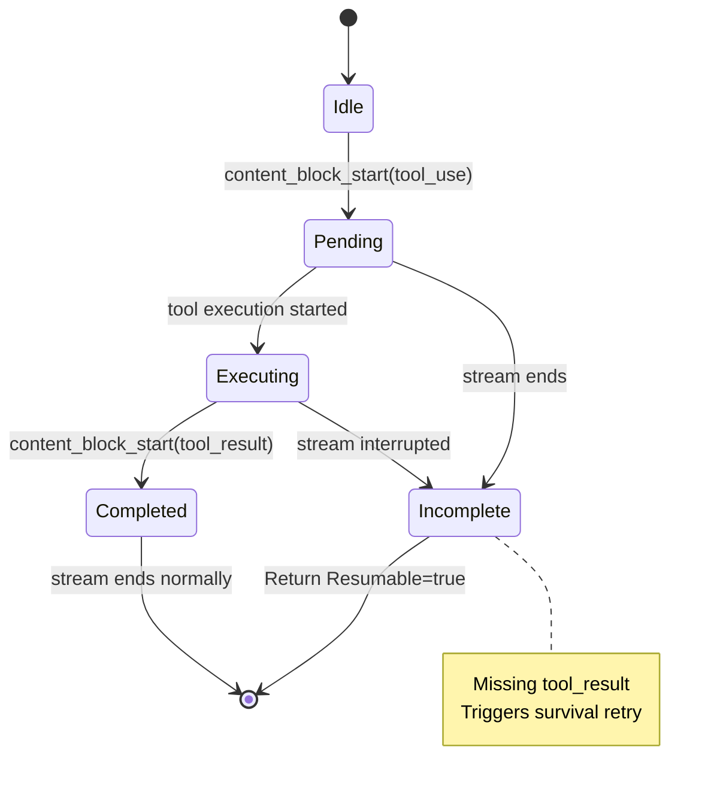

### 2.2 Tool Call Validation Process

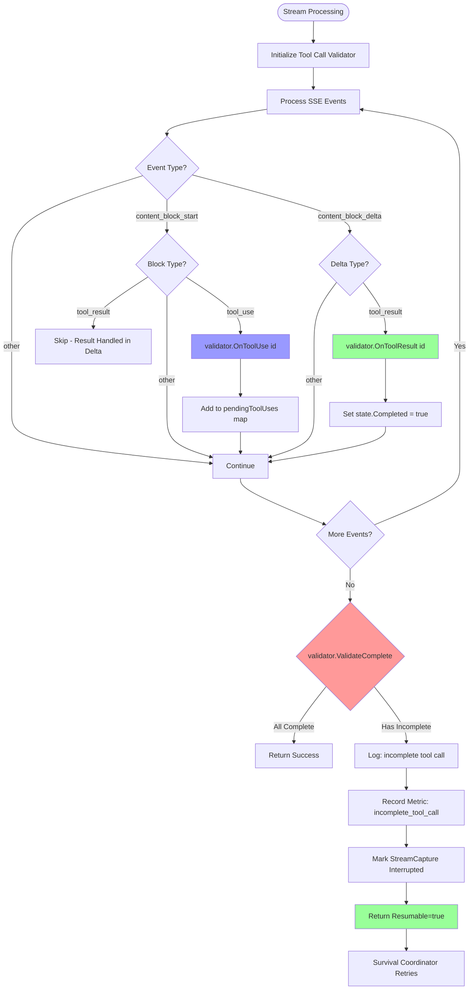

### 2.3 Tool Call State Machine Detail

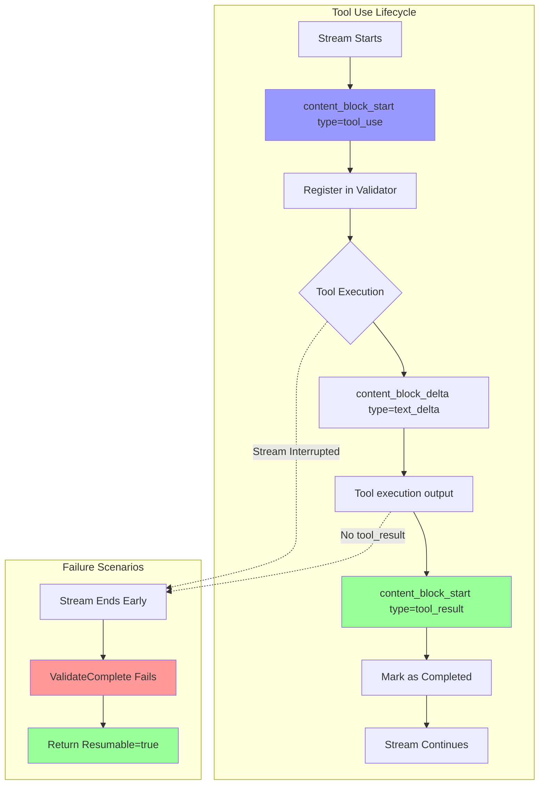

---

## 3. Integration with Survival Coordinator

### 3.1 Survival Coordinator Decision Flow

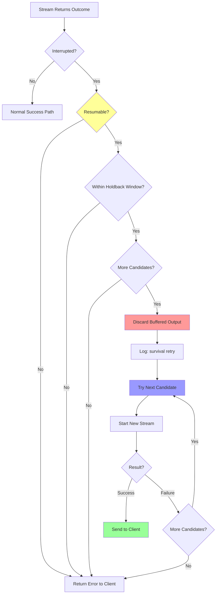

### 3.2 Holdback Window Concept

```mermaid
gantt
    title Holdback Window and Retry Strategy
    dateFormat X
    axisFormat %L ms
    
    section Stream 1
    Upstream Response   :0, 100
    Buffering          :100, 300
    Validation Fail    :300, 301
    
    section Holdback
    Window Active      :0, 500
    Decision Point     :crit, 301, 302
    
    section Stream 2
    Retry Start        :302, 402
    Buffering          :402, 600
    Success            :600, 601
    
    section Client
    No Output Yet      :0, 600
    First Byte         :milestone, 601, 0
```

---

## 4. Performance Characteristics

### 4.1 Validation Overhead

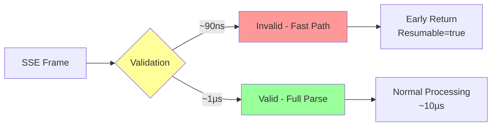

### 4.2 End-to-End Latency Impact

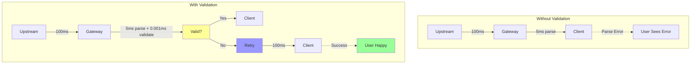

---

## 5. Monitoring Flow

### 5.1 Metrics Pipeline

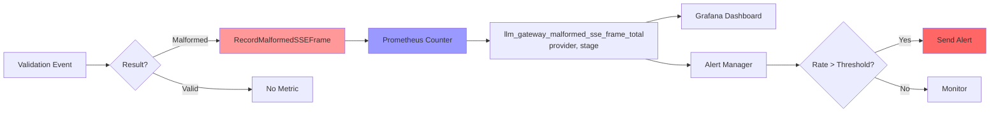

### 5.2 Observability Stack

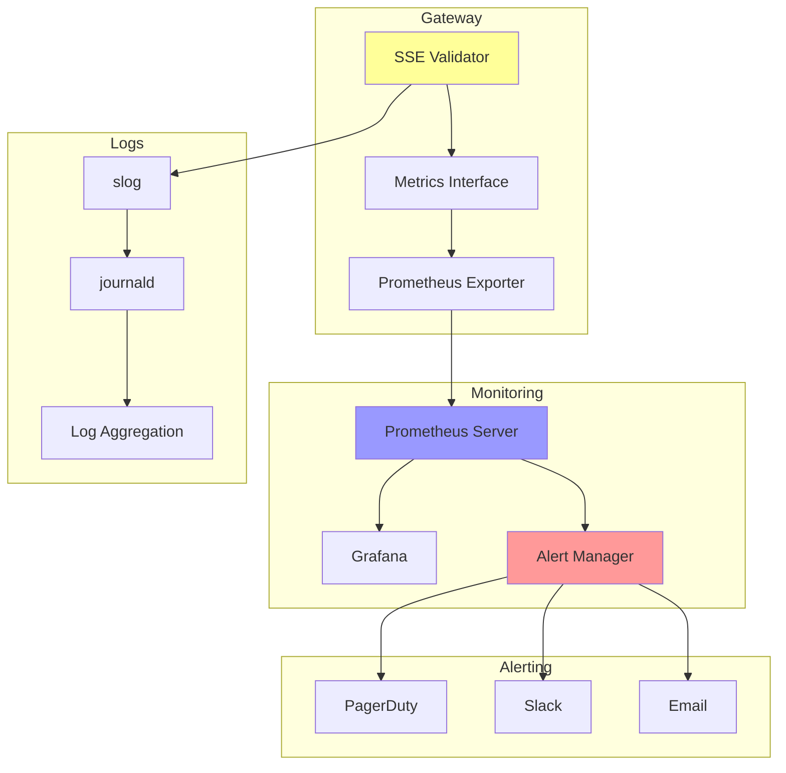

---

## 6. Deployment Flow

### 6.1 Safe Deployment Process

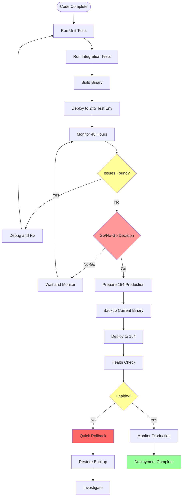

---

**Created**: 2026-08-29  
**Format**: Mermaid Diagrams  
**Usage**: Can be rendered in GitHub, GitLab, or any Mermaid-compatible viewer
