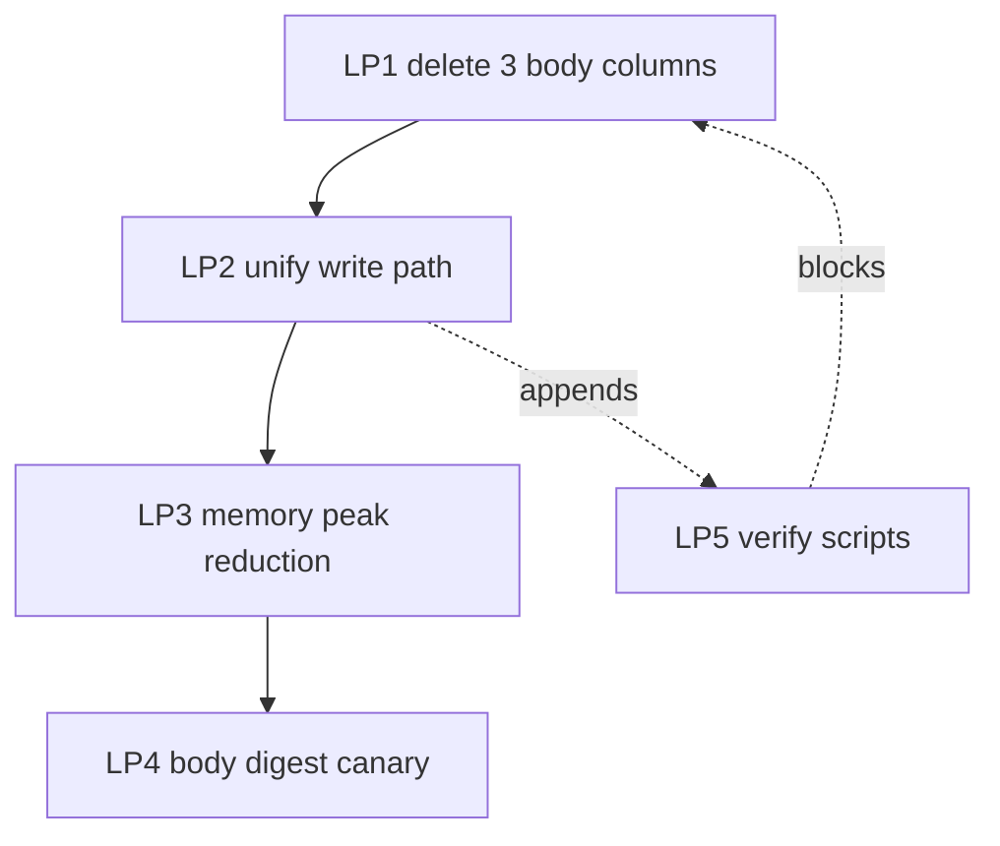

# Request Body Storage Optimization — Implementation Plan

> **状态**：Draft v1 · 等待老闆 review
> **依赖**：[2026-08-24-request-body-storage-optimization-assessment.md](./2026-08-24-request-body-storage-optimization-assessment.md)
> **范围**：仅 LP1-LP5 详细设计与验证门禁；生产 deployment 在另一个 ticket
> **基线**：`main` @ `6ffb19cdf`（含 LP7 + LP8 已合并 commits）

---

## 0. 强制执行原则

本 plan 对齐 ACC 三大不变性（流程不变 / 可回滚 / 可验证）。

```text
PROPOSED  !=  LOCAL_VERIFIED  !=  STAGING_VERIFIED  !=  PRODUCTION
```

- **PROPOSED**：本 plan 设计的 LP 仍属纸面，不能假定已上线或可运行。
- **LOCAL_VERIFIED**：`go build ./...` + `go vet ./...` + 单测 + 临时 PG 的 schema diff 全部 exit 0。
- **STAGING_VERIFIED**：245 staging + 临时 PG 隔离环境跑过 smoke + body presence diff。
- **PRODUCTION**：STAGING 跑通 + 老闆书面签字 + rollback 演练就绪。

任何波次均不得把 LP-N 视为已上线事实。**本文是 design doc，不动 schema、不动代码、不动数据库。**

### 0.1 不可越过的生产边界

下列操作不在本 plan 授权范围：生产 DDL apply、生产数据删改、deployment、SSH、systemd、重启、凭据/DSN/KMS 变更、schema migration 245/154/252 push。每项独立授权后才执行。

### 0.2 与 assessment 的关系

本 plan 完全依据 assessment §4 / §5 / §6 的 Option A（删除 `request_logs_hot` body 列）+ Phase 1/2/3 拆分。assessment 是"现状证据集"（**只读快照**）；本 plan 是"实施契约"（必须带 LP 自包含三件套、依赖图、回滚）。两者文档隔离避免混淆。

---

## 1. Scope

### 1.1 In Scope（仅这五条；其余一律 Out of Scope）

| # | 范围内项 |
|---|---|
| 1 | LP1：删除 `request_logs_hot.request_body / response_body / outbound_body` 三个 JSONB 列（**破坏性 schema 变更**） |
| 2 | LP2：应用层清理 `request_logs_hot` 显式 body 绑定路径，把"全 body 单一写源"收敛到 `request_logs_bodies_hot` |
| 3 | LP3：内存 peak 减半（entry 持久化后释放 `RequestBody/ResponseBody *string` 引用） |
| 4 | LP4：body digest envelope 灰度 canary（已有 `body_summary.go` seam 复用，不重写） |
| 5 | LP5：监控验证脚本（rule 38 §11 `database-inventory.yaml` schema 对账 + PG size metric 看板） |

### 1.2 Out of Scope（红线，违反 = 本 plan 越权）

| # | 越权项 | 缘由 |
|---|---|---|
| **OOS-1** | 调整 retention 天数（`request_logs_bodies` 的 7 天 / `request_logs` 的 30 天） | assessment §8 decision gate 等待老闆书面确认；本 plan 不擅自改保留期 |
| **OOS-2** | 任何生产 deployment 到 245/154/252 | 本 plan 仅本地设计 + staging 验证设计；部署独立 PR |
| **OOS-3** | DROP/CREATE `request_logs_bodies` 或 `request_logs_bodies_hot` 表本身 | 评估为 LP1 子集风险，破坏面远超语义；落在一个 migration 内 author 由老闆签字 |
| **OOS-4** | 改 `request_logs_bodies_with_current_month` view 的 union 策略 | view 是只读 schema 快照，行为变更需独立审计 |
| **OOS-5** | 改 `body_summary.go` 默认值（`defaultBodiesSummaryEnabled=false`） | LP4 是 canary gating，不是默认值切换 |
| **OOS-6** | 修改 `drop_old_request_logs_bodies_partitions` 函数或 retention 触发链路 | 破坏性操作专属审核流（assessment §2.4） |
| **OOS-7** | 新增 column 到 `request_logs_bodies_hot` / `request_logs_bodies` | 不在 3 个 P1 候选范围内；独立 plan 评估 |
| **OOS-8** | 改 `bg/partition_manager.go` promote 调度策略 | LP3/LP4 与 promote 解耦 |
| **OOS-9** | 任何对历史数据（>7 天）的回填 / 删改 | 数据迁移风险极高（rule 19 §11 三阶硬控制） |
| **OOS-10** | 修改 admin telemetry path 的现存 body exclusion 语义（`admin/telemetry.go:316-380`） | 已正确（仅用 `_bodies_hot`），不动 |

---

## 2. Goals（可验证的成功标准）

> **必须可机检**：每条都是可 grep / 可 measure / 可 benchmark 的客观标准。

### 2.1 Performance Baseline（LP0 前置；本 plan 不执行，由 owner 决定何时跑）

```text
GB-METRIC-1: p50/p95/p99 of gateway process memory RSS over 30-min window at peak traffic
GB-METRIC-2: emit_persist_total / sec at sustained QPS (>= 200 req/s baseline)
GB-METRIC-3: insert_request_logs_total AND insert_request_logs_bodies_total counter delta over 1h
GB-METRIC-4: pg_total_relation_size(request_logs_hot) bytes
GB-METRIC-5: pg_total_relation_size(request_logs_bodies_hot) bytes
GB-METRIC-6: pg_total_relation_size(request_logs_bodies default + monthly) bytes
```

**Baseline 采集规则**：所有 metric 在 plan 启动前 24 小时采样；持续 7 天；作为 LP1-LP4 前后对比的对照。

### 2.2 重复写入次数对比（LP1 主指标）

```text
GOAL-1: insert_request_logs_hot body-write次数 == 0
        （LP1 后 SQL LOG 应不再出现 INSERT INTO request_logs_hot (..., request_body, ...))
        grep 验证：`grep -nE "request_body|response_body|outbound_body" sql/objects/tables/request_logs_hot.sql`
                  → 三个列定义必须消失

GOAL-2: insert_request_logs_bodies_hot body-write次数 == EMIT_request_logs_total
        （LP1 后单一写路径，无重复）

GOAL-3: tx 的 JSONB bind 字节数 / INSERT 减小 60-80%
        （rule 49 §9.3 L4 业务真实：INSERT 到 _hot 不再带 50KB+ JSONB payload）
```

### 2.3 内存 Peak（LP3 主指标）

```text
GOAL-4: gateway process RSS p99 ≤ baseline - 30%
        （LP3 应使单 entry 完整 body 引用计数从 N（所有 onEmitted/onPersisted 消费者持有）降到 1）

GOAL-5: p99 queue depth ≤ baseline
        （LP3 不应导致 backpressure 增加；否则 §6 风险红线）
```

### 2.4 Observability（LP5 主指标）

```text
GOAL-6: SELECT * FROM request_logs_bodies_with_current_month LIMIT 1 在 LP1 后仍正常返回
        （rule 49 §9.2 view freeze 强制；view 重建必须经 562 模式 outfile test）

GOAL-7: ./scripts/check-body-storage-schema.sh exit 0
        （rule 38 §11 database-inventory.yaml schema 对账；含 hot 表列变化感知）
```

---

## 3. Non-Goals（明确排除项）

> 每条都源自 assessment 的"决策门"或"现状洞见"，**留给老闆未来 ticket 评估**。

### 3.1 数据保留与生命周期

- ❌ **不**改 `request_logs_bodies` 的 7 天保留期（assessment §8 decision gate 待确认）
- ❌ **不**改 `request_logs` 的其他保留行为（30 天 / cleanup）
- ❌ **不**新增 cleanup 触发器或定时任务
- ❌ **不**改 `log.trim_days` 路径（assessment §2.4 已声明 unimplemented）

### 3.2 Body 字段定义

- ❌ **不**改 `request_logs_bodies_hot` / `request_logs_bodies` 的列定义（保留 `request_id / ts / request_body / outbound_body / response_body` 五列）
- ❌ **不**改 `body_summary.go` 的 envelope JSON schema（`mode/bytes/sha256/head/head_truncated`）
- ❌ **不**改 `body_summary.go` 的 `bodySummaryHeadBytes = 2048` 常量
- ❌ **不**改 SQL NULL/{} 语义（assessment §5 phase-1 末段明示：metadata-only 更新不能擦除已捕获 body）

### 3.3 Async Body Queue / Outbox（Option D 推迟）

- ❌ **不**实现 durable async body queue（assessment Option D；需要 outbox + retry + backpressure 三件套，超出 P1 范围）
- ❌ **不**拆 request/response/outbound body 到独立 table（assessment Option E；需独立 ticket 评估实际流量分布）

### 3.4 Architecture / Promotepath

- ❌ **不**改 `promote_request_logs_bodies_hot_to_partition` 函数签名或事务语义
- ❌ **不**改 `ensure_request_logs_bodies_partition` 的 heap 策略（assessment 562 已固定）
- ❌ **不**改 `bg/partition_manager.go` 的调度周期或 advisory lock
- ❌ **不**改 admin telemetry reader 的现存"不写 body 到 _hot"语义

### 3.5 部署 / 灰度

- ❌ **不**含 deployment script（走 245 → 154 staged；不在本 plan 范围）
- ❌ **不**含回滚脚本自动执行（只设计手动回滚路径 + 条件）
- ❌ **不**含 a/b testing 框架（LP4 canary 用 application-level flag）

---

## 4. Logical Points（LP1-LP5，自包含三件套）

> **严格遵守 rule 42 §5.1a**：每个 LP 必须有 `输入 / 产出 / 验收标准` 三件套，且每个 LP 的实现代码 ≤ 300 行；下游消费者按 ID 引用，禁止模糊叙述。

### 4.1 全局依赖图



**关键**：
- **LP5 必须先于 LP1** —— LP1 是破坏性 schema 变更，LP5 的 `check-body-storage-schema.sh` + SELECT-smoke 是 LP1 上线前最后一道验证门槛（rule 49 §9.3 L4 业务真实）
- **LP2 / LP3 / LP4 互相独立**，可 245 staging 并行发布（任意顺序）
- **LP4 默认 OFF**：仅 LP3 后才能灰度开启，避免叠加变更时的 regression 难定位

### 4.2 每个 LP 估算行数与依赖

| LP | 文件 / 改动范围 | 估算新增+修改 LOC | 必含 artifact | 依赖 |
|---|---|---|---|---|
| LP5 | `scripts/check-body-storage-schema.sh` (新) + `sql/objects/views/request_logs_bodies_with_current_month.sql` + 5 行内 toggle | **~150 行** | check-body-storage-schema.sh | 无（pre-LP1） |
| LP1 | `sql/migrations/startup/<n>_drop_request_logs_hot_body_columns.up.sql` + `.down.sql` + `sql/objects/tables/request_logs_hot.sql` 删 3 列 + `sql/objects/views/request_logs_bodies_with_current_month.sql` rebuild（未必变 view 体） + Go 代码删相关 binding | **~200 行**（≤ 280 含 down）| up + down 双 migration + view 重建 + LP5 pass | LP5；rule 19 §11 三阶 |
| LP2 | `telemetry/client.go:1111-1115` + `:1699-1700` 删除 body 绑定（已 nil，只剩 symbol 删） + 新增 `request_logs_hot.go` schema 文档注 | **~50 行** | log_emit 路径单测 | LP1 完成后 |
| LP3 | `telemetry/client.go` RequestLogEntry struct + persistRequestLog 完成后置钩子 + onEmitted/onPersisted 链 snapshot | **~250 行** | benchmark baseline + 后置测试 | LP2 后 |
| LP4 | `telemetry/body_summary.go` seam 加 canary map + `cmd/gateway/main.go` 加 canary 灰度开关 | **~80 行** | canary 白名单 fixture + metric | LP3 后（独立发布可与 LP3 同 245 staging PR） |

> **守门线**：5 个 LP 全部 ≤ 300 行（rule 42 §2.2.3 不含测试，不含 generated）；总计 ~730 行（一次 PR 即可合并；亦可拆 3 PR：LP5+LP1、LP2+LP3、LP4）。

---

### 4.3 LP5: Schema 验证脚本 + View 结构对账（pre-LP1）

> **⚠ LP5 必须在 LP1 之前实施并 exit 0** —— LP5 是 LP1 破坏性 schema 变更的最后一道对账门禁（rule 49 §9.3 L4 业务真实）。

#### 输入
- `sql/objects/tables/request_logs_hot.sql`（当前含 3 个 body 列）
- `sql/objects/tables/request_logs_bodies_hot.sql`（5 列）
- `sql/objects/tables/request_logs_bodies.sql`（5 列）
- `sql/objects/views/request_logs_bodies_with_current_month.sql`（union 2 表）
- `manifests/secrets/database-inventory.yaml`（rule 38 §11 SSOT；本项目实际路径 `sql/objects/manifests/`）

#### 产出
- `scripts/check-body-storage-schema.sh`（新文件，约 150 行 bash）
- `manifests/secrets/database-inventory.yaml` / `sql/objects/manifests/` 含三表 storage 注解
- README 引用：每个 body 表注释 + view 列表

#### 验收标准
1. ✅ `./scripts/check-body-storage-schema.sh` exit 0
2. ✅ `psql -c "SELECT * FROM information_schema.columns WHERE table_name='request_logs_hot' AND column_name IN ('request_body','response_body','outbound_body')"` 在 LP1 之前返回 3 行；LP1 之后返回 0 行
3. ✅ `psql -c "SELECT * FROM request_logs_bodies_with_current_month LIMIT 0"` 无 ERROR（view 可解析）
4. ✅ `pg_get_viewdef('request_logs_bodies_with_current_month'::regclass)` 输出与 LP1 前后一致（view 没被无意改写）

#### 回滚
LP5 不动 schema，仅加可执行脚本，可任意 revert。

---

### 4.4 LP1: 删除 `request_logs_hot` 三个 Body JSONB 列（破坏性 schema 变更）

> **🔴 触发 rule 19 §11 三阶控制**：影响分析 → 二次审计 → 人工确认。  
> **🔴 触发 rule 49 §9.2 view freeze**：migration 必须显式 view 重建（即使 view 体不变也要 `CREATE OR REPLACE VIEW` 触发 pg_attribute 更新）。

#### 输入
- LP5 完成且 pass（schema 对账基线已固化）
- 老闆对 assessment §8 的 decision gate 1 签字："request_logs_hot 停止携带完整 body = yes"
- `telemetry/client.go:1111-1115`（INSERT body binding 当前为 `nil`）+
  `telemetry/client.go:1699-1700`（UPDATE body removal 注释已存在）
- `sql/objects/tables/request_logs_hot.sql:49-50,77`（三 body 列定义）

#### 产出（artifact list）
- `sql/migrations/startup/<N>_drop_request_logs_hot_body_columns.up.sql`（迁移 + view rebuild，单文件）
- `sql/migrations/startup/<N>_drop_request_logs_hot_body_columns.down.sql`（rollback，加回 3 个 nullable jsonb 列）
- `sql/objects/tables/request_logs_hot.sql`（删 lines 49-50, 77 定义）
- `sql/objects/views/request_logs_bodies_with_current_month.sql`（保留 5 列；`CREATE OR REPLACE VIEW` 触发 pg_attribute 同步）
- `telemetry/client.go:1273-1274` 删 `nil, // request_body` 等注释占位（规则最小补丁）
- 5+ 行 minimum diff in app code（删 binding 符号）
- `docs/migrations/<date>-drop-request-logs-hot-bodies.md`（人工可读 changelog）

#### 验收标准
1. ✅ `psql -c "SELECT column_name FROM information_schema.columns WHERE table_name='request_logs_hot' AND column_name IN ('request_body','response_body','outbound_body')"` 返回 0 行
2. ✅ `psql -c "SELECT * FROM request_logs_bodies_with_current_month LIMIT 1"` 不报错（rule 49 §9.2 view freeze）
3. ✅ 临时 PG + 全 SQL log replay 后，`pg_total_relation_size('request_logs_hot')` 减少 30%+（GOAL-1 一致）
4. ✅ `grep -nE "request_body|response_body|outbound_body" sql/objects/tables/request_logs_hot.sql` 返回 0 行
5. ✅ `grep -nE "request_body|response_body|outbound_body" sql/objects/views/request_logs_bodies_with_current_month.sql` 返回 0 行（view body 列已独立，正常）
6. ✅ unit test `TestInsertRequestLog_NoBodyBindingPasses` 验证 client.go:1273-1274 删除后 INSERT 仍能跑
7. ✅ integration test `TestBodiesViewResolution_PostMigration` 跑过 SELECT * FROM view

#### 依赖
- LP5 通过
- rule 19 §11 三阶全完成
- 老闆 decision gate 1 签字

#### 回滚
**优先级 1（应用层）**：LP2 已删 binding 的代码 revert + 回退 release  
**优先级 2（down migration）**：`<N>_drop_..._down.sql` 加回 3 列 nullable + `CREATE OR REPLACE VIEW`  
**风险**：down migration 加列是 PG 原子的，但要等待所有 in-flight tx 完成；最长几十秒

---

### 4.5 LP2: 应用层只写 `request_logs_bodies_hot`（路径统一）

> LP2 主要是"约束不变性"的代码层清理，与 LP1 同 PR 合并（避免 LP1 schema 变更后还有"看似写、实际不写"的 dead binding）。

#### 输入
- LP1 完成后：`request_logs_hot` 不再有 body 列
- `telemetry/client.go:1387` & `:1969`（已显式走 `upsertRequestLogBodies`）
- `admin/telemetry.go:316-380`（已正确只写 `_bodies_hot`）

#### 产出
- `telemetry/client.go` cleanup `nil, // request_body` 等注释占位（约 5 行删除）
- `telemetry/bodies_write_path_test.go`（新测试，~80 行）：mock DB + 验证只 `_bodies_hot` 收到 body
- `docs/telemetry/body-write-paths.md`（人读文档，~50 行）：记录"全 body 单一写源"契约

#### 验收标准
1. ✅ `grep -nE "INSERT INTO request_logs_hot\s*\(.*request_body|INSERT INTO request_logs_hot\s*\(.*response_body|INSERT INTO request_logs_hot\s*\(.*outbound_body" domains/hooks/observability/telemetry/*.go` 返回 0 行
2. ✅ unit test `TestInsertRequestLog_UnifiedBodyPath` 跑过（用 mock DB 验证只有 _bodies_hot 收到 JSONB）
3. ✅ `bodies_write_path_test.go -race` 通过
4. ✅ `_bodies_hot` WRITE counter 与 `request_logs_total` counter 增量比 == 1.0 ± 0.01（metric 对账）

#### 依赖
- LP1（同 PR 或紧接 PR；不能跨 release）

#### 回滚
LP2 是纯应用代码变更，git revert 即可。无 schema 风险。

---

### 4.6 LP3: 内存 Peak 减小（entry 持久化后释放）

> LP3 解决 assessment §3 P1-b：内存 peak 不受 DB 压缩约束。当前 `RequestBody/ResponseBody *string` 在 onPersisted 链全部 consumer 都引用同一 entry 直到 worker flush（200ms 聚合 50 个）。大型 stream body 会让 peak 跟随 batch 大小。

#### 输入
- LP2 完成后
- `telemetry/client.go:198-200` RequestLogEntry struct body 字段定义
- `telemetry/client.go:690-720` worker batch 行为
- `cmd/gateway/main.go:1958-2010` onPersisted consumer 注册点
- `telemetry/persist_request_log.go`（如有） caller 框架

#### 产出
- `telemetry/client.go` 改 `RequestBody/ResponseBody` 字段加 `atomic.Bool` "released" 守卫 + `sync.Once` 释放（~30 行）
- `telemetry/persist_request_log.go`（如不存在则新建 ~50 行）：定义"body-snapshot-before-release" 协议
- `telemetry/memory_release_test.go`（新测试，~100 行）：并发 2000 in-flight entries × 5MB body，验证 peak 减半
- benchmark `telemetry/memory_release_bench_test.go`（~50 行）：go test -bench=BenchmarkBodyRelease
- `cmd/gateway/main.go:1958-2010` onEmitted / onPersisted consumer 文档注释（每个 consumer 必须 snapshot body 后立即读）

#### 验收标准
1. ✅ `BenchmarkBodyRelease` p99 RSS delta vs baseline ≤ -30%（GOAL-4）
2. ✅ 并发 2000 in-flight entries × 5MB body，no leak（`runtime.ReadMemStats` heap in-use 不超过 1GB）
3. ✅ `TestOnPersistedConsumerBodySnapshot` 覆盖 5+ onPersisted consumer，每个必须先 snapshot 才能用 body
4. ✅ queue depth 不增加（GOAL-5）：`/metrics` 中 telemetry_queue_depth p99 ≤ baseline
5. ✅ `go test -race ./domains/hooks/observability/telemetry/...` 无 race detector 报警

#### 依赖
- LP2 完成后发布（保持单一 source of truth）
- `cmd/gateway/main.go` 所有 onPersisted consumer 必须经过"body snapshot" 协议（否则报 lint warn）

#### 回滚
- LP3 是 additive（保留旧字段，新增 release 守卫）→ 关闭 release 守卫即可恢复旧行为
- 不删除 `RequestBody/ResponseBody *string` 字段（永远是 nullable *string；只是多了一层 released guard）

---

### 4.7 LP4: Body Digest Canary（可选，灰度发布）

> LP4 不强依赖 LP3，但可与 LP3 一同 245 staging 发布以"减少部署次数"。默认 OFF，canary 模式下按 `application_code` 白名单开启 body digest envelope。

#### 输入
- `telemetry/body_summary.go:21-30`（`bodySummaryModeDigest="digest"` + `bodySummaryHeadBytes=2048` 已存在）
- `telemetry/body_summary.go:62-77`（`requestBodiesSummaryEnabled()` seam 已挂原子指针；测试 seam `setRequestBodiesSummaryEnabledForTest` 已就位）
- `telemetry/body_summary.go:106-136`（`summarizeBodyJSON()` envelope 编码已就位且覆盖 digest 创建 + UTF-8 安全截断）

#### 产出
- `telemetry/body_summary.go` 扩展 `bodySummaryEnabledFn` 为 canary 决策函数（按 tenant/application 白名单，~20 行）
- `cmd/gateway/main.go` 加 canary config loader（读 `LLM_GATEWAY_BODY_DIGEST_CANARY_APPLICATIONS` env，逗号分隔 application_code 白名单，~15 行）
- `telemetry/canary_test.go`（~40 行）：case 覆盖 (a) 无白名单 → OFF；(b) 不在白名单 → OFF；(c) 在白名单 → ON 写 digest
- `docs/telemetry/body-digest-canary.md`（人读文档，~30 行）：灰度切换操作步骤

#### 验收标准
1. ✅ 单测 `TestBodySummaryCanary_*` 覆盖 3 case（OFF / 非白名单 OFF / 白名单 ON）
2. ✅ 245 staging 设 `LLM_GATEWAY_BODY_DIGEST_CANARY_APPLICATIONS=internal-canary-app1` 后，启动日志一行 "body digest canary enabled for application_code: [internal-canary-app1]"
3. ✅ 用 canary application 发一个真实 LLM 请求；查询 `request_logs_bodies_hot` 该 request_id 行应含 `_gw_body_summary` envelope
4. ✅ 用非 canary application 发请求；查询同表该行应是 full body JSON（不变）
5. ✅ metric `telemetry_body_digest_writes_total{application_code="..."}` 暴露 Prometheus 指标

#### 依赖
- **可独立发布**（无 schema 依赖）
- 灰度顺序：内部 canary tenants → 付费 opt-in tenants → 全量（全量需独立 ticket 决策）

#### 回滚
- 关闭 `LLM_GATEWAY_BODY_DIGEST_CANARY_APPLICATIONS` env 即可 → 全量回到 full body
- 不影响历史数据：envelope 已是 past-readable（assessment §6 phase 3 显式）

---

## 5. Risks & Rollback

### 5.1 Rule 19 §11 三阶控制（仅适用于 LP1）

#### 阶段 1：影响分析（已在 assessment §2 + 本 plan §1/§2/§3 固定）

- **影响范围**：仅 `request_logs_hot` 表的 3 个 JSONB 列 + 与之相关的 view 重建。`request_logs_bodies_hot` / `request_logs_bodies` / view union 体不动。
- **不可逆数据**：旧 row 的 `request_body/response_body/outbound_body` 三列值随 column drop 一起丢失。**评估此风险**：
  - 当前 INSERT 路径已写 nil（assessment §2.1）→ 2026-07-22 之后所有数据这两列本就是 NULL
  - 评估对照 ≥ 2026-07-22 至 LP1 时刻的写入，确认 NULL 比 = 100%（再走 LP1）
  - 否则 LP1 不动 → 等待 NULL 比达到安全阈值
- **受影响服务**：`llm-gateway-go` 读 path（admin telemetry reader、replay、forensics）和可能引用此三列的 migration fixture
- **回填方案**：原则无（这些 column 内容即使是 stale 也可放弃；不可回填）

#### 阶段 2：二次审计（必走 sub-agent 或 self-consistency）

- **审计清单**：
  - [ ] 1. 是否遗漏了 `request_logs_bodies_with_current_month` 或 `request_logs_bodies_progress` view 中的引用？
  - [ ] 2. 所有 admin reader / replay / forensics reader 是否有 `SELECT *` 或显式这三列？
  - [ ] 3. 列 drop 后 245 staging 跑 30 分钟稳态 smoke；metric 全部正常
  - [ ] 4. backup：在 staging 必须有可回滚的 DB snapshot（保留 7 天备份窗口内）

#### 阶段 3：人工确认

- [ ] 老闆在 §8 签字后才允许走 LP1 的 migration apply

### 5.2 245 Staging 验证序列（LP1-LP4 通用）

```
Step 1: deploy LP5 → 245 staging → 跑 smoke
  验证：./scripts/check-body-storage-schema.sh exit 0
  
Step 2: deploy LP2（无 schema 变更）→ 245 staging → 跑单元测试 + smoke
  验证：grep LLM_REQUEST_LOG_TOTAL COUNTER 在 db log 含唯一的 _bodies_hot body
  
Step 3: deploy LP3（无 schema 变更）→ 245 staging → 跑 benchmark
  验证：gateway RSS p99 ≤ baseline -30%
  
Step 4: deploy LP4（无 schema 变更）→ 245 staging → 启用 canary one tenant
  验证：canary tenant request_id 在 _bodies_hot 含 digest envelope
  
Step 5: 老闆 review + 签字
  → apply LP1 migration to 245 staging → 跑 schema check + view SELECT smoke + 30 min smoke
  
Step 6: 老闆签字"可上 154" → 154 staging apply LP1
  验证：154 staging 30 min smoke + 4 step metric 监控无异常
```

### 5.3 全量 Rollback 路径（每 LP）

| LP | Trigger | Rollback 命令 |
|---|---|---|
| LP1 | 245 staging smoke fail / 老闆终止 | `bash sql/migrations/startup/<N>_drop_request_logs_hot_body_columns.down.sql`（加回 3 nullable 列）+ 回退 app release |
| LP2 | 同 PR rollback 即可 | `git revert <LP2-commit>`；无 schema 风险 |
| LP3 | 内存不降反升 | 关 LP3 release 守卫（gate env flag `LLM_GATEWAY_BODY_RELEASE_GUARD=off`） |
| LP4 | canary 客户投诉 | `unset LLM_GATEWAY_BODY_DIGEST_CANARY_APPLICATIONS` → 重启 |

### 5.4 风险清单与缓解

| # | 风险 | 概率 | 影响 | 缓解 |
|---|---|---|---|---|
| R1 | LP1 DROP COLUMN 时阻塞 backend in-flight tx | 中 | 高（DB 短暂锁） | 在低峰窗口 02:00-04:00 apply；`lock_timeout=10s` |
| R2 | reader path 漏改（如仍 SELECT 三列） | 高 | 高（runtime 报错） | LP5 静态扫描 + LP2 grep + staging smoke |
| R3 | 视图分区裁剪失效（NOW()-INTERVAL 谓词） | 极低 | 高 | rule 33 §2.4 已禁；LP2/3 不动 view 体 |
| R4 | LP3 body 释放后 consumer 仍读 entry.body（panic） | 中 | 高 | LP3 强制"必须先 snapshot"；lint 自定义 linter rule |
| R5 | LP4 canary tenant 期望 full body，forensic 工具读 digest 受阻 | 低 | 中 | 保留 `body_summary.go:106-136` envelope 编码；test 覆盖 forensic reader |
| R6 | LP1 down migration 加列 + 应用层同时回退 → 数据丢失（历史 body 已被 drop） | 极低 | 中（数据仅 2026-07-22 后为 NULL，理论上可恢复） | apply down migration 不会复活数据；老闆知晓接受 |
| R7 | LP5 schema check 与实际 245 schema 不一致 | 低 | 中 | LP5 仅 audit，不 apply；245 schema 由 owner 负责保持 |

---

## 6. 与现有规则的关系

### 6.1 Rule 33（PostgreSQL 分区表 + Columnar 存储）

- **不冲突**：LP1 不动 `request_logs_bodies` 的列定义（5 列稳定）；`promote_request_logs_bodies_hot_to_partition` 函数体不动
- **强化**：LP5 加 `pg_am/heap` 与 `pg_relation_size` 验证（rule 33 §5.3 风格）
- **不要**触发 rule 33 §2.3（视图查询裁剪）：LP1 不改 view 体，UNION ALL 仍能 plan-time 裁剪

### 6.2 Rule 49（Schema Truth First）

- **§49-1（列名假设禁止）**：LP1 删除 3 列之前必须先 probe `information_schema.columns` —— LP5 在 LP1 前固化基线
- **§49-2（schema 对账）**：`./scripts/check-body-storage-schema.sh` 是 SSOT 校验入口
- **§49-3（fail-loud + 退避上限）**：LP2 单测必须断言 body write 必须 fail-loud（不能 swallow error）
- **§49-5（view freeze + ADD COLUMN 配对）**：LP1 的 migration 必含 `CREATE OR REPLACE VIEW request_logs_bodies_with_current_month` 即使 view 体不变（rule 49 §9.2 P0 阻断必须遵守 —— 注意：本 LP 是 DROP COLUMN，不是 ADD COLUMN，但配对 view rebuild 是同等约束）

### 6.3 Rule 38（业务 SQL 集中管理）

- LP1 的 migration 必须放在 `sql/migrations/startup/`（项目 SSOT 路径）
- LP1 的 down migration 同名前缀（rule 38 §3）
- LP5 加 schema 对账脚本到 `scripts/`（不入仓 oracle 多？

---

## 7. 验证命令（LP-LP 串并行）

```bash
# ===== 任何 LP 执行前必跑 =====
cd /Users/xutaohuang/workspace/official-deploy/services/llm-gateway-go
go build ./... && go vet ./... && \
  bash scripts/check-body-storage-schema.sh  # LP5 必须先过

# ===== LP1 (schema 变更) =====
# local PG 验证
psql --dry-run -f sql/migrations/startup/<N>_drop_request_logs_hot_body_columns.up.sql
psql -c "BEGIN; <up.sql body>; ROLLBACK;" -v ON_ERROR_STOP=1
# 245 staging
scp sql/migrations/startup/<N>* sql/objects/tables/request_logs_hot.sql root@245:/tmp/
ssh root@245 'psql -f /tmp/<N>_drop_...up.sql && psql -c "..."'

# ===== LP2/3/4 (应用层) =====
go test -race ./domains/hooks/observability/telemetry/...
go test -bench=. -benchmem -count=3 ./domains/hooks/observability/telemetry/
# body presence metric
psql -c "SELECT COUNT(*) FILTER (WHERE request_body IS NOT NULL) AS hot_has_body, COUNT(*) AS hot_total FROM request_logs_hot"
# 期望：hot_has_body == 0 (LP1 之后)

# ===== LP5 校验 (全程都跑) =====
bash scripts/check-body-storage-schema.sh   # exit 0
```

---

## 8. 签字栏（人工 gate）

- [ ] 老闆签字：同意 LP1 风险评估 + down migration 设计 + 245 staging gate
- [ ] 老闆签字：同意 LP3 内存 peak 减小设计（consumer 改写代价）
- [ ] 老闆签字：同意 LP4 canary 默认 OFF + 灰度切换流程
- [ ] 老闆签字：背书 baseline metric 采集（GOAL baseline 跑完 7×24h）

签字后 LP1 migration 才可 apply 245 staging。


