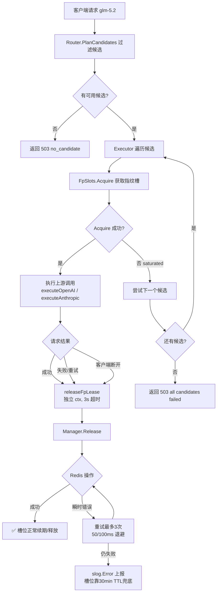
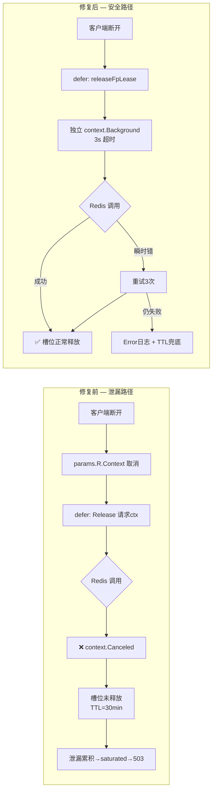
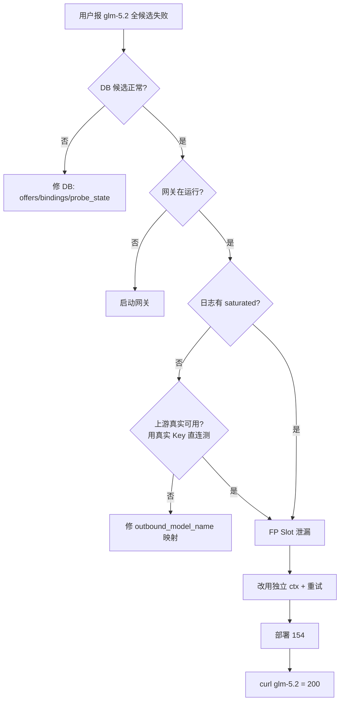

# GLM-5.2 FP Slot 泄漏修复 — 总结与流程图

> 关联事故记录：`docs/2026-07-09-glm52-fp-slot-leak-postmortem.md`

## 一、任务总结

### 1.1 问题
`llm.kxpms.cn`（154 节点）上 `glm-5.2` 请求 100% 返回 503「All N candidates failed」，持续约 3 小时。数据库侧一切正常，但运行时反复报 `cred_fp_slot saturated`。

### 1.2 根因
`executor.go` 释放指纹槽时使用了**请求自身的 context**（`params.R.Context()`）。当客户端在上游响应前断开，context 被取消，Redis `Release` 操作立即返回 `context.Canceled`，槽位 key 既未删除也未续期，保留 30 分钟 TTL。泄漏累积后 `fp_slot_limit`（默认 20）被占满，路由器遍历全部候选都被 `saturated` 挡掉。

> 排查中一度误判为「上游不支持 glm-5.2」并做过 `outbound_model_name` 临时映射，事后用真实 API Key 验证智谱/NVIDIA 均原生支持，已回滚映射。真正原因是 saturated 把可用凭据挡在了路由之外。

### 1.3 修复
| 文件 | 改动 | 作用 |
|------|------|------|
| `domains/streaming/executors/executor.go` | 新增 `releaseFpLease` helper；3 处 `Release` 调用统一走它 | 用独立 `context.Background()` + 3s 超时释放，与请求生命周期解耦 |
| `credentialfpslot/slot.go` | `Release` 增加 3 次有限重试 + `slog.Error` 上报 | 应对瞬时 Redis 错误，不再因单次抖动永久泄漏 |
| `docs/2026-07-09-glm52-fp-slot-leak-postmortem.md` | 新增事故记录 | 标准化复盘文档 |

代码已提交 `fix/fp-slot-leak-glm52` 分支、合并到 `main` 并推送；已编译部署到 154 生产节点；单元测试通过；生产 `curl glm-5.2` 返回 200。

### 1.4 避免重复造轮子
- 复用已有的 `credentialfpslot.Manager`（未新造清理器，`reclaim.go` 后台回收机制已存在）。
- 复用已有的 `context.WithTimeout` 模式（项目内多处使用）。
- 未新建独立诊断表，诊断仍走现有 `model_probe_runs` / 日志。

---

## 二、流程图

### 2.1 请求 → FP Slot 生命周期（修复后）

### 2.2 泄漏成因对比（修复前 vs 修复后）

### 2.3 诊断决策树（本次排查路径）

---

## 三、后续建议（未在本任务实施）

1. 监控：暴露 `fp_slot_usage_ratio` / `fp_slot_release_failures_total`，告警阈值 0.9 / 5min。
2. `domains/ursm/routing.go` 的 `fpSlotMgr.Release` 同样使用请求 ctx，待 URSM 启用前一并改为独立 ctx。
3. 团队规范：释放资源一律用独立 context，写入 Go 编码规范。
