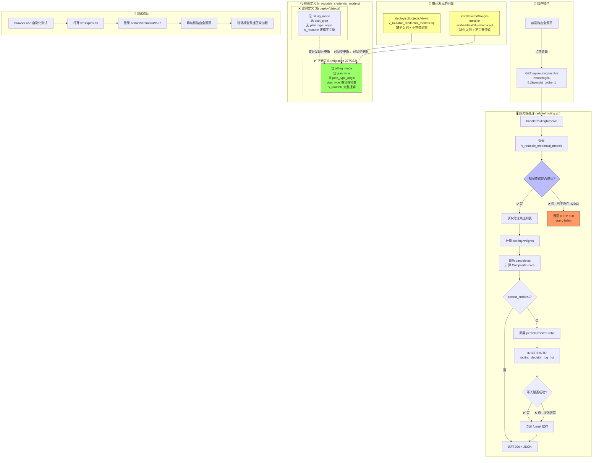

# /api/routing/resolve 500 错误修复：功能总结与流程图

## 功能总结

### 问题背景
`/api/routing/resolve` 接口是 LLM Gateway 管理后台的**路由诊断工具**，前端路由全景页调用 `?model=glm-5.2&persist_probe=1` 查询模型路由候选列表并记录探测日志。

### 故障现象
接口返回 HTTP 500，前端路由页面模型搜索功能不可用。

### 根因
视图 `v_routable_credential_models` 经 migration 327/332 重写后，不再暴露 `credential_status`/`availability_state`/`quota_state`/`binding_available`/`billing_mode` 等 8 个列，但 Go 代码 SQL 查询仍用 `v.xxx` 引用这些不存在的列 → PostgreSQL ERROR 42703。

### 修复与审计结果
1. **修复 SQL**: 将列引用从 `v.*` 改为已 JOIN 的 `credentials c.*` / `credential_model_bindings cmb.*`
2. **增强容错**: `persistResolveProbe` 添加 panic 恢复 + 详细错误日志
3. **审计更新**: 发现并修复 2 个过时视图定义文件（deploy/objects + installer/embeddata）
4. **部署**: 编译部署到 154 服务器 + 推送到 git main 分支
5. **验证**: browser-use 本地登录验证，路由页面正常显示

## 流程图



## 代码变更

| 文件 | 变更类型 | 说明 |
|---|---|---|
| `admin/routing.go` | 🛠️ 修复 | `v.*` → `c.*`/`cmb.*` 修正8个列引用 |
| `admin/routing_resolve_probe.go` | 🛡️ 增强 | panic 恢复 + 详细错误日志 |
| `deploy/sql/objects/views/v_routable_credential_models.sql` | 📝 审计修复 | 同步 migration 332 最新定义 |
| `installer/cmd/llm-gw-installer/embeddata/01-schema.sql` | 📝 审计修复 | 同步 migration 332 最新定义 |
| `docs/2026-07-09-routing-resolve-500-fix.md` | 📄 新增 | 修复记录文档 |

## Git 提交记录

```
c462cc45 docs(fix): 添加路由解析500错误修复记录 + 审计修正过时视图定义
17129047 fix(routing/resolve): 修复 v_routable_credential_models 视图字段不匹配导致500错误
```

## 部署确认

- **服务**: llm-gateway-go (154 服务器)
- **二进制**: `/opt/llm-gateway-go/llm-gateway-go`
- **状态**: active (running)
- **备份**: `/opt/llm-gateway-go/llm-gateway-go.bak.20260709_1157XX`
