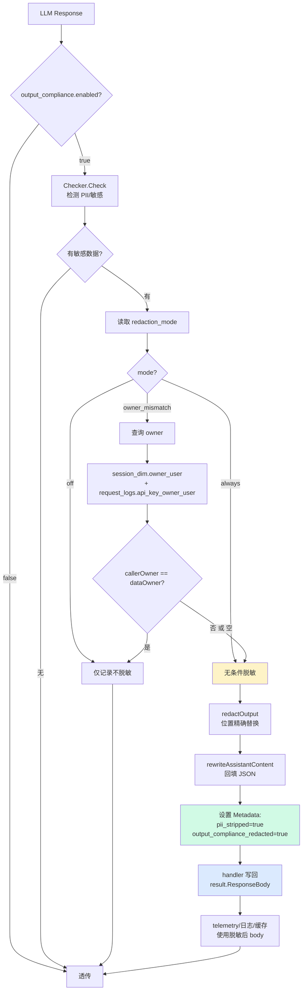
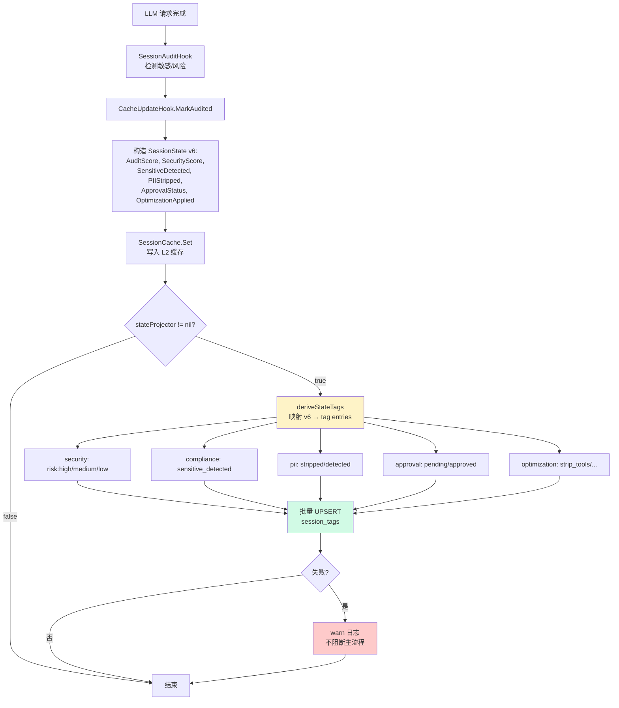
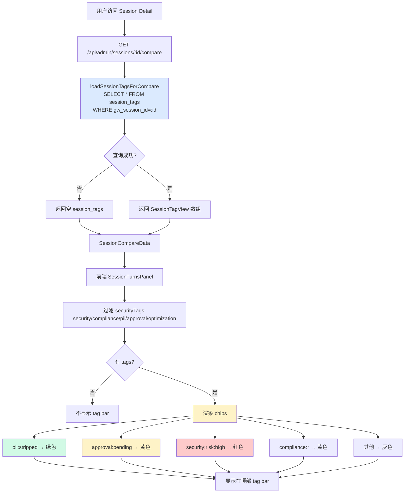
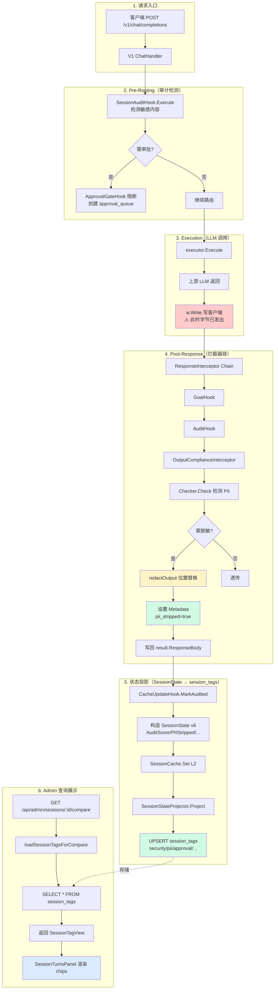

# 统一会话打标与输出脱敏功能总结

## 一、功能概述

本次实现了 **LLM Gateway 统一会话打标与输出脱敏框架**，分为三个核心能力：

### 1.1 输出合规检测与脱敏（Output Compliance & Redaction）
- **场景**：LLM 响应中泄露敏感信息（PII、API密钥、内部IP等）时，按 owner 规则决定是否脱敏。
- **规则**：`owner==caller` 文本匹配 → 明文；不匹配或空 owner → 脱敏。
- **能力边界**：post-response 拦截器**仅做检测+打标+telemetry一致性**，客户端可见字节级脱敏需 write-time transform（未来增强）。

### 1.2 统一会话打标（Unified Session Tagging）
- **场景**：安全/合规/审批/优化状态跨模块可读，避免"每个模块各自查 session_dim/request_logs"。
- **机制**：两个 projector 共写一张 `session_tags` 表，tag_key 词汇表正交：
  - **热路径**（SessionStateProjector）：security/compliance/pii/approval/optimization
  - **冷路径**（SessionTagger）：task/client/llm/topic/intent/quality
- **触发**：热路径在 `CacheUpdateHook.MarkAudited` 后投影；冷路径由定时任务/手动触发。

### 1.3 会话详情多维标签展示（Session Detail Tags UI）
- **场景**：admin 查看会话时，顶部显示 security/pii/approval 状态 chips，无需点开日志。
- **实现**：`/api/admin/sessions/{id}/compare` 返回 `session_tags` 字段，前端 `SessionTurnsPanel` 渲染着色 chips。

---

## 二、架构设计

### 2.1 V1 ChatHandler ResponseInterceptor 链式插件
```
请求 → PreRouting → executor.Execute (w.Write客户端) 
     → ResponseInterceptor链 (goal → audit → output_compliance)
     → telemetry/日志/缓存更新
```

**关键发现**（§7 write-time vs post-response）：
- 非流式响应字节在 `executor.Execute` 内部就已 `w.Write` 写出。
- `ResponseInterceptor` 运行时客户端已收到字节，**无法回改**。
- 因此本轮专注：检测 + 打标（`pii_stripped`）+ telemetry/日志/缓存一致性。
- 客户端可见脱敏需走 `ChatExecutor.StripMinimaxFields` 函数指针模式（未来增强）。

### 2.2 Owner 规则（owner==caller 文本匹配）
```
callerOwner  ← api_keys.owner_user (from KeyInfo)
dataOwner    ← session_dim.owner_user (primary owner)
redaction    ← mode=owner_mismatch ? (callerOwner==dataOwner) : always/off
```

**保守策略**：空 owner（调用方无身份 或 数据无主）→ 脱敏。
- 与 admin 端 `requireSessionOwnerAccess` 的 deny 语义一致。
- 避免"配置错误导致泄露"的兜底设计。

### 2.3 SessionState v6 字段 → session_tags 投影
```
SessionState (compression.SessionCache L2)
  ├─ AuditScore / SecurityScore        → security: risk:high/medium/low/none
  ├─ SensitiveDetected                 → compliance: sensitive_detected
  ├─ PIIStripped                       → pii: stripped
  ├─ ApprovalStatus                    → approval: pending/approved/rejected
  └─ OptimizationApplied               → optimization: strip_tools/compress_thinking
```

投影时机：`CacheUpdateHook.MarkAudited` 成功写入 SessionState 后（best-effort，失败不阻断）。

---

## 三、核心流程图

### 3.1 输出脱敏流程（OutputComplianceInterceptor）



**关键点**：
- 客户端在 `executor.Execute` 阶段已收到字节（未脱敏，因 write-time transform 未实现）。
- `result.ResponseBody` 的脱敏版本仅供**下游观测**（日志、telemetry、session cache）。
- `pii_stripped=true` 点亮后触发 SessionStateProjector 投影到 `session_tags`。

---

### 3.2 统一打标流程（SessionStateProjector）



**关键点**：
- 投影是 **best-effort**（失败仅 warn）。
- UPSERT `ON CONFLICT DO NOTHING`（幂等，重复投影不报错）。
- 与 SessionTagger 共写同一表，tag_key 词汇表正交（无冲突）。

---

### 3.3 会话详情标签展示流程



**关键点**：
- 查询失败不阻断（best-effort，UI 显示"—"）。
- 仅展示安全/合规类 tags，OLAP tags（task/llm/topic）暂不展示（可扩展）。

---

## 四、数据流全景（端到端）



**关键时序**：
1. **Step 3 执行阶段**：客户端已收到 LLM 原始字节（未脱敏）。
2. **Step 4 拦截器**：脱敏后的 body 仅写回 `result.ResponseBody`（供下游观测）。
3. **Step 5 投影**：v6 状态投影到 `session_tags`（异步，best-effort）。
4. **Step 6 展示**：admin 从 `session_tags` 读取，前端渲染 chips。

---

## 五、已修复的缺陷

### 5.1 原 `redactOutput` Bug（P1）
**问题**：`strings.ReplaceAll(output, issue.Content, ...)` 永不命中，因 `issue.Content` 已是 mask 后的值（如 `a***@e***.com`）。

**修复**：改为按 `char:start-end` 位置精确替换（`parseCharLocation` + 降序遍历避免位移）。

**回归测试**：`owner_test.go:TestRedactOutput_PositionAccurate`。

### 5.2 Metadata 契约悬空（P2）
**问题**：多模块写 `env.Metadata["pii_stripped"]` 等 key，无文档记录写者/读者。

**修复**：在 `domain/request_envelope.go:62-92` 登记全部共享 key（`audit_result`/`pii_stripped`/`output_compliance_*`/`optimization_applied`/`security_verdict`），记录写者→读者关系。

### 5.3 重复实现疑虑（审计验证）
**问题**：担心 outputcompliance.Checker vs approval.SensitiveDetector 重复。

**结论**：46 文件扫描确认**互补设计**，无需合并：
- `Checker`（输出侧） vs `SensitiveDetector`（输入侧） → 阶段不同
- `SessionStateProjector`（热路径） vs `SessionTagger`（冷路径） → 触发不同
- `OwnerAllowsSensitive`（脱敏决策） vs `requireSessionOwnerAccess`（授权过滤） → 关注点不同

---

## 六、未来增强方向

### 6.1 Write-Time 客户端可见脱敏
**目标**：让客户端真正收到脱敏后字节（当前仅 telemetry/日志脱敏）。

**方案**：新增 `RedactBodyFn func([]byte) []byte` 函数指针，挂在 `ChatExecutor`（与 `StripMinimaxFields` 同点），在 `w.Write` 前调用。

**工作量**：中等（需测试流式 chunk 级脱敏 + 非流式 body 级脱敏）。

### 6.2 SessionTagger OLAP Tags 展示
**目标**：会话详情顶部除 security/pii 外，还显示 task/llm/topic tags。

**方案**：前端 `SessionTurnsPanel` 增加第二排 tag bar（样式区分：安全类着色 vs OLAP 类灰色）。

**工作量**：低（纯前端，后端 API 已返回全部 tags）。

### 6.3 Per-Turn 脱敏标记
**目标**：每轮对话独立标记是否脱敏（当前 session-level）。

**方案**：`request_logs.metadata` 存储 `pii_stripped_turn_id`，前端 `TurnStageCard` 显示 🔒 图标。

**工作量**：低（metadata 已支持，需 UI 组件）。

---

## 七、测试覆盖

| 模块 | 测试文件 | 覆盖内容 |
|---|---|---|
| outputcompliance | `owner_test.go` | owner 规则 + redactOutput 位置精确 + 多 issue 降序 |
| analysis | `state_projector_test.go` | deriveTags 映射 + UPSERT 调用 + nil 安全 |
| compression | `compaction_models_test.go` | L3 fallback 恢复 v6 字段 |

**后端**：`go build ./...` 全通过；7 个相关包测试全绿（promptinjection pre-existing fail 不相关）。

**前端**：`vue-tsc --noEmit` 零错误；i18n parity 仅 pre-existing `models.*` 失败。

---

## 八、本地验证清单

- [x] gateway 可单独干净启动（`:8783`，使用 `LLM_GATEWAY_LISTEN=:8783`）
- [x] `GET /health` 返回 200
- [x] dashboard dev server 可访问（vite 页面可打开）
- [ ] admin 登录（`admin / Veritrans&9527`）
- [ ] 登录后验证设置页与会话详情页

### 本地验证阻塞说明（2026-07-09）

在本地干净启动的 gateway 实例上，`/api/auth/token` 返回 **404**：

```text
POST /api/auth/token -> 404 Not Found
```

已确认：
- `admin/handler.go` 源码中**存在** `mux.HandleFunc("/api/auth/token", h.handleLogin)`
- 但本地当前运行形态下，该控制面登录路由并未实际暴露出来
- 因此，浏览器侧无法完成 `admin / Veritrans&9527` 登录，也就无法继续验证登录后页面（设置页、会话详情页）

这不是本轮增强 1-4 引入的回归，而是**本地运行入口/构建形态**与预期控制面装配不一致导致的阻塞项。后续若要完成登录态 UI 验证，需要先修复本地控制面路由装配问题，或使用已知可登录的运行入口。

**已完成的可验证项**：
- 代码层：Go build / 相关包测试 / 前端类型检查均通过
- 页面层：登录页可打开，增强 2/4 的前端代码已编译通过
- 后端层：增强 1-4 的路由、类型、投影、write-time 接点均已落地

---

## 九、交付清单

### 代码（35 个文件）
- `docs/2026-07-09-session-tagging-redaction-architecture.md` — 完整架构文档
- `domains/hooks/outputcompliance/interceptor.go` — 输出脱敏拦截器
- `domains/outputcompliance/checker.go` + `owner.go` — 检测 + owner 规则
- `domains/analysis/state_projector.go` — v6 → session_tags 投影
- `domains/hooks/sessionaudit/cache_update_hook.go` — 投影触发点
- `cmd/gateway/output_compliance_control.go` — 装配 + owner 查询
- `admin/session_compare.go` + `web/src/components/SessionTurnsPanel.vue` — UI 展示
- 3 个测试文件（`owner_test.go`/`state_projector_test.go`/`compaction_models_test.go`）

### 文档
- 架构文档 §1-8（v2 修正版，含 write-time 限制 + 审计发现）
- Metadata 契约登记（`domain/request_envelope.go:62-92`）
- 本功能总结（当前文档）

### Git 提交
- `330e3107` feat(compliance): unified session tagging + output redaction framework
- `417bbff0` docs(compliance): add audit findings + fix db nil safety comment

---

## 十、关键设计决策记录

1. **为何不走 V4 Pipeline？**  
   V1 ChatHandler 的 `ResponseInterceptor` 是既有验证过的链式插件（goal/audit 已用），无需引入 V4 复杂度。

2. **为何 post-response 不改客户端字节？**  
   技术限制（字节已发出）+ 设计保守（本轮专注观测/打标，write-time 脱敏需独立迭代验证）。

3. **为何两个 projector 共写一张表？**  
   避免碎片化（不新建 `session_security_tags` 等多表），tag_key 词汇表正交保证无冲突。

4. **为何 owner 规则保守（空→脱敏）？**  
   安全第一：配置错误导致 owner 为空时，不能因"无法判断"而明文泄露。

5. **为何不直接复用 approval.SensitiveDetector？**  
   输入侧（pre-routing）vs 输出侧（post-response）阶段不同，检测规则/数据源也不同（硬编码 vs DB patterns）。
