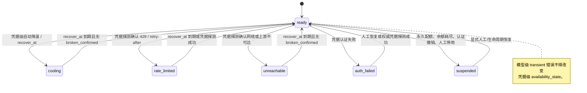
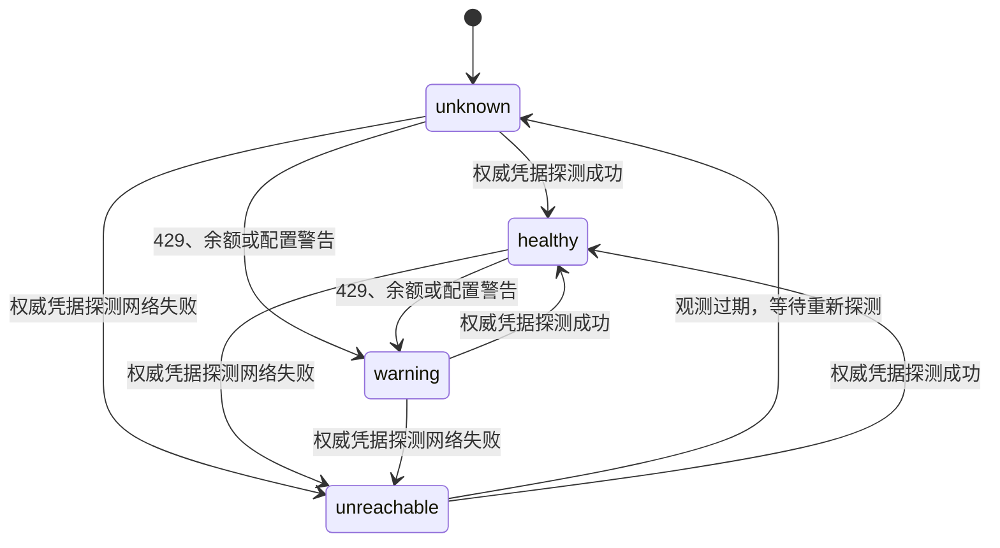
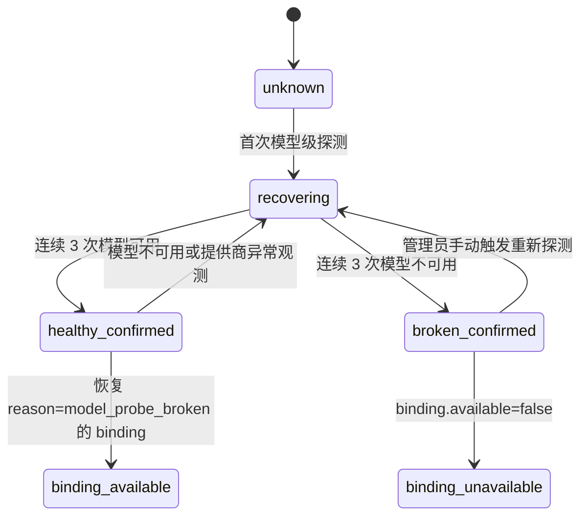
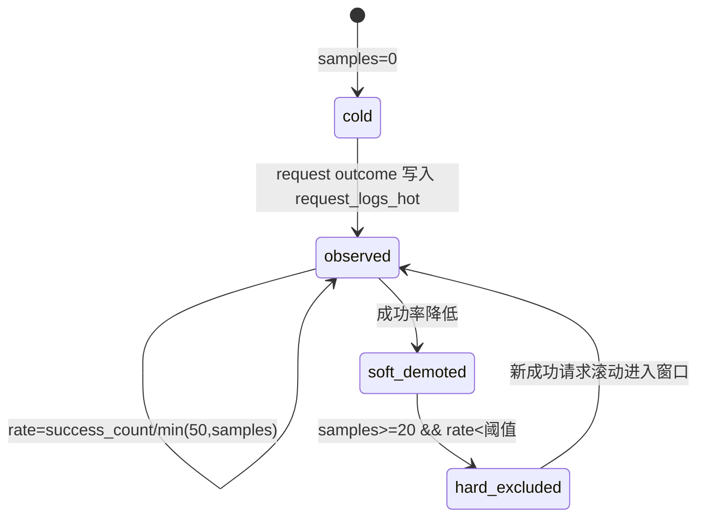
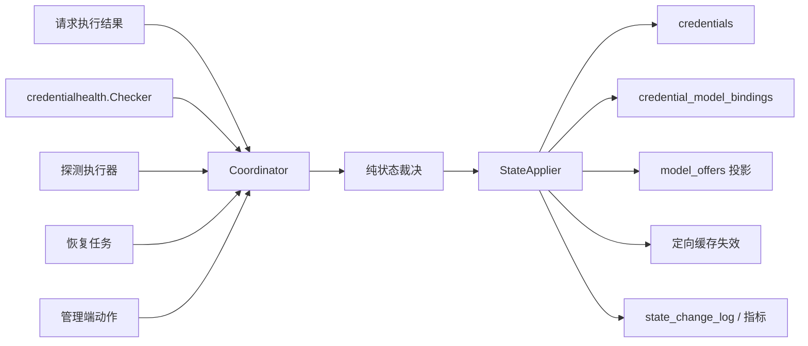
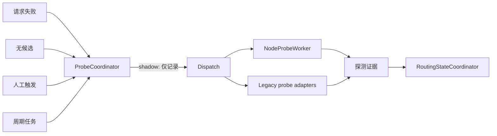

# 模型路由、凭据状态与探测统一化重构方案

> 日期：2026-07-15
> 状态：已审计，待按影子优先策略实施
> 范围：模型路由、候选池、凭据/模型状态、探测、恢复、内部能力等级与替代
> 非目标：本方案首轮不切换生产状态写入权、不启用自动模型替代、不修改探测频率。

## 1. 目标与约束

### 1.1 目标

1. 以统一的状态证据和状态提交路径消除探测、请求、恢复和管理端之间的竞争写入。
2. 让 `credential_model_bindings` 成为模型级路由可用性的唯一数据权威，`model_offers` 仅作为同事务投影。
3. 让 `canonical_name` 负责客户端请求、路由策略和替代决策；让 `raw_model_name` / `outbound_model_name` 负责 binding、探测和供应商调用。
4. 在不改变当前 P2C、粘性和 Auto-route 结果的前提下，建立能力画像与替代候选影子决策。
5. 通过候选池快照和定向失效将热路径候选查询降至缓存命中时 0 次 DB 查询。

### 1.2 强制约束

- 路由决策 p95 小于 20ms。
- 热路径候选池查询小于 1 次 DB 查询；缓存命中时必须为 0。
- 关键状态的可观测传播目标小于 5 秒。
- 探测器重构只能以影子、可观测、可回退方式进行。
- 人工禁用、人工保护和租户模型策略始终高于自动状态与自动替代。

## 2. 当前事实与修正

### 2.1 状态枚举

交接材料称 `availability_state` 有 7 个状态；数据库约束实际只允许 6 个：

| 字段 | 合法值 | 语义 |
| --- | --- | --- |
| `credentials.availability_state` | `ready`、`cooling`、`rate_limited`、`auth_failed`、`unreachable`、`suspended` | 凭据级可用性 |
| `credentials.health_status` | `unknown`、`healthy`、`warning`、`unreachable` | 凭据级观测状态 |
| `credential_model_bindings.available` | `true` / `false` | `(credential, raw model)` 的路由可用性 |
| `model_probe_state.state` | `unknown`、`recovering`、`healthy_confirmed`、`broken_confirmed` 等 | 模型级探测共识 |

`degraded` 是历史 `credentials.status` / `trust_level` 语义，不是合法的 `availability_state`。首轮迁移将历史 `availability_state='degraded'` 映射为 `cooling`，并保留 `state_reason_code='legacy_degraded'` 作为审计标识；后续写入不得再产生 `degraded`。

### 2.2 当前路由读路径

生产候选加载读取 `model_offers`、`credentials`、`v_routable_credential_models`、`model_probe_state` 与 `recent_success_rate`。其中：

- `v_routable_credential_models` 以 `credentials`、`credential_model_bindings` 和人工保护条件作为生产硬门。
- `model_offers` 主要服务管理端和测试路由，必须与 binding 同事务投影。
- `credentialstate.Manager` 的内存/Redis 状态在 Router 中再做一层过滤，缓存未命中会 fail-open。
- `recent_success_rate` 是 `request_logs_hot` 上最近 50 次、默认 3 小时窗口的派生读模型，不是可写状态。

### 2.3 当前风险

1. 请求、主动/被动/模型/凭据探测、两套恢复 worker、故障监控和管理员 API 直接写入不同状态表。
2. 凭据级证据与模型级证据混合，旧结果可覆盖新结果。
3. 某些路径写入约束外的 `availability_state` 或 `health_status` 字面量。
4. `model_offers` 和 `credential_model_bindings` 的更新并非始终同步，造成管理端与生产路由漂移。
5. 运行时 `ensureRoutingRecentSuccessRate` 会重建函数并读冷表，覆盖已存在的热表实现。
6. 高频状态变化仍有全量候选缓存失效路径，易导致并发 DB 回源。

## 3. 目标状态模型

### 3.1 凭据级 availability_state



规则：

- 凭据级状态只能由凭据范围的证据改变：认证、配额、凭据级探测、生命周期或人工动作。
- 单模型网络、超时、模型不存在、上下文超限和不支持特性只能改变对应 binding。
- `suspended` 是终止性状态；自动恢复禁止将其改为 `ready`。

### 3.2 health_status



`health_status` 是凭据级观测，不单独赋予或撤销某个模型 binding 的可路由性。

### 3.3 模型级 probe 共识与 binding



提供商错误、认证、网络和限流不计入“模型不存在”三次共识；它们应产生凭据级或短期 binding 证据。

### 3.4 recent_success_rate



它是派生指标：唯一事实源是标准化请求结果，函数读取 `request_logs_hot`。它只能影响候选的软排序和现有硬门槛，不能直接写 `availability_state`。

## 4. 名称与范围契约

| 字段 | 用途 | 禁止用途 |
| --- | --- | --- |
| `canonical_name` | 客户端请求、路由策略、租户策略、能力画像、替代决策、客户端响应 | 供应商请求和 binding 主键 |
| `raw_model_name` | `provider_models` / binding、模型探测、故障证据的模型键 | 客户端模型比较 |
| `outbound_model_name` | 实际供应商请求模型名 | canonical 比较和能力画像主键 |
| `(credential_id, raw_model_name)` | 模型级状态、探测去重、binding 状态 | 跨供应商的 canonical 替代 |

新状态与探测接口必须显式携带 `CanonicalName` 和可选 `RawModelName`，不得再以单个 `model string` 猜测语义。

## 5. SSOT：RoutingStateCoordinator

### 5.1 责任边界

`RoutingStateCoordinator` 是统一的状态证据入口和状态裁决模块；它不执行 HTTP 探测，不计算连续失败阈值，不直接承担候选排序。



### 5.2 StateEvidence

```text
StateEvidence {
  credential_id
  raw_model_name?           // 仅 model scope 必填
  canonical_name
  scope: credential | model
  source: request | checker | active_probe | node_probe | model_probe |
          credential_probe | passive_probe | recovery | admin
  observed_at
  correlation_id
  generation
  error_kind?
  probe_outcome?
  retry_at?
  manual_action?
}
```

### 5.3 裁决规则

1. 人工 disable/protected、租户策略和生命周期状态优先于自动证据。
2. `scope=model` 只能写 binding 与对应 offer 投影；除非携带已定义的凭据级错误种类。
3. `scope=credential` 可以写 `availability_state`、`health_status` 与所有受影响 binding。
4. 较旧的 `observed_at` 或较低 generation 不能覆盖已提交的新证据。
5. 同一事务内写 `credentials`、binding、offer 投影；成功提交后才定向失效候选缓存。
6. `credentialhealth.Checker` 是连续失败资格判定的唯一模块，协调器不得重新实现 80%/1h 阈值。

### 5.4 影子优先

首轮 `StateCoordinator` 仅产生建议转移和差异指标；现有 `credentialstate.Manager`、Writer 与 worker 继续承担实际写入。影子记录不得失效缓存、不得触发 probe、不得改变路由结果。

## 6. ProbeCoordinator

### 6.1 目标

统一探测任务的准入、去重、优先级、限速与审计，同时复用现有执行器。首轮不增加新的探测 HTTP 实现。



### 6.2 ProbeTask

```text
ProbeTask {
  credential_id
  raw_model_name?
  scope: credential | model
  trigger: request_failure | no_candidates | scheduled | recovery | manual
  priority
  not_before
  correlation_id
  evidence_summary
}
```

### 6.3 影子规则

- `(credential_id, raw_model_name)` 模型级任务去重；凭据级任务以 `(credential_id, *)` 去重。
- 按凭据限制并发与排队长度，防止单个抖动租户耗尽探测队列。
- 相同 correlation 的重复提交记录为 suppress，不再形成新 probe。
- `shadow` 只记录“会调度 / 会抑制”的结果及原因；现有 `NodeProbeWorker`、legacy worker 的真实行为完全不变。

## 7. 内部能力等级值

### 7.1 存储模型

现有 `models_canonical` 已保存基础事实：`modality`、`multimodal_caps`、`context_window`、`strengths`、`cost_tier`、`version_rank`。能力替代需要版本化计算、人工覆盖和审计，因此使用独立表。

```text
model_capability_profiles
  canonical_id PK/FK -> models_canonical.id
  mode: auto | manual | hybrid
  modality_caps text[]
  intelligence_level smallint [1,10]
  context_level smallint [1,10]
  response_speed_level smallint [1,10]
  price_level smallint [1,10]       // 1 最低成本，10 最高成本
  capability_score numeric(5,2)     // 0..100
  manual_overrides jsonb
  computed_inputs jsonb
  calculation_version text
  updated_by
  created_at / updated_at

model_capability_profile_audit
  append-only: profile snapshot, action, actor, reason, created_at

model_substitution_overrides
  requested_canonical_id
  candidate_canonical_id
  action: allow | deny
  reason, actor, timestamps
```

### 7.2 计算规则

等级均为 1–10，未知值保留 `NULL` 并在计算中显式处理，绝不伪造 0 或满分。

| 维度 | 权重 | 自动输入 |
| --- | ---: | --- |
| 智能等级 | 45% | `strengths`、`version_rank`、人工验证能力标签 |
| 上下文 | 20% | `context_window` 的分段标准化 |
| 多模态匹配 | 15% | `modality`、`multimodal_caps` 与请求需求 |
| 响应速度 | 10% | 健康 offer 的长期 P95 延迟中位数 |
| 价格效率 | 10% | 健康 offer 的输入/输出价格中位数 |

```text
capability_score =
  0.45 * intelligence * 10 +
  0.20 * context * 10 +
  0.15 * modality_fit * 10 +
  0.10 * speed * 10 +
  0.10 * price_efficiency * 10
```

`recent_success_rate`、断路器、瞬时可用性和活跃会话属于运行时 binding 指标，不能进入长期模型能力画像。

### 7.3 混合模式

- `auto`：所有字段由计算器生成。
- `manual`：所有有效值由管理员指定，重新计算不覆盖。
- `hybrid`：`manual_overrides` 中的字段优先，其他字段由计算器生成。

每次计算均记录 `calculation_version` 与 `computed_inputs`，保证可回放与灰度对比。

### 7.4 替代规则

#### 硬过滤

候选必须同时满足：

1. 支持请求实际使用的模态、工具调用、结构化输出等协议能力。
2. `context_window >= estimated_input_tokens * 1.2`。
3. 没有租户拒绝策略、模型禁用、人工 binding 禁用或 `model_substitution_overrides.deny`。
4. 通过现有 binding 可用性、断路器和实时成功率门槛。
5. 符合请求预算上限。

#### 软阈值

- 智能等级最多低于请求模型 1 级。
- 任一非价格软维度最多低 1 级。
- 同模型家族加权向量距离不超过 `8/100`。
- 跨模型家族加权向量距离不超过 `6/100`。
- 候选能力更高可以接受，但价格必须满足预算。
- `deny` 高于一切自动相似度；显式 `allow` 仅跳过距离阈值，不能跳过硬能力与租户安全约束。

## 8. 候选池缓存

### 8.1 两类缓存

1. 现有 provider 候选缓存：按规范化请求模型、profile、tenant、modality 缓存 binding 候选。
2. 新能力候选池快照：按 `canonical_name` 缓存符合替代契约的 canonical 集合。

热路径顺序：

```text
canonical_name -> capability snapshot -> existing binding candidate cache
-> state/breaker filters -> P2C/粘性/Auto-route
-> raw_model_name/outbound_model_name 发往供应商
```

能力快照不替代 binding 缓存，也不保存凭据密钥或实时可用性。

### 8.2 失效规则

- 单凭据状态、binding、模型探测结果：`InvalidateCandidateCacheForCredential(credentialID)`。
- provider 停用、全局配置、批量管理员动作：保留全量失效。
- 画像、替代 override 或 canonical 模型元数据更新：仅失效相关 canonical 的能力快照；不立即全量删除 binding 缓存。
- 所有缓存失效在状态事务提交成功后触发。

## 9. API

首轮 API 只提供画像管理与影子观测，不提供自动替代开关。

| 方法 | 路径 | 权限 | 作用 |
| --- | --- | --- | --- |
| `GET` | `/api/models/{id}/capability-profile` | admin | 查看有效画像与计算版本 |
| `PUT` | `/api/models/{id}/capability-profile` | super_admin | 写入人工覆盖 / mode |
| `POST` | `/api/models/{id}/capability-profile/recompute` | super_admin | 重新计算 auto/hybrid 字段 |
| `GET` | `/api/models/{id}/capability-profile/audit` | admin | 查看审计历史 |
| `GET` | `/api/admin/routing/substitution-shadow` | admin | 查看影子建议与拒绝原因 |

所有管理端写入都必须记录 actor、理由和完整前后快照。

## 10. 分阶段实施

### Phase 0：基线修复与可观测

1. 修复非法状态写入与历史 `degraded` 映射。
2. 统一 `recent_success_rate` 运行时 DDL 到 `request_logs_hot`。
3. 将高频缓存失效改为按 credential 定向。
4. 增加状态转移、缓存失效和写入延迟指标。
5. 不改变路由、探测、恢复或状态权威。

### Phase 1：状态与探测影子

1. 接入 `RoutingStateCoordinator` 的兼容 adapter。
2. 现有 worker / 管理端只额外投递证据，旧写入路径保持不变。
3. 接入 `ProbeCoordinator` 的影子准入和去重审计。
4. 观测实际状态与建议转移的 divergence。

### Phase 2：能力画像与替代影子

1. 建表、计算器、管理员 API 和审计。
2. 建立 canonical 能力快照。
3. 比较精确模型候选与扩展候选，不改变 winner。
4. 记录无替代、被拒绝、预算不满足、能力不足等原因。

### Phase 3：预发验证后再单独审批

仅在以下条件连续满足后，才为 `authoritative` 或 `enforce` 制定独立实施计划：

- 状态影子 divergence 有明确且可接受的原因，非预期差异趋近于零。
- 候选池热路径不出现 DB 查询回退和 thundering herd。
- 路由 p95 小于 20ms。
- 关键状态影子链路小于 5 秒。
- 探测任务抑制不增加无候选持续时间。

## 11. 灰度与回滚

新增平台设置，默认均为 `off`：

```text
state_coordinator.mode = off | shadow | authoritative
probe_coordinator.mode = off | shadow | authoritative
capability_substitution.mode = off | shadow | enforce
```

首轮只实现并启用 `shadow`，不实现 `authoritative` / `enforce` 的实际写入或路由替换。保留现有 `LLM_GATEWAY_USE_NEW_PROBE_MODE` 作为探测执行器总开关。

验证顺序：

1. 本地测试和 benchmark。
2. 245 环境运行影子至少 24 小时。
3. 核验状态分歧率、探测抑制率、候选缓存命中率、无候选率、路由 p95、状态链路延迟。
4. 明确审批后才对单个 tenant / canonical 模型启用下一阶段。

回滚仅需将新 mode 设为 `off`；影子表和审计数据保留，不修改旧 worker 的可执行路径。

## 12. 测试矩阵

| 类别 | 覆盖 |
| --- | --- |
| 状态 | 枚举约束、scope、人工保护、终止状态、过期证据、3 次模型共识 |
| 名称 | canonical 输入、raw binding、outbound 调用、跨供应商替代 |
| 缓存 | 单凭据失效、批量失效、事务失败不失效、热路径 0 DB |
| 探测 | 去重、限速、抑制、手动优先级、影子与旧实际调度一致 |
| 能力 | 未知值、manual/hybrid、公式版本、模态/上下文硬过滤、距离阈值、deny 优先 |
| 回归 | CMB 与 offer 投影一致、管理端和生产路由一致、recent_success_rate 读热表 |
| 性能 | 路由排序 benchmark、能力池 benchmark、并发失效与 DB 回源 |

## 13. 首轮验收标准

- 代码库中不再有任何可执行路径向 `availability_state` 写入 `degraded`。
- 代码库中不再有任何可执行路径向 `health_status` 写入 `error` 或 `auth_failed`。
- `recent_success_rate` 的迁移、对象文件和运行时确保逻辑一致地读取 `request_logs_hot`。
- 高频单凭据状态变化只失效包含该 credential 的候选缓存条目。
- 新协调器、探测协调器和能力替代均不改变生产路由或实际状态写入。
- 新增测试通过，且现有相关测试无回归。
