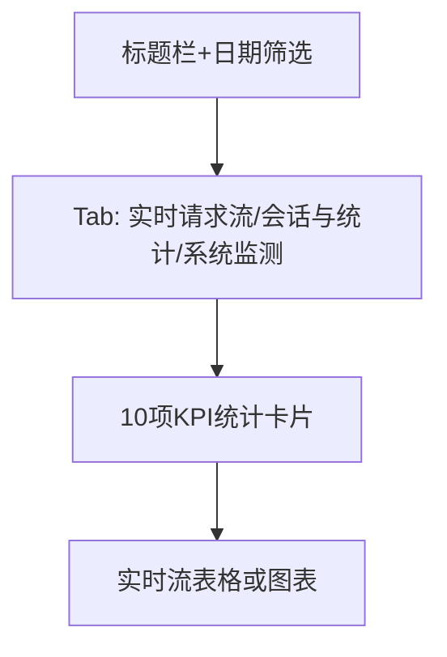

# 总览（仪表盘） — UI 审计

- **路由**: `/`
- **组件**: `web/src/views/DashboardViewV2.vue`
- **审计时间**: 2026-07-14
- **视口**: 1920×1080（browser-use 实测 llmgo.kxpms.cn）

## 页面结构

## 现状评估

| 维度 | 结论 | 优先级 |
|------|------|--------|
| 视觉/display | 深色主题一致，统计卡片横向紧凑，无反色块。实时请求流空态占位偏大。 | P1 |
| 功能组织 | KPI → Tab → 详情三层结构清晰。 | P2 |
| 数据布局 | 自上而下：标题→Tab→统计→主内容，左到右统计带信息完整。 | P2 |
| 多语言 | zh-CN完整；切换en后部分Tab/标题仍中文；ar RTL已启用。 | P1 |

## 发现的问题

1. P1：延迟显示「4.8Kms」单位易误解
2. P2：版本号「vv2.4.3」重复v
3. P2：实时流空态区域过高
4. P1：非中文locale下仪表盘标题未切换

## 优化建议

1. 统一延迟单位格式化
2. 修复App.vue版本号拼接
3. 空态max-height+skeleton
4. 补全dashboard.ts各语言

---
*浏览器实测 + 代码对照；详见 [99-i18n-汇总.md](../99-i18n-汇总.md)*
