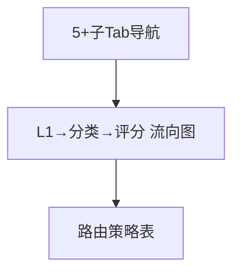

# 路由全景 — UI 审计

- **路由**: `/routing-v2`
- **组件**: `web/src/views/RoutingDashboardView.vue`
- **审计时间**: 2026-07-14
- **视口**: 1920×1080（browser-use 实测 llmgo.kxpms.cn）

## 页面结构

## 现状评估

| 维度 | 结论 | 优先级 |
|------|------|--------|
| 视觉/display | 流向图层次清晰，信息密度高但可读。 | P1 |
| 功能组织 | 导航+流向+策略表分区合理。 | P2 |
| 数据布局 | 全景→策略明细，流向左到右。 | P2 |
| 多语言 | 中文完整。 | OK |

## 发现的问题

1. P1：多Tab横向排列1366px可能折行
2. P2：刷新仅图标缺tooltip

## 优化建议

1. Tab scrollable或下拉聚合
2. 图标按钮补aria-label

---
*浏览器实测 + 代码对照；详见 [99-i18n-汇总.md](../99-i18n-汇总.md)*
