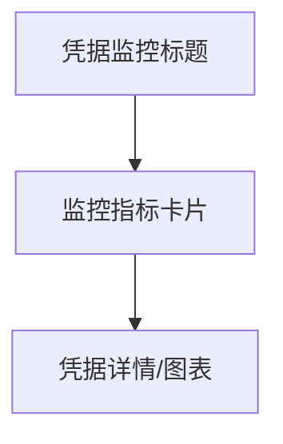

# 凭据监控 — UI 审计

- **路由**: `/routing-v2/credentials`
- **组件**: `web/src/views/CredentialMonitorView.vue`
- **审计时间**: 2026-07-14
- **视口**: 1920×1080（browser-use 实测 llmgo.kxpms.cn）

## 页面结构

## 现状评估

| 维度 | 结论 | 优先级 |
|------|------|--------|
| 视觉/display | 标题清晰，卡片紧凑。 | P2 |
| 功能组织 | 从路由全景独立，侧边栏exact高亮正确。 | P2 |
| 数据布局 | 卡片→详情区。 | P2 |
| 多语言 | 中文完整。 | OK |

## 发现的问题

1. P2：与路由全景功能边界略模糊

## 优化建议

1. 页头加说明文案

---
*浏览器实测 + 代码对照；详见 [99-i18n-汇总.md](../99-i18n-汇总.md)*
