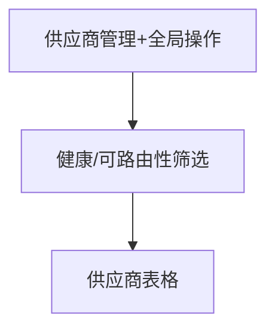

# 供应商 — UI 审计

- **路由**: `/providers`
- **组件**: `web/src/views/ProvidersView.vue`
- **审计时间**: 2026-07-14
- **视口**: 1920×1080（browser-use 实测 llmgo.kxpms.cn）

## 页面结构

## 现状评估

| 维度 | 结论 | 优先级 |
|------|------|--------|
| 视觉/display | 工具栏+筛选+表格，按钮尺寸统一。 | P1 |
| 功能组织 | 全局操作与行内操作分离。 | P2 |
| 数据布局 | 筛选横排，表格完整。 | P2 |
| 多语言 | 6外语标题已翻译；域名等技术字段保持原文合理。 | OK |

## 发现的问题

1. P1：部分行含error状态文案
2. P2：筛选多时换行

## 优化建议

1. 错误态统一ElAlert
2. 筛选区collapsible

---
*浏览器实测 + 代码对照；详见 [99-i18n-汇总.md](../99-i18n-汇总.md)*
