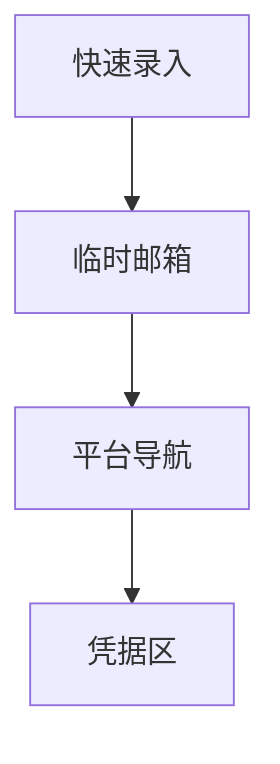

# 免费资源 — UI 审计

- **路由**: `/free-pool`
- **组件**: `web/src/views/FreePoolView.vue`
- **审计时间**: 2026-07-14
- **视口**: 1920×1080（browser-use 实测 llmgo.kxpms.cn）

## 页面结构

## 现状评估

| 维度 | 结论 | 优先级 |
|------|------|--------|
| 视觉/display | 四区块纵向，间距均匀。 | P2 |
| 功能组织 | 录入/邮箱/导航/凭据分块清晰。 | P2 |
| 数据布局 | 四段式从上到下。 | P2 |
| 多语言 | 完整；外链域名保持原文。 | OK |

## 发现的问题

1. P2：首屏需滚动看全

## 优化建议

1. Tab或锚点导航

---
*浏览器实测 + 代码对照；详见 [99-i18n-汇总.md](../99-i18n-汇总.md)*
