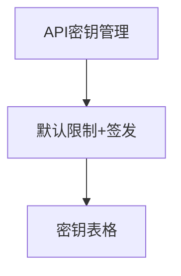

# API 密钥 — UI 审计

- **路由**: `/keys`
- **组件**: `web/src/views/KeysView.vue`
- **审计时间**: 2026-07-14
- **视口**: 1920×1080（browser-use 实测 llmgo.kxpms.cn）

## 页面结构

## 现状评估

| 维度 | 结论 | 优先级 |
|------|------|--------|
| 视觉/display | masked显示正常。 | P2 |
| 功能组织 | 限制→签发→列表流程清晰。 | P2 |
| 数据布局 | 操作→筛选→表格。 | P2 |
| 多语言 | 完整。 | OK |

## 发现的问题

1. P2：作废密钥切换不够明确

## 优化建议

1. el-tabs区分活跃/作废

---
*浏览器实测 + 代码对照；详见 [99-i18n-汇总.md](../99-i18n-汇总.md)*
