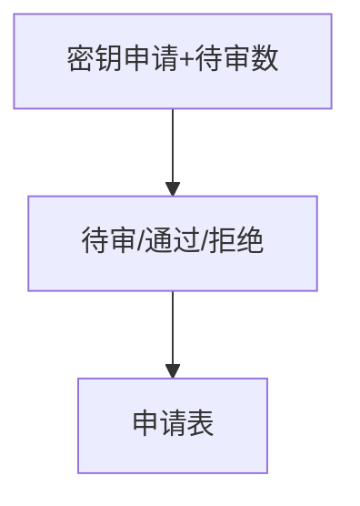

# 密钥申请 — UI 审计

- **路由**: `/key-applications`
- **组件**: `web/src/views/KeyApplicationsView.vue`
- **审计时间**: 2026-07-14
- **视口**: 1920×1080（browser-use 实测 llmgo.kxpms.cn）

## 页面结构

## 现状评估

| 维度 | 结论 | 优先级 |
|------|------|--------|
| 视觉/display | 动态待审计数直观。 | P2 |
| 功能组织 | 状态Tab清晰。 | P2 |
| 数据布局 | Tab→表格。 | P2 |
| 多语言 | 完整。 | OK |

## 发现的问题

1. P2：计数在标题与Tab重复

## 优化建议

1. 仅Tab badge显示

---
*浏览器实测 + 代码对照；详见 [99-i18n-汇总.md](../99-i18n-汇总.md)*
