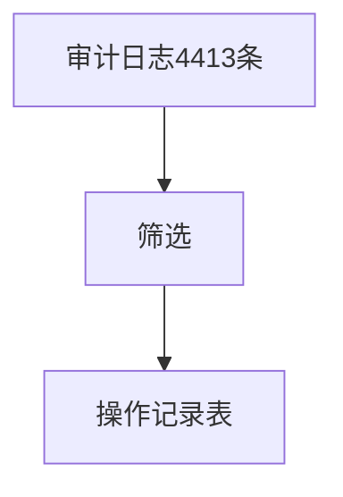

# 审计日志 — UI 审计

- **路由**: `/audit-logs`
- **组件**: `web/src/views/AuditLogView.vue`
- **审计时间**: 2026-07-14
- **视口**: 1920×1080（browser-use 实测 llmgo.kxpms.cn）

## 页面结构

## 现状评估

| 维度 | 结论 | 优先级 |
|------|------|--------|
| 视觉/display | 表格正常，说明文案清晰。 | P1 |
| 功能组织 | 筛选+表格符合审计惯例。 | P2 |
| 数据布局 | 说明→筛选→表格。 | P2 |
| 多语言 | 操作类型显示raw key如authentication.login。 | P1 |

## 发现的问题

1. P1：操作类型列显示i18n key非翻译
2. P1：加载失败文案可能暴露英文error

## 优化建议

1. action字段t()映射
2. 统一错误态组件

---
*浏览器实测 + 代码对照；详见 [99-i18n-汇总.md](../99-i18n-汇总.md)*
