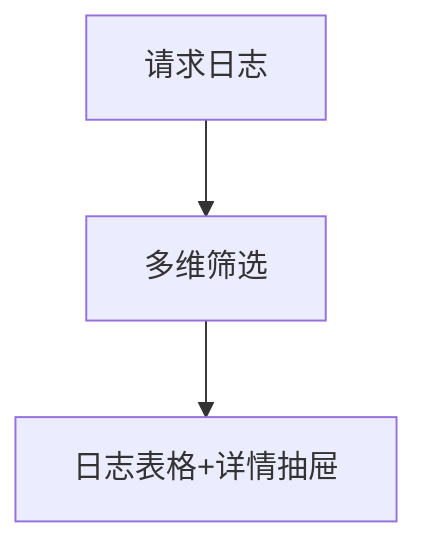

# 请求日志 — UI 审计

- **路由**: `/request-logs`
- **组件**: `web/src/views/RequestLogsView.vue`
- **审计时间**: 2026-07-14
- **视口**: 1920×1080（browser-use 实测 llmgo.kxpms.cn）

## 页面结构

## 现状评估

| 维度 | 结论 | 优先级 |
|------|------|--------|
| 视觉/display | 复杂筛选+宽表格，1366下需横向滚动（预期）。 | P1 |
| 功能组织 | 筛选区功能多但分组可优化。 | P2 |
| 数据布局 | 筛选→表格→详情。 | P2 |
| 多语言 | 主体已i18n；部分列头英文。 | P2 |

## 发现的问题

1. P1：页面含error/Failed检测
2. P2：筛选条件过多占垂直空间

## 优化建议

1. 筛选折叠面板
2. 固定常用筛选项

---
*浏览器实测 + 代码对照；详见 [99-i18n-汇总.md](../99-i18n-汇总.md)*
