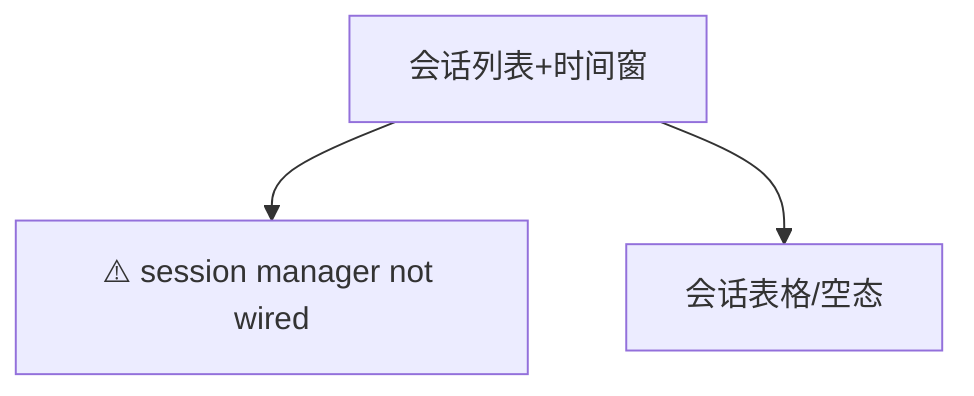

# 会话列表 — UI 审计

- **路由**: `/sessions`
- **组件**: `web/src/views/SessionListView.vue`
- **审计时间**: 2026-07-14
- **视口**: 1920×1080（browser-use 实测 llmgo.kxpms.cn）

## 页面结构

## 现状评估

| 维度 | 结论 | 优先级 |
|------|------|--------|
| 视觉/display | 警告条醒目但破坏整体美观。 | P0 |
| 功能组织 | 时间窗+刷新合理。 | P2 |
| 数据布局 | 说明→警告→内容。 | P2 |
| 多语言 | 硬编码中文较多（见ui-audit P0）。 | P0 |

## 发现的问题

1. P0：显示「session manager not wired」
2. P0：大量硬编码中文未i18n
3. P1：警告条样式过于刺眼

## 优化建议

1. 修复session manager wiring
2. 迁移SessionListView至t()
3. 警告改用ElAlert type=warning

---
*浏览器实测 + 代码对照；详见 [99-i18n-汇总.md](../99-i18n-汇总.md)*
