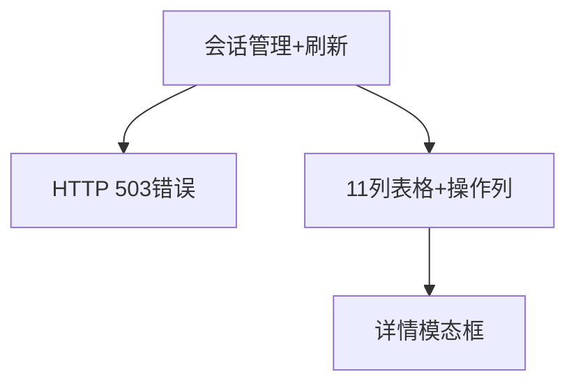

# 会话管理 — UI 审计

- **路由**: `/admin/sessions`
- **组件**: `web/src/views/SessionManagementView.vue`
- **审计时间**: 2026-07-14
- **视口**: 1920×1080（browser-use 实测 llmgo.kxpms.cn）

## 页面结构

## 现状评估

| 维度 | 结论 | 优先级 |
|------|------|--------|
| 视觉/display | 503错误条破坏页面；表头全硬编码中文。 | P0 |
| 功能组织 | 表格+模态详情结构合理。 | P2 |
| 数据布局 | 表格列多，1366需滚动。 | P2 |
| 多语言 | 仅en标题部分翻译，表头/按钮/模态全中文；ar仍显示中文。 | P0 |

## 发现的问题

1. P0：HTTP 503服务不可用
2. P0：全页硬编码中文（572行）
3. P0：confirm/alert原生对话框
4. P1：11列表格过宽

## 优化建议

1. 修复session API 503
2. 按ui-audit迁移i18n
3. 替换ElMessageBox
4. 隐藏次要列+列设置

---
*浏览器实测 + 代码对照；详见 [99-i18n-汇总.md](../99-i18n-汇总.md)*
