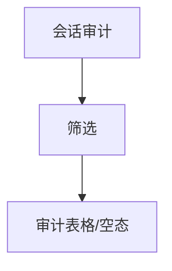

# 会话审计 — UI 审计

- **路由**: `/admin/session-audit`
- **组件**: `web/src/views/SessionAuditView.vue`
- **审计时间**: 2026-07-14
- **视口**: 1920×1080（browser-use 实测 llmgo.kxpms.cn）

## 页面结构

## 现状评估

| 维度 | 结论 | 优先级 |
|------|------|--------|
| 视觉/display | 空态友好。 | P0 |
| 功能组织 | 筛选+表格标准。 | P2 |
| 数据布局 | 简洁。 | P2 |
| 多语言 | 泄漏app.current_tenant key。 | P0 |

## 发现的问题

1. P0：显示app.current_tenant未翻译key
2. P2：空态图标可统一

## 优化建议

1. 补app.current_tenant翻译
2. 统一Empty组件

---
*浏览器实测 + 代码对照；详见 [99-i18n-汇总.md](../99-i18n-汇总.md)*
