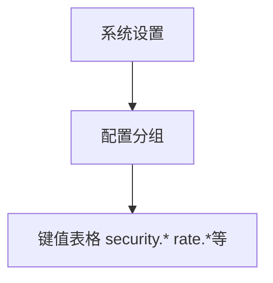

# 系统设置 — UI 审计

- **路由**: `/admin/settings`
- **组件**: `web/src/views/SettingsView.vue`
- **审计时间**: 2026-07-14
- **视口**: 1920×1080（browser-use 实测 llmgo.kxpms.cn）

## 页面结构

## 现状评估

| 维度 | 结论 | 优先级 |
|------|------|--------|
| 视觉/display | 配置键直接展示，偏技术向。 | P1 |
| 功能组织 | 按模块分组合理。 | P2 |
| 数据布局 | 分组→键值表。 | P2 |
| 多语言 | 配置key为英文dot notation（预期）；标签需i18n。 | P1 |

## 发现的问题

1. P1：配置项显示raw key如security.llm.intent_model
2. P1：hasError/空分组

## 优化建议

1. 配置项label映射表
2. 分组折叠+搜索

---
*浏览器实测 + 代码对照；详见 [99-i18n-汇总.md](../99-i18n-汇总.md)*
