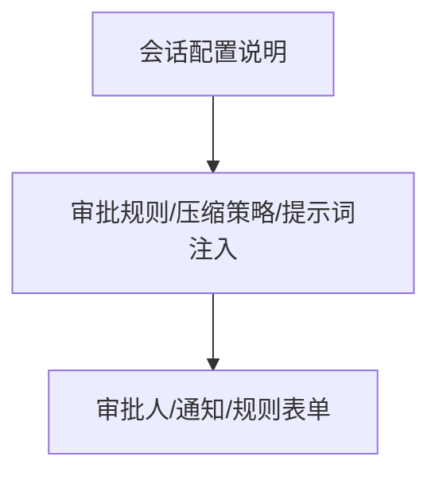

# 会话配置 — UI 审计

- **路由**: `/admin/session-config`
- **组件**: `web/src/views/SessionConfigView.vue`
- **审计时间**: 2026-07-14
- **视口**: 1920×1080（browser-use 实测 llmgo.kxpms.cn）

## 页面结构

## 现状评估

| 维度 | 结论 | 优先级 |
|------|------|--------|
| 视觉/display | Tab切换清晰。 | P2 |
| 功能组织 | 三Tab对应三类配置合理。 | P2 |
| 数据布局 | 说明→Tab→表单。 | P2 |
| 多语言 | 完整。 | OK |

## 发现的问题

1. P2：说明文字较长可折叠

## 优化建议

1. description collapsible

---
*浏览器实测 + 代码对照；详见 [99-i18n-汇总.md](../99-i18n-汇总.md)*
