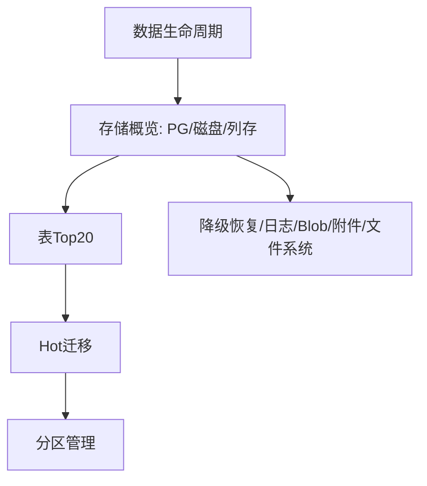

# 数据生命周期 — UI 审计

- **路由**: `/admin/data-lifecycle`
- **组件**: `web/src/views/DataLifecycleView.vue`
- **审计时间**: 2026-07-14
- **视口**: 1920×1080（browser-use 实测 llmgo.kxpms.cn）

## 页面结构

## 现状评估

| 维度 | 结论 | 优先级 |
|------|------|--------|
| 视觉/display | 6表+多卡片，信息密集但无反色块。 | P1 |
| 功能组织 | 8个内部Tab功能多，建议侧栏子导航。 | P2 |
| 数据布局 | 概览→明细，运维向紧凑。 | P2 |
| 多语言 | 表名public.*为数据库对象（预期）。 | OK |

## 发现的问题

1. P1：信息密度过高新手难上手
2. P2：6表格同时出现滚动多

## 优化建议

1. Tab拆分降低单页密度
2. 关键指标置顶卡片化

---
*浏览器实测 + 代码对照；详见 [99-i18n-汇总.md](../99-i18n-汇总.md)*
