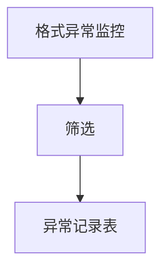

# 格式异常监控 — UI 审计

- **路由**: `/format-anomalies`
- **组件**: `web/src/views/FormatAnomaliesView.vue`
- **审计时间**: 2026-07-14
- **视口**: 1920×1080（browser-use 实测 llmgo.kxpms.cn）

## 页面结构

## 现状评估

| 维度 | 结论 | 优先级 |
|------|------|--------|
| 视觉/display | 标准监控页。 | P2 |
| 功能组织 | 筛选+表格。 | P2 |
| 数据布局 | 清晰。 | P2 |
| 多语言 | 已迁移i18n（见I18N_PAGES_IMPLEMENTATION）。 | OK |

## 发现的问题

1. P2：异常类型色标可加强

## 优化建议

1. severity color coding

---
*浏览器实测 + 代码对照；详见 [99-i18n-汇总.md](../99-i18n-汇总.md)*
