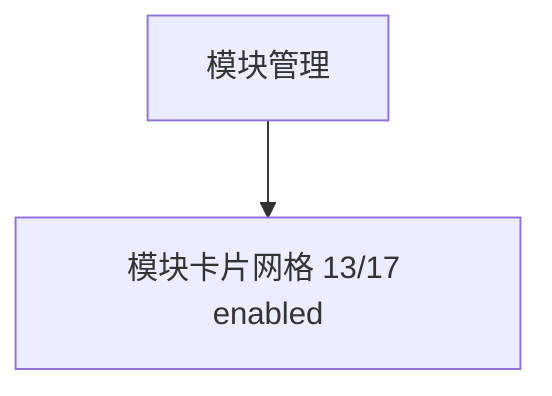

# 模块管理 — UI 审计

- **路由**: `/admin/modules`
- **组件**: `web/src/views/ModulesView.vue`
- **审计时间**: 2026-07-14
- **视口**: 1920×1080（browser-use 实测 llmgo.kxpms.cn）

## 页面结构

## 现状评估

| 维度 | 结论 | 优先级 |
|------|------|--------|
| 视觉/display | 卡片网格美观，状态badge清晰。 | P1 |
| 功能组织 | 模块卡片+详情抽屉合理。 | P2 |
| 数据布局 | 网格从左到右从上到下。 | P2 |
| 多语言 | modulesView.*部分key缺失（i18n:check）。 | P1 |

## 发现的问题

1. P1：dependencyDisabled等310 missing keys之一
2. P1：hasError检测

## 优化建议

1. 补modulesView locale
2. 错误态优化

---
*浏览器实测 + 代码对照；详见 [99-i18n-汇总.md](../99-i18n-汇总.md)*
