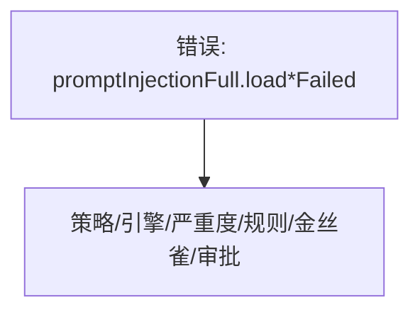

# 提示词注入检测 — UI 审计

- **路由**: `/admin/prompt-injection`
- **组件**: `web/src/views/PromptInjectionSettingsView.vue`
- **审计时间**: 2026-07-14
- **视口**: 1920×1080（browser-use 实测 llmgo.kxpms.cn）

## 页面结构

## 现状评估

| 维度 | 结论 | 优先级 |
|------|------|--------|
| 视觉/display | 页面几乎空白，仅显示i18n key错误信息。 | P0 |
| 功能组织 | 设计为多Tab复杂页，当前不可用。 | P2 |
| 数据布局 | 无法评估。 | P2 |
| 多语言 | P0：promptInjectionFull.* 全模块310 missing keys。 | P0 |

## 发现的问题

1. P0：loadStatsFailed/loadDetectionsFailed/loadRulesFailed key泄漏
2. P0：promptInjectionFull命名空间locale完全缺失
3. P0：8语言均显示key

## 优化建议

1. 新增locales/*/promptInjectionFull.ts
2. API失败时显示友好错误非key
3. 优先P0修复

---
*浏览器实测 + 代码对照；详见 [99-i18n-汇总.md](../99-i18n-汇总.md)*
