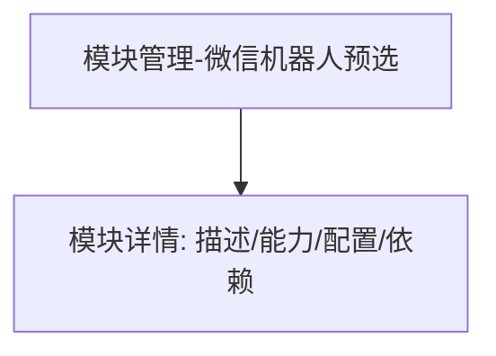

# 微信机器人 — UI 审计

- **路由**: `/admin/modules?module=wechat_bot`
- **组件**: `web/src/views/ModulesView.vue`
- **审计时间**: 2026-07-14
- **视口**: 1920×1080（browser-use 实测 llmgo.kxpms.cn）

## 页面结构

## 现状评估

| 维度 | 结论 | 优先级 |
|------|------|--------|
| 视觉/display | query预选模块，详情页清晰。 | P1 |
| 功能组织 | 依赖模块列表（压缩/注入/缓存）合理。 | P2 |
| 数据布局 | 详情纵向排列。 | P2 |
| 多语言 | 完整。 | OK |

## 发现的问题

1. P1：hasError
2. P2：与模块管理页重复导航

## 优化建议

1. 深度链接优化breadcrumb

---
*浏览器实测 + 代码对照；详见 [99-i18n-汇总.md](../99-i18n-汇总.md)*
