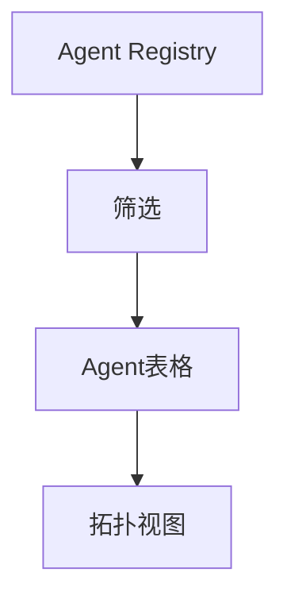

# Agent Registry — UI 审计

- **路由**: `/admin/agents`
- **组件**: `web/src/views/AgentRegistryView.vue`
- **审计时间**: 2026-07-14
- **视口**: 1920×1080（browser-use 实测 llmgo.kxpms.cn）

## 页面结构

## 现状评估

| 维度 | 结论 | 优先级 |
|------|------|--------|
| 视觉/display | 表格+拓扑，专业感强。 | P2 |
| 功能组织 | 注册表+关系图分区好。 | P2 |
| 数据布局 | 列表→详情/拓扑。 | P2 |
| 多语言 | agentRegistryView keys部分unused但页面正常。 | OK |

## 发现的问题

1. P2：英文标题与中文侧栏混用

## 优化建议

1. 标题i18n或统一英文品牌名

---
*浏览器实测 + 代码对照；详见 [99-i18n-汇总.md](../99-i18n-汇总.md)*
