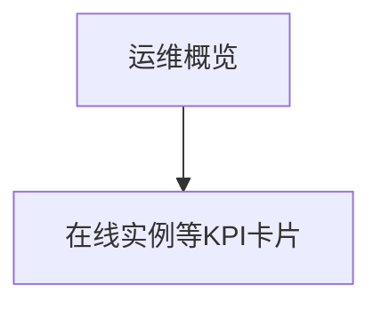

# 运维概览 — UI 审计

- **路由**: `/ops/overview`
- **组件**: `web/src/views/ops/OpsOverviewView.vue`
- **审计时间**: 2026-07-14
- **视口**: 1920×1080（browser-use 实测 llmgo.kxpms.cn）

## 页面结构

## 现状评估

| 维度 | 结论 | 优先级 |
|------|------|--------|
| 视觉/display | 卡片简洁。 | P1 |
| 功能组织 | 概览页定位清晰。 | P2 |
| 数据布局 | KPI卡片横排。 | P2 |
| 多语言 | 非en语言标题仍显示Operations Overview英文。 | P1 |

## 发现的问题

1. P1：zh-TW/ja/de/fr/es/ar标题未本地化
2. P1：common.status等ops页missing keys

## 优化建议

1. 补ops/overview locale
2. ops各页补common.*引用

---
*浏览器实测 + 代码对照；详见 [99-i18n-汇总.md](../99-i18n-汇总.md)*
