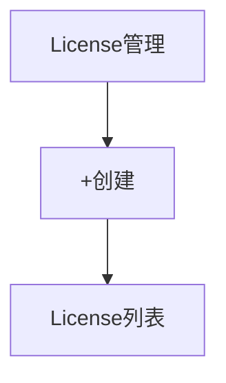

# License 管理 — UI 审计

- **路由**: `/ops/licenses`
- **组件**: `web/src/views/ops/LicenseManagementView.vue`
- **审计时间**: 2026-07-14
- **视口**: 1920×1080（browser-use 实测 llmgo.kxpms.cn）

## 页面结构

## 现状评估

| 维度 | 结论 | 优先级 |
|------|------|--------|
| 视觉/display | 🔑emoji标题，按钮合适。 | P1 |
| 功能组织 | 创建+列表标准。 | P2 |
| 数据布局 | 简洁。 | P2 |
| 多语言 | common.updateSuccess等missing。 | P1 |

## 发现的问题

1. P1：toast可能显示key
2. P2：emoji标题

## 优化建议

1. 补ops locale
2. 去emoji

---
*浏览器实测 + 代码对照；详见 [99-i18n-汇总.md](../99-i18n-汇总.md)*
