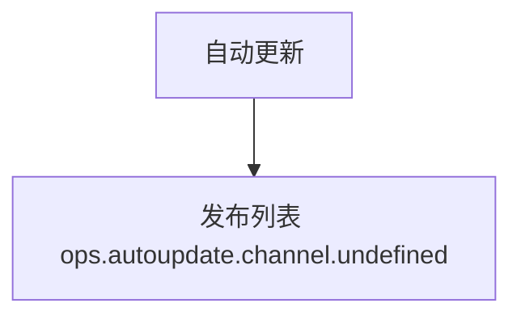

# 自动更新 — UI 审计

- **路由**: `/ops/autoupdate`
- **组件**: `web/src/views/ops/AutoUpdateView.vue`
- **审计时间**: 2026-07-14
- **视口**: 1920×1080（browser-use 实测 llmgo.kxpms.cn）

## 页面结构

## 现状评估

| 维度 | 结论 | 优先级 |
|------|------|--------|
| 视觉/display | 列表正常但status显示undefined key。 | P0 |
| 功能组织 | 创建发布+列表合理。 | P2 |
| 数据布局 | 标准。 | P2 |
| 多语言 | ops.autoupdate.channel.undefined泄漏。 | P0 |

## 发现的问题

1. P0：channel.undefined/logStatus.undefined key显示
2. P1：common.status missing

## 优化建议

1. AutoUpdateView fallback文案
2. 补undefined枚举翻译

---
*浏览器实测 + 代码对照；详见 [99-i18n-汇总.md](../99-i18n-汇总.md)*
