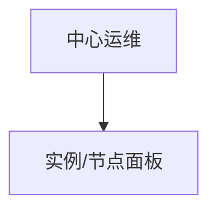

# 中心运维 — UI 审计

- **路由**: `/ops/center`
- **组件**: `web/src/views/ops/CenterOpsView.vue`
- **审计时间**: 2026-07-14
- **视口**: 1920×1080（browser-use 实测 llmgo.kxpms.cn）

## 页面结构

## 现状评估

| 维度 | 结论 | 优先级 |
|------|------|--------|
| 视觉/display | 加载正常。 | P1 |
| 功能组织 | 可能缺显式标题。 | P2 |
| 数据布局 | 面板式。 | P2 |
| 多语言 | common.status missing。 | P1 |

## 发现的问题

1. P1：无检测到h标题
2. P1：i18n缺口

## 优化建议

1. PageHeader
2. 补locale

---
*浏览器实测 + 代码对照；详见 [99-i18n-汇总.md](../99-i18n-汇总.md)*
