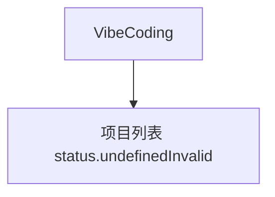

# VibeCoding — UI 审计

- **路由**: `/ops/vibecoding`
- **组件**: `web/src/views/ops/VibeCodingView.vue`
- **审计时间**: 2026-07-14
- **视口**: 1920×1080（browser-use 实测 llmgo.kxpms.cn）

## 页面结构

## 现状评估

| 维度 | 结论 | 优先级 |
|------|------|--------|
| 视觉/display | 项目列表正常。 | P0 |
| 功能组织 | 创建+列表。 | P2 |
| 数据布局 | 标准。 | P2 |
| 多语言 | ops.vibecoding.status.undefinedInvalid泄漏。 | P0 |

## 发现的问题

1. P0：无效status显示raw i18n key
2. P2：品牌名VibeCoding可保留英文

## 优化建议

1. status枚举fallback
2. 补vibecoding locale

---
*浏览器实测 + 代码对照；详见 [99-i18n-汇总.md](../99-i18n-汇总.md)*
