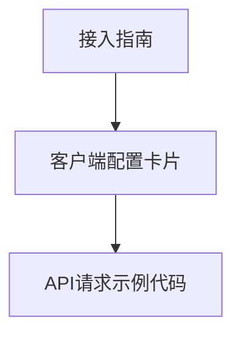

# 接入示例 — UI 审计

- **路由**: `/examples`
- **组件**: `web/src/views/ExamplesView.vue`
- **审计时间**: 2026-07-14
- **视口**: 1920×1080（browser-use 实测 llmgo.kxpms.cn）

## 页面结构

## 现状评估

| 维度 | 结论 | 优先级 |
|------|------|--------|
| 视觉/display | 代码块+卡片，阅读体验好。 | P2 |
| 功能组织 | 客户端分类+示例代码分区清晰。 | P2 |
| 数据布局 | 上到下：说明→配置→代码。 | P2 |
| 多语言 | 完整；代码示例英文合理。 | OK |

## 发现的问题

1. P2：代码块横向滚动条样式

## 优化建议

1. 代码区max-width

---
*浏览器实测 + 代码对照；详见 [99-i18n-汇总.md](../99-i18n-汇总.md)*
