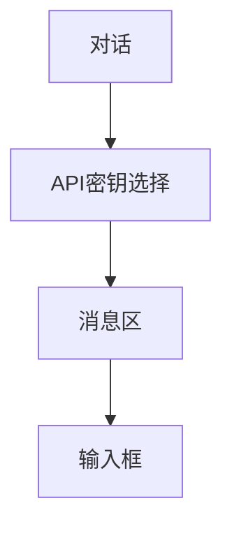

# 对话 — UI 审计

- **路由**: `/chat`
- **组件**: `web/src/views/ChatView.vue`
- **审计时间**: 2026-07-14
- **视口**: 1920×1080（browser-use 实测 llmgo.kxpms.cn）

## 页面结构

## 现状评估

| 维度 | 结论 | 优先级 |
|------|------|--------|
| 视觉/display | 聊天布局标准，暗色协调。 | P2 |
| 功能组织 | 密钥→对话→输入流程合理。 | P2 |
| 数据布局 | 经典IM三段式。 | P2 |
| 多语言 | 完整。 | OK |

## 发现的问题

1. P2：密钥下拉显示部分明文前缀
2. P2：侧栏「对话」与「微信机器人」图标重复💬

## 优化建议

1. 密钥仅显示别名
2. 差异化图标

---
*浏览器实测 + 代码对照；详见 [99-i18n-汇总.md](../99-i18n-汇总.md)*
