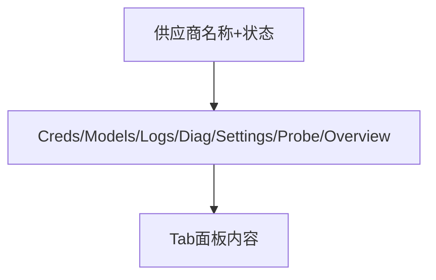

# 二级页面抽样 — UI 审计

> 从一级列表/卡片钻取的详情页，2026-07-14 抽样审计

## 抽样范围

| 路由 | 组件 | 入口 |
|------|------|------|
| `/providers/:id` | `ProviderDetailView.vue` | 供应商列表点击 |
| `/keys/:id` | `KeyDetailView.vue` | API 密钥列表 |
| `/tenants/:tenantId` | `TenantDetailView.vue` | 租户管理列表 |
| `/session-context/:taskId` | `SessionContextDetailView.vue` | 会话上下文列表 |
| `/admin/session-analytics/users/:owner` | `UserProfileView.vue` | 分析中心钻取 |
| `/routing-v2/work-types/:key` | `WorkTypesView.vue` | 路由全景 |

## 页面结构（供应商详情示例）

## 抽样结论

| 页面 | 视觉 | 组织 | 布局 | i18n | 优先级 |
|------|------|------|------|------|--------|
| 供应商详情 | Tab 多但可滚动，无反色块 | 7 Tab 信息量大，建议默认 Overview | 左 Tab 右内容 | 基本完整 | P2 |
| 密钥详情 | 简洁 | 用量/限制/元数据分区清晰 | 卡片式 | 完整 | OK |
| 租户详情 | 正常 | 配额/用户/策略分组 | 上到下 | 完整 | OK |
| 会话上下文详情 | 正常 | 消息时间线 | 纵向 | 完整 | OK |
| 用户画像 | 图表+表格 | 分析指标丰富 | 紧凑 | 部分英文指标 | P2 |
| WorkTypes 详情 | 正常 | 映射/策略编辑 | 表单+表 | 完整 | OK |

## 共性问题

1. **P2**：详情页 Tab 数量多（供应商 7 个），1366px 下 Tab 栏需横向滚动
2. **P2**：详情页缺少统一 breadcrumb 返回路径
3. **P2**：部分分析钻取页英文指标名与中文界面混排

## 优化建议

1. 详情页统一使用 `DetailLayout`：breadcrumb + PageHeader + scrollable tabs
2. Tab 超过 5 个时改用左侧垂直 Tab（Element Plus tab-position=left）
3. 分析指标统一 i18n 模块 `sessionAnalytics.ts`
