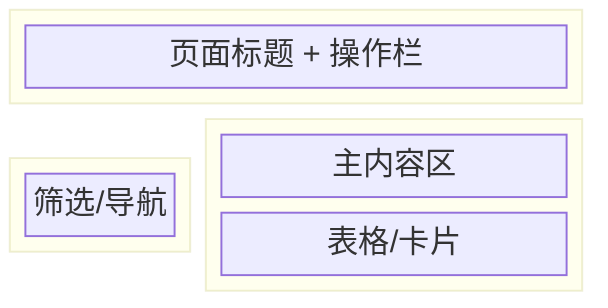

# {页面名称} — UI 审计

- **路由**: `/path`
- **组件**: `web/src/views/XXX.vue`
- **审计时间**: 2026-07-14
- **视口**: 1920×1080

## 页面结构

## 现状评估

| 维度 | 结论 | 优先级 |
|------|------|--------|
| 视觉/display | | |
| 功能组织 | | |
| 数据布局 | | |
| 多语言 | | |

## 发现的问题

1.

## 优化建议

1.

## 截图

- `assets/{slug}/overview-zh-CN.png`
