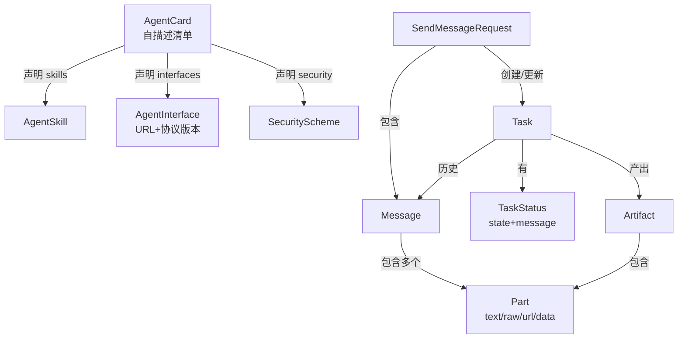
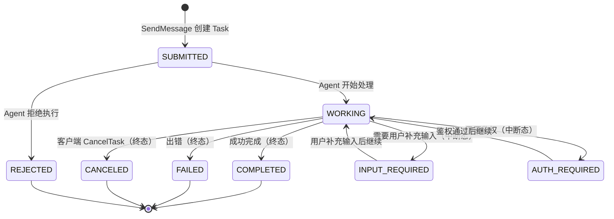

# A2A 协议调研（2026-06）

> **文档版本**：v1.0
> **调研日期**：2026-06-25
> **作者**：kaixuan-ai-agent
> **配套**：实施计划 `2026-06-23-llmgw-implementation-plan.md` Part 6 D2（Q1 2027）
> **Spec 版本**：A2A v1.0（a2aproject/A2A, commit main @ 2026-06-24）
>
> **TL;DR**：Google A2A（Agent2Agent）协议已于 2026 年演进为 v1.0 正式版（24.4k stars，
> 2026-06-24 仍在更新）。它是一个基于 protobuf 的**跨 Agent 互操作协议**，核心抽象是
> **Task 状态机 + Message/Part/Artifact 消息模型 + AgentCard 自描述清单**。
> 我们的定位：**llm-gateway-go 作为 A2A 网关**，实现 Agent Registry（谁能调谁）+ A2A
> dispatcher（协议编解码）+ 编排层（Task DAG）。**不**自研新协议，完全遵循官方 spec。

---

## 1. 协议目标与边界

### 1.1 A2A 解决什么问题？

A2A 解决的是**跨 Agent 互操作**问题。在 A2A 之前，每个 Agent 框架（LangGraph / CrewAI / AutoGen / OpenClaw）都有自己的 RPC 格式，Agent A 无法调用 Agent B 的能力。

A2A 提供一个**统一、厂商无关**的协议，让任意两个 Agent 能：
1. **发现**：通过 `AgentCard`（自描述 JSON 清单）声明"我是谁、我能做什么"
2. **通信**：通过 `SendMessage` / `SendStreamingMessage` 交换 `Message`
3. **协作**：通过 `Task` 状态机管理异步、长时运行、多轮的协作流程

### 1.2 A2A vs MCP（边界在哪？）

这是最关键的区分，团队务必达成共识：

| 维度 | A2A（Agent-to-Agent） | MCP（Model Context Protocol） |
|------|----------------------|------------------------------|
| **谁和谁通信** | Agent ↔ Agent | Agent ↔ Tool（工具/数据源） |
| **抽象层次** | 高层：任务协作、多轮对话 | 低层：函数调用、资源读取 |
| **核心单位** | Task（有状态的长期协作） | Tool call（无状态的单次调用） |
| **自治性** | 对等：双方都是"智能"Agent | 主从：Agent 调用工具 |
| **类比** | 人与人协作（委托任务） | 程序员调用 API |
| **发起者** | a2aproject（Google 主导，24.4k star） | Anthropic 主导 |
| **我们的角色** | **网关**：路由 / 鉴权 / 编排 | **宿主**：暴露工具给 LLM |

**一句话边界**：
> **MCP 是"Agent 调工具"，A2A 是"Agent 调 Agent"。**
> llm-gateway-go 同时是 A2A 网关（Q1 2027）和 MCP 宿主（Q3 2026，A2 主干）。
> 两者互补，不冲突：一个 Agent 既可以通过 MCP 调用工具，也可以通过 A2A 委托另一个 Agent。

### 1.3 我们为什么需要 A2A？

基于我们的产品定位（实施计划 Q1 2027 v4.0 "Agentic Gateway"）：

1. **差异化竞争**：市面上 LLM 网关很多，但 **A2A 网关几乎没有**。我们抢先支持 A2A = 建立"Agent 编排枢纽"的心智。
2. **打通内部 Agent**：我们的 brandmind-go / crm-go / openclaw 之间目前是硬编码 HTTP 调用。A2A 提供统一协议，降低耦合。
3. **承接外部 Agent 流量**：第三方 Agent（如客户的销售 Agent）可以标准化地接入我们的 Agent 生态。
4. **可观测性**：A2A 的 Task 状态机天然适合审计 + 计费（我们已有的 MaaS 计费可直接复用）。

---

## 2. 消息模型

A2A 的核心数据结构（来自官方 `specification/a2a.proto`）：

### 2.1 核心概念关系



### 2.2 Message（消息单元）

`Message` 是 Agent 间通信的基本单元。一轮对话 = 一个 `Message`。

```protobuf
message Message {
  string message_id = 1;        // UUID，必填
  string context_id = 2;        // 会话上下文 ID（可选，关联多个 task）
  string task_id = 3;           // 关联的 task（可选）
  Role role = 4;                // USER（客户端→服务端）| AGENT（服务端→客户端）
  repeated Part parts = 5;      // 消息内容（必填，至少一个 Part）
  google.protobuf.Struct metadata = 6;
  repeated string extensions = 7;
  repeated string reference_task_ids = 8;  // 引用其他 task 作为上下文
}
```

### 2.3 Part（内容片段）

`Part` 是消息内容的载体，支持多种类型（`oneof content`）：

| 类型 | 字段 | 场景 |
|------|------|------|
| 文本 | `text` | 普通 prompt / 回复 |
| 原始字节 | `raw` (base64) | 文件、图片、音频 |
| URL 引用 | `url` | 大文件引用（避免内联） |
| 结构化数据 | `data` (JSON Value) | 工具调用参数、表格数据 |

每个 Part 还带 `media_type`（MIME）、`filename`、`metadata`。这种设计让 A2A 能承载**多模态**协作。

### 2.4 Task（任务）—— 核心抽象

`Task` 是 A2A 的**核心**，代表一个有状态的、可能长时运行的协作单元：

```protobuf
message Task {
  string id = 1;                    // UUID（服务端生成）
  string context_id = 2;            // 会话集合 ID
  TaskStatus status = 3;            // 当前状态
  repeated Artifact artifacts = 4;  // 任务产出
  repeated Message history = 5;     // 交互历史
  google.protobuf.Struct metadata = 6;
}
```

**关键特性**：
- **一个 Task 可跨多轮 Message**：`history` 记录所有交互
- **一个 context_id 可关联多个 Task**：代表一个"会话"内的多个子任务
- **产出是 Artifact**（不是 Message）：Artifact 是结构化输出（如生成的报告、表格）

### 2.5 AgentCard（自描述清单）

每个 Agent 通过一个 HTTPS 可访问的 `AgentCard` 声明自己的能力：

```json
{
  "name": "BrandMind Agent",
  "description": "品牌智能分析 Agent",
  "version": "1.0.0",
  "capabilities": {
    "streaming": true,
    "pushNotifications": true
  },
  "skills": [
    {
      "id": "competitor-analysis",
      "name": "竞品分析",
      "description": "分析指定品牌的竞争对手",
      "tags": ["marketing", "research"]
    }
  ],
  "supportedInterfaces": [
    { "url": "https://brandmind.internal.example.com/a2a", "protocolBinding": "JSONRPC", "protocolVersion": "1.0" }
  ],
  "securitySchemes": { "bearer": { "http": { "scheme": "bearer" } } }
}
```

**AgentCard 的作用**：相当于 Agent 的"名片 + API 文档"。调用方先 fetch AgentCard，了解能力后再发起 Task。

### 2.6 JSON-RPC vs Protobuf

**重要**：A2A spec 有两种序列化 binding：
1. **gRPC（protobuf 原生）**：高性能，适合内部 Agent 间调用
2. **JSON-RPC 2.0**：人类可读，适合 Web / 第三方集成

spec 的 `specification/json/` 目录有 JSON Schema。我们实现时**两者都要支持**（gRPC 内部 + JSON-RPC 对外）。

---

## 3. 传输层

### 3.1 三种协议 binding

spec 的 `AgentInterface.protocol_binding` 字段支持：

| Binding | 场景 | 我们的支持计划 |
|---------|------|---------------|
| `JSONRPC` | Web / 第三方 / 简单集成 | **Q1 D2 首批支持**（HTTP+SSE） |
| `GRPC` | 内部 Agent 高频调用 | Q1 D2 后期 / Q2 |
| `HTTP+JSON` | REST 风格简单调用 | Q1 D2 首批支持 |

### 3.2 同步 vs 流式

A2A 提供两种消息发送模式：

```
SendMessage              → SendMessageResponse      （同步，阻塞到完成）
SendStreamingMessage     → stream StreamResponse    （流式，实时状态更新）
```

`StreamResponse` 的 `oneof payload` 可以是：
- `task`：完整 Task 快照
- `message`：一条 Message
- `status_update`：状态变更事件
- `artifact_update`：Artifact 增量（支持 `append` + `last_chunk` 流式拼接）

**我们的实现**：优先支持**流式**（`SendStreamingMessage`），因为 LLM 响应天然是 SSE 流，且我们的 relay 已有 SSE 基础设施。

### 3.3 鉴权方案

A2A 的 `SecurityScheme` 支持 5 种（OpenAPI 3.2 对齐）：

| 方案 | 场景 | 我们的选择 |
|------|------|-----------|
| `http` (Bearer/JWT) | **主推**：与 Casdoor OIDC 集成 | ✅ 默认 |
| `apiKey` | 简单场景 | ✅ 兼容现有 api_keys 表 |
| `oauth2` | 第三方 Agent | Q2 评估 |
| `openIdConnect` | 企业 SSO | Q2 评估 |
| `mtls` | 高安全内部 | 暂不做 |

**我们的鉴权设计**：
- 复用 llm-gateway-go 现有的 Casdoor JWT + api_keys 双层鉴权
- A2A 请求头 `Authorization: Bearer <jwt>` 或 `X-API-Key: <key>`
- AgentCard 的 `securityRequirements` 声明该 Agent 要求哪种鉴权

---

## 4. 状态机

### 4.1 Task 生命周期

A2A Task 有 **8 个状态**（来自 `TaskState` enum）：



**状态分类**：
- **初始态**：`SUBMITTED`
- **运行态**：`WORKING`
- **中断态**（可恢复）：`INPUT_REQUIRED`、`AUTH_REQUIRED`
- **终态**（不可变更）：`COMPLETED`、`FAILED`、`CANCELED`、`REJECTED`

### 4.2 流式响应如何处理？

流式模式下，Agent 通过 `TaskStatusUpdateEvent` 和 `TaskArtifactUpdateEvent` 推送增量：

```
client: SendStreamingMessage(msg="分析竞品 A")
server: stream → TaskStatusUpdateEvent(state=SUBMITTED)
server: stream → TaskStatusUpdateEvent(state=WORKING)
server: stream → TaskArtifactUpdateEvent(artifact=报告第1段, append=false, last_chunk=false)
server: stream → TaskArtifactUpdateEvent(artifact=报告第2段, append=true, last_chunk=false)
server: stream → TaskArtifactUpdateEvent(artifact=报告第3段, append=true, last_chunk=true)
server: stream → TaskStatusUpdateEvent(state=COMPLETED)
```

**关键设计点（我们要实现）**：
- `append=true`：当前 chunk 要**追加**到同 `artifact_id` 的前一个 chunk
- `last_chunk=true`：标记 Artifact 完成
- 中断态（`INPUT_REQUIRED`）时，流**不关闭**，等待客户端发新 Message

### 4.3 Task 持久化

`Task` 是有状态的，必须持久化。我们的设计：

| 存储 | 内容 | 说明 |
|------|------|------|
| PostgreSQL `a2a_tasks` 表 | Task 元数据 + 状态 | DB migration（Q1 D1），含 RLS |
| PostgreSQL `a2a_messages` 表 | Message history | JSONB 存 parts |
| PostgreSQL `a2a_artifacts` 表 | Artifact 产出 | 大内容用对象存储引用 |
| Redis | 活跃 Task 的状态缓存 | 加速 `GetTask` 查询 |

---

## 5. 安全

### 5.1 跨 Agent 调用的鉴权链

```
Agent A (client)                  Agent B (server, via 网关)
    │                                  │
    │  1. fetch AgentCard              │
    │─────────────────────────────────>│
    │  2. AgentCard (含 securityScheme)│
    │<─────────────────────────────────│
    │                                  │
    │  3. SendMessage + Bearer JWT     │
    │─────────────────────────────────>│
    │      ┌──────────────────────┐    │
    │      │ 网关验证 JWT（Casdoor）│   │
    │      │ + 检查 AgentRegistry │    │
    │      │   A 是否有权调 B     │    │
    │      └──────────────────────┘    │
    │  4. 200 / 403                    │
    │<─────────────────────────────────│
```

### 5.2 多租户隔离（关键！）

A2A spec **原生支持多租户**：proto 的每个 RPC 都有 `tenant` 字段（`additional_bindings: { post: "/{tenant}/message:send" }`）。

**我们的实现**（遵循 `docs/multi-tenant-standards.md`）：
- `tenant` 字段从 JWT 的 `tenant_id` claim 提取，**不接受客户端明文指定**（防越权）
- Agent Registry 表 `a2a_agents` 有 `tenant_id` 列 + RLS policy
- Task / Message / Artifact 表全部带 `tenant_id` + RLS
- **跨租户 Agent 调用**默认禁止；需 super_admin 在 `a2a_agent_trust` 表显式授权

### 5.3 审计与合规

| 事件 | 审计字段 | 存储位置 |
|------|---------|---------|
| Task 创建 | `a2a_task_created` | audit events（复用现有） |
| Task 状态变更 | `a2a_task_state_changed` + old/new state | audit events |
| Agent 调用 Agent | `a2a_agent_invoke` + caller/target | audit events |
| 鉴权失败 | `a2a_auth_failed` + reason | audit events |

**OTel**：所有 A2A span 必须带 `tenant.id` + `a2a.task.id` + `a2a.agent.target` attribute（遵循 `lint-otel-tenant`）。

---

## 6. 我们要做的（实现范围）

对应实施计划 Q1 2027 Part 6 D1-D3：

### 6.1 D1：Agent Registry（决定谁能调谁）

| 任务 | 工作量 | 说明 |
|------|--------|------|
| DB migration：`a2a_agents` 表 | 2 人日 | id, tenant_id, name, agent_card_url, status, skills JSONB + RLS |
| DB migration：`a2a_agent_trust` 表 | 1 人日 | caller_agent_id, target_agent_id, tenant_scope（同租户/跨租户）|
| `control/handler/a2a/registry.go` | 3 人日 | Admin API: register/list/update/revoke |
| AgentCard fetch + cache | 2 人日 | 后台 worker 定期拉取 + 校验 JWS 签名 |
| 前端 `/a2a/agents` 管理 UI | 3 人日 | 列表 + 详情 + 信任关系配置 |

### 6.2 D2：A2A Dispatcher（协议编解码）

| 任务 | 工作量 | 说明 |
|------|--------|------|
| `a2a/dispatcher.go` | 4 人日 | JSON-RPC 编解码 + 路由到本地 Agent |
| `a2a/task_machine.go` | 3 人日 | Task 状态机实现（8 状态 + 转换校验）|
| `a2a/streaming.go` | 3 人日 | SSE 流式响应 + Artifact append/last_chunk 拼接 |
| `a2a/jsonrpc_handler.go` | 2 人日 | HTTP endpoint: `POST /{tenant}/message:send` 等 |
| 测试：状态机 + 流式拼接 | 3 人日 | 对齐 A2A conformance test（官方有）|

### 6.3 D3：编排层（Plan / Task DAG）

| 任务 | 工作量 | 说明 |
|------|--------|------|
| `a2a/planner.go` | 5 人日 | 将"复杂任务"拆解为 Task DAG（Plan）|
| `a2a/orchestrator.go` | 4 人日 | 执行 Plan，管理子 Task 依赖 + 失败重试 |
| DB migration：`a2a_plans` 表 | 1 人日 | plan DAG + 子 task 关系 |
| 前端 `/a2a/plans` 编排 UI | 4 人日 | DAG 可视化 + 实时状态 |

### 6.4 与现有系统的集成点

| 现有模块 | 集成方式 |
|---------|---------|
| `relay/` | A2A dispatcher 复用 relay 的 SSE 基础设施 |
| `maas/` (计费) | A2A Task 计费：按 Task 计费 / 按 Artifact 计费 |
| `audit/` | A2A 事件接入现有审计 pipeline + SIEM（CEF） |
| `security/armor/` | A2A Message 经过 armor 检查（注入检测 + SDP） |
| Casdoor | A2A JWT 鉴权委托 Casdoor |
| `credentialfpslot/` | Agent 调用外部 LLM 时复用指纹池 |

---

## 7. 风险与待定

### 7.1 协议演进风险

| 风险 | 概率 | 影响 | 缓解 |
|------|------|------|------|
| **A2A spec 仍在演进** | 高（v1.0 刚稳定） | 中：API 可能微调 | 跟踪官方 CHANGELOG；我们的 dispatcher 层做版本协商（`protocol_version`）|
| **JSON-RPC 与 gRPC 双 binding 维护成本** | 中 | 中：双倍测试 | Q1 先只做 JSON-RPC，gRPC 延后到 Q2 |
| **Artifact 大对象处理** | 中 | 低：大文件 | 用 URL 引用（Part.url）而非内联 raw |

### 7.2 与 OpenClaw / brandmind-go 的 A2A 适配策略（待定）

**开放问题**：我们的存量 Agent（OpenClaw / brandmind-go / crm-go）如何暴露为 A2A？

| 方案 | 优点 | 缺点 |
|------|------|------|
| **A. 网关适配（推荐）** | 存量 Agent 零改动；统一在网关层翻译 | 网关成为瓶颈；翻译层复杂 |
| B. 存量 Agent 原生支持 | 性能最优；无翻译损耗 | 每个 Agent 都要改；维护分散 |
| C. 混合 | 关键 Agent 原生，其余适配 | 一致性差 |

**建议**：方案 A（网关适配）。llm-gateway-go 作为 A2A 网关，将外部 A2A 请求翻译为内部 Agent 的原生 API（HTTP/gRPC）。存量 Agent 不感知 A2A。

**待 TL 决策**。

### 7.3 其他待定

- [ ] **Task 超时策略**：长时 Task 的超时阈值？（建议：可配置，默认 30 分钟）
- [ ] **Task 并发限制**：单租户同时进行的 Task 上限？（建议：默认 100，可调）
- [ ] **Push Notification**：是否实现？（spec 支持，但需 webhook 基础设施；建议 Q1 不做，Q2 评估）
- [ ] **AgentCard 签名验证**：是否强制？（JWS 签名防止 AgentCard 篡改；建议 v1 可选，v2 强制）

---

## 8. 参考资料

| 资料 | URL | 用途 |
|------|-----|------|
| **A2A 官方仓库** | https://github.com/a2aproject/A2A | spec + proto（24.4k stars）|
| A2A Protobuf 定义 | `specification/a2a.proto`（本调研已全文解析）| 消息模型 + RPC 定义 |
| A2A 官方文档站 | https://google.github.io/A2A/ | 教程 / 最佳实践 |
| A2A JSON Schema | 仓库 `specification/json/` | JSON-RPC binding |
| MCP（对比） | https://modelcontextprotocol.io | Agent↔Tool 协议（背景对比）|
| 实施计划 D2 | `docs/产品方案/2026-06-23-llmgw-implementation-plan.md` §6 | Q1 任务拆解 |
| 多租户标准 | `docs/multi-tenant-standards.md` | RLS + tenant 隔离 |
| OpenAPI 3.2 Security Scheme | https://spec.openapis.org/oas/v3.2.0.html#security-scheme-object | SecurityScheme 设计来源 |

---

## 附录 A：A2A 核心消息速查（JSON-RPC 示例）

### A.1 发送消息（流式）

```http
POST /{tenant}/message:stream HTTP/1.1
Authorization: Bearer <jwt>
Content-Type: application/json

{
  "message": {
    "message_id": "msg-001",
    "context_id": "ctx-session-1",
    "role": "USER",
    "parts": [
      { "text": "帮我分析品牌 X 的竞品" }
    ]
  },
  "configuration": {
    "accepted_output_modes": ["text/plain", "application/json"]
  }
}
```

### A.2 流式响应（SSE）

```
data: {"task":{"id":"task-123","status":{"state":"SUBMITTED"}}}

data: {"task":{"id":"task-123","status":{"state":"WORKING"}}}

data: {"artifact_update":{"task_id":"task-123","artifact":{"artifact_id":"art-1","parts":[{"text":"竞品分析报告：\n\n"}]},"append":false,"last_chunk":false}}

data: {"artifact_update":{"task_id":"task-123","artifact":{"artifact_id":"art-1","parts":[{"text":"1. 品牌A：市场占有率..."}]},"append":true,"last_chunk":false}}

data: {"artifact_update":{"task_id":"task-123","artifact":{"artifact_id":"art-1","parts":[{"text":"2. 品牌B：..."}]},"append":true,"last_chunk":true}}

data: {"status_update":{"task_id":"task-123","status":{"state":"COMPLETED"}}}
```

### A.3 查询 Task

```http
GET /{tenant}/tasks/task-123 HTTP/1.1
Authorization: Bearer <jwt>
```

### A.4 取消 Task

```http
POST /{tenant}/tasks/task-123:cancel HTTP/1.1
Authorization: Bearer <jwt>
```
